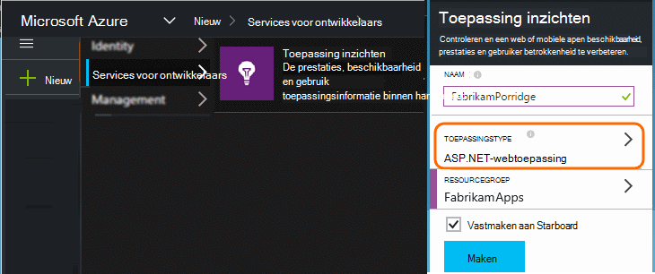
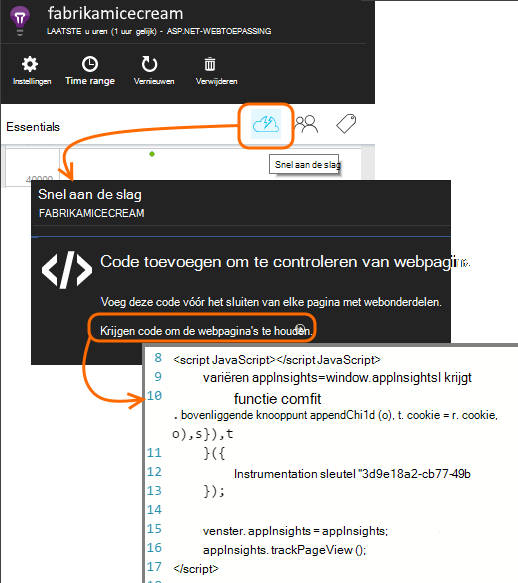
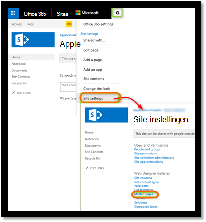
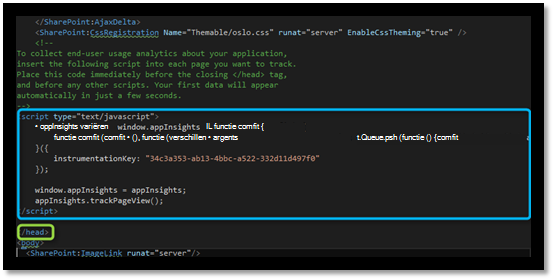
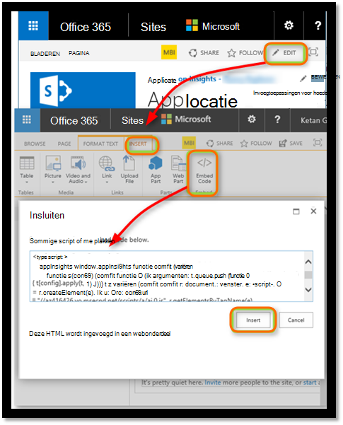
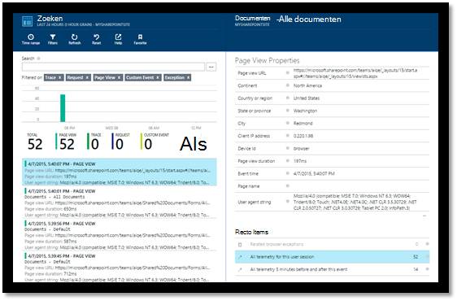
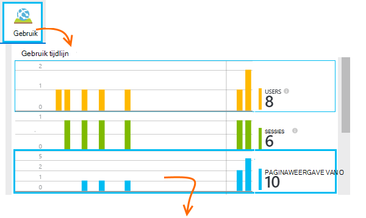
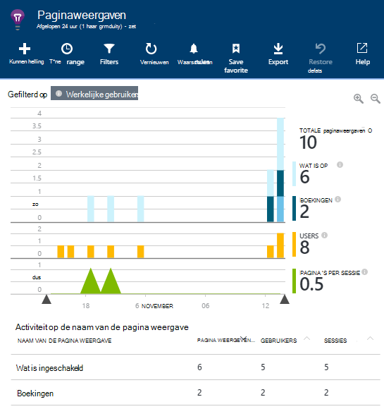
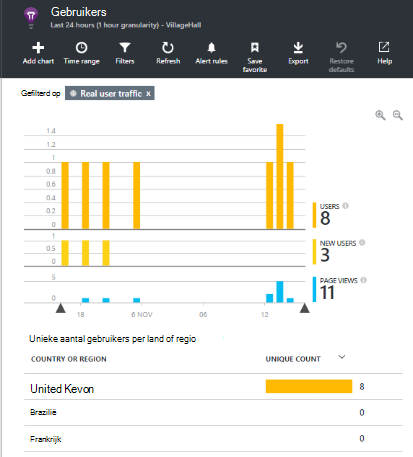
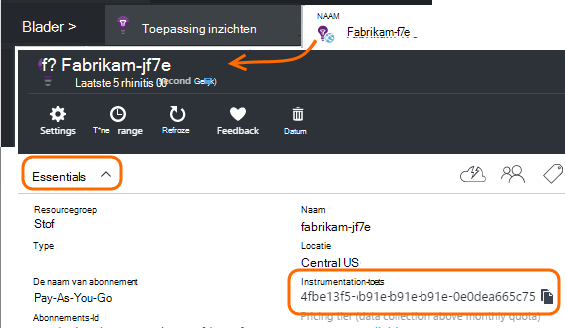

<properties 
    pageTitle="Monitor met een SharePoint-site met de toepassing inzichten" 
    description="Start een nieuwe toepassing bewaken met een nieuwe instrumentation-sleutel" 
    services="application-insights" 
    documentationCenter=""
    authors="alancameronwills" 
    manager="douge"/>

<tags 
    ms.service="application-insights" 
    ms.workload="tbd" 
    ms.tgt_pltfrm="ibiza" 
    ms.devlang="na" 
    ms.topic="article" 
    ms.date="03/24/2016" 
    ms.author="awills"/>

# <a name="monitor-a-sharepoint-site-with-application-insights"></a>Monitor met een SharePoint-site met de toepassing inzichten


Visual Studio-toepassing inzichten bewaakt de beschikbaarheid, de prestaties en het gebruik van uw apps. Hier leert u hoe u deze instelt voor een SharePoint-site.


## <a name="create-an-application-insights-resource"></a>Maak een toepassing inzichten-bron


Maak een nieuwe resource van toepassing inzichten in de [portal van Azure](https://portal.azure.com). Kies ASP.NET als het toepassingstype.




Het blad dat wordt geopend en is de plaats waar u prestatie- en gebruiksgegevens over uw app ziet. Als u wilt terugkeren naar het volgende keer dat u bij Azure aanmelden, moet u een tegel voor het zoeken op het startscherm. U kunt ook op Bladeren om te vinden.
    


## <a name="add-our-script-to-your-web-pages"></a>Onze script toevoegen aan uw webpagina 's

Krijg het script voor webpagina's aan de slag:



Alleen voordat het script invoegen de &lt;/head&gt; tag van elke pagina die u wilt bijhouden. Als uw website een basispagina heeft, kunt u het script er plaatsen. Bijvoorbeeld in een project ASP.NET MVC zou u deze opnemen in View\Shared\_Layout.cshtml

Het script bevat de instrumentation-sleutel die wordt u omgeleid het telemetrielogboek aan uw toepassing inzichten resource zodat.

### <a name="add-the-code-to-your-site-pages"></a>De code hebt toegevoegd aan sitepagina 's

#### <a name="on-the-master-page"></a>Klik op de basispagina

Als u de basispagina van de site bewerken kunt, krijgt die voor elke pagina van de site voor controle.

De basispagina uitchecken en bewerken met behulp van SharePoint Designer of een andere editor.




Alleen voordat de code hebt toegevoegd de </head> tag. 




#### <a name="or-on-individual-pages"></a>Of klik op afzonderlijke pagina's

Afzonderlijk toevoegen het script aan elke pagina om de een beperkt aantal pagina's, te houden. 

Een webonderdeel invoegen en het codefragment insluiten in deze.





## <a name="view-data-about-your-app"></a>Gegevens over uw app weergeven

Uw app opnieuw.

Ga terug naar uw blade toepassing in de [portal van Azure](https://portal.azure.com).

De eerste gebeurtenissen worden weergegeven in zoekresultaten. 



Klik op vernieuwen na een paar seconden als u meer gegevens verwacht.

Klik op **gebruiksanalyses** om te zien naar diagrammen van gebruikers, sessies en paginaweergaven van het blad Overzicht:



Klik op een grafiek meer details - bijvoorbeeld paginaweergaven:



Of gebruikers:





## <a name="capturing-user-id"></a>Gebruikers-Id vastleggen


Het codefragment standaard webpagina de gebruikers-id van SharePoint niet vastleggen, maar u kunt doen met een kleine wijziging.


1. Kopieer van uw app instrumentation sleutel uit de Essentials-omlaag in de toepassing inzichten. 


    

2. Vervangen door de toets instrumentation 'XXXX' in het onderstaande fragment. 
3. Insluiten het script in uw SharePoint-app in plaats van het fragment dat u van de portal krijgen.


```


<SharePoint:ScriptLink ID="ScriptLink1" name="SP.js" runat="server" localizable="false" loadafterui="true" /> 
<SharePoint:ScriptLink ID="ScriptLink2" name="SP.UserProfiles.js" runat="server" localizable="false" loadafterui="true" /> 
  
<script type="text/javascript"> 
var personProperties; 
  
// Ensure that the SP.UserProfiles.js file is loaded before the custom code runs. 
SP.SOD.executeOrDelayUntilScriptLoaded(getUserProperties, 'SP.UserProfiles.js'); 
  
function getUserProperties() { 
    // Get the current client context and PeopleManager instance. 
    var clientContext = new SP.ClientContext.get_current(); 
    var peopleManager = new SP.UserProfiles.PeopleManager(clientContext); 
     
    // Get user properties for the target user. 
    // To get the PersonProperties object for the current user, use the 
    // getMyProperties method. 
    
    personProperties = peopleManager.getMyProperties(); 
  
    // Load the PersonProperties object and send the request. 
    clientContext.load(personProperties); 
    clientContext.executeQueryAsync(onRequestSuccess, onRequestFail); 
} 
     
// This function runs if the executeQueryAsync call succeeds. 
function onRequestSuccess() { 
var appInsights=window.appInsights||function(config){
function s(config){t[config]=function(){var i=arguments;t.queue.push(function(){t[config].apply(t,i)})}}var t={config:config},r=document,f=window,e="script",o=r.createElement(e),i,u;for(o.src=config.url||"//az416426.vo.msecnd.net/scripts/a/ai.0.js",r.getElementsByTagName(e)[0].parentNode.appendChild(o),t.cookie=r.cookie,t.queue=[],i=["Event","Exception","Metric","PageView","Trace"];i.length;)s("track"+i.pop());return config.disableExceptionTracking||(i="onerror",s("_"+i),u=f[i],f[i]=function(config,r,f,e,o){var s=u&&u(config,r,f,e,o);return s!==!0&&t["_"+i](config,r,f,e,o),s}),t
    }({
        instrumentationKey:"XXXX"
    });
    window.appInsights=appInsights;
    appInsights.trackPageView(document.title,window.location.href, {User: personProperties.get_displayName()});
} 
  
// This function runs if the executeQueryAsync call fails. 
function onRequestFail(sender, args) { 
} 
</script> 


```


## <a name="next-steps"></a>Volgende stappen

* [Web tests](app-insights-monitor-web-app-availability.md) om de beschikbaarheid van uw site.

* [Toepassing inzichten](app-insights-overview.md) voor andere soorten app.


<!--Link references-->


 