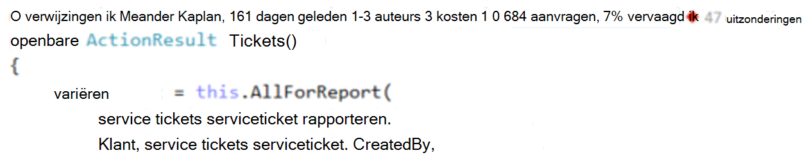
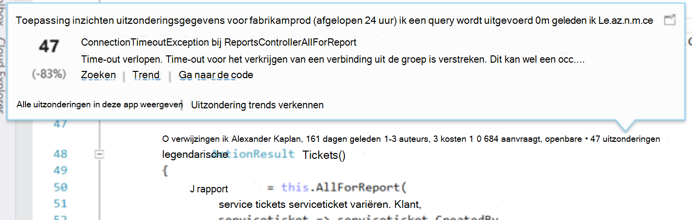
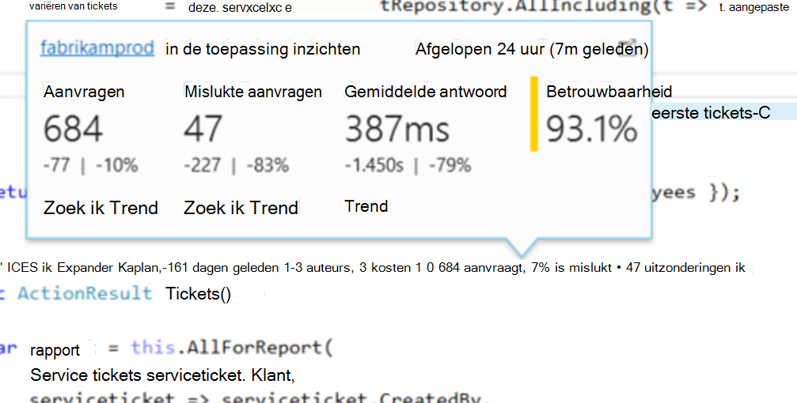
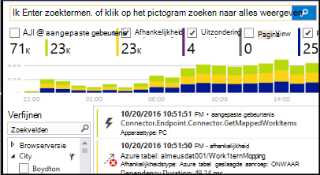

<properties 
    pageTitle="Toepassing inzichten telemetrielogboek in Visual Studio CodeLens | Microsoft Azure" 
    description="Snelle toegang tot uw toepassing inzichten aanvraag en uitzondering telemetrielogboek met CodeLens in Visual Studio." 
    services="application-insights" 
    documentationCenter=".net"
    authors="numberbycolors" 
    manager="douge"/>

<tags 
    ms.service="application-insights" 
    ms.workload="tbd" 
    ms.tgt_pltfrm="ibiza" 
    ms.devlang="na" 
    ms.topic="get-started-article" 
    ms.date="08/30/2016" 
    ms.author="daviste"/>
    
# Toepassing inzichten telemetrielogboek in Visual Studio CodeLens

Methoden in de code van uw web-app kunnen worden gemarkeerd met telemetrielogboek over runtime-uitzonderingen en een restitutie antwoord tijden. Als u [Visual Studio toepassing inzichten](app-insights-overview.md) in uw toepassing hebt geïnstalleerd, het telemetrielogboek wordt weergegeven in Visual Studio [CodeLens](https://msdn.microsoft.com/library/dn269218.aspx) - de opmerkingen aan het begin van elke functie waar u gewend bent kent nuttige informatie, zoals het nummer van de functie geplaatst wordt verwezen of de laatste persoon die deze bewerkt.

> [AZURE.NOTE] Toepassing inzichten in CodeLens is beschikbaar in Visual Studio 2015 Update 3 en hoger, of met de meest recente versie van [Analytics speciale tools voor ontwikkelaars extensie](https://visualstudiogallery.msdn.microsoft.com/82367b81-3f97-4de1-bbf1-eaf52ddc635a). CodeLens is beschikbaar in de professionals en Enterprise-edities van Visual Studio.

## Waar vind ik toepassing inzichten gegevens

Hiermee zoekt u de toepassing inzichten telemetrielogboek in de indicatoren CodeLens van de openbare verzoek methoden van uw webtoepassing. Indicatoren voor CodeLens worden bovenstaande methode en andere declaraties in C# en Visual Basic-code weergegeven. Als de gegevens van de toepassing inzichten beschikbaar is voor een methode, ziet u de indicatoren voor vergaderverzoeken en uitzonderingen zoals "100 aanvraagt, 1% is mislukt" of "10 uitzonderingen." Klik op een CodeLens-indicator voor meer informatie. 

> [AZURE.TIP] Toepassing inzichten aanvragen en uitzondering indicatoren duurt een paar seconden laden nadat andere CodeLens indicatoren worden weergegeven.

## Uitzonderingen in CodeLens

De uitzondering CodeLens-indicator geeft het aantal uitzonderingen die zijn opgetreden in de afgelopen 24 uur van de meest gebruikte optreedt uitzonderingen in uw toepassing tijdens deze periode, tijdens het verwerken van de aanvraag served door de methode 15.

Meer details weergeven, klikt u op de uitzonderingen CodeLens indicator:

* De wijziging percentage in het aantal uitzonderingen van de meest recente 24 uur ten opzichte van de voorgaande 24 uur
* **Ga naar de code** kiezen om te navigeren naar de broncode voor de functie de uitzondering genereren
* Kies **Zoeken** om query's in alle exemplaren van deze uitzondering die zijn opgetreden in de afgelopen 24 uur
* Kies **Trend** om weer te geven van een visualisatie trend exemplaren van deze uitzondering in de afgelopen 24 uur
* Kies **alle uitzonderingen in deze app weergeven** om query's in alle uitzonderingen die zijn opgetreden in de afgelopen 24 uur
* Kies **verkennen uitzondering trends** om weer te geven van een visualisatie trend voor alle uitzonderingen die zijn opgetreden in de afgelopen 24 uur. 

> [AZURE.TIP] Als u "0 uitzonderingen" in CodeLens te zien, maar u moet er uitzonderingen weten, controleert u of dat de juiste toepassing inzichten resource is geselecteerd in CodeLens. Als u wilt selecteren in een andere resource, met de rechtermuisknop op uw project in de Solution Explorer en kies **toepassing inzichten > Kies Telemetrielogboek bron**. CodeLens wordt alleen weergegeven voor de 15 meest voorkomende uitzonderingen in uw toepassing in de afgelopen 24 uur, dat het geval is als een uitzondering de 16e meest is of minder, ziet u "0 uitzonderingen." Uitzonderingen in ASP.NET-weergaven worden mogelijk niet weergegeven op de controller-methoden die deze weergaven gegenereerd.

> [AZURE.TIP] Als u ziet '? uitzonderingen"in CodeLens, moet u uw Azure-account koppelen aan Visual Studio of uw referentie Azure-account is mogelijk verlopen. In beide gevallen, klikt u op '? uitzonderingen"en kies **... een account toevoegen** aan uw referenties invoeren.

## Verzoeken in CodeLens

Het verzoek CodeLens indicator geeft het aantal HTTP-aanvragen die zijn verwerkt door een methode in de afgelopen 24 uur, plus het percentage van aanvragen die is mislukt.

Meer details weergeven, klikt u op de aanvragen CodeLens indicator:

* De absolute en het percentage wijzigingen in het aantal aanvragen, mislukte aanvragen en gemiddelde antwoord tijden via de afgelopen 24 uur vergeleken met de voorgaande 24 uur
* De betrouwbaarheid van de methode, berekend als het percentage van aanvragen die niet in de afgelopen 24 uur is mislukt
* Kies **Zoeken** voor serviceaanvragen of mislukte aanvragen om query's in alle (mislukte) aanvragen die zijn aangebracht in de afgelopen 24 uur
* Kies **Trend** weergeven van een visualisatie trend voor aanvragen, mislukte aanvragen of gemiddelde antwoord tijden in de afgelopen 24 uur.
* Kies de naam van de resource van toepassing inzicht krijgen in de linkerbovenhoek van de CodeLens details wilt wijzigen welke resource fungeert als bron voor CodeLens gegevens.

## Volgende stappen

||
|---|---
|**[Werken met de toepassing inzichten in Visual Studio](app-insights-visual-studio.md)** Telemetrielogboek zoeken, raadpleegt u gegevens in CodeLens en inzichten die toepassing configureren. Allemaal in Visual Studio. |
|**[Meer gegevens toevoegen](app-insights-asp-net-more.md)** Gebruik, beschikbaarheid, afhankelijkheden, uitzonderingen bewaken. Integreer traces van logboekregistratie kaders. Schrijf aangepaste telemetrielogboek. | 
|**[Werken met de toepassing inzichten-portal](app-insights-dashboards.md)** Dashboards, krachtige hulpprogramma's voor diagnose en analytische, waarschuwingen, een kaart live afhankelijkheid aan uw toepassing en telemetrielogboek exporteren. |
