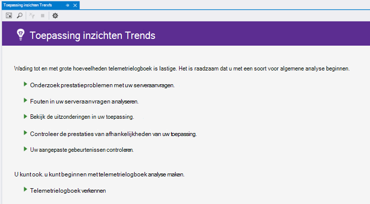
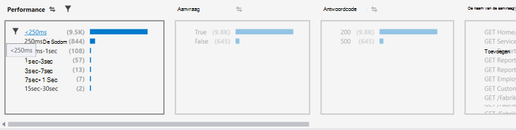
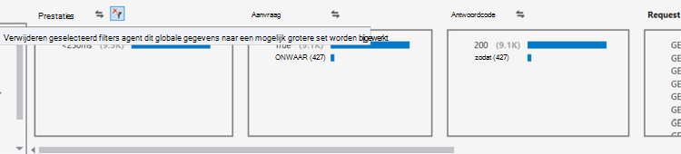
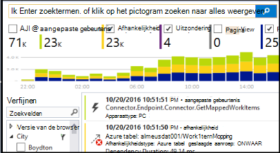
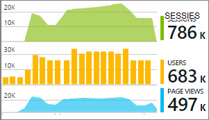

<properties 
    pageTitle="Analyseren van Trends in Visual Studio | Microsoft Azure" 
    description="Analyseren, visualiseren en verkennen van trends in uw toepassing inzichten telemetrielogboek in Visual Studio." 
    services="application-insights" 
    documentationCenter=".net"
    authors="numberbycolors" 
    manager="douge"/>

<tags 
    ms.service="application-insights" 
    ms.workload="tbd" 
    ms.tgt_pltfrm="ibiza" 
    ms.devlang="na" 
    ms.topic="get-started-article" 
    ms.date="10/25/2016" 
    ms.author="daviste"/>
    
# Analyseren van Trends in Visual Studio

Het hulpmiddel toepassing inzichten Trends gevisualiseerd hoe van uw toepassing belangrijke telemetrielogboek gebeurtenissen stadium worden gewijzigd, zodat u snel identificeren van problemen en verdwijnen. Met behulp van u koppelingen naar gedetailleerde diagnostische informatie, kunt Trends u van uw app prestaties verbeteren, de oorzaken van uitzonderingen opsporen en inzichten van uw aangepaste gebeurtenissen schuiven.

> [AZURE.NOTE] Toepassing inzichten Trends is beschikbaar in Visual Studio 2015 Update 3 en hoger, of met de [extensie Analytics speciale tools voor ontwikkelaars](https://visualstudiogallery.msdn.microsoft.com/82367b81-3f97-4de1-bbf1-eaf52ddc635a) versie 5.209 en hoger.

## Geopende toepassing inzichten Trends

De toepassing inzichten Trends-venster openen:

* Kies in de werkbalkknop toepassing inzichten **Verkennen Telemetrielogboek Trends**, of
* Kies in het contextmenu project **toepassing inzichten > verkennen Telemetrielogboek Trends**, of
* Kies in de menubalk Visual Studio **Weergave > andere Windows > toepassing inzichten Trends**.

U ziet mogelijk gevraagd te selecteren van een resource. **Selecteer een resource**op, meld u aan met een Azure-abonnement en kiest u een resource van toepassing inzicht krijgen in de lijst waarvoor u wilt analyseren van trends telemetrielogboek.

## Kies een trendanalyse

Aan de slag door een van de vijf algemene trend analyses, elke analyseren van gegevens uit de afgelopen 24 uur te kiezen:

* **Onderzoeken prestatieproblemen ondervindt met het serveraanvragen van uw** - aanvragen voor uw service, gegroepeerd op antwoord tijden
* **Analyseren fouten in uw serveraanvragen** - aanvragen voor uw service, gegroepeerd op http-antwoordcode
* **Bekijk de uitzonderingen in uw toepassing** - uitzonderingen van uw service, gegroepeerd op uitzonderingstype
* **Controleer de prestaties van van uw toepassing afhankelijkheden** - Services aangeroepen door de service, gegroepeerd op antwoord tijden
* **Uw aangepaste gebeurtenissen controleren** - aangepaste gebeurtenissen die u hebt ingesteld voor uw service, gegroepeerd op gebeurtenistype.

Deze vooraf gedefinieerde analyses zijn later via de knop **weergave voorkomende telemetrielogboek analyse** in de linkerbovenhoek van het venster Trends beschikbaar.

## Trends in uw toepassing visualiseren

Toepassing inzichten Trends maakt u een reeks tijdsvisualisatie van van uw app-telemetrielogboek. Elke reeks tijdsvisualisatie weergegeven één type telemetrielogboek, gegroepeerd op één eigenschap van die telemetrielogboek, via sommige tijdsbereik. U wilt bijvoorbeeld serververzoeken, gegroepeerd op het land waarvan ze afkomstig, via de afgelopen 24 uur bekijken. In dit voorbeeld zou elke bel in de visualisatie een telling van de serveraanvragen voor sommige land/regio vertegenwoordigen tijdens één uur.

Gebruik de knoppen boven aan het venster om aan te passen wat voor soort telemetrielogboek die u bekijkt. Kies eerst de telemetrielogboek typen waarin u geïnteresseerd bent:

* **Type telemetrielogboek** - serveraanvragen, uitzonderingen, depdendencies of aangepaste gebeurtenissen
* **Tijdsbereik** - ergens in de laatste 30 minuten tot de laatste 3 dagen
* **Group By** - uitzondering type, probleem-ID, land/regio en meer.

Klik vervolgens op **Analyseren Telemetrielogboek** als de query wilt uitvoeren.

Om te navigeren tussen bellen in de visualisatie:

* Schakel een bellendiagram, waarin de filters onderaan in het venster alleen de gebeurtenissen die zijn aangebracht in een bepaalde periode samenvatten wordt bijgewerkt
* Dubbelklik op een bellendiagram om te navigeren naar de knop Zoeken en Zie al de afzonderlijke telemetrielogboek-gebeurtenissen die hebben plaatsgevonden tijdens deze periode
* CTRL + klik op een bellendiagram opgeheven om deze te selecteren in de visualisatie.

> [AZURE.TIP] Hulpmiddelen voor werk samen om u te helpen de oorzaken van problemen in uw service tussen duizenden telemetrielogboek gebeurtenissen pinpoint de Trends en zoeken. Bijvoorbeeld als één namiddag uw klanten ziet u de app minder heeft gereageerd wordt, beginnen met Trends. Aanvragen voor uw service via de afgelopen enkele uren, gegroepeerd op antwoord tijd analyseren. Zie als er een ongebruikelijk cluster van traag aanvragen. Dubbelklik vervolgens die bellen om te gaan naar de knop zoeken, gefilterd op de gebeurtenissen die aanvraag zijn. Zoeken, kunt u de inhoud van deze verzoeken verkennen en navigeer naar de code die nodig zijn voor het probleem op te lossen.

## Filter

Meer informatie over samenvat met de filterbesturingselementen onderaan in het venster. Als u een filter, klikt u op de naam ervan. U kunt snel schakelen tussen verschillende filters om te ontdekken trends in een bepaalde dimensie van uw telemetrielogboek kunnen worden verborgen. Als u een filter in één dimensie, zoals uitzonderingstype toepassen, blijven de filters in andere dimensies waarop kan worden geklikt zelfs als deze niet beschikbaar bij worden weergegeven. Naar un-een filter toepassen, klikt u nogmaals op. CTRL terwijl u klikt op meerdere filters in dezelfde dimensie selecteren.

Wat gebeurt er als u wilt meerdere filters toepassen? 

1. Het eerste filter toepassen. 
2. Klik op de knop **geselecteerde filters en query opnieuw toepassen** door de naam van de dimensie van het eerste filter. Hiermee wordt uw telemetrielogboek voor alleen de gebeurtenissen die overeenkomen met het eerste filter opnieuw query. 
3. Een tweede filter toepassen. 
4. Herhaal het proces voor het vinden van trends in specifieke deelverzamelingen uw telemetrielogboek. Bijvoorbeeld serveraanvragen met de naam "GET-start/Index" _en_ die afkomstig zijn Duitsland _en_ die een antwoordcode 500 hebt ontvangen. 

Naar un-een van deze filters toepassen, klikt u op de knop **verwijderen van de geselecteerde filters en query opnieuw** voor de dimensie.

## Afwijkingen zoeken

Het hulpmiddel Trends kunt bellen van gebeurtenissen die afwijkende vergeleken met andere bellen in de dezelfde tijdreeks zijn markeren. Kies in de vervolgkeuzelijst weergavetype **telt in tijd Emmertje (markeren afwijkingen)** of **Percentages in tijd Emmertje (markeren afwijkingen)**. Rode bellen zijn afwijkende. Afwijkingen worden gedefinieerd als bellen met telt/percentages van meer dan 2.1 tijden de standaarddeviatie van de telt/percentages die zijn aangebracht in het verleden twee tijdsperioden (48 uur als u de laatste 24 uur, enz bekijkt.).

> [AZURE.TIP] Markering afwijkingen is vooral handig voor het zoeken van uitschieters in tijdreeks van kleine bellen die er anders op dezelfde manier grootte.  

## Volgende stappen

||
|---|---
|**[Werken met de toepassing inzichten in Visual Studio](app-insights-visual-studio.md)** Telemetrielogboek zoeken, raadpleegt u gegevens in CodeLens en inzichten die toepassing configureren. Allemaal in Visual Studio. |
|**[Meer gegevens toevoegen](app-insights-asp-net-more.md)** Gebruik, beschikbaarheid, afhankelijkheden, uitzonderingen bewaken. Integreer traces van logboekregistratie kaders. Schrijf aangepaste telemetrielogboek. | 
|**[Werken met de toepassing inzichten-portal](app-insights-dashboards.md)** Dashboards, krachtige hulpprogramma's voor diagnose en analytische, waarschuwingen, een kaart live afhankelijkheid aan uw toepassing en telemetrielogboek exporteren. |
