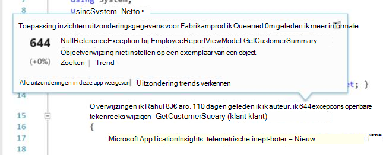

<properties 
    pageTitle="Werken met inzichten van toepassing op Visual Studio" 
    description="Prestatieanalyse en hulpprogramma's voor diagnose tijdens de foutopsporing en in productie." 
    services="application-insights" 
    documentationCenter=".net"
    authors="alancameronwills" 
    manager="douge"/>

<tags 
    ms.service="application-insights" 
    ms.workload="tbd" 
    ms.tgt_pltfrm="ibiza" 
    ms.devlang="na" 
    ms.topic="get-started-article" 
    ms.date="06/21/2016" 
    ms.author="awills"/>

# Werken met de toepassing inzichten in Visual Studio

Visual Studio (2015 en hoger), kunt u prestaties analyseren en diagnose stellen bij problemen zowel in Foutopsporing en productie, telemetrielogboek van [Visual Studio toepassing inzichten](app-insights-overview.md)gebruik.

Als u nog niet hebt [Geïnstalleerd toepassing inzichten in uw app](app-insights-asp-net.md), dat nu doen.

## Fouten opsporen in uw project

Uw toepassing met F5 uitvoeren en probeer het zelf: verschillende pagina's om te genereren sommige telemetrielogboek openen.

Visual Studio ziet u een telling van de gebeurtenissen die zijn geregistreerd.

Klik op deze knop als diagnostische zoeken wilt openen. 

## Diagnostische gegevens zoeken

Het venster zoeken bevat gebeurtenissen die zijn geregistreerd. (Als u aangemeld bij Azure bij het instellen van toepassing inzichten, u zult kunnen doorzoeken dezelfde gebeurtenissen in de portal.)

De zoekopdracht vrije tekst werkt op alle velden in de gebeurtenissen. Deel van de URL van een pagina; bijvoorbeeld zoeken of de waarde van een eigenschap zoals client plaats; of specifieke woorden in een logboek doelcellen.

Klik op een willekeurige gebeurtenis als u wilt zien van de uitgebreide eigenschappen.

U kunt ook het tabblad verwante Items om u te helpen bij het vaststellen van mislukte aanvragen of uitzonderingen openen.

## Diagnostisch hulpprogramma hub

De Hub diagnostische gegevens (in Visual Studio-2015 of later) ziet u de toepassing inzichten server telemetrielogboek zoals deze wordt gegenereerd. Dit werkt zelfs wanneer u niet alleen als u wilt de SDK, zonder deze verbinding maakt met een bron in de portal van Azure installeren.

## Uitzonderingen

Als u [ingesteld uitzondering monitoring hebt](app-insights-asp-net-exceptions.md), worden uitzondering rapporten worden weergegeven in het venster zoeken. 

Klik op een uitzondering als u een stacktrace. Als de code van de app geopend in Visual Studio is, kunt u via uit de stacktrace naar de betreffende regel van de code.

Bovendien op de regel Code Lens boven elke methode ziet u een telling van de uitzonderingen die door de toepassing inzichten is vastgelegd in de afgelopen 24 uur.

## Lokale bewaken

(Van Visual Studio 2015 Update 2) Als u dit nog niet hebt geconfigureerd voor de SDK telemetrielogboek om naar te verzenden de toepassing inzichten-portal (zodat er geen toets instrumentation in ApplicationInsights.config) wordt het venster diagnostisch hulpprogramma telemetrielogboek uit de sessie voor de meest recente foutopsporing weergegeven. 

Dit is wenselijk als u een eerdere versie van uw app al hebt gepubliceerd. U wilt niet dat de telemetrielogboek bij uw foutopsporing sessies naar omhoog worden gecombineerd met de telemetrielogboek op de portal-toepassing inzichten vanuit de gepubliceerde app.

Het is ook handig als er bepaalde [aangepaste telemetrielogboek](app-insights-api-custom-events-metrics.md) waarin u opsporen wilt alvorens telemetrielogboek bij de portal.

* *Volledig geconfigureerd ik aanvankelijk inzichten van toepassing als u wilt verzenden telemetrielogboek bij de portal. Maar nu ik wilt zien van het telemetrielogboek alleen in Visual Studio.*

 * In het venster Zoeken-instellingen is er een optie voor het zoeken van lokale diagnostische hulpprogramma's, zelfs als uw app telemetrielogboek bij de portal stuurt.
 * Opmerking Als u wilt stoppen telemetrielogboek dat wordt verzonden naar de portal, de regel `<instrumentationkey>...` uit ApplicationInsights.config. Wanneer u bent klaar telemetrielogboek bij de portal om opnieuw te verzenden, verwijder de opmerkingen bij deze.

## Trends

Trends is een hulpprogramma voor het visualiseren van de werking van uw app na verloop van tijd. 

Kies **Verkennen Telemetrielogboek Trends** in de toepassing inzichten werkbalkknop of toepassing inzichten zoekvenster. Kies een van de vijf algemene query's aan de slag. U kunt verschillende gegevenssets op basis van telemetrielogboek typen, tijdsbereik en andere eigenschappen kunt analyseren. 

Als u wilt zoeken afwijkingen in uw gegevens, kiest u een van de afwijking opties onder de vervolgkeuzelijst "Weergavetype". De filteropties onderaan in het venster kunnen eenvoudig specificeren specifieke deelverzamelingen uw telemetrielogboek.

[Meer informatie over Trends](app-insights-visual-studio-trends.md).

## Hoe nu verder?

||
|---|---
|**[Meer gegevens toevoegen](app-insights-asp-net-more.md)** Gebruik, beschikbaarheid, afhankelijkheden, uitzonderingen bewaken. Integreer traces van logboekregistratie kaders. Schrijf aangepaste telemetrielogboek. | 
|**[Werken met de toepassing inzichten-portal](app-insights-dashboards.md)** Dashboards, krachtige hulpprogramma's voor diagnose en analytische, waarschuwingen, een kaart live afhankelijkheid aan uw toepassing en telemetrielogboek exporteren. |

 
