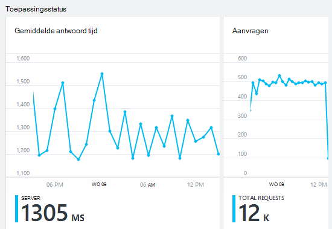

<properties 
    pageTitle="De status van uw app en het gebruik met de toepassing inzichten controleren" 
    description="Aan de slag met de toepassing inzichten. Gebruik, beschikbaarheid en prestaties van uw on-premises implementatie of Microsoft Azure-toepassingen analyseren." 
    services="application-insights" 
    documentationCenter=""
    authors="alancameronwills" 
    manager="douge"/>

<tags 
    ms.service="application-insights" 
    ms.workload="tbd" 
    ms.tgt_pltfrm="ibiza" 
    ms.devlang="na" 
    ms.topic="article" 
    ms.date="11/25/2015" 
    ms.author="awills"/>
 
# Prestaties van de monitor in webtoepassingen

*Er is een toepassing inzichten in de proefversie.*

Controleer of dat uw toepassing ook wordt uitgevoerd en snel achterhalen over eventuele fouten. [Toepassing inzichten] [ start] wordt informatie over de gewenste prestatieproblemen en uitzonderingen en kunt u vinden en diagnose stellen bij de belangrijkste oorzaken.

Toepassing inzichten kunnen controleren Java zowel ASP.NET-webtoepassingen en services, WCF-services. Dit steekt nogal on-premises, op virtuele machines of als Microsoft Azure websites die worden gehost. 

Aan de clientzijde, kan de toepassing inzichten telemetrielogboek van webpagina's en een grote verscheidenheid aan apparaten zoals een iOS-, Android en Windows Store-apps duren.

## Prestatiecontroles instellen

Als u dit nog niet hebt (dat wil zeggen als er geen ApplicationInsights.config) nog toepassing inzichten toegevoegd aan uw project, kiest u een van de volgende manieren aan de slag:

* [ASP.NET-web-apps](app-insights-asp-net.md)
 * [Uitzonderingen voor controle toevoegen](app-insights-asp-net-exceptions.md)
 * [Afhankelijkheid cmdlets voor controle toevoegen](app-insights-monitor-performance-live-website-now.md)
* [J2EE WebApps](app-insights-java-get-started.md)
 * [Afhankelijkheid cmdlets voor controle toevoegen](app-insights-java-agent.md)

## Prestatiegegevens verkennen

Blader naar de resource van toepassing inzichten die u voor uw toepassing instelt in [de portal van Azure](https://portal.azure.com). Het blad overzicht ziet u eenvoudige prestatiegegevens:

Klik op een grafiek om meer details weer te geven en om resultaten te bekijken voor een langere periode. Bijvoorbeeld, klikt u op de tegel aanvragen en selecteer een tijdsbereik:

Klik op een grafiek om te kiezen welke doelstellingen wordt weergegeven, of een nieuwe grafiek toevoegen en kiest u de metrisch:

> [AZURE.NOTE] **Schakel alle doelstellingen** om te zien van de volledige selectie die beschikbaar is. De doelstellingen kunnen worden ingedeeld in groepen; Wanneer alle leden van een groep is geselecteerd, wordt alleen de andere leden van die groep weergegeven.

## Wat betekent dit alle? Tegels van de prestaties en rapporten

Er is een aantal prestatiegegevens die kunt u deze krijgen. Laten we beginnen met die standaard worden weergegeven op het blad toepassing.

### Aanvragen

Het aantal HTTP-aanvragen ontvangen in een opgegeven periode. Vergelijk deze met de resultaten voor andere rapporten om te zien hoe uw app zich gedraagt als het selectievakje laden varieert.

HTTP-aanvragen bevatten alle GET of POST aanvragen voor pagina's, gegevens en afbeeldingen.

Klik op de tegel voor telt voor specifieke URL's.

### Gemiddelde antwoord tijd

Meet de tijd tussen een web-verzoek om uw toepassing en het antwoord in te voeren.

De punten weergeven zwevend gemiddelde. Als er een groot aantal aanvragen, is er mogelijk enkele die afwijken van het gemiddelde zonder een duidelijke piek of gehalveerde in de grafiek.

Zoek naar ongebruikelijke pieken. In het algemeen wordt verwacht antwoord tijd toenemen met een stijging van aanvragen. Als de stijging niet in verhouding staan is, is het mogelijk dat uw app een limiet resource zoals CPU of de capaciteit van een service die wordt gebruikt raken.

Klik op de tegel voor tijden voor specifieke URL's.

### Laagst mogelijke aanvragen

Ziet u welke aanvragen mogelijk eerst prestaties optimaliseren.

### Mislukte aanvragen

Een telling van serviceaanvragen die onbekende uitzonderingen heeft.

Klik op de tegel om te zien van de details van specifieke fouten en selecteer een afzonderlijke aanvraag om de details weer te geven. 

Slechts een steekproef zijn vertegenwoordiger van fouten blijft voor afzonderlijke inspectie behouden.

### Andere aan de doelstellingen

Als u wilt zien wat Stel andere parameters die u kunt weergeven, klikt u op een grafiek en schakelt u de maateenheden om te zien het volledige beschikbaar. Klik op (i) als de definitie van elke metrisch wilt weergeven.

Een meetwaarde selecteren, wordt de anderen die niet kan worden weergegeven in dezelfde grafiek uitgeschakeld.

## Waarschuwingen instellen

Als u wilt worden gewaarschuwd per e-mail van ongebruikelijke waarden van een meting, moet u een waarschuwing toevoegen. U kunt u ofwel het e-mailbericht verzenden naar de account-beheerders, of aan specifieke e-mailadressen.

Stel de resource voordat u de andere eigenschappen. Kies de resources webtest geen als u wilt waarschuwingen instellen op prestaties of gebruik de doelstellingen.

Zorg ervoor dat de eenheden waarin u wordt gevraagd of Voer de drempelwaarde opmerking.

*Ik zie niet de knop Waarschuwing toevoegen.* -Is dit een groep waaraan u alleen-lezentoegang hebt account? Neem contact op met de accountbeheerder van het.

## Diagnose van problemen

Hier volgen enkele tips voor het zoeken en oplossen van prestatieproblemen:

* [Web tests] instellen[ availability] om te worden gewaarschuwd als uw website uitvalt of langzaam af of onjuist worden gegroepeerd reageert. 
* Vergelijk de aanvraag tellen met andere maatstelsel weergegeven als fouten of traag antwoord betrekking hebben op laden.
* [Invoegen en zoek instructies trace] [ diagnostic] in uw code om te helpen problemen pinpoint.

## Volgende stappen

[Tests met webonderdelen] [ availability] -web-aanvraag verzonden naar uw toepassing met regelmatige tussenpozen van de wereld hebben.

[Vastleggen en het traceren van diagnostische informatie zoeken] [ diagnostic] - trace oproepen invoegen en de resultaten om op te sporen problemen doorzoeken.

[Gebruik bijhouden] [ usage] -Ontdek hoe mensen gebruiken voor uw toepassing.

[Probleemoplossing] [ qna] - en Q & A

## Video

[AZURE.VIDEO performance-monitoring-application-insights]

<!--Link references-->

[availability]: app-insights-monitor-web-app-availability.md
[diagnostic]: app-insights-diagnostic-search.md
[greenbrown]: app-insights-asp-net.md
[qna]: app-insights-troubleshoot-faq.md
[redfield]: app-insights-monitor-performance-live-website-now.md
[start]: app-insights-overview.md
[usage]: app-insights-web-track-usage.md

 
