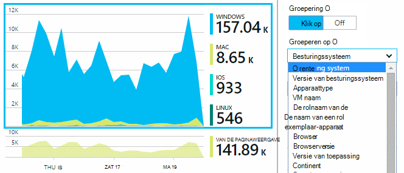

<properties 
    pageTitle="Gebruiksanalyse voor webtoepassingen met toepassing inzichten" 
    description="Overzicht van gebruiksanalyses voor WebApps gebruiken met de toepassing inzichten" 
    services="application-insights" 
    documentationCenter=""
    authors="alancameronwills" 
    manager="douge"/>

<tags 
    ms.service="application-insights" 
    ms.workload="tbd" 
    ms.tgt_pltfrm="ibiza" 
    ms.devlang="na" 
    ms.topic="article" 
    ms.date="06/12/2016" 
    ms.author="awills"/>
 
# <a name="usage-analysis-for-web-applications-with-application-insights"></a>Gebruiksanalyse voor webtoepassingen met toepassing inzichten

Als u weet hoe mensen gebruiken voor uw toepassing, kunt u uw ontwikkelingswerk richten op de scenario's die ze het belangrijkst zijn en inzicht in de doelstellingen die ze vinden makkelijker of moeilijker om te bereiken krijgen. 

Visual Studio-toepassing inzichten biedt twee niveaus van gebruik bijhouden:

* **Gebruiker, de sessie en de pagina gegevens weer** - opgegeven afmelden bij het vak.  
* **Aangepaste telemetrielogboek** - u [programmacode schrijven] [ api] traceren van uw gebruikers via de gebruikerservaring van uw app. 

## <a name="setting-up"></a>Instellen

Open een resource van toepassing inzichten in de [Portal van Azure](https://portal.azure.com), klik op de lege Browser pagina laadtijd grafiek en volg de installatie-instructies.

[Meer informatie](app-insights-javascript.md) 


## <a name="how-popular-is-my-web-application"></a>Hoe populaire is mijn webtoepassing?

Meld u aan bij de [portal van Azure][portal], blader naar de bron van de toepassing en klikt u op gebruik:


* **Gebruikers:** Het aantal verschillende actieve gebruikers in het tijdsbereik van de grafiek. 
* **Sessies:** Het aantal actieve sessies
* **Paginaweergaven** Telt het aantal oproepen naar trackPageView(), meestal één keer worden genoemd in elke pagina met webonderdelen.

Klik op een van de grafieken om meer details weer te geven. Zoals u ziet dat u het tijdsbereik van de grafieken kunt wijzigen.

### <a name="where-do-my-users-live"></a>Waar ik mijn gebruikers live?

Klik op de grafiek gebruikers om te zien van meer details van het blad gebruik:


 
### <a name="what-browsers-or-operating-systems-do-they-use"></a>Welke browsers of besturingssystemen gebruik ze gebruiken?

De groepsgegevens (segment) op een eigenschap, zoals de Browser, besturingssysteem of plaats:




## <a name="sessions"></a>Sessies

Sessie is een fundamentele concept in toepassing inzichten, waarin streeft ernaar te koppelen elke telemetrielogboek gebeurtenis: zoals aanvragen, paginaweergaven, uitzonderingen, of aangepaste gebeurtenissen die u code uzelf - aan de sessie van een specifieke gebruiker. 

RTF contextgegevens worden verzameld over elke sessie, zoals apparaateigenschappen, geografische locatie, besturingssysteem, enzovoort.

Als u zowel de client en server instrument ([ASP.NET] [ greenbrown] of [J2EE][java]), wordt het SDK's wordt de sessie-id tussen client en server, doorvoeren, zodat gebeurtenissen aan beide zijden kunnen worden gelezen.

Bij het [oplossen van problemen][diagnostic], vindt u alle telemetrielogboek die zijn gerelateerd aan de sessie waarin een probleem is opgetreden, inclusief alle aanvragen en gebeurtenissen, uitzonderingen of sporen die zijn geregistreerd.

Sessies bieden een goede maateenheid voor de populariteit van contexten zoals apparaat, besturingssysteem of locatie. Door het aantal sessies gegroepeerd op apparaat weergeeft, bijvoorbeeld dat u een nauwkeuriger telling van hoe vaak dat apparaat wordt gebruikt met uw app, dan door te tellen paginaweergaven. Dit is een handige invoer om te sorteren van elk apparaat-specifieke probleem.


#### <a name="whats-a-session"></a>Wat is een sessie?

Een sessie vertegenwoordigt een enkel optreden tussen de gebruiker en de app. In het eenvoudigste sessie begint met een gebruiker voor het starten van de app en eindigt wanneer de gebruiker de app verlaat. Web-apps voor eindigt standaard de sessie na 30 minuten inactiviteit of na 24 uur van de activiteit. 

U kunt deze standaardinstellingen wijzigen door het codefragment bewerken:

    <script type="text/javascript">
        var appInsights= ... { ... }({
            instrumentationKey: "...",
            sessionRenewalMs: 3600000,
            sessionExpirationMs: 172800000
        });

* `sessionRenewalMs`: De tijd in milliseconden, de sessie vanwege gebruikerswachtwoord inactiviteit verloopt. Standaard: 30 minuten.
* `sessionExpirationMs`: De lengte van de maximale sessie (in milliseconden). Als de gebruiker na deze keer actief blijft, wordt geteld op een andere sessie. Standaard: 24 uur.

**De duur van de sessie** is een [Metrisch] [ metrics] die de tijdsduur tussen de eerste en laatste telemetrielogboek-items van de sessie records. (Dit zijn de time-out niet opgenomen.)

**Sessie tellen** in een bepaalde interval wordt gedefinieerd als het aantal unieke sessies met enkele activiteit tijdens dit interval. Wanneer u een lang tijdsbereik zoals dagelijkse sessie tellen voor de laatste week bekijkt, is dit meestal gelijk is aan het totale aantal sessies. 

Wanneer u een korter tijdsbereik zoals per uur gelijk verkennen, wordt er echter een lange sessie die meerdere uren in beslag nemen worden geteld voor elk uur waarin de sessie actief is. 

## <a name="users-and-user-counts"></a>Gebruikers en gebruiker aantallen


Elke gebruikerssessie is gekoppeld aan een unieke gebruikers-id. 

De gebruiker wordt standaard aangegeven door een cookie plaatsen. Een gebruiker die meerdere browsers of apparaten gebruikt worden meer dan één keer geteld. (Maar Zie [geverifieerde gebruikers](#authenticated-users))


Het **aantal gebruikers** metrisch in een bepaalde interval wordt gedefinieerd als het aantal unieke gebruikers met opgenomen activiteit tijdens dit interval. Hierdoor kunnen kunnen gebruikers met lange sessies worden verwerkt meerdere keren, wanneer u een tijdsbereik instellen zodat de gelijk minder dan een uur is of zodat.

**Nieuwe gebruikers** telt de gebruikers van wie de eerste sessie met de app is opgetreden tijdens dit interval. Als de standaardmethode van tellen door gebruikers door cookies wordt gebruikt, wordt dit ook gebruikers die hun cookies hebt uitgeschakeld, of mensen die een nieuwe apparaat of de browser gebruiken voor toegang tot uw app voor de eerste keer bevatten.


### <a name="authenticated-users"></a>Geverifieerde gebruikers

Als uw web-app kan gebruikers aanmelden, kunt u een nauwkeuriger telling verkrijgen met behulp van de toepassing inzichten die een unieke gebruikers-id. Deze geen moeten hun naam of dezelfde-id die u in uw app gebruiken. Zodra de app heeft de gebruiker geïdentificeerd, gebruikt u deze code:


*JavaScript op client*

      appInsights.setAuthenticatedUserContext(userId);

Als uw app gegroepeerd gebruikers in accounts, kunt u ook een id voor de account doorgeven. 

      appInsights.setAuthenticatedUserContext(userId, accountId);

De gebruiker en account-id's mag geen spaties of de tekens bevatten`,;=|`


U kunt een grafiek van **Geverifieerde gebruikers** en - **Accounts**maken in [aan de doelstellingen explorer](app-insights-metrics-explorer.md). 

## <a name="synthetic-traffic"></a>Synthetische verkeer

Synthetische verkeer bevat aanmeldingsaanvragen van beschikbaarheid en laden tests, zoekmachine-crawlers en andere gemachtigden. 

Toepassing inzichten pogingen doen streeft ernaar automatisch bepalen en synthetische verkeer classificeren en past u er correct. In de meeste gevallen wordt synthetische verkeer geen gebruikgemaakt van de SDK JavaScript, zodat deze activiteit wordt uitgesloten van de gebruiker en de sessie tellen. 

Echter voor de toepassing inzichten [web tests][availability], de gebruikers-id wordt automatisch ingesteld op basis van POP-locatie en sessie-id is ingesteld op basis van een test uitvoeren-id. In rapporten, synthetische verkeer standaard wordt uitgesloten deze gebruikers en sessies worden uitgefilterd. Echter wanneer synthetische verkeer opgenomen is, het mogelijk dat een kleine stijging in algehele gebruikers en sessie aantallen.
 
## <a name="page-usage"></a>Gebruik van de pagina

Klik op de pagina weergaven grafiek voor een versie meer uitgezoomde in combinatie met een overzicht van de populairste pagina's:


 
Het bovenstaande voorbeeld is van een website spellen. Hieruit kan we direct zien:

* Gebruik niet is verbeterd in de laatste week. Wellicht moet we Zoekmachineoptimalisatie nadenken?
* Veel minder mensen Zie spellen pagina's dan de startpagina. Waarom wordt niet de introductiepagina kan worden afgespeeld spellen trekken?
* 'Crossword' is het meest populaire spel. We moet prioriteit om nieuwe ideeën en er verbeteringen te geven.

## <a name="custom-tracking"></a>Aangepaste bijhouden

Stel dat we in plaats van elk spel implementeren in een afzonderlijke webpagina, u wilt ze refactoring alles in de app dezelfde één pagina met de meeste van de functionaliteit voor gecodeerd als Javascript in de pagina met webonderdelen. Hiermee kan de gebruiker snel schakelen tussen één spel en een andere, of zelfs hebben verschillende spellen op één pagina. 

Maar nog steeds de gewenste inzichten van de toepassing het aantal keren aanmelden elk spel wordt geopend, op precies dezelfde manier als wanneer ze zich op afzonderlijke webpagina's. Dat is gemakkelijk: alleen een oproep naar de module telemetrielogboek invoegen in uw JavaScript waar u wilt opnemen die een nieuwe pagina heeft geopend:

    appInsights.trackPageView(game.Name);

## <a name="custom-events"></a>Aangepaste gebeurtenissen

Schrijf aangepaste telemetrielogboek om specifieke gebeurtenissen. Met name in een app één pagina wilt u weten hoe vaak de gebruiker, kunt u bepaalde acties uitvoeren of bepaalde doelstellingen bereikt: 

    appInsights.trackEvent("GameEnd");

Als u bijvoorbeeld aan te melden te klikken op een koppeling:

    <a href="target.htm" onclick="appInsights.trackEvent('linkClick');return true;">my link</a>


## <a name="view-counts-of-custom-events"></a>Weergave aantallen aangepaste gebeurtenissen

Open de Verkenner de doelstellingen en gebeurtenissen weergeven in een grafiek toevoegen. Segmenten met hun naam weergeven:


## <a name="drill-into-specific-events"></a>Zoom in op specifieke gebeurtenissen

Als u een beter begrip van hoe een typisch sessie hoort, is het raadzaam om u te richten op een specifieke gebruiker-sessie met een bepaald type gebeurtenis. 

In dit voorbeeld gecodeerd we een aangepaste gebeurtenis "NoGame" dat wordt aangeroepen als de gebruiker zich afmelden zonder daadwerkelijk een spel wordt gestart. Waarom een gebruiker dat zou u doen? Wellicht als we enkele specifieke exemplaren inzoomen, krijgt we een aanwijzing. 

De aangepaste gebeurtenissen hebt ontvangen van de app worden met hun naam weergeven op het blad Overzicht vermeld:


 
Klik op de gebeurtenis belangrijke en selecteert u een recente specifieke exemplaar:


 
Bekijk alle telemetrielogboek in voor de sessie waar die NoGame gebeurtenis heeft plaatsgevonden. 


 
Er zijn geen uitzonderingen, zodat de gebruiker is niet verhinderd door enkele storing wordt afgespeeld.
 
We kunnen alle typen telemetrielogboek behalve paginaweergaven uitfilteren voor deze sessie:


 
En nu kunnen we zien dat deze gebruiker geregistreerd in overzichtelijk wilt controleren van de meest recente scores. We overwegen wellicht ontwikkeling van een gebruiker artikel die gemakkelijker kunt doen. (En we een aangepaste gebeurtenis aan rapport te implementeren als dit artikel bepaalde plaatsvindt.)

## <a name="filter-search-and-segment-your-data-with-properties"></a>Filteren, zoeken en segmenteren van uw gegevens met eigenschappen
U kunt willekeurige labels en numerieke waarden toevoegen aan gebeurtenissen.
 

*JavaScript op client*

```JavaScript

    appInsights.trackEvent("WinGame",
        // String properties:
        {Game: currentGame.name, Difficulty: currentGame.difficulty},
        // Numeric measurements:
        {Score: currentGame.score, Opponents: currentGame.opponentCount}
    );
```

*C# op server*

```C#

    // Set up some properties:
    var properties = new Dictionary <string, string> 
        {{"game", currentGame.Name}, {"difficulty", currentGame.Difficulty}};
    var measurements = new Dictionary <string, double>
        {{"Score", currentGame.Score}, {"Opponents", currentGame.OpponentCount}};

    // Send the event:
    telemetry.TrackEvent("WinGame", properties, measurements);
```

*VB op server*

```VB

    ' Set up some properties:
    Dim properties = New Dictionary (Of String, String)
    properties.Add("game", currentGame.Name)
    properties.Add("difficulty", currentGame.Difficulty)

    Dim measurements = New Dictionary (Of String, Double)
    measurements.Add("Score", currentGame.Score)
    measurements.Add("Opponents", currentGame.OpponentCount)

    ' Send the event:
    telemetry.TrackEvent("WinGame", properties, measurements)
```

Eigenschappen koppelen aan de paginaweergaven op dezelfde manier:

*JavaScript op client*

```JS

    appInsights.trackPageView("Win", 
        url,
        {Game: currentGame.Name}, 
        {Score: currentGame.Score});
```

In diagnostische zoeken, moet u de eigenschappen weergeven door te klikken via een afzonderlijke exemplaar van een gebeurtenis.


 
Gebruik het zoekveld om gebeurtenissen die hebben plaatsgevonden met de waarde van een bepaald onroerend goed weer te geven.


## <a name="a--b-testing"></a>A | B testen

Als u niet welke variant van een functie worden prettig weet, laat u beide, waardoor elke toegankelijk zijn voor andere gebruikers. Het succes van elk meten en klikt u vervolgens verplaatsen naar een geïntegreerd versie.

Voor deze techniek, kunt u afzonderlijke labels toevoegen aan alle telemetrielogboek die is verzonden door elke versie van uw app. U kunt dit doen door het definiëren van eigenschappen in het actieve TelemetryContext. Deze standaardeigenschappen worden toegevoegd aan elke telemetrielogboek bericht dat de toepassing wordt verzonden - niet alleen uw aangepaste berichten, maar als u ook het standaard telemetrielogboek. 

Klik in de portal-toepassing inzichten u kunt vervolgens wel filteren en groeperen (segment) uw gegevens van de labels, kunnen de verschillende versies vergelijken.

*C# op server*

```C#

    using Microsoft.ApplicationInsights.DataContracts;

    var context = new TelemetryContext();
    context.Properties["Game"] = currentGame.Name;
    var telemetry = new TelemetryClient(context);
    // Now all telemetry will automatically be sent with the context property:
    telemetry.TrackEvent("WinGame");
```

*VB op server*

```VB

    Dim context = New TelemetryContext
    context.Properties("Game") = currentGame.Name
    Dim telemetry = New TelemetryClient(context)
    ' Now all telemetry will automatically be sent with the context property:
    telemetry.TrackEvent("WinGame")
```

Afzonderlijke telemetrielogboek kunt overschreven door de standaardwaarden.

U kunt een universele initialisatiefunctie zo instellen dat alle nieuwe TelemetryClients automatisch uw context gebruiken.

```C#


    // Telemetry initializer class
    public class MyTelemetryInitializer : ITelemetryInitializer
    {
        public void Initialize (ITelemetry telemetry)
        {
            telemetry.Properties["AppVersion"] = "v2.1";
        }
    }
```

In de app-initialisatiefunctie zoals Global.asax.cs:

```C#

    protected void Application_Start()
    {
        // ...
        TelemetryConfiguration.Active.TelemetryInitializers
        .Add(new MyTelemetryInitializer());
    }
```


## <a name="build---measure---learn"></a>Opbouwen - eenheid - informatie over

Wanneer u analytics gebruikt, wordt een geïntegreerde onderdeel ontwikkelingscyclus - niet alleen iets u denkt dat ongeveer bij het oplossen van problemen. Hier volgen enkele tips:

* Hiermee bepaalt u de belangrijkste meetwaarde van uw toepassing. Wilt u zo veel gebruikers mogelijk of wilt u liever een kleine groep tevreden gebruikers? Wilt u bezoeken of sales maximaliseren?
* Plan voor het meten van elk artikel. Wanneer u een nieuwe gebruiker verhaal schetsen of functie, of een abonnement bij een nieuwe database, altijd Denk na over hoe u het succes van de wijziging wordt meten. Voordat u begint kleurcodering, stel een vraag 'welk effect dit heeft op onze aan de doelstellingen, als dit werkt? Moeten we bijhouden alle nieuwe gebeurtenissen?"
En natuurlijk als de functie live is, Controleer of u kijkt u naar de analytische gegevens en op de resultaten te volgen. 
* Andere metrische gegevens koppelen aan de belangrijkste meetwaarde. Bijvoorbeeld als u een functie 'Favorieten' toevoegt, u graag weten hoe vaak gebruikers Favorieten toevoegen. Maar het is waarschijnlijk meer interessant om te weten hoe vaak ze keert u terug naar hun Favorieten. En, belangrijker, klanten die gebruikmaken van Favorieten uiteindelijk koop meer van uw product?
* Canarische testen. Het instellen van een functie schakeloptie waarmee u een nieuwe functie alleen zichtbaar voor bepaalde gebruikers te maken. Toepassing inzichten gebruik om te zien of de nieuwe functie wordt gebruikt in de manier waarop die u beoogde. Wijzigingen aanbrengen, en vervolgens deze voor een groter publiek uitgebracht.
* Neem contact op met uw gebruikers! Analytics is niet genoeg op eigen, maar de bijbehorende voor het behoud van een goede klant-relatie.


## <a name="references"></a>Verwijzingen

* [Gebruik van de API - overzicht][api]
* [JavaScript-API-verwijzing](https://github.com/Microsoft/ApplicationInsights-JS/blob/master/API-reference.md)

## <a name="video"></a>Video

> [AZURE.VIDEO usage-monitoring-application-insights]


<!--Link references-->

[api]: app-insights-api-custom-events-metrics.md
[availability]: app-insights-monitor-web-app-availability.md
[client]: app-insights-javascript.md
[diagnostic]: app-insights-diagnostic-search.md
[greenbrown]: app-insights-asp-net.md
[java]: app-insights-java-get-started.md
[metrics]: app-insights-metrics-explorer.md
[portal]: http://portal.azure.com/
[windows]: app-insights-windows-get-started.md

 
