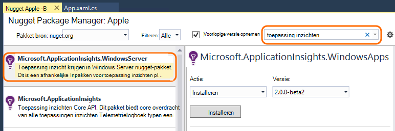

<properties
    pageTitle="Inzichten voor Windows toepassingsservices en werknemer rollen | Microsoft Azure"
    description="De toepassing inzichten SDK handmatig toevoegen aan uw ASP.NET-toepassing te analyseren gebruik, beschikbaarheid en prestaties."
    services="application-insights"
    documentationCenter=".net"
    authors="alancameronwills"
    manager="douge"/>

<tags
    ms.service="application-insights"
    ms.workload="tbd"
    ms.tgt_pltfrm="ibiza"
    ms.devlang="na"
    ms.topic="get-started-article"
    ms.date="08/30/2016"
    ms.author="awills"/>

# Toepassing inzichten handmatig configureren voor ASP.NET-4-toepassingen

*Er is een toepassing inzichten in de proefversie.*

[AZURE.INCLUDE [app-insights-selector-get-started](../../includes/app-insights-selector-get-started.md)]

U kunt handmatig configureren [Visual Studio toepassing inzichten](app-insights-overview.md) om de Windows-services, werknemer rollen en andere ASP.NET-toepassingen te houden. Handmatige configuratie is web-apps voor een alternatief voor het [automatisch ingesteld](app-insights-asp-net.md) door Visual Studio worden aangeboden.

Toepassing inzichten kunt u problemen en monitor prestaties en het gebruik in uw live toepassing opsporen.

#### Voordat u begint

U nodig hebt:

* Een abonnement op [Microsoft Azure](http://azure.com). Als uw team of uw organisatie een Azure-abonnement heeft, kunt de eigenaar u aan toevoegen, met uw [Microsoft-account](http://live.com).
* Visual Studio 2013 of hoger.

## 1. een resource van toepassing inzichten maken

Meld u aan bij de [portal van Azure](https://portal.azure.com/)en een nieuwe resource van toepassing inzichten maakt. Kies ASP.NET als het toepassingstype.

Een [resource](app-insights-resources-roles-access-control.md) in Azure is een exemplaar van een service. Deze resource is waarop telemetrielogboek uit uw app worden geanalyseerd en aangegeven dat u.

De keuze van toepassingstype stelt de Standaardinhoud van de bladen van de resource en de eigenschappen zichtbaar in [De Verkenner de doelstellingen](app-insights-metrics-explorer.md).

#### Kopieer de Instrumentation-toets

De toets geeft de bron en installeert u deze snel in de SDK om te sturen van gegevens naar de bron.

De stappen die u net hebt uitgevoerd als u wilt een nieuwe resource maakt vormen een goede manier om te beginnen met een toepassing voor controle. Nu kunt u gegevens verzendt naar deze.

## 2. de SDK in uw toepassing installeren

Installeren en configureren van de toepassing inzichten SDK varieert afhankelijk van het platform dat u werkt. ASP.NET-apps voor is het eenvoudig.

1. Bewerk in Visual Studio, de NuGet-pakketten van uw webproject-app.

    

2. Toepassing inzichten SDK voor WebApps installeren.

    

    *Kan ik andere pakketten gebruiken?*

    Ja. Kies de Core-API (Microsoft.ApplicationInsights) als u alleen gebruiken de API wilt voor het verzenden van uw eigen telemetrielogboek. Het pakket met Windows Server wordt automatisch bevat de Core-API plus een aantal andere pakketten zoals prestatiemeteritem verzamelen en afhankelijkheid bewaken. 

#### Upgrade uitvoeren naar toekomstige SDK versies

We loslaat een nieuwe versie van de SDK te bezoeken.

Als u wilt upgraden naar een [nieuwe versie van de SDK](https://github.com/Microsoft/ApplicationInsights-dotnet-server/releases/), NuGet pakket manager opnieuw en automatische filter voor een geïnstalleerde pakketten te openen. Selecteer **Microsoft.ApplicationInsights.Web** en kies **upgraden**.

Als u eventuele aanpassingen in ApplicationInsights.config hebt aangebracht, sla een kopie van deze voordat u upgrade en daarna de wijzigingen in de nieuwe versie samenvoegen.

## 3. telemetrielogboek verzenden

**Als u alleen het core API-pakket hebt geïnstalleerd:**

* De sleutel instrumentation in code, bijvoorbeeld instellen `main()`: 

    `TelemetryConfiguration.Active.InstrumentationKey = "`*uw sleutel*`";` 

* [Uw eigen telemetrielogboek met de API schrijven](app-insights-api-custom-events-metrics.md#ikey).

**Als u een andere toepassing inzichten-pakketten geïnstalleerd** kunt u, als u liever, gebruikt u het bestand .config de instrumentation sleutels in te stellen:

* ApplicationInsights.config bewerken (die is toegevoegd door de installatie NuGet). Invoegen vlak voor de tag haakje:

    `<InstrumentationKey>`*de instrumentation toets die u hebt gekopieerd*`</InstrumentationKey>`

* Zorg ervoor dat de eigenschappen van ApplicationInsights.config in Solution Explorer zijn ingesteld op **Build Action = inhoud, kopiëren naar uitvoer Directory = kopiëren**.

## Uw project uitvoeren

Gebruiken van de **F5** om uw toepassing uitvoeren en uitproberen: verschillende pagina's om te genereren sommige telemetrielogboek openen.

Visual Studio ziet u een telling van de gebeurtenissen die zijn verzonden.

## Uw telemetrielogboek weergeven

Ga terug naar de [Azure-portal](https://portal.azure.com/) en bladert u naar uw toepassing inzichten resource.

Zoeken naar gegevens in de grafieken overzicht. Aanvankelijk ziet alleen u een of twee punten. Bijvoorbeeld:

Klik op in een grafiek om meer gedetailleerde aan de doelstellingen weer te geven. [Meer informatie over de doelstellingen.](app-insights-web-monitor-performance.md)

#### Er zijn geen gegevens?

* Gebruikt u de toepassing, verschillende pagina's te openen zodat sommige telemetrielogboek wordt gegenereerd.
* Open de tegel [Zoeken](app-insights-diagnostic-search.md) als u wilt zien van afzonderlijke gebeurtenissen. Soms duurt gebeurtenissen iets terwijl langer ophalen via de pijplijn aan de doelstellingen.
* Wacht een paar seconden en klikt u op **vernieuwen**. Grafieken regelmatig zelf vernieuwen, maar u kunt handmatig vernieuwen als u aan het wachten bent voor sommige gegevens moet verschijnen.
* Zie [problemen met](app-insights-troubleshoot-faq.md).

## Uw app publiceren

Nu uw toepassing implementeren naar uw server of Azure en bekijk de gegevens worden verzameld.

Wanneer u in de foutopsporingsmodus voor uitvoert, wordt telemetrielogboek versneld door de pijplijn, zodat u de gegevens die worden weergegeven in enkele seconden moet zien. Wanneer u uw app in Release configuratie implementeert, gegevens worden bij elkaar opgeteld langzamer.

#### Er zijn geen gegevens nadat u op de server publiceren?

Deze poorten voor uitgaand verkeer openen in de firewall van de server:

+ `dc.services.visualstudio.com:443`
+ `f5.services.visualstudio.com:443`

#### Problemen bij het op de server opbouwen?

Zie [dit artikel voor probleemoplossing](app-insights-asp-net-troubleshoot-no-data.md#NuGetBuild).

> [AZURE.NOTE]Als uw app een groot aantal telemetrielogboek genereert (en de ASP.NET SDK versie 2.0.0-beta3 dat u gebruikt of hoger), de module Geavanceerde steekproeven automatisch afgetrokken van het volume dat wordt verzonden naar de portal door te sturen van alleen een vertegenwoordiger fractie van gebeurtenissen. Gebeurtenissen die betrekking op één verzoek hebben worden echter worden geselecteerd of uitgeschakeld als een groep, zodat u tussen gerelateerde gebeurtenissen navigeren kunt. 
> [Algemene informatie over de steekproeven](app-insights-sampling.md).

## Volgende stappen

* [Meer telemetrielogboek toevoegen](app-insights-asp-net-more.md) voor de weergave volledige 360 graden van uw toepassing.

