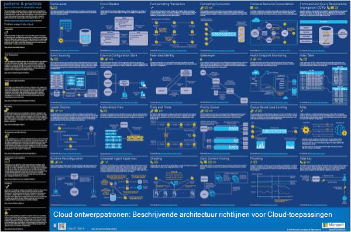
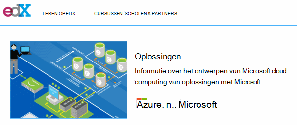
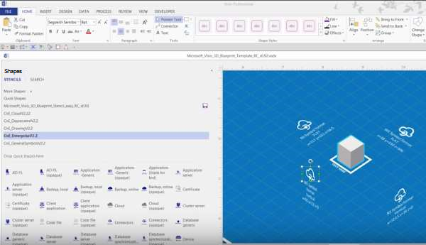
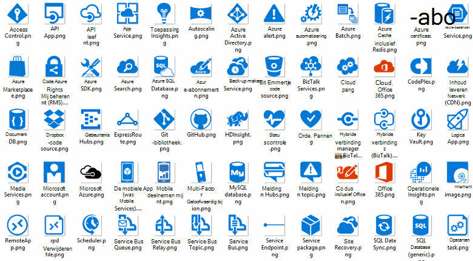
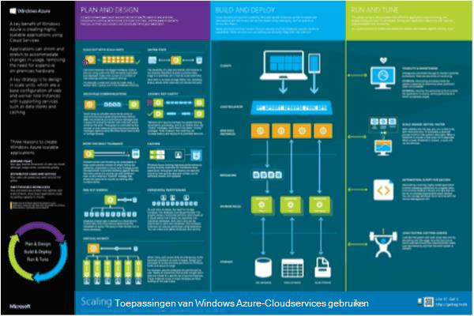

<properties 
    pageTitle="Toepassingsarchitectuur op Microsoft Azure | Microsoft Azure" 
    description="Overzicht van de architectuur die betrekking heeft op algemene ontwerppatronen" 
    services="" 
    documentationCenter="" 
    authors="Rboucher" 
    manager="jwhit" 
    editor="mattshel"/>

<tags 
    ms.service="multiple" 
    ms.workload="na" 
    ms.tgt_pltfrm="na" 
    ms.devlang="na" 
    ms.topic="article" 
    ms.date="09/13/2016" 
    ms.author="robb"/>

#Toepassingsarchitectuur op Microsoft Azure
Resources voor het samenstellen van toepassingen die gebruikmaken van Microsoft Azure. Dit geldt ook voor hulpmiddelen waarmee u kunt diagrammen om te beschrijven visueel softwaresystemen tekenen. 

##Ontwerp patronen poster

Microsoft patronen en procedures heeft gepubliceerd het adresboek [Cloud ontwerppatronen](http://msdn.microsoft.com/library/dn568099.aspx) beschikbaar op MSDN zowel in PDF-bestand downloaden is. Er is ook een grote opmaken-poster beschikbaar waarin alle de patronen. 

##Microsoft architectuur-certificering cursus

Microsoft heeft een architectuur cursus ondersteunende Microsoft certificering certificeringsexamens 70-534. Dit is [beschikbaar gratis op EDX.ORG](https://www.edx.org/course/architecting-microsoft-azure-solutions-microsoft-dev205x).  De [3D-blauwdruk Visio-sjabloon](#3d-blueprint-visio-template)wordt gebruikt. 

##Microsoft-oplossingen

Microsoft publiceert een reeks hoog niveau [oplossing architecturen](http://aka.ms/azblueprints) laat zien hoe u specifieke soorten systemen met Microsoft-producten kunt maken. 

Microsoft gepubliceerd eerder, een set met voorbeeld architecturen blauwdrukken. Die zijn vervangen door de oplossing architecturen die eerder is vermeld en de koppeling blauwdruk is omgeleid om te laten verwijzen naar deze. Als u toegang tot de vorige blauwdrukken materialen om welke reden nodig, via e-mail verzenden [CnESymbols@microsoft.com](mailto:CnESymbols@microsoft.com) met uw aanvraag kunt invullen.   

Gebruik de delen van de [Cloud en Enterprise-symbool instellen](#Drawing-symbol-and-icon-sets)de blauwdrukken van beveiligingssystemen en oplossing architecturen diagrammen.   

##3D-blauwdruk Visio-sjabloon

De 3D-versies van de nu uitgeschakelde [Microsoft architectuur blauwdrukken](http://aka.ms/azblueprints) zijn in eerste instantie in een niet-Microsoft-hulpmiddel gemaakt. Een Visio-sjabloon voor 2013 (en later) op 5 augustus 2015 als onderdeel van een [Microsoft-architectuur-certificering cursus verdeeld over EDX.ORG](#microsoft-architecture-certification-course)verzonden.

De sjabloon is ook beschikbaar buiten de cursus. 

- [Weergave de video training](http://aka.ms/3dBlueprintTemplateVideo) eerste zodat u weet wat dit kunt doen   
- Download de [Microsoft Visio-sjabloon voor 3D-blauwdruk](http://aka.ms/3DBlueprintTemplate)
- Download de [Cloud en Enterprise-symbolen](#drawing-symbol-and-icon-sets) voor gebruik met de 3D-sjabloon. 

Een e-mail sturen naar [CnESymbols@microsoft.com](mailto:CnESymbols@microsoft.com) voor specifieke vragen niet door de trainingsmateriaal of om feedback te geven. De sjabloon is niet meer in actieve ontwikkeling, maar het is nog steeds nuttige en relevante omdat deze de beschikking over eventuele PNG- of de [Cloud en Enterprise-symbolen](#drawing-symbol-and-icon-sets), die worden bijgewerkt.  

##Symbool en pictogram sets tekenen 

[De Visio en symbolen training video weergeven](http://aka.ms/CnESymbolsVideo) en klik vervolgens [downloaden van de Cloud en Enterprise-symbool instellen](http://aka.ms/CnESymbols) om te maken van technische materialen die wordt beschreven Azure, Windows Server, SQL Server en meer. U kunt de symbolen in netwerkarchitectuurdiagrammen, trainingsmateriaal, presentaties, gegevensbladen, infographics, technische documenten en zelfs 3e partijen boeken kunt gebruiken als het adresboek anderen traint moeten gebruiken van Microsoft-producten. Ze zijn echter niet bedoeld voor gebruik in gebruikersinterfaces.

De symbolen CnE zijn in Visio, SVG en PNG-indeling. Aanvullende instructies over het gebruik van gemakkelijk de symbolen gebruiken in PowerPoint worden opgenomen in de groep. 

De symboolset wordt geleverd per kwartaal en wordt bijgewerkt als nieuwe services zijn vrijgegeven. 

Meer symbolen voor Microsoft Office en verwante technologieën zijn beschikbaar in de [Microsoft Office Visio-stencil](http://www.microsoft.com/en-us/download/details.aspx?id=35772), hoewel ze zijn niet geoptimaliseerd voor architectuur diagrammen, zoals het CnE is.   

**Feedback:** Als u de symbolen CnE hebt gebruikt, de korte 5 vraag [enquête](http://aka.ms/azuresymbolssurveyv2) of een e-mail sturen naar [CnESymbols@microsoft.com](mailto:CnESymbols@microsoft.com) voor specifieke vragen en problemen. Willen we weten wat u ervan vindt, inclusief positieve feedback, zodat we weten dat ze moeten gaat u verder met de tijd in deze investeren. 

##Architectuur Infographics

Microsoft publiceert verschillende architectuur posters/infographics gerelateerd. De opties omvatten [Building echte Cloud-toepassingen](https://azure.microsoft.com/documentation/infographics/building-real-world-cloud-apps/) en [schaling met Cloudservices](https://azure.microsoft.com/documentation/infographics/cloud-services/) . 

