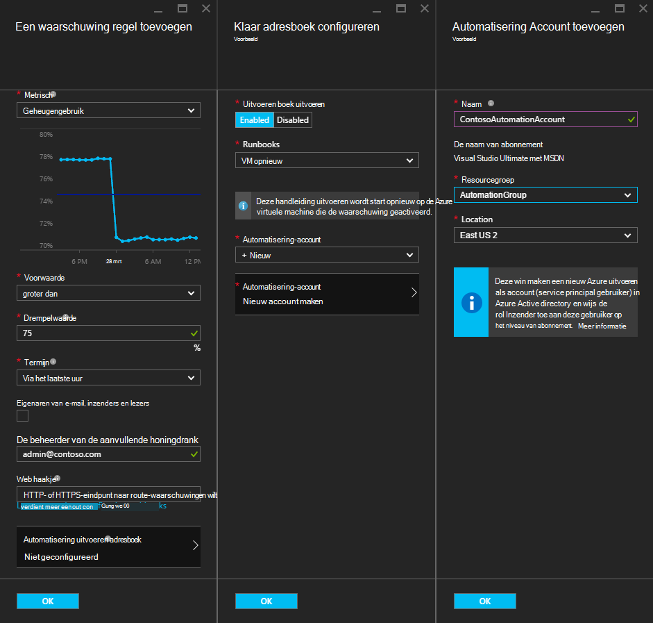
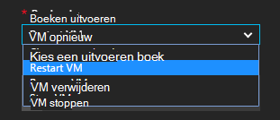
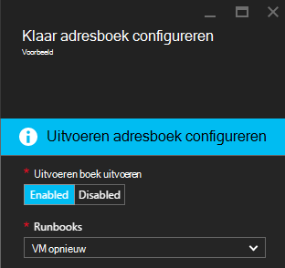
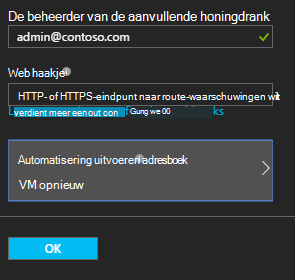

<properties
    pageTitle=" Een verhelpen Azure VM waarschuwingen met automatisering Runbooks | Microsoft Azure"
    description="In dit artikel wordt beschreven hoe Azure virtuele machines waarschuwingen integreren met Azure automatisering runbooks en problemen automatisch-verhelpen"
    services="automation"
    documentationCenter=""
    authors="mgoedtel"
    manager="jwhit"
    editor="tysonn" />    
<tags
    ms.service="automation"
    ms.devlang="na"
    ms.topic="article"
    ms.tgt_pltfrm="na"
    ms.workload="infrastructure-services"
    ms.date="06/14/2016"
    ms.author="csand;magoedte" />

# <a name="azure-automation-scenario---remediate-azure-vm-alerts"></a>Scenario voor automatisering op Azure - Azure VM waarschuwingen verhelpen

Azure automatisering en Azure virtuele Machines hebben een nieuwe functie zodat u kunt configureren meldingen virtuele Machine (VM) om uit te voeren automatisering runbooks uitgebracht. Deze nieuwe functionaliteit kunt u standaard remediation automatisch worden uitgevoerd in antwoord op VM waarschuwingen, zoals opnieuw starten of stoppen de VM.

Eerder, tijdens het maken van VM waarschuwingsregels u kon [een webhook automatisering opgeven](https://azure.microsoft.com/blog/using-azure-automation-to-take-actions-on-azure-alerts/) naar een runbook om te kunnen uitvoeren van het runbook wanneer de waarschuwing geactiveerd. Echter vereist dit u moet de werklast van het runbook maken, de webhook voor het runbook, maken en vervolgens kopiëren en plakken van de webhook tijdens het maken van waarschuwingsregels. Met deze nieuwe versie, is het proces is veel gemakkelijker omdat u een runbook rechtstreeks uit een lijst tijdens het maken van waarschuwingsregels kiezen kunt en kunt u een automatisering-account die wordt uitgevoerd van het runbook of eenvoudig een account maken.

In dit artikel wordt leert u hoe makkelijk het is een waarschuwing Azure VM instellen en configureren van een runbook automatisering om uit te voeren wanneer de waarschuwing activeert. Voorbeelden van scenario's zijn opnieuw starten van een VM wanneer de geheugengebruik sommige drempelwaarde vanwege een toepassing op de VM met een geheugen zijn verdwenen overschrijdt, of een VM stoppen wanneer de tijd van de gebruiker CPU minder dan 1% voor de afgelopen uur is en niet gebruikt wordt. We ook leggen hoe het geautomatiseerde maken van een service principal in uw account automatisering eenvoudiger voor het gebruik van runbooks in Azure waarschuwing remediation.

## <a name="create-an-alert-on-a-vm"></a>Een waarschuwing maken op een VM

De volgende stappen om te configureren van een melding in om te starten een runbook wanneer de drempel is voldaan uitvoeren.

>[AZURE.NOTE] In deze release alleen ondersteund V2 virtuele machines en ondersteuning voor klassieke die VMS binnenkort, worden toegevoegd.  

1. Meld u aan bij de portal van Azure en klik op **virtuele Machines**.  
2. Selecteer een van uw virtuele machines.  Het virtuele machine dashboard blad wordt weergegeven en het blad **Instellingen** rechts hiervan.  
3. Selecteer in het blad **Instellingen** , onder de sectie Monitoring **waarschuwingsregels**.
4. Klik op het blad **waarschuwingsregels** op **melding toevoegen**.

Hiermee opent u het blad **een waarschuwing regel toevoegen** , kunt u de voorwaarden voor de melding configureren en kiezen uit een of meer van de volgende opties: e-mail verzenden naar iemand, voert u een webhook met de melding naar een ander systeem doorsturen en/of een runbook automatisering uitvoeren in antwoord geprobeerd het probleem te verhelpen.

## <a name="configure-a-runbook"></a>Een runbook configureren

Als u wilt configureren een runbook worden uitgevoerd wanneer u de drempelwaarde voor de waarschuwing VM is voldaan, selecteert u **Automatisering Runbook**. U kunt het runbook om uit te voeren en het account automatisering uitvoeren van het runbook in selecteren in het blad **runbook configureren** .



>[AZURE.NOTE] Voor deze release kunt u kiezen uit drie runbooks die de service biedt – VM opnieuw starten, stoppen VM of VM verwijderen (verwijderen).  De mogelijkheid om te selecteren van andere runbooks of een van uw eigen runbooks zijn beschikbaar in toekomstige versie.



Nadat u een van de drie beschikbaar runbooks, de vervolgkeuzelijst **automatisering account** wordt weergegeven en u automatisering account die het runbook wordt uitgevoerd als kunt selecteren. Runbooks moet worden uitgevoerd in de context van een [automatisering-account](automation-security-overview.md) dat is in uw Azure-abonnement. U kunt een automatisering-account dat u al hebt gemaakt, of u kunt een nieuw automatisering-account voor u gemaakt selecteren.

De runbooks die beschikbaar zijn voor gebruik van een service principal Azure worden geverifieerd. Als u besluit om het runbook worden uitgevoerd in een van uw bestaande automatisering-accounts, wordt we automatisch de service hoofdsom voor u gemaakt. Als u kiest u een nieuw account voor automatisering maakt, maakt wordt automatisch het account en de hoofdsom service. In beide gevallen worden twee activa ook gemaakt in het account Automatisering – een certificaat-activa **AzureRunAsCertificate** met de naam en de activa van een verbinding met de naam **AzureRunAsConnection**. De runbooks wordt **AzureRunAsConnection** gebruikt om te verifiëren met Azure om te kunnen uitvoeren van de actie management ten opzichte van de VM.

>[AZURE.NOTE] De hoofdsom service wordt gemaakt in het bereik van het abonnement en de rol Inzender is toegewezen. Deze rol is vereist om het te kunnen uitvoeren automatisering runbooks-account voor het beheren van Azure VMs.  Het maken van een Automaton-account en/of de service principal is een eenmalige gebeurtenis. Nadat ze zijn gemaakt, kunt u dat account kunt gebruiken om uit te voeren runbooks voor andere waarschuwingen Azure VM.

Wanneer u op **OK** de melding is geconfigureerd en als u de optie voor het maken van een nieuw automatisering-account hebt geselecteerd, wordt deze gemaakt samen met de service principal.  Dit kan een paar seconden duren.  



Nadat de configuratie is voltooid ziet u de naam van het runbook worden weergegeven in het blad **een waarschuwing regel toevoegen** .



Klik op **OK** in het **toevoegen van een regel voor waarschuwingen** blade en de huidige regel wordt gemaakt en activeren als de virtuele machine actief is.

### <a name="enable-or-disable-a-runbook"></a>In- of uitschakelen van een runbook

Als u een runbook die is geconfigureerd voor een melding hebt, kunt u deze kunt uitschakelen zonder te verwijderen van de configuratie runbook. Hiermee kunt u de melding die wordt uitgevoerd behouden en enkele van de waarschuwingsregels misschien testen en later opnieuw inschakelen het runbook.

## <a name="create-a-runbook-that-works-with-an-azure-alert"></a>Een runbook die met een Azure melding werkt maken

Als u een runbook als onderdeel van een regel voor Azure waarschuwing kiest, moet het runbook logica hebben in deze voor het beheren van de waarschuwing gegevens dat is doorgegeven.  Wanneer een runbook is geconfigureerd in een regel voor waarschuwingen, is een webhook gemaakt voor het runbook; die webhook wordt vervolgens gebruikt voor het starten van het runbook telkens wanneer de waarschuwing activeert.  De werkelijke oproep door naar het begin van het runbook is een HTTP POST-aanvraag naar de URL webhook. De hoofdtekst van de POST-aanvraag bevat een JSON-indeling object met nuttige eigenschappen die betrekking hebben op de melding.  Zoals u hieronder ziet, bevat de waarschuwing gegevens details zoals subscriptionID, resourceGroupName, bronnaam en brontype.

### <a name="example-of-alert-data"></a>Voorbeeld van waarschuwing gegevens
```
{
    "WebhookName": "AzureAlertTest",
    "RequestBody": "{
    \"status\":\"Activated\",
    \"context\": {
        \"id\":\"/subscriptions/<subscriptionId>/resourceGroups/MyResourceGroup/providers/microsoft.insights/alertrules/AlertTest\",
        \"name\":\"AlertTest\",
        \"description\":\"\",
        \"condition\": {
            \"metricName\":\"CPU percentage guest OS\",
            \"metricUnit\":\"Percent\",
            \"metricValue\":\"4.26337916666667\",
            \"threshold\":\"1\",
            \"windowSize\":\"60\",
            \"timeAggregation\":\"Average\",
            \"operator\":\"GreaterThan\"},
        \"subscriptionId\":\<subscriptionID> \",
        \"resourceGroupName\":\"TestResourceGroup\",
        \"timestamp\":\"2016-04-24T23:19:50.1440170Z\",
        \"resourceName\":\"TestVM\",
        \"resourceType\":\"microsoft.compute/virtualmachines\",
        \"resourceRegion\":\"westus\",
        \"resourceId\":\"/subscriptions/<subscriptionId>/resourceGroups/TestResourceGroup/providers/Microsoft.Compute/virtualMachines/TestVM\",
        \"portalLink\":\"https://portal.azure.com/#resource/subscriptions/<subscriptionId>/resourceGroups/TestResourceGroup/providers/Microsoft.Compute/virtualMachines/TestVM\"
        },
    \"properties\":{}
    }",
    "RequestHeader": {
        "Connection": "Keep-Alive",
        "Host": "<webhookURL>"
    }
}
```

Terwijl de automatisering webhook service het bericht HTTP ontvangt haalt de waarschuwing gegevens en wordt doorgegeven aan het runbook in de invoerparameter van WebhookData runbook.  Hieronder ziet u een voorbeeld runbook waarin wordt uitgelegd hoe de parameter WebhookData gebruiken en de waarschuwing gegevens hebt geëxtraheerd en deze gebruiken voor het beheren van de Azure resource die de waarschuwing geactiveerd.

### <a name="example-runbook"></a>Voorbeeld runbook

```
#  This runbook will restart an ARM (V2) VM in response to an Azure VM alert.

[OutputType("PSAzureOperationResponse")]

param ( [object] $WebhookData )

if ($WebhookData)
{
    # Get the data object from WebhookData
    $WebhookBody = (ConvertFrom-Json -InputObject $WebhookData.RequestBody)

    # Assure that the alert status is 'Activated' (alert condition went from false to true)
    # and not 'Resolved' (alert condition went from true to false)
    if ($WebhookBody.status -eq "Activated")
    {
        # Get the info needed to identify the VM
        $AlertContext = [object] $WebhookBody.context
        $ResourceName = $AlertContext.resourceName
        $ResourceType = $AlertContext.resourceType
        $ResourceGroupName = $AlertContext.resourceGroupName
        $SubId = $AlertContext.subscriptionId

        # Assure that this is the expected resource type
        Write-Verbose "ResourceType: $ResourceType"
        if ($ResourceType -eq "microsoft.compute/virtualmachines")
        {
            # This is an ARM (V2) VM

            # Authenticate to Azure with service principal and certificate
            $ConnectionAssetName = "AzureRunAsConnection"
            $Conn = Get-AutomationConnection -Name $ConnectionAssetName
            if ($Conn -eq $null) {
                throw "Could not retrieve connection asset: $ConnectionAssetName. Check that this asset exists in the Automation account."
            }
            Add-AzureRMAccount -ServicePrincipal -Tenant $Conn.TenantID -ApplicationId $Conn.ApplicationID -CertificateThumbprint $Conn.CertificateThumbprint | Write-Verbose
            Set-AzureRmContext -SubscriptionId $SubId -ErrorAction Stop | Write-Verbose

            # Restart the VM
            Restart-AzureRmVM -Name $ResourceName -ResourceGroupName $ResourceGroupName
        } else {
            Write-Error "$ResourceType is not a supported resource type for this runbook."
        }
    } else {
        # The alert status was not 'Activated' so no action taken
        Write-Verbose ("No action taken. Alert status: " + $WebhookBody.status)
    }
} else {
    Write-Error "This runbook is meant to be started from an Azure alert only."
}
```

## <a name="summary"></a>Overzicht

Als u een melding voor een VM Azure configureert, hebt u nu de mogelijkheid eenvoudig configureren voor een runbook automatisering automatisch remediation als actie wilt uitvoeren wanneer de waarschuwing activeert. Voor deze release, kunt u kiezen uit runbooks opnieuw starten, stoppen of verwijderen van een VM afhankelijk van uw waarschuwing scenario. Dit is alleen het begin van het inschakelen van scenario's waarin u de acties (melding, problemen oplossen als remediation) wordt automatisch uitgevoerd wanneer een waarschuwing activeert bepalen.

## <a name="next-steps"></a>Volgende stappen

- Zie [Mijn eerste grafische runbook](automation-first-runbook-graphical.md) om te beginnen met grafische runbooks
- Als u wilt beginnen met PowerShell werkstroom runbooks, raadpleegt u [Mijn eerste runbook van de PowerShell-werkstroom](automation-first-runbook-textual.md)
- Meer informatie over runbook typen, hun voordelen en beperkingen, raadpleegt u [Azure automatisering runbook typen](automation-runbook-types.md)
