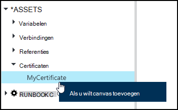
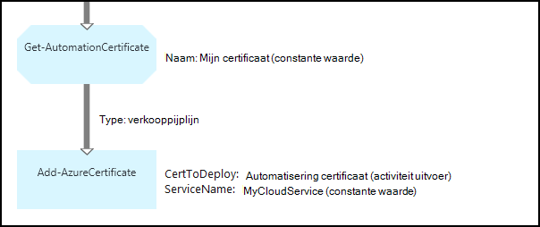

<properties 
   pageTitle="Certificaat van activa in Azure automatisering | Microsoft Azure"
   description="Certificaten kunnen veilig worden opgeslagen in Azure automatisering zodat ze kunnen worden geopend door runbooks of DSC configuraties verifiëren van Azure en bronnen van derden.  In dit artikel wordt uitgelegd dat de details van certificaten en hoe u Hiermee werkt in zowel tekstuele en grafische authoring."
   services="automation"
   documentationCenter=""
   authors="mgoedtel"
   manager="stevenka"
   editor="tysonn" />
<tags 
   ms.service="automation"
   ms.devlang="na"
   ms.topic="article"
   ms.tgt_pltfrm="na"
   ms.workload="infrastructure-services"
   ms.date="02/23/2016"
   ms.author="magoedte;bwren" />

# Certificaat activa in Azure automatisering

Certificaten kunnen veilig worden opgeslagen in Azure automatisering zodat ze kunnen worden geopend door runbooks of DSC configuraties met de activiteit **Get-AutomationCertificate** . Hiermee kunt u runbooks en DSC configuraties die gebruikmaken van certificaten voor verificatie maken of aan Azure of derden resources toevoegt.

>[AZURE.NOTE] Secure activa in Azure automatisering zijn referenties, certificaten, verbindingen en versleutelde variabelen. Deze activa zijn versleuteld en opgeslagen in de Azure automatisering met een unieke sleutel die wordt gegenereerd voor elke account automatisering. Deze sleutel is van een basispagina certificaat versleuteld en opgeslagen in Azure automatisering. Voordat u een secure activa op te slaan, de sleutel voor het account dat automatisering is ontsleuteld met behulp van de basispagina certificaat en vervolgens worden gebruikt voor het coderen van de activa.

## Windows PowerShell-Cmdlets

De cmdlets in de volgende tabel worden gebruikt om te maken en beheren van automatisering certificaat activa met Windows PowerShell. Wordt verzonden als onderdeel van de [Azure PowerShell-module](../powershell-install-configure.md) die beschikbaar voor gebruik in automatisering runbooks en DSC configuraties is.

|Cmdlets voor|Beschrijving|
|:---|:---|
|[Get-AzureAutomationCertificate](http://msdn.microsoft.com/library/dn913765.aspx)|Hiermee haalt u informatie over een certificaat. U kunt alleen het certificaat zelf ophalen uit Get-AutomationCertificate activiteit.|
|[Nieuwe AzureAutomationCertificate](http://msdn.microsoft.com/library/dn913764.aspx)|Een nieuw certificaat wordt geïmporteerd in Azure automatisering.|
|[Verwijderen - AzureAutomationCertificate](http://msdn.microsoft.com/library/dn913773.aspx)|Hiermee verwijdert een certificaat uit Azure automatisering.|
|[Set - AzureAutomationCertificate](http://msdn.microsoft.com/library/dn913763.aspx)|Hiermee stelt u de eigenschappen voor een bestaand certificaat, inclusief het certificaatbestand uploaden en het wachtwoord voor een .pfx instellen.|

## Activiteiten voor toegang tot certificaten

De activiteiten in de volgende tabel worden gebruikt voor toegang tot de certificaten in een runbook of DSC configuratie.

|Activiteiten|Beschrijving|
|:---|:---|
|Get-AutomationCertificate|Een certificaat wilt gebruiken in een runbook of DSC configuratie krijgt.|

>[AZURE.NOTE] Vermijd het gebruik van variabelen in het gedeelte-naam-parameter van Get-AutomationCertificate omdat dit kan ontdekken afhankelijkheden tussen runbooks of DSC configuraties bemoeilijken en activa-tijdens de ontwerpfase certificaat.

## Een nieuw certificaat maken

Wanneer u een nieuw certificaat maakt, kunt u een .cer of .pfx-bestand uploaden naar Azure automatisering. Als u het certificaat als geëxporteerd hebt gemarkeerd, u kunt verbind deze vervolgens door uit het archief met Azure automatisering. Als het niet geëxporteerd, kan klikt u vervolgens deze alleen worden gebruikt voor het ondertekenen van binnen de runbook of DSC-configuratie.

### Een nieuw certificaat maken met de portal van de Azure klassieke

1. Van uw account automatisering, klikt u op **activa** boven aan het venster.
1. Klik onder aan het venster, op **Instelling toevoegen**.
1. Klik op **referentie toevoegen**.
2. Selecteer in de vervolgkeuzelijst **Referentietype** **certificaat**.
3. Typ een naam voor het certificaat in het vak **naam** en klik op de pijl-rechts.
4. Blader naar een .cer of .pfx-bestand.  Als u een .pfx-bestand hebt geselecteerd, geeft u een wachtwoord en of deze moet kunnen worden geëxporteerd.
1. Klik op het vinkje om het certificaatbestand uploaden en sla de nieuwe certificaat activa.

### Een nieuw certificaat maken met de portal van Azure

1. Klik op het deel van de **activa** als u wilt openen van het blad **activa** van uw account automatisering.
1. Klik op het deel achter de **certificaten** om te openen van het blad **certificaten** .
1. Klik op **een certificaat toevoegen** aan de bovenkant van het blad.
2. Typ een naam voor het certificaat in het vak **naam** .
2. Klik op **een bestand hebt geselecteerd** onder **een certificaatbestand uploaden** om te bladeren naar een .cer of .pfx-bestand.  Als u een .pfx-bestand hebt geselecteerd, geeft u een wachtwoord en of deze moet kunnen worden geëxporteerd.
1. Klik op **maken** om op te slaan van het nieuwe certificaat activum.

### Een nieuw certificaat maken met Windows PowerShell

De volgende opdrachten in de steekproef beschreven hoe u een nieuw certificaat voor automatisering maakt en markeert geëxporteerd. Hiermee wordt een bestaande .pfx-bestand geïmporteerd.

    $certName = 'MyCertificate'
    $certPath = '.\MyCert.pfx'
    $certPwd = ConvertTo-SecureString -String 'P@$$w0rd' -AsPlainText -Force
    
    New-AzureAutomationCertificate -AutomationAccountName "MyAutomationAccount" -Name $certName -Path $certPath –Password $certPwd -Exportable

## Met behulp van een certificaat

Een certificaat te gebruiken, moet u de activiteit **Get-AutomationCertificate** gebruiken. U kunt de cmdlet [Get-AzureAutomationCertificate](http://msdn.microsoft.com/library/dn913765.aspx) niet gebruiken omdat deze geeft als informatie over het certificaat van activa, maar niet het certificaat zelf resultaat.

### Voorbeeld van de tekstuele runbook

De volgende code ziet hoe u een certificaat toevoegen aan een cloudservice in een runbook. In dit voorbeeld wordt wordt het wachtwoord opgehaald uit een versleutelde automation-variabele.

    $serviceName = 'MyCloudService'
    $cert = Get-AutomationCertificate -Name 'MyCertificate'
    $certPwd = Get-AutomationVariable –Name 'MyCertPassword'
    Add-AzureCertificate -ServiceName $serviceName -CertToDeploy $cert

### Voorbeeld van de grafische runbook

U kunt een **Get-AutomationCertificate** toevoegen aan een grafische runbook door met de rechtermuisknop op het certificaat in het deelvenster bibliotheek van de grafische editor en **toevoegen aan het tekenpapier**te selecteren.

De volgende afbeelding ziet u een voorbeeld van het gebruik van een certificaat in een grafische runbook.  Dit is het voorbeeld hierboven voor het toevoegen van een certificaat naar een cloudservice uit een tekstuele runbook.  

Dit voorbeeld wordt de **UseConnectionObject** -parameter ingesteld voor de activiteit **Verzenden TwilioSMS** die een connection-object voor verificatie met de service wordt gebruikt.  Een [verkooppijplijn koppeling](automation-graphical-authoring-intro.md#links-and-workflow) moet hier worden gebruikt, aangezien de koppeling van een reeks een siteverzameling met één object dat niet verwacht dat de parameter voor gegevensverbinding voor het resultaat.

## Zie ook

- [Koppelingen in de grafische ontwerpen](automation-graphical-authoring-intro.md#links-and-workflow) 
