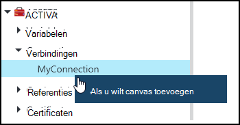
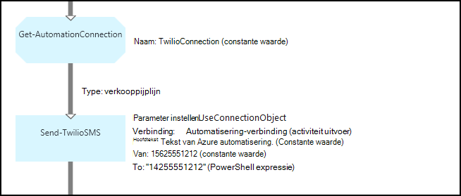
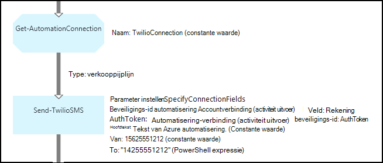

<properties 
   pageTitle="Verbinding activa in Azure automatisering | Microsoft Azure"
   description="Verbinding activa in Azure automatisering bevatten de gegevens die verbinding maken met een externe service of de toepassing van een runbook of DSC configuratie vereist. In dit artikel wordt uitgelegd dat de details van verbindingen en hoe u Hiermee werkt in zowel tekstuele en grafische authoring."
   services="automation"
   documentationCenter=""
   authors="bwren"
   manager="stevenka"
   editor="tysonn" />
<tags 
   ms.service="automation"
   ms.devlang="na"
   ms.topic="article"
   ms.tgt_pltfrm="na"
   ms.workload="infrastructure-services"
   ms.date="01/27/2016"
   ms.author="bwren" />

# Verbinding activa in Azure automatisering

Activa verbinding automatisering bevat de informatie die verbinding maken met een externe service of de toepassing van een runbook of DSC configuratie vereist. Deze kan informatie die is vereist voor verificatie, zoals een gebruikersnaam en wachtwoord naast verbindingsgegevens, zoals een URL of een poort bevatten. De waarde van een verbinding is ervoor dat alle eigenschappen om verbinding te maken voor een bepaalde toepassing in één van de activa in plaats van meerdere variabelen maken. De gebruiker de waarden van een verbinding op één plaats kunt bewerken en u kunt de naam van een verbinding doorgeven aan een runbook of DSC configuratie in een enkele parameter. De eigenschappen van een verbinding kunnen worden geopend in de runbook of DSC-configuratie met de activiteit **Get-AutomationConnection** .

Wanneer u een verbinding hebt gemaakt, moet u een *verbindingstype*. Het verbindingstype is een sjabloon die een set met eigenschappen definieert. De verbinding Hiermee definieert u waarden voor elke eigenschap die is gedefinieerd in het verbindingstype. Verbindingstypen zijn toegevoegd aan Azure automatisering in integratiemodules of die zijn gemaakt met de [Azure automatisering API](http://msdn.microsoft.com/library/azure/mt163818.aspx). De enige verbindingstypen die beschikbaar zijn wanneer u een verbinding maakt zijn geïnstalleerd in uw account automatisering.

>[AZURE.NOTE] Secure activa in Azure automatisering zijn referenties, certificaten, verbindingen en versleutelde variabelen. Deze activa zijn versleuteld en opgeslagen in de Azure automatisering met een unieke sleutel die wordt gegenereerd voor elke account automatisering. Deze sleutel is van een basispagina certificaat versleuteld en opgeslagen in Azure automatisering. Voordat u een secure activa op te slaan, de sleutel voor het account dat automatisering is ontsleuteld met behulp van de basispagina certificaat en vervolgens worden gebruikt voor het coderen van de activa.

## Windows PowerShell-Cmdlets

De cmdlets in de volgende tabel worden gebruikt om Automation verbindingen met Windows PowerShell maken en beheren. Wordt verzonden als onderdeel van de [Azure PowerShell-module](../powershell-install-configure.md) die beschikbaar voor gebruik in automatisering runbooks en DSC configuraties is.

|Cmdlet|Beschrijving|
|:---|:---|
|[Get-AzureAutomationConnection](http://msdn.microsoft.com/library/dn921828.aspx)|Hiermee haalt u een verbinding. Bevat een hashtabel met de waarden van de velden van de verbinding.|
|[Nieuwe AzureAutomationConnection](http://msdn.microsoft.com/library/dn921825.aspx)|Hiermee maakt u een nieuwe verbinding.|
|[Verwijderen AzureAutomationConnection](http://msdn.microsoft.com/library/dn921827.aspx)|Een bestaande verbinding verwijderen.|
|[Set-AzureAutomationConnectionFieldValue](http://msdn.microsoft.com/library/dn921826.aspx)|Hiermee stelt u de waarde van een bepaald veld voor een bestaande verbinding.|

## Activiteiten

De activiteiten in de volgende tabel worden gebruikt voor toegang tot verbindingen in een runbook of DSC configuratie.

|Activiteiten|Beschrijving|
|---|---|
|Get-AutomationConnection|Krijgt een verbinding te gebruiken. Geeft als resultaat een hashtabel met de eigenschappen van de verbinding.|

>[AZURE.NOTE] Vermijd het gebruik van variabelen in het gedeelte-naam-parameter van **Get-AutomationConnection** omdat dit ontdekken afhankelijkheden tussen runbooks of DSC configuraties en verbinding activa tijdens de ontwerpfase bemoeilijken kunt.

## Een nieuwe verbinding maken

### Een nieuwe verbinding maken met de portal van de Azure klassieke

1. Van uw account automatisering, klikt u op **activa** boven aan het venster.
1. Klik onder aan het venster, op **Instelling toevoegen**.
1. Klik op **verbinding toevoegen**.
2. Selecteer het type verbinding die u wilt maken in de vervolgkeuzelijst **Type verbinding** .  De wizard wordt de eigenschappen voor dat type presenteren.
1. Voltooi de wizard en klik op het selectievakje om op te slaan van de nieuwe verbinding.

### Een nieuwe verbinding maken met de portal van Azure

1. Klik op het deel van de **activa** als u wilt openen van het blad **activa** van uw account automatisering.
1. Klik op het gedeelte **verbindingen** om te openen van het blad **verbindingen** .
1. Klik op **een verbinding toevoegen** aan de bovenkant van het blad.
2. Selecteer in de vervolgkeuzelijst **Type** het type verbinding die u wilt maken. Het formulier worden de eigenschappen voor dat type presenteren.
1. Vul het formulier en klik op **maken** om de nieuwe verbinding opslaan.

### Een nieuwe verbinding maken met Windows PowerShell

Een nieuwe verbinding maken met Windows PowerShell met de cmdlet [New-AzureAutomationConnection](http://msdn.microsoft.com/library/dn921825.aspx) . Deze cmdlet heeft een parameter met de naam **ConnectionFieldValues** die een [hashtabel](http://technet.microsoft.com/library/hh847780.aspx) waarden definiëren voor elk van de eigenschappen die zijn gedefinieerd door het verbindingstype verwacht.

De volgende opdrachten in de steekproef maken een nieuwe verbinding voor [Twilio](http://www.twilio.com) , dat wil een telefonieservice waarmee u zeggen kunt verzenden en ontvangen van SMS-berichten.  Een voorbeeld integratie-module met een verbindingstype Twilio is beschikbaar in [Script Center](http://gallery.technet.microsoft.com/scriptcenter/Twilio-PowerShell-Module-8a8bfef8).  Dit verbindingstype definieert eigenschappen voor beveiligings-id Account en autorisatie toegangstoken, die zijn vereist voor het valideren van uw account als u koppelt aan Twilio.  U moet [deze module download](http://gallery.technet.microsoft.com/scriptcenter/Twilio-PowerShell-Module-8a8bfef8) en installeer het in uw account automatisering in dit voorbeeld code werkt.

    $AccountSid = "DAf5fed830c6f8fac3235c5b9d58ed7ac5"
    $AuthToken  = "17d4dadfce74153d5853725143c52fd1"
    $FieldValues = @{"AccountSid" = $AccountSid;"AuthToken"=$AuthToken}

    New-AzureAutomationConnection -AutomationAccountName "MyAutomationAccount" -Name "TwilioConnection" -ConnectionTypeName "Twilio" -ConnectionFieldValues $FieldValues

## Met behulp van een verbinding in een runbook of DSC configuratie

U ophalen een verbinding in een runbook of DSC-configuratie met de cmdlet **Get-AutomationConnection** .  Deze activiteit haalt de waarden van de verschillende velden in de verbinding en geeft als resultaat de ze een [hashtabel](http://go.microsoft.com/fwlink/?LinkID=324844) die vervolgens met de juiste opdrachten in het runbook of DSC configuratie kunnen worden gebruikt.

### Voorbeeld van de tekstuele runbook
Het volgende voorbeeldopdrachten weergeven hoe u de verbinding Twilio in het vorige voorbeeld met een tekstbericht versturen vanuit een runbook.  De verzenden TwilioSMS activiteit hier gebruikt heeft twee parametersets die elk een andere methode gebruikt voor het verifiëren van de service Twilio nodig.  Een beschikt over een connection-object en een andere afzonderlijke parameters gebruikt voor de beveiligings-id Account en autorisatie Token.  Beide methoden worden in dit voorbeeld weergegeven.

    $Con = Get-AutomationConnection -Name "TwilioConnection"
    $NumTo = "14255551212"
    $NumFrom = "15625551212"
    $Body = "Text from Azure Automation."

    #Send text with connection object.
    Send-TwilioSMS -Connection $Con -From $NumFrom -To $NumTo -Body $Body

    #Send text with connection properties.
    Send-TwilioSMS -AccountSid $Con.AccountSid -AuthToken $Con.AuthToken -From $NumFrom -To $NumTo -Body $Body

### Voorbeelden van de grafische runbook

U kunt de activiteit in een **Get-AutomationConnection** toevoegen aan een grafische runbook door met de rechtermuisknop op de verbinding in het deelvenster bibliotheek van de grafische editor en **toevoegen aan het tekenpapier**te selecteren.

De volgende afbeelding ziet u een voorbeeld van het gebruik van een verbinding in een grafische runbook.  Dit is het voorbeeld hierboven voor het verzenden van een SMS-bericht met Twilio vanaf een tekstuele runbook.  Dit voorbeeld wordt de **UseConnectionObject** -parameter ingesteld voor de activiteit **Verzenden TwilioSMS** die een connection-object voor verificatie met de service wordt gebruikt.  Een [koppeling van de verkooppijplijn](automation-graphical-authoring-intro.md#links-and-workflow) wordt hier gebruikt sinds de parameter voor gegevensverbinding voor één object verwacht.

De reden waarom een PowerShell expressie wordt gebruikt voor de waarde in de parameter **naar** in plaats van een constante waarde is dat deze parameter een tekenreeks matrix-waardetype verwacht, zodat u naar meerdere getallen verzenden kunt.  Een expressie PowerShell kunt u één waarde of een matrix geven.

De onderstaande afbeelding ziet u de dezelfde als bovenstaande voorbeeld, maar gebruik de parameter **SpecifyConnectionFields** ingesteld dat het AccountSid en AuthToken parameters te afzonderlijk worden opgegeven in plaats van een verbindingsobject voor verificatie verwacht.  In dit geval zijn velden van de verbinding opgegeven in plaats van het object zelf.  

## Verwante artikelen

- [Koppelingen in de grafische ontwerpen](automation-graphical-authoring-intro.md#links-and-workflow)
 
