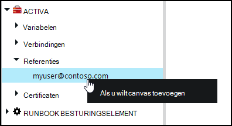
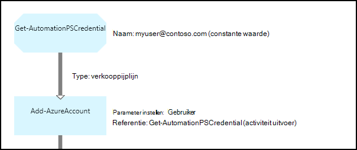

<properties 
   pageTitle="Referentie-activa in Azure automatisering | Microsoft Azure"
   description="Referentie activa in Azure automatisering bevatten beveiligingsreferenties die kunnen worden gebruikt om te verifiëren naar bronnen die worden gebruikt door de runbook of DSC-configuratie. In dit artikel wordt beschreven hoe referentie activa maken en gebruiken in een runbook of DSC configuratie."
   services="automation"
   documentationCenter=""
   authors="mgoedtel"
   manager="jwhit"
   editor="tysonn" />
<tags 
   ms.service="automation"
   ms.devlang="na"
   ms.topic="article"
   ms.tgt_pltfrm="na"
   ms.workload="infrastructure-services"
   ms.date="06/09/2016"
   ms.author="bwren" />

# Referentie activa in Azure automatisering

Activa referentie automatisering bevat een [PSCredential](http://msdn.microsoft.com/library/system.management.automation.pscredential) object met beveiligingsreferenties zoals een gebruikersnaam en wachtwoord. Runbooks en DSC configuraties mogelijk gebruikt cmdlets die een object PSCredential voor verificatie accepteren of ze mogelijk uitpakken de gebruikersnaam en wachtwoord van het object PSCredential geven sommige toepassing of de service is verificatie vereist. De eigenschappen voor een referentie veilig worden opgeslagen in Azure automatisering en kunnen worden geopend in de runbook of DSC-configuratie met de activiteit [Get-AutomationPSCredential](http://msdn.microsoft.com/library/system.management.automation.pscredential.aspx) .

>[AZURE.NOTE] Secure activa in Azure automatisering zijn referenties, certificaten, verbindingen en versleutelde variabelen. Deze activa zijn versleuteld en opgeslagen in de Azure automatisering met een unieke sleutel die wordt gegenereerd voor elke account automatisering. Deze sleutel is van een basispagina certificaat versleuteld en opgeslagen in Azure automatisering. Voordat u een secure activa op te slaan, de sleutel voor het account dat automatisering is ontsleuteld met behulp van de basispagina certificaat en vervolgens worden gebruikt voor het coderen van de activa. 

## Windows PowerShell-cmdlets

De cmdlets in de volgende tabel worden gebruikt om te maken en beheren van automatisering referentie activa met Windows PowerShell.  Wordt verzonden als onderdeel van de [Azure PowerShell-module](../powershell-install-configure.md) die beschikbaar voor gebruik in automatisering runbooks en DSC configuraties is.

|Cmdlets voor|Beschrijving|
|:---|:---|
|[Get-AzureAutomationCredential](http://msdn.microsoft.com/library/dn913781.aspx)|Hiermee haalt u informatie over een referentie-activa. U kunt alleen de referentie zelf ophalen uit **Get-AutomationPSCredential** activiteit.|
|[Nieuwe AzureAutomationCredential](http://msdn.microsoft.com/library/azure/jj554330.aspx)|Hiermee maakt u een nieuwe automatisering referentie.|
|[Verwijderen - AzureAutomationCredential](http://msdn.microsoft.com/library/azure/jj554330.aspx)|Hiermee verwijdert u een referentie automatisering.|
|[Set - AzureAutomationCredential](http://msdn.microsoft.com/library/azure/jj554330.aspx)|Hiermee stelt u de eigenschappen voor een bestaande automatisering referentie.|

## Runbook activiteiten

De activiteiten in de volgende tabel worden gebruikt voor toegang tot referenties in een runbook en DSC configuraties.

|Activiteiten|Beschrijving|
|:---|:---|
|Get-AutomationPSCredential|Krijgt een referentie wilt gebruiken in een runbook of DSC configuratie. Geeft als resultaat een object [System.Management.Automation.PSCredential](http://msdn.microsoft.com/library/system.management.automation.pscredential) .|

>[AZURE.NOTE] Vermijd het gebruik van variabelen in het gedeelte-naam-parameter van Get-AutomationPSCredential omdat dit kan ontdekken afhankelijkheden tussen runbooks of DSC configuraties bemoeilijken en referenties activa tijdens de ontwerpfase.

## Een nieuwe referentie actief maken

### Een nieuw referentie activum maken met de portal van de Azure klassieke

1. Van uw account automatisering, klikt u op **activa** boven aan het venster.
1. Klik onder aan het venster, op **Instelling toevoegen**.
1. Klik op **referentie toevoegen**.
2. Selecteer in de vervolgkeuzelijst **Type referentie** **PowerShell referentie**.
1. Voltooi de wizard en klik op het selectievakje om op te slaan van de nieuwe referentie.

### Een nieuw referentie activum maken met de portal van Azure

1. Klik op het deel van de **activa** als u wilt openen van het blad **activa** van uw account automatisering.
1. Klik op het deel achter de **referenties** om te openen van het blad **referenties** .
1. Klik op **een referentie toevoegen** aan de bovenkant van het blad.
1. Vul het formulier en klik op **maken** om de nieuwe referentie opslaan.

### Een nieuw referentie activum maken met Windows PowerShell

Het volgende voorbeeldopdrachten weergeven hoe u een nieuwe referentie voor automatisering maakt. Een object PSCredential is met de naam en wachtwoord voor het eerst wordt gemaakt en gebruikt voor het maken van de activa referentie. U kunt ook de cmdlet **Get-referentie** wilt worden gevraagd om te typen in een naam en een wachtwoord.

    $user = "MyDomain\MyUser"
    $pw = ConvertTo-SecureString "PassWord!" -AsPlainText -Force
    $cred = New-Object –TypeName System.Management.Automation.PSCredential –ArgumentList $user, $pw
    New-AzureAutomationCredential -AutomationAccountName "MyAutomationAccount" -Name "MyCredential" -Value $cred

## Een referentie PowerShell gebruiken

U ophalen een referentie actief in een runbook of DSC-configuratie met de activiteit **Get-AutomationPSCredential** . Hiermee wordt een [PSCredential object](http://msdn.microsoft.com/library/system.management.automation.pscredential.aspx) dat u kunt gebruiken met een activiteit of -cmdlet waarmee een parameter PSCredential vereist. U kunt ook de eigenschappen van het object referentie om afzonderlijk ophalen. Het object heeft een eigenschap voor de gebruikersnaam en het wachtwoord beveiligde of u kunt de **GetNetworkCredential** -methode gebruiken om een object [NetworkCredential](http://msdn.microsoft.com/library/system.net.networkcredential.aspx) waarmee een onbeveiligde versie van het wachtwoord te retourneren.

### Voorbeeld van de tekstuele runbook

De volgende opdrachten in de steekproef laten zien hoe een referentie PowerShell gebruiken in een runbook. In dit voorbeeld de referentie zijn opgehaald en de gebruikersnaam en wachtwoord die zijn toegewezen aan variabelen.

    $myCredential = Get-AutomationPSCredential -Name 'MyCredential'
    $userName = $myCredential.UserName
    $securePassword = $myCredential.Password
    $password = $myCredential.GetNetworkCredential().Password

### Voorbeeld van de grafische runbook

U kunt de activiteit in een **Get-AutomationPSCredential** toevoegen aan een grafische runbook door met de rechtermuisknop op de referentie in het deelvenster bibliotheek van de grafische editor en **toevoegen aan het tekenpapier**te selecteren.

De volgende afbeelding ziet u een voorbeeld van het gebruik van een referentie in een grafische runbook.  In dit geval wordt deze gebruikt voor verificatie voor een runbook naar Azure bronnen zoals is beschreven in [Runbooks verifiëren met Azure AD-gebruikersaccount](automation-sec-configure-aduser-account.md).  De eerste activiteit haalt de referenties die toegang tot het Azure abonnement heeft.  De activiteit **Toevoegen-AzureAccount** worden vervolgens deze referentie gebruikt voor verificatie voor alle activiteiten gewist.  Een [koppeling voor verkooppijplijn](automation-graphical-authoring-intro.md#links-and-workflow) bevindt zich hier Aangezien **Get-AutomationPSCredential** één object verwacht.  

## Gebruik van een referentie PowerShell in DSC
Terwijl DSC configuraties in Azure automatisering kunnen verwijst naar referentie activa met **Get-AutomationPSCredential**, kunnen referentie activa ook worden doorgegeven via parameters, indien gewenst. Zie [compileren configuraties in Azure automatisering DSC](automation-dsc-compile.md#credential-assets)voor meer informatie.

## Volgende stappen

- Zie voor meer informatie over koppelingen in de grafische authoring, [koppelingen in het grafische ontwerpen](automation-graphical-authoring-intro.md#links-and-workflow)
- Als u wilt weten over de verschillende verificatiemethoden met automatisering, Zie [Azure automatisering beveiliging](automation-security-overview.md)
- Zie [Mijn eerste grafische runbook](automation-first-runbook-graphical.md) om te beginnen met grafische runbooks
- Als u wilt beginnen met PowerShell werkstroom runbooks, raadpleegt u [Mijn eerste runbook van de PowerShell-werkstroom](automation-first-runbook-textual.md) 

 
