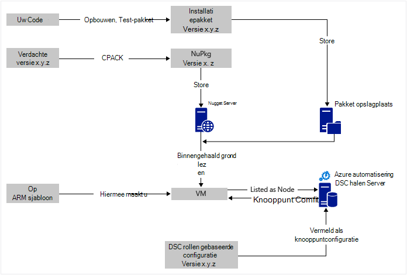
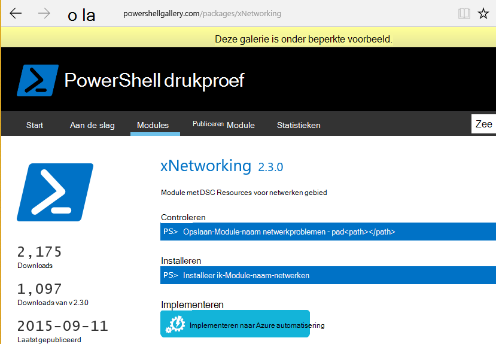

<properties
   pageTitle="Continue Azure automatisering DSC-implementatie waarbij Chocolatey | Microsoft Azure"
   description="DevOps continue implementatie Azure automatisering DSC en Chocolatey pakket manager gebruiken.  Voorbeeld met volledige JSON ARM sjabloon en de PowerShell-bron."
   services="automation"
   documentationCenter=""
   authors="sebastus"
   manager="stevenka"
   editor=""/>

<tags
   ms.service="automation"
   ms.devlang="na"
   ms.topic="article"
   ms.tgt_pltfrm="vm-windows"
   ms.workload="na"
   ms.date="08/08/2016"
   ms.author="golive"/>

# Voorbeeld van gebruik: Doorlopend implementatie aan virtuele Machines automatisering DSC en Chocolatey gebruiken

In de wereld van een DevOps zijn er veel hulpmiddelen om u te helpen met verschillende momenten in de pijplijn continue integratie.  Azure automatisering gewenst staat configuratie (DSC) is een Welkom nieuwe aanvulling op de opties die DevOps teams kunnen gebruiken.  In dit artikel ziet u de instelling van continue implementatie (CD) voor een Windows-computer.  U kunt de methode om op te nemen zo veel Windows-computers zo nodig in de rol (bijvoorbeeld een website) en van daaruit naar aanvullende rollen ook eenvoudig uitbreiden.

## Op hoog niveau

Er is heel wat hier, maar gelukkig deze in de twee belangrijkste processen kan worden onderverdeeld: 

  - Code schrijven en testen, klikt u vervolgens maken en publiceren, installatiepakketten voor primaire en secundaire versies van het systeem. 
  - Maken en beheren van VMs die installeren en uitvoeren van de code in de pakketten.  

Als beide core processen uitgevoerd worden, is een korte stap automatisch moeten worden bijgewerkt het pakket op een bepaalde VM wordt uitgevoerd als nieuwe versies worden gemaakt en geïmplementeerd.

## Overzicht van de component

Pakket managers zoals [enz-get](https://en.wikipedia.org/wiki/Advanced_Packaging_Tool) zijn heel bekende ter wereld Linux, maar niet zo veel in de wereld van Windows.  [Chocolatey](https://chocolatey.org/) is een goed en van Scott Hanselman [blog](http://www.hanselman.com/blog/IsTheWindowsUserReadyForAptget.aspx) over het onderwerp is een uitstekende inleidende.  Chocolatey gaat, kunt u pakketten installeren vanaf een centrale opslagplaats van pakketten in een Windows-systeem via de opdrachtregel.  U kunt maken en beheren van uw eigen opslagplaats en Chocolatey kunt pakketten installeren vanaf een willekeurig aantal opslagplaatsen die u opgeeft.

Gewenste staat configuratie (DSC) ([Overzicht](https://technet.microsoft.com/library/dn249912.aspx)) is een PowerShell-hulpmiddel waarmee u de configuratie die u wilt gebruiken voor een machine declareren.  U kunt bijvoorbeeld, "Ik wil dat Chocolatey is geïnstalleerd, ik wil dat IIS is geïnstalleerd, ik wil dat poort 80 geopend, ik wil dat versie 1.0.0 van mijn website is geïnstalleerd."  De DSC lokale Configuration Manager (KGV) implementeert die configuratie. Een Server DSC halen bevat een opslagplaats voor configuraties voor uw machines. De KGV op elke computer controleert regelmatig om te zien als de configuratie overeenkomt met de opgeslagen configuratie. Dit kan status rapporteren of probeert te brengen van de computer terug naar de uitlijning aan de opgeslagen configuratie. U kunt de opgeslagen configuratie op de server halen oorzaak van een computer of een set computers moeten afkomstig zijn uitgelijnd met de gewijzigde configuratie bewerken.

Azure automatisering is een beheerde service in Microsoft Azure waarmee u verschillende taken met runbooks, knooppunten, referenties, resources en activa, zoals planningen en algemene variabelen kunt automatiseren. Azure automatisering DSC breidt deze mogelijkheid automatisering PowerShell DSC's zijn opgenomen.  Hier is een goed [Overzicht](automation-dsc-overview.md).

Een Resource DSC is een module met code met specifieke functies, zoals het beheren van netwerken, Active Directory of SQL Server.  De Chocolatey DSC Resource weet hoe u toegang tot een NuGet Server (onder andere), pakketten downloaden, installeren pakketten, enzovoort.  Er zijn vele andere DSC Resources in de [Galerie met PowerShell](http://www.powershellgallery.com/packages?q=dsc+resources&prerelease=&sortOrder=package-title).  Deze modules zijn geïnstalleerd op uw Server Azure automatisering DSC halen (door u) zodat ze kunnen worden gebruikt door uw configuraties.

Op ARM sjablonen bieden een declaratieve manier voor het genereren van de infrastructuur van uw - items, zoals netwerken, subnetten, netwerkbeveiliging en -mailroutering laden balancers, NIC, VMs, enzovoort.  Hier ziet u een [artikel](../resource-manager-deployment-model.md) waarin verschilt van de ARM implementatiemodel (declaratieve) met het beheer van de Service Azure (ASM of klassieke) implementatiemodel (imperatieve).  En een ander [artikel](../virtual-machines/virtual-machines-windows-compare-deployment-models.md) over de core resource providers, berekeningscluster, opslag en netwerk.

Één spil van een sjabloon ARM is de mogelijkheid om te installeren extensie VM in de VM zoals deze ingericht.  VM extensie heeft specifieke mogelijkheden zoals een aangepast script uitvoeren, antivirussoftware installeren of een DSC configuratiescript uitvoeren.  Er zijn tal van VM uitbreidingen.

## Snelle reis rond het diagram

Vanaf de bovenkant, schrijft u uw code, maken en testen en vervolgens een installatiepakket maken.  Chocolatey kan verschillende soorten installatiepakketten, zoals MSI, MSU, ZIP verwerken.  En u de volledige kracht van PowerShell moet de werkelijke installatie als Chocolatey van systeemeigen mogelijkheden niet helemaal maximaal hebben.  Het pakket in ergens bereikbaar – een pakket opslagplaats plaatsen.  In dit voorbeeld gebruik een openbare map in een Azure blob storage-account gebruikt, maar deze overal kunt worden.  Chocolatey werkt native met NuGet servers en enkele andere voor beheer van metagegevens pakket.  [In dit artikel](https://github.com/chocolatey/choco/wiki/How-To-Host-Feed) worden de opties.  In dit voorbeeld gebruik NuGet gebruikt.  Een Nuspec is metagegevens over uw pakketten.  Van de Nuspec zijn 'gecompileerd' in de NuPkg en die zijn opgeslagen in een NuGet-server.  Wanneer uw configuratie aanvragen van een pakket met de naam en verwijst naar een server NuGet, wordt de Chocolatey DSC Resource (nu op de VM) pakt het pakket en installeert deze voor u.  U kunt ook een specifieke versie van een doos aanvragen.

In het onderste linkergedeelte van de afbeelding is er een Azure Resource Manager (ARM)-sjabloon.  In dit voorbeeld gebruik registreert de extensie VM de VM met de Server Azure automatisering DSC halen (dat wil zeggen een server halen) als een knooppunt.  De configuratie wordt opgeslagen in de server halen.  Werkelijk, wordt deze opgeslagen tweemaal: eenmaal als tekst zonder opmaak en zodra gecompileerd als een MOF-bestand (voor die over zaken weten.)  Klik in de portal is de MOF een 'knooppuntconfiguratie"(in plaats van gewoon" configuratie").  Is het onderdeel dat is gekoppeld aan een knooppunt zodat het knooppunt de configuratie weten.  Hieronder wordt aangegeven hoe de knooppuntconfiguratie toewijzen aan het knooppunt.

U doet waarschijnlijk al de bit boven, of meest ervan.  Maken van de nuspec, compileren en deze opslaan in een NuGet-server is een kleine ding.  En u bent al VMs beheren.  De volgende stap het duurt aan doorlopende implementatie is vereist, de halen-server (één keer) instelt, registreert uw knooppunten (één keer), en maken en opslaan van de configuratie er (in eerste instantie).  Vernieuw vervolgens pakketten zijn bijgewerkt en geïmplementeerd in de bibliotheek, de configuratie en configuratie van knooppunten in de server halen (herhaald indien nodig).

Als u bent niet begint met een sjabloon ARM, is dat ook OK.  Er zijn zo ontworpen dat u uw VMs hebt geregistreerd bij de server halen en alle van de rest van PowerShell-cmdlets. Zie voor meer informatie in dit artikel: [Onboarding machines voor beheer door Azure automatisering DSC](automation-dsc-onboarding.md)

## Stap 1: Het instellen van het account van server en automatisering halen

Op een geverifieerde (toevoegen-AzureRmAccount) PowerShell-opdrachtregel: (kan een paar minuten duren terwijl de server halen is ingesteld)

    New-AzureRmResourceGroup –Name MY-AUTOMATION-RG –Location MY-RG-LOCATION-IN-QUOTES
    New-AzureRmAutomationAccount –ResourceGroupName MY-AUTOMATION-RG –Location MY-RG-LOCATION-IN-QUOTES –Name MY-AUTOMATION-ACCOUNT 

U kunt uw account automatisering plaatsen in een van de volgende regio's (of locatie): Oost VS 2, Zuid centraal ons, ons beurs Virginia, West Europa, Zuidoost-Azië, Japan Oost-, centraal India en Australië Zuidoost.

## Stap 2: VM extensie aanpassingen aan de sjabloon ARM

Als u meer informatie voor VM registratie (met de extensie PowerShell DSC VM) die beschikbaar zijn in deze [Azure Quickstart sjabloon](https://github.com/Azure/azure-quickstart-templates/tree/master/dsc-extension-azure-automation-pullserver).  Deze stap registreert uw nieuwe VM bij de server halen in de lijst met DSC knooppunten.  Onderdeel van deze registratie is de knooppuntconfiguratie moeten worden toegepast om het knooppunt opgeven.  Deze knooppuntconfiguratie hoeft te nog bestaat in de server halen, dus is het OK die stap 4 is waar dit klaar is voor de eerste keer.  Maar hier in stap 2 u moet de naam van het knooppunt en de naam van de configuratie hebt besloten.  In dit voorbeeld gebruik het knooppunt is 'isvbox' en de configuratie is 'ISVBoxConfig'.  De naam van het knooppunt configuratie (aan te geven in DeploymentTemplate.json) staat dus 'ISVBoxConfig.isvbox'.  

## Stap 3: Vereiste DSC resources toevoegen aan de server halen

De PowerShell-galerie is geïmplementeerd om te kunnen installeren DSC resources in uw account Azure automatisering.  Navigeer naar de bron die u wilt en klik op de knop "Implementeren naar Azure automatisering".

Een andere methode die onlangs toegevoegd bij de Portal Azure kunt u downloaden van nieuwe modules of het bijwerken van bestaande modules. Klik op de resource automatisering-Account, klik op de tegel activa en ten slotte op de tegel Modules.  Het pictogram bladeren galerie kunt u de lijst met modules in de galerie, Inzoomen op details en uiteindelijk willen importeren in uw Account automatisering. Dit is een uitstekende manier om uw modules te bezoeken up-to-date houden. En, wordt de functie gecontroleerd afhankelijkheden met andere modules om ervoor te zorgen dat er niets wordt niet gesynchroniseerd.

Nee, er is de handmatige methode.  De mapstructuur van een PowerShell-Module voor integratie voor een Windows-computer is iets anders dan de mapstructuur verwacht door de automatisering Azure.  Dit is wat u op uw onderdeel vereist.  Maar het is niet moeilijk en deze klaar slechts één keer per resource (tenzij u wilt bijwerken in toekomstige.)  Zie voor meer informatie over het ontwerpen van de PowerShell-integratiemodules, in dit artikel: [Authoring integratiemodules voor het automatiseren van Azure](https://azure.microsoft.com/blog/authoring-integration-modules-for-azure-automation/)

-   Installeer de module die u nodig hebt op uw werkstation, als volgt:
    -   Installeer [Windows Management Framework, v5](http://aka.ms/wmf5latest) (niet nodig voor Windows 10)
    -   `Install-Module –Name MODULE-NAME`<, pakt de module vanuit de galerie met PowerShell 
-   Kopieer de map met de module uit `c:\Program Files\WindowsPowerShell\Modules\MODULE-NAME` naar een map temp 
-   Voorbeelden en documentatie verwijderen uit de hoofdmap 
-   De hoofdmap, de naam van het ZIP-bestand precies hetzelfde als de map ZIP 
-   Plaats het ZIP-bestand in een bereikbaar HTTP-locatie, zoals in een Account van de opslagruimte Azure-blobopslag.
-   Hiermee voert u deze PowerShell:

        New-AzureRmAutomationModule `
            -ResourceGroupName MY-AUTOMATION-RG -AutomationAccountName MY-AUTOMATION-ACCOUNT `
            -Name MODULE-NAME –ContentLink "https://STORAGE-URI/CONTAINERNAME/MODULE-NAME.zip"
        

Het opgenomen voorbeeld kunt u deze stappen uitvoeren voor cChoco en xNetworking. Zie de [notities](#notes) voor speciale verwerking voor cChoco.

## Stap 4: De knooppuntconfiguratie toevoegen aan de server halen

Er is niets speciale over de eerste keer dat u uw configuratie in de halen-server en compileren importeren.  Alle volgende importeren/compileert met dezelfde configuratie er precies hetzelfde.  Telkens wanneer u uw pakket bijwerken en doorgeven aan productie moet uitvoeren u deze stap nadat u dat het configuratiebestand klopt – met inbegrip van de nieuwe versie van uw pakket.  Hier volgt het configuratiebestand en PowerShell:

ISVBoxConfig.ps1:

    Configuration ISVBoxConfig 
    { 
        Import-DscResource -ModuleName cChoco 
        Import-DscResource -ModuleName xNetworking
    
        Node "isvbox" {   
    
            cChocoInstaller installChoco 
            { 
                InstallDir = "C:\choco" 
            }
    
            WindowsFeature installIIS 
            { 
                Ensure="Present" 
                Name="Web-Server" 
            }
    
            xFirewall WebFirewallRule 
            { 
                Direction = "Inbound" 
                Name = "Web-Server-TCP-In" 
                DisplayName = "Web Server (TCP-In)" 
                Description = "IIS allow incoming web site traffic." 
                DisplayGroup = "IIS Incoming Traffic" 
                State = "Enabled" 
                Access = "Allow" 
                Protocol = "TCP" 
                LocalPort = "80" 
                Ensure = "Present" 
            }
    
            cChocoPackageInstaller trivialWeb 
            {            
                Name = "trivialweb" 
                Version = "1.0.0" 
                Source = “MY-NUGET-V2-SERVER-ADDRESS” 
                DependsOn = "[cChocoInstaller]installChoco", 
                "[WindowsFeature]installIIS" 
            } 
        }    
    }

Nieuw-ConfigurationScript.ps1:

    Import-AzureRmAutomationDscConfiguration ` 
        -ResourceGroupName MY-AUTOMATION-RG –AutomationAccountName MY-AUTOMATION-ACCOUNT ` 
        -SourcePath C:\temp\AzureAutomationDsc\ISVBoxConfig.ps1 ` 
        -Published –Force
    
    $jobData = Start-AzureRmAutomationDscCompilationJob ` 
        -ResourceGroupName MY-AUTOMATION-RG –AutomationAccountName MY-AUTOMATION-ACCOUNT ` 
        -ConfigurationName ISVBoxConfig 
    
    $compilationJobId = $jobData.Id
    
    Get-AzureRmAutomationDscCompilationJob ` 
        -ResourceGroupName MY-AUTOMATION-RG –AutomationAccountName MY-AUTOMATION-ACCOUNT ` 
        -Id $compilationJobId

Het resultaat van deze stappen in een nieuwe knooppuntconfiguratie met de naam 'ISVBoxConfig.isvbox' op de server halen wordt geplaatst.  De naam van het knooppunt configuratie is gebouwd als "configurationName.nodeName".

## Stap 5: Maken en onderhouden van pakket metagegevens

Voor elke pakket dat u hebt opgeslagen in de opslagplaats pakket, moet u een nuspec die wordt beschreven.  Die nuspec moet worden gecompileerd en opgeslagen in uw NuGet-server. Dit proces wordt beschreven [hier](http://docs.nuget.org/create/creating-and-publishing-a-package).  U kunt MyGet.org gebruiken als een NuGet-server.  Ze deze service verkopen, maar u hebt een starter SKU die is gratis.  Bij NuGet.org vindt u instructies voor het installeren van de server van uw eigen NuGet voor uw privé-pakketten.

## Stap 6: Zo koppelen helemaal

Telkens wanneer een versie q & a worden doorgegeven en is goedgekeurd voor implementatie, is het pakket gemaakt, nuspec en nupkg bijgewerkt en geïmplementeerd op de server NuGet.  Bovendien kan de configuratie (stap 4 hierboven) moet worden bijgewerkt overeenstemming met het nummer van de nieuwe versie.  Er moet worden verzonden naar de server halen en gecompileerd.  Vanaf dat punt is het aan de VMs die afhankelijk zijn van die configuratie om te halen van de update en installeer deze.  Elk van deze updates zijn eenvoudige - alleen een of twee regels van PowerShell.  Voor Visual Studio Team diensten, zijn een paar hiervan encapsulated in opbouwen taken die kunnen worden samengevoegd in een opbouwen.  In dit [artikel](https://www.visualstudio.com/en-us/docs/alm-devops-feature-index#continuous-delivery) vindt u meer informatie.  Deze [GitHub cessies‑retrocessies](https://github.com/Microsoft/vso-agent-tasks) ingegaan op de verschillende beschikbare opbouwen-taken.

## Notities

In dit voorbeeld gebruik begint met een VM uit een algemene Windows Server 2012 R2 afbeelding uit de galerie met Azure.  U kunt starten vanuit een opgeslagen afbeelding en vervolgens aanpassen met de configuratie DSC daarvandaan.  Configuratie die is warm wijzigen in een afbeelding is echter veel moeilijker dan de configuratie met behulp van DSC dynamisch bij te werken.

U hoeft niet te gebruiken van een sjabloon ARM en de extensie VM deze techniek gebruiken met uw VMs.  En uw VMs niet hoeft te worden op Azure moeten onder beheer van de CD.  Alle die nodig is dat Chocolatey wordt geïnstalleerd en de KGV geconfigureerd op de VM zodat deze weet waar de server halen is.  

Wanneer u een pakket op een VM die is in productie bijwerkt, moet u uiteraard kunt uitvoeren die VM afmelden bij de draaiing terwijl de update is geïnstalleerd.  Hoe u dit doet varieert.  Bijvoorbeeld, met een VM achter een taakverdeling Azure, kunt u toevoegen een aangepaste onderzoeken.  Tijdens het bijwerken van de VM, hebt u de test-eindpunt een 400 retourneren.  De oorzaak van deze wijziging nodig tweak kan zijn binnen uw configuratie als kunt u de tweak om terug te keren naar een 200 retourneren nadat het bijwerken voltooid is.

Volledige bron voor dit voorbeeld gebruik is in [dit project Visual Studio](https://github.com/sebastus/ARM/tree/master/CDIaaSVM) op GitHub.

##Verwante artikelen##

- [Azure automatisering DSC overzicht] (automatisering-dsc-overview.md)
- [Azure automatisering DSC cmdlets] (https://msdn.microsoft.com/library/mt244122.aspx)
- [Onboarding machines voor beheer door Azure automatisering DSC] (automatisering-dsc-onboarding.md)
