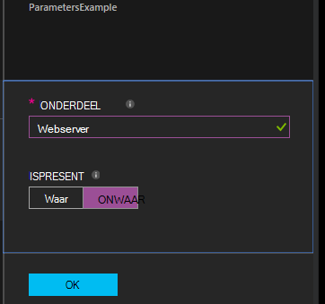

<properties 
   pageTitle="Configuraties in Azure automatisering DSC compileren | Microsoft Azure" 
   description="Overzicht van de volgende twee manieren gewenst staat configuratie (DSC) configuraties compileren: Klik In de portal van Azure en met Windows PowerShell. " 
   services="automation" 
   documentationCenter="na" 
   authors="coreyp-at-msft" 
   manager="stevenka" 
   editor="tysonn"/>

<tags
   ms.service="automation"
   ms.devlang="na"
   ms.topic="article"
   ms.tgt_pltfrm="powershell"
   ms.workload="na" 
   ms.date="01/25/2016"
   ms.author="coreyp"/>
   
#Configuraties in Azure automatisering DSC compileren#

U kunt desgewenst staat configuratie (DSC) configuraties op twee manieren met Azure automatisering compileren: Klik In de portal van Azure en met Windows PowerShell. De volgende tabel, kunt u bepalen wanneer welke methode op basis van de kenmerken van elk gebruikt: 

###Azure preview-portal###
- Eenvoudigst met interactieve gebruikersinterface
- Formulier kunt eenvoudige parameterwaarden opgeven
- Eenvoudig kunnen bijhouden taakstatus
- Access geverifieerd met Azure aanmelding

###Windows PowerShell###
- Bellen vanuit de opdrachtregel met Windows PowerShell-cmdlets
- Kunnen worden opgenomen in geautomatiseerd-oplossing met meerdere stappen
- Eenvoudige en complexe parameterwaarden opgeven
- Taakstatus bijhouden
- Client vereist ter ondersteuning van de PowerShell-cmdlets
- ConfigurationData doorgeven
- Compilatie-configuraties die gebruikmaken van referenties

Als u hebt besloten van een methode gecompileerd, kunt u de onderstaande starten compileren desbetreffende procedures volgen.

##Compileren van een DSC-configuratie met de portal van Azure##

1.  Van uw account automatisering, klikt u op **configuraties**.
2.  Klik op een configuratie als u wilt de blade openen.
3.  Klik op **compileren**.
4.  Als de configuratie geen parameters heeft, wordt u gevraagd om te bevestigen of u wilt deze compileren. Als de configuratie parameters heeft, wordt het blad **Compileren configuratie** wordt geopend zodat u parameterwaarden kan geven. Zie de sectie <a href="#basic-parameters">**Fundamentele Parameters**</a> hieronder voor meer informatie over parameters.
5.  Het blad **Gecompileerd taak** wordt geopend, zodat u de status van de taak gecompileerd en het knooppunt configuraties (MOF configuratiedocumenten) het veroorzaakt moet worden geplaatst op de Server Azure automatisering DSC halen kunt bijhouden.

##Compileren van een DSC-configuratie met Windows PowerShell##

U kunt [`Start-AzureRmAutomationDscCompilationJob`](https://msdn.microsoft.com/library/mt244118.aspx) om te beginnen met Windows PowerShell compileren. De volgende code wordt gestart compilatie van een DSC-configuratie **SampleConfig**genoemd.

    Start-AzureRmAutomationDscCompilationJob -ResourceGroupName "MyResourceGroup" -AutomationAccountName "MyAutomationAccount" -ConfigurationName "SampleConfig" 
 
`Start-AzureRmAutomationDscCompilationJob`Geeft als resultaat een gecompileerd taak-object dat u gebruiken kunt voor het bijhouden van de status ervan. U kunt dit object gecompileerd taak met [`Get-AzureRmAutomationDscCompilationJob`](https://msdn.microsoft.com/library/mt244120.aspx) om te bepalen de status van de taak gecompileerd en [`Get-AzureRmAutomationDscCompilationJobOutput`](https://msdn.microsoft.com/library/mt244103.aspx) om weer te geven van de streams (uitvoer). De volgende code compilatie van de configuratie **SampleConfig** is gestart, wacht totdat deze is voltooid en de streams selecteert, wordt weergegeven.
    
    $CompilationJob = Start-AzureRmAutomationDscCompilationJob -ResourceGroupName "MyResourceGroup" -AutomationAccountName "MyAutomationAccount" -ConfigurationName "SampleConfig"
    
    while($CompilationJob.EndTime –eq $null -and $CompilationJob.Exception –eq $null)           
    {
        $CompilationJob = $CompilationJob | Get-AzureRmAutomationDscCompilationJob
        Start-Sleep -Seconds 3
    }
    
    $CompilationJob | Get-AzureRmAutomationDscCompilationJobOutput –Stream Any 

##Eenvoudige Parameters##

Parameterdeclaratie in DSC configuraties, inclusief parametertypen en eigenschappen werkt in Azure automatisering runbooks. Zie [een runbook in Azure automatisering starten](automation-starting-a-runbook.md) voor meer informatie over runbook parameters.

In het volgende voorbeeld worden twee parameters genoemd **onderdeel** en **IsPresent**, gebruikt om te bepalen de waarden van eigenschappen in de configuratie **ParametersExample.sample** knooppunten, gegenereerd tijdens het compileren.

    Configuration ParametersExample
    {
        param(
            [Parameter(Mandatory=$true)]
    
            [string] $FeatureName,
    
            [Parameter(Mandatory=$true)]
            [boolean] $IsPresent
        )
    
        $EnsureString = "Present"
        if($IsPresent -eq $false)
        {
            $EnsureString = "Absent"
        }
    
        Node "sample"
        {
            WindowsFeature ($FeatureName + "Feature")
            {
                Ensure = $EnsureString
                Name = $FeatureName
            }
        }
    }

U kunt compileren DSC-configuraties die gebruikmaken van de fundamentele parameters in de portal Azure automatisering DSC of met Azure PowerShell:

###Portal###

Klik in de portal kunt u parameterwaarden nadat u hebt geklikt **compileren**.

###PowerShell###

PowerShell vereist parameters in een [hashtable](http://technet.microsoft.com/library/hh847780.aspx) waar de sleutel overeenkomt met de parameternaam van de en de waarde gelijk is aan de parameterwaarde.

    $Parameters = @{
            "FeatureName" = "Web-Server"
            "IsPresent" = $False
    }
    
    
    Start-AzureRmAutomationDscCompilationJob -ResourceGroupName "MyResourceGroup" -AutomationAccountName "MyAutomationAccount" -ConfigurationName "ParametersExample" -Parameters $Parameters 
    

Zie voor informatie over het doorgeven van PSCredentials als parameters, <a href="#credential-assets">**Referentie activa**</a> hieronder.

##ConfigurationData##

**ConfigurationData** kunt u structurele configuratie van een specifieke configuratie van de omgeving volwaardig PowerShell DSC scheiden. Zie ['Wat' scheiden van 'Waar' in PowerShell DSC](http://blogs.msdn.com/b/powershell/archive/2014/01/09/continuous-deployment-using-dsc-with-minimal-change.aspx) voor meer informatie over **ConfigurationData**.

>[AZURE.NOTE] U kunt **ConfigurationData** gebruiken bij het compileren in Azure automatisering DSC via Azure PowerShell, maar niet in de portal van Azure.

Het volgende voorbeeld DSC configuratie gebruikt **ConfigurationData** via de trefwoorden **$ConfigurationData** en **$AllNodes** . U moet ook de [ **xWebAdministration** -module](https://www.powershellgallery.com/packages/xWebAdministration/) voor dit voorbeeld:

     Configuration ConfigurationDataSample
     {
        Import-DscResource -ModuleName xWebAdministration -Name MSFT_xWebsite
    
        Write-Verbose $ConfigurationData.NonNodeData.SomeMessage 
    
        Node $AllNodes.Where{$_.Role -eq "WebServer"}.NodeName
        {
            xWebsite Site
            {
                Name = $Node.SiteName
                PhysicalPath = $Node.SiteContents
                Ensure   = "Present"
            }
        }
    }

U kunt de configuratie DSC hierboven met PowerShell compileren. De onder PowerShell voegt u twee knooppunt configuraties toe aan de Server Azure automatisering DSC halen: **ConfigurationDataSample.MyVM1** en **ConfigurationDataSample.MyVM3**:

    $ConfigData = @{
        AllNodes = @(
            @{
                NodeName = "MyVM1"
                Role = "WebServer"
            },
            @{
                NodeName = "MyVM2"
                Role = "SQLServer"
            },
            @{
                NodeName = "MyVM3"
                Role = "WebServer"
    
            }
    
        )
    
        NonNodeData = @{
            SomeMessage = "I love Azure Automation DSC!"
    
        }
    
    } 
    
    Start-AzureRmAutomationDscCompilationJob -ResourceGroupName "MyResourceGroup" -AutomationAccountName "MyAutomationAccount" -ConfigurationName "ConfigurationDataSample" -ConfigurationData $ConfigData

##Activa##

Activa verwijzingen zijn identiek in Azure automatisering DSC configuraties en runbooks. Zie de volgende onderwerpen voor meer informatie:

- [Certificaten](automation-certificates.md)
- [Verbindingen](automation-connections.md)
- [Referenties](automation-credentials.md)
- [Variabelen](automation-variables.md)

###Referentie activa###
Terwijl DSC configuraties in Azure automatisering kunnen verwijst naar referentie activa met **Get-AzureRmAutomationCredential**, kunnen referentie activa ook worden doorgegeven via parameters, indien gewenst. Als een configuratie een parameter van het type **PSCredential duurt** , moet u de naam van activa referentie Azure automatisering als de waarde van de parameter, in plaats van een object PSCredential doorgeven. Achter de schermen, worden de activa Azure automatisering referentie met die naam opgehaald en doorgegeven aan de configuratie.

Referenties behouden secure in knooppunt configuraties (MOF configuratiedocumenten) is vereist voor het coderen van de referenties in het knooppunt MOF configuratiebestand. Azure automatisering duurt deze een stap verder en versleutelt het hele MOF-bestand. Echter moet momenteel u zien PowerShell DSC dat het is geen probleem voor referenties output als tekst zonder opmaak tijdens het knooppunt configuratie MOF genereren, omdat PowerShell DSC niet weet dat Azure automatisering wordt worden coderen van de hele MOF bestand na de generatie via een taak gecompileerd.

U kunt PowerShell DSC zien dat dit geen probleem voor referenties is output als tekst zonder opmaak in de configuratie van de gegenereerde knooppunten MOF-bestanden met <a href="#configurationdata">**ConfigurationData**</a>. U moet doorgeven `PSDscAllowPlainTextPassword = $true` via **ConfigurationData** van elke knooppunt-blok in te voeren die wordt weergegeven in de configuratie DSC en worden de referenties gebruikt.

Het volgende voorbeeld ziet u een DSC-configuratie met activa referentie automatisering.

    Configuration CredentialSample
    {
       $Cred = Get-AzureRmAutomationCredential -Name "SomeCredentialAsset"
    
        Node $AllNodes.NodeName
        { 
            File ExampleFile
            { 
                SourcePath = "\\Server\share\path\file.ext" 
                DestinationPath = "C:\destinationPath" 
                Credential = $Cred 
            }
        }
    }

U kunt de configuratie DSC hierboven met PowerShell compileren. De onder PowerShell voegt u twee knooppunt configuraties toe aan de Server Azure automatisering DSC halen: **CredentialSample.MyVM1** en **CredentialSample.MyVM2**.

    $ConfigData = @{
        AllNodes = @(
            @{
                NodeName = "*"
                PSDscAllowPlainTextPassword = $True
            },
            @{
                NodeName = "MyVM1"
            },
            @{
                NodeName = "MyVM2"
            }
        )
    }
    
    Start-AzureRmAutomationDscCompilationJob -ResourceGroupName "MyResourceGroup" -AutomationAccountName "MyAutomationAccount" -ConfigurationName "CredentialSample" -ConfigurationData $ConfigData
