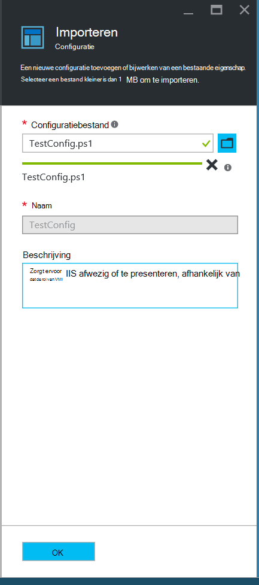
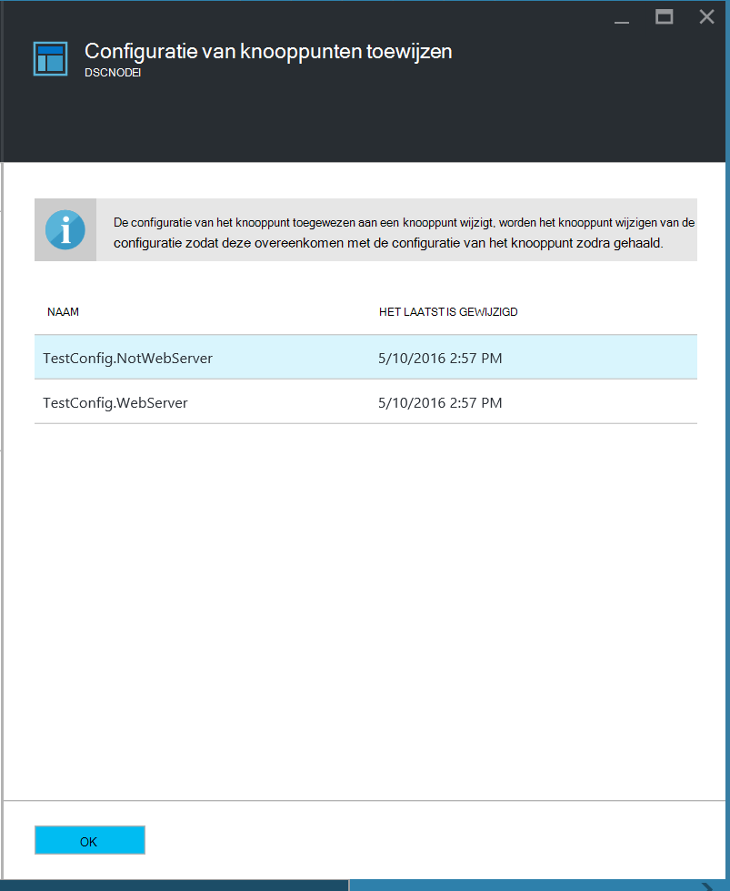

<properties
   pageTitle="Aan de slag met Azure automatisering DSC"
   description="Uitleg en voorbeelden van de meest voorkomende taken in Azure automatisering gewenst staat configuratie (DSC)"
   services="automation" 
   documentationCenter="na" 
   authors="eslesar" 
   manager="dongill" 
   editor="tysonn"/>

<tags
   ms.service="automation"
   ms.devlang="na"
   ms.topic="article"
   ms.tgt_pltfrm="powershell"
   ms.workload="na" 
   ms.date="06/06/2016"
   ms.author="magoedte;eslesar"/>
   

# <a name="getting-started-with-azure-automation-dsc"></a>Aan de slag met Azure automatisering DSC

In dit onderwerp wordt uitgelegd hoe u de meest voorkomende taken met Azure automatisering gewenst staat configuratie (DSC), zoals maken, importeren, en compileren configuraties onboarding machines te beheren, en rapporten weergeven. Zie voor een overzicht van wat Azure automatisering DSC is, [Azure automatisering DSC overzicht](automation-dsc-overview.md). Zie [Windows PowerShell gewenst staat configuratieoverzicht](https://msdn.microsoft.com/PowerShell/dsc/overview)voor DSC documentatie.

In dit onderwerp biedt stapsgewijze instructies over het gebruik van Azure automatisering DSC. Als u een Voorbeeldomgeving die al is ingesteld zonder de stappen in dit onderwerp wilt, kunt u [de volgende ARM-sjabloon](https://github.com/azureautomation/automation-packs/tree/master/102-sample-automation-setup). Deze sjabloon bepaalt een voltooide Azure automatisering DSC-omgeving, inclusief een Azure-VM dat wordt beheerd door Azure automatisering DSC.
 
## <a name="prerequisites"></a>Vereisten voor

U voltooit de voorbeelden in dit onderwerp, zijn vereist:

- Een automatisering Azure-account. Zie voor instructies over het maken van een account automatisering Azure die uitvoeren als [Azure uitvoeren als Account](automation-sec-configure-azure-runas-account.md).
- Een Azure resourcemanager VM (niet klassieke) met Windows Server 2008 R2 of hoger. Zie voor instructies over het maken van een VM [maken uw eerste virtuele Windows-computer in de portal van Azure](../virtual-machines/virtual-machines-windows-hero-tutorial.md)

## <a name="creating-a-dsc-configuration"></a>Maken van een DSC-configuratie

We gaan een eenvoudige [DSC configuratie](https://msdn.microsoft.com/powershell/dsc/configurations) die ervoor zorgt dat de aanwezigheid of afwezigheid van de **Webserver** Windows functie IIS (), afhankelijk van hoe het toewijzen van knooppunten maken.

1. Start de Windows PowerShell-wissen (of elke teksteditor).

2. Typ het volgende:

    ```powershell
    configuration TestConfig
    {
        Node WebServer
        {
            WindowsFeature IIS
            {
                Ensure               = 'Present'
                Name                 = 'Web-Server'
                IncludeAllSubFeature = $true

            }
        }

        Node NotWebServer
        {
            WindowsFeature IIS
            {
                Ensure               = 'Absent'
                Name                 = 'Web-Server'

            }
        }
        }
    ```
3. Sla het bestand als `TestConfig.ps1`.

Deze configuratie roept een resource in elk blok knooppunt, de [WindowsFeature resource](https://msdn.microsoft.com/powershell/dsc/windowsfeatureresource), die ervoor zorgt de aanwezigheid of afwezigheid van de functie **Webserver dat** .

## <a name="importing-a-configuration-into-azure-automation"></a>Het importeren van een configuratie in Azure automatisering

Vervolgens gaat we de configuratie importeren in de automatisering-account.

1. Meld u aan bij de [portal van Azure](https://portal.azure.com).

2. Klik op het menu Hub op **alle resources** en klik vervolgens op de naam van uw account automatisering.

3. Klik op het blad **automatisering account** op **DSC configuraties**.

4. Klik op het blad **DSC configuraties** op **toevoegen een configuratie**.

5. Klik op het blad **Configuratie importeren** , blader naar de `TestConfig.ps1` bestand op uw computer.
    
    
    

6. Klik op **OK**.

## <a name="viewing-a-configuration-in-azure-automation"></a>Weergeven van een configuratie in Azure automatisering

Nadat u een configuratie hebt geïmporteerd, kunt u deze kunt weergeven in de portal van Azure.

1. Meld u aan bij de [portal van Azure](https://portal.azure.com).

2. Klik op het menu Hub op **alle resources** en klik vervolgens op de naam van uw account automatisering.

3. Klik op het blad **automatisering account** op **DSC configuraties**

4. Klik op het blad **DSC configuraties** op **TestConfig** (dit is de naam van de configuratie die u in de vorige procedure hebt geïmporteerd).

5. Klik op het blad **TestConfig configuratie** op **bron van de configuratie weergeven**.

    
    
    Een blade **TestConfig configuratie bron** wordt geopend, met de PowerShell-code voor de configuratie.
    
## <a name="compiling-a-configuration-in-azure-automation"></a>Een configuratie in Azure automatisering compileren

Voordat u een gewenste staat op een knooppunt toepassen kunt, moet een DSC-configuratie definiëren die staat worden gecompileerd in een of meer knooppunt configuraties (MOF document) en op de Server automatisering DSC halen geplaatst. Voor een gedetailleerde beschrijving van het compileren van configuraties in Azure automatisering DSC, Zie [configuraties in Azure automatisering DSC compileren](automation-dsc-compile.md). Zie voor meer informatie over het compileren van configuraties, [DSC configuraties](https://msdn.microsoft.com/PowerShell/DSC/configurations).

1. Meld u aan bij de [portal van Azure](https://portal.azure.com).

2. Klik op het menu Hub op **alle resources** en klik vervolgens op de naam van uw account automatisering.

3. Klik op het blad **automatisering account** op **DSC configuraties**

4. Klik op het blad **DSC configuraties** op **TestConfig** (de naam van de eerder geïmporteerde configuratie).

5. Klik op het blad **TestConfig configuratie** op **compileren**en klik vervolgens op **Ja**. Hiermee start u een taak gecompileerd.
    
    
    
> [AZURE.NOTE] Wanneer u een configuratie in Azure automatisering compileren, worden automatisch alle gemaakte knooppuntconfiguratie MOF-bestanden op de server halen geïmplementeerd.

## <a name="viewing-a-compilation-job"></a>Een taak gecompileerd weergeven

Nadat u een gecompileerd begonnen, kunt u deze kunt weergeven in de tegel **gecompileerd taken** in het blad **configuratie** . De tegel **gecompileerd taken** ziet u momenteel uitgevoerd, voltooid en is mislukt taken. Wanneer u een gecompileerd taak blade opent, ziet u informatie over die taak inclusief eventuele fouten of waarschuwingen heeft voorgedaan, invoerparameters gebruikt in de configuratie en compilatie Logboeken.

1. Meld u aan bij de [portal van Azure](https://portal.azure.com).

2. Klik op het menu Hub op **alle resources** en klik vervolgens op de naam van uw account automatisering.

3. Klik op het blad **automatisering account** op **DSC configuraties**.

4. Klik op het blad **DSC configuraties** op **TestConfig** (de naam van de eerder geïmporteerde configuratie).

5. Klik op een van de taken die wordt vermeld op de tegel **gecompileerd taken** van het blad **TestConfig configuratie** . Een blade **Gecompileerd taak** wordt geopend, met de datum waarop de taak gecompileerd is begonnen het label.

    
  
6. Klik op een willekeurige tegel in het blad **Gecompileerd taak** om meer details over de taak weer te geven.

## <a name="viewing-node-configurations"></a>Knooppunt configuraties weergeven

Succesvolle afronding van een taak gecompileerd Hiermee maakt u een of meer nieuwe knooppunt configuraties. Een knooppuntconfiguratie is een MOF-document dat is geïmplementeerd op de server halen en klaar voor worden verzameld en toegepast door een of meer knooppunten. U kunt het knooppunt configuraties weergeven in uw account automatisering in het blad **DSC knooppunt configuraties** . Een knooppuntconfiguratie heeft een naam met het formulier *ConfigurationName*. *Knooppuntnaam*.

1. Meld u aan bij de [portal van Azure](https://portal.azure.com).

2. Klik op het menu Hub op **alle resources** en klik vervolgens op de naam van uw account automatisering.

3. Klik op het blad **automatisering account** op **DSC knooppunt configuraties**.

    
    
## <a name="onboarding-an-azure-vm-for-management-with-azure-automation-dsc"></a>Onboarding een VM Azure om te beheren met Azure automatisering DSC

U kunt Azure automatisering DSC gebruiken voor het beheren van Azure VMs (klassieke en resourcemanager), on-premises implementatie VMs Linux machines, AWS VMs en on-premises implementatie fysieke machines. In dit onderwerp wordt beschreven hoe u de ingebouwde alleen Azure resourcemanager VMs. Andere soorten machines, Zie voor informatie over onboarding [Onboarding machines voor beheer door Azure automatisering DSC](automation-dsc-onboarding.md).

### <a name="to-onboard-an-azure-resource-manager-vm-for-management-by-azure-automation-dsc"></a>Naar ingebouwde een Azure resourcemanager VM voor beheer door Azure automatisering DSC

1. Meld u aan bij de [portal van Azure](https://portal.azure.com).

2. Klik op het menu Hub op **alle resources** en klik vervolgens op de naam van uw account automatisering.

3. Klik op het blad **automatisering account** op **DSC knooppunten**.

4. Klik in het blad **DSC knooppunten** op **Azure VM toevoegen**.

    

5. Klik in het blad **Azure VMs toevoegen** op **virtuele machines naar ingebouwde selecteren**.

6. In het blad **VMs selecteert** , selecteert u de gewenste ingebouwde VM en klik op **OK**.

    >[AZURE.IMPORTANT] Dit moet een Azure resourcemanager VM met Windows Server 2008 R2 of hoger.
    
7. Klik in het blad **Azure VMs toevoegen** op **registratiegegevens configureren**.

8. Voer de naam van de configuratie van de knooppunten die u wilt toepassen op de VM in het vak **Naam van de configuratie knooppunt** in het blad **registratie** . Dit moet precies overeenkomen met de naam van de knooppuntconfiguratie van een in het automatisering-account. Op dit moment een naam opgeven is optioneel. U kunt de knooppuntconfiguratie toegewezen na onboarding het knooppunt wijzigen.
**Start opnieuw op knooppunt indien nodig**controleren en klik vervolgens op **OK**.
    
    
    
    De configuratie van de knooppunten die u hebt opgegeven worden toegepast op de VM tussenpozen opgegeven door de **Configuratie modus frequentie**en de VM wordt controleren op updates voor de knooppuntconfiguratie op intervallen die zijn opgegeven door de **Frequentie vernieuwen**. Voor meer informatie over hoe deze waarden worden gebruikt, Zie [configureren van de lokale Configuration Manager](https://msdn.microsoft.com/PowerShell/DSC/metaConfig).
    
9. Klik in het blad **Azure VMs toevoegen** op **maken**.

Azure begint het proces van het onboarding de VM. Wanneer deze voltooid is, wordt de VM in het blad **DSC knooppunten** in het account dat automatisering weergegeven.

## <a name="viewing-the-list-of-dsc-nodes"></a>De lijst met DSC knooppunten weergeven

U kunt de lijst met alle computers die onboarded om te beheren in uw account automatisering in het blad **DSC knooppunten zijn** weergeven.

1. Meld u aan bij de [portal van Azure](https://portal.azure.com).

2. Klik op het menu Hub op **alle resources** en klik vervolgens op de naam van uw account automatisering.

3. Klik op het blad **automatisering account** op **DSC knooppunten**.

## <a name="viewing-reports-for-dsc-nodes"></a>Rapporten voor DSC knooppunten weergeven

Telkens wanneer die een consistentiecontrole op een beheerde knooppunt van Azure automatisering DSC uitvoeren stuurt het knooppunt een statusrapport terug naar de server halen. Klik op het blad voor dat knooppunt kunt u deze rapporten weergeven.

1. Meld u aan bij de [portal van Azure](https://portal.azure.com).

2. Klik op het menu Hub op **alle resources** en klik vervolgens op de naam van uw account automatisering.

3. Klik op het blad **automatisering account** op **DSC knooppunten**.

4. Klik op een van de rapporten in de lijst op de tegel **rapporten** .

    

Op het blad voor een bepaald rapport, kunt u de volgende statusinformatie voor de bijbehorende consistentiecontrole bekijken:

- De rapportstatus, of het knooppunt "compatibel', de configuratie 'Mislukt', of het knooppunt"Niet-compatibele"is (wanneer het knooppunt in **applyandmonitor** -modus is en de computer niet in de gewenste stand is).
- De starttijd van de consistentiecontrole.
- De totale runtime voor de consistentiecontrole.
- Het type consistentiecontrole.
- Eventuele fouten, inclusief de foutcode en het foutbericht wordt weergegeven. 
- DSC resources in de configuratie, en de status van elke resource (of het knooppunt is in de gewenste stand voor de desbetreffende resource) gebruikt, kunt u klikken op elke resource voor meer gedetailleerde informatie voor de desbetreffende resource.
- De naam, het IP-adres en configuratiemodus van het knooppunt.

U kunt ook klikken op **onbewerkte View-rapport** om te zien van de werkelijke gegevens die het knooppunt naar de server verzendt. Zie [een rapportserver DSC](https://msdn.microsoft.com/powershell/dsc/reportserver)voor meer informatie over het gebruik van deze gegevens.

Het kan enige tijd nadat een knooppunt onboarded is voordat het eerste rapport beschikbaar is duren. Mogelijk moet u wacht maximaal 30 minuten voor het eerste rapport nadat u boord knooppunt.

## <a name="reassigning-a-node-to-a-different-node-configuration"></a>Opnieuw toewijzen van een knooppunt naar een ander knooppunt-configuratie

U kunt een knooppunt naar een ander knooppunt configuratie uitvoeren dan de tabel die u in eerste instantie toegewezen toewijzen.

1. Meld u aan bij de [portal van Azure](https://portal.azure.com).

2. Klik op het menu Hub op **alle resources** en klik vervolgens op de naam van uw account automatisering.

3. Klik op het blad **automatisering account** op **DSC knooppunten**.

4. Klik op het blad **DSC knooppunten** op de naam van het knooppunt dat u wilt toewijzen.

5. Klik op het blad voor dat knooppunt, op **knooppunt toewijzen**.

    

6. Op het blad **Configuratie knooppunt toewijzen** , selecteert u de configuratie van het knooppunt waarnaar u wilt het knooppunt toewijzen en klik vervolgens op **OK**.

    
    
## <a name="unregistering-a-node"></a>Afmelden van een knooppunt

Als u niet langer een knooppunt worden beheerd door Azure automatisering DSC wilt, kunt u de registratie verwijderen.

1. Meld u aan bij de [portal van Azure](https://portal.azure.com).

2. Klik op het menu Hub op **alle resources** en klik vervolgens op de naam van uw account automatisering.

3. Klik op het blad **automatisering account** op **DSC knooppunten**.

4. Klik op het blad **DSC knooppunten** op de naam van het knooppunt dat u wilt unregister.

5. Klik op het blad voor dat knooppunt, op **Unregister**.

    

## <a name="related-articles"></a>Verwante artikelen
* [Azure automatisering DSC-overzicht](automation-dsc-overview.md)
* [Onboarding machines voor beheer door Azure automatisering DSC](automation-dsc-onboarding.md)
* [Windows PowerShell gewenst provinciale-configuratieoverzicht](https://msdn.microsoft.com/powershell/dsc/overview)
* [Azure automatisering DSC-cmdlets](https://msdn.microsoft.com/library/mt244122.aspx)
* [Azure automatisering DSC prijzen](https://azure.microsoft.com/pricing/details/automation/)

