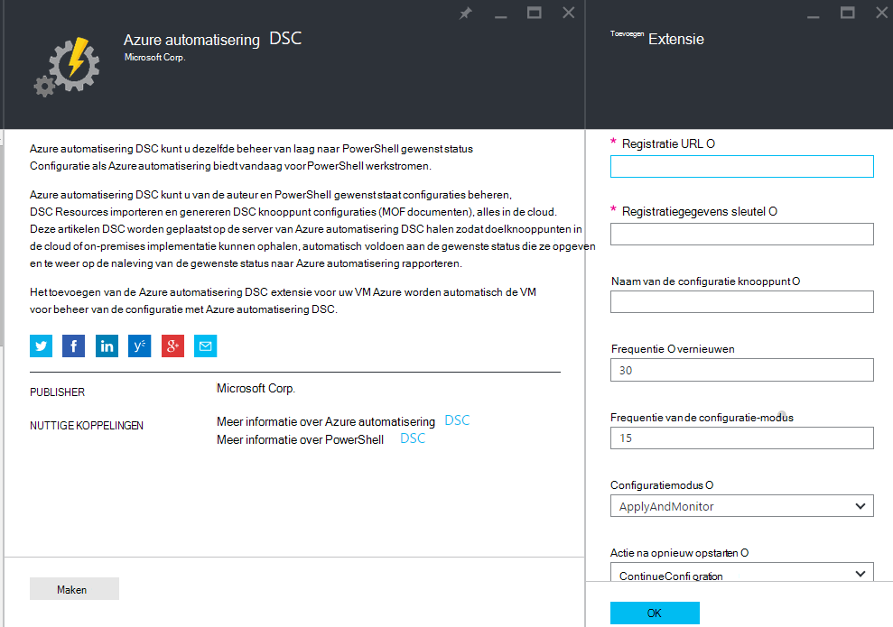
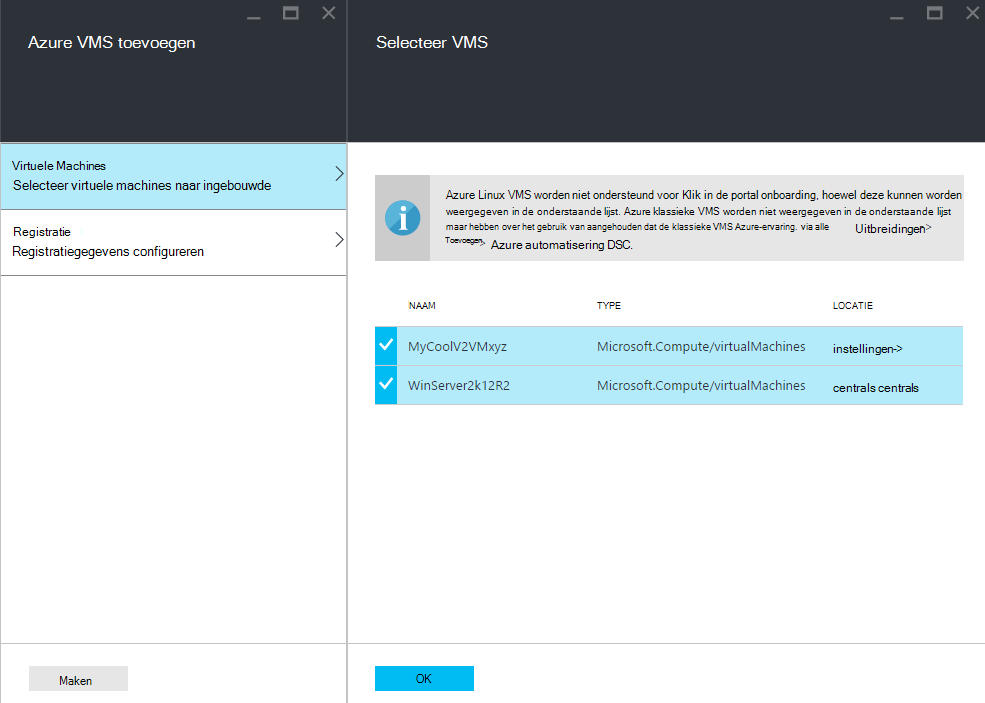
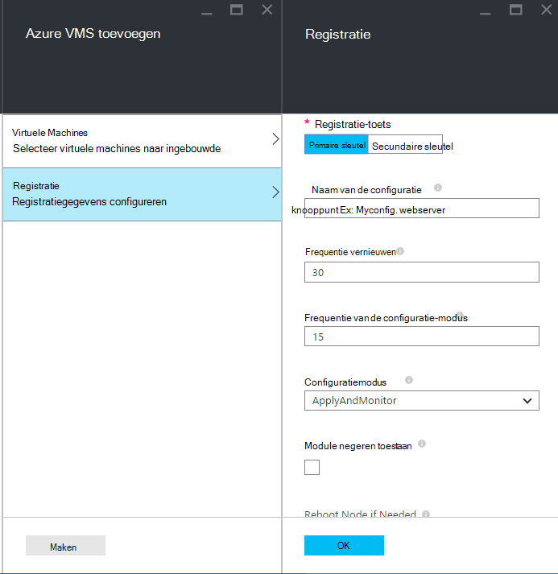
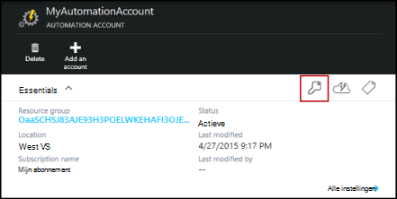
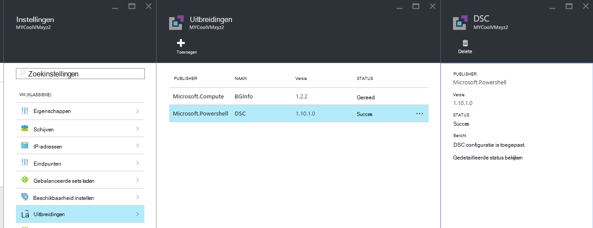

<properties 
   pageTitle="Onboarding fysieke en virtuele machines voor beheer door Azure automatisering DSC | Microsoft Azure" 
   description="Hoe u machines om te beheren met Azure automatisering DSC in te stellen" 
   services="automation" 
   documentationCenter="dev-center-name" 
   authors="coreyp-at-msft" 
   manager="stevenka" 
   editor="tysonn"/>

<tags
   ms.service="automation"
   ms.devlang="NA"
   ms.topic="article"
   ms.tgt_pltfrm="powershell"
   ms.workload="TBD" 
   ms.date="04/22/2016"
   ms.author="coreyp"/>

# Onboarding machines voor beheer door Azure automatisering DSC

## Waarom machines met Azure automatisering DSC beheren?

Zoals [PowerShell gewenst staat configuratie](https://technet.microsoft.com/library/dn249912.aspx)is de configuratie van Azure automatisering gewenst een eenvoudige, maar krachtige, configuratie management service voor DSC knooppunten (fysieke en virtuele machines) in een datacenter cloud of on-premises. Kunt schaalbaarheid in duizenden machines snel en gemakkelijk vanaf een centrale, veilige locatie. U kunt eenvoudig ingebouwde machines, toewijzen ze declaratieve configuraties en rapporten weergeven met elk van de computer bevindt zich naleving naar de gewenste status die u hebt opgegeven. De laag met Azure automatisering DSC management is naar DSC wat de laag met Azure automatisering management is PowerShell-scripts. Met andere woorden, op dezelfde manier als Azure automatisering helpt u PowerShell-scripts te beheren, is het ook handig u DSC configuraties beheren. Zie [overzicht van de Azure automatisering DSC](automation-dsc-overview.md)meer informatie over de voordelen van het gebruik van Azure automatisering DSC. 

Azure automatisering DSC kan worden gebruikt voor het beheren van diverse computers:

*    Azure virtuele machines (klassieke)
*    Azure virtuele machines
*    Amazon Web Services (AWS) virtuele machines
*    Windows fysieke/virtuele machines on-premises of in een wolk dan Azure/AWS
*    Linux fysieke/virtuele machines on-premises in Azure wordt aangegeven of in een wolk dan Azure

Bovendien als u niet wilt systeemconfiguratie beheren vanuit de cloud, kunnen Azure automatisering DSC ook worden gebruikt als een rapport alleen-lezen-eindpunt. Hiermee kunt u de gewenste configuratie (push) tot en met DSC on-premises implementatie en details van een uitgebreide rapportage knooppunt dat voldoet aan de gewenste status in Azure automatisering weergeven.

De volgende gedeelten hoe kunt u boord verschillende soorten machine naar Azure automatisering DSC.

## Azure virtuele machines (klassieke)

Met Azure automatisering DSC kunt u eenvoudig ingebouwde Azure virtuele machines (klassieke) voor het beheer van de configuratie met de portal van Azure of PowerShell. Geavanceerde instellingen weergeven en zonder een beheerder in de VM externe hoeven, registreert de configuratie van Azure VM gewenst extensie de VM met Azure automatisering DSC. Aangezien de configuratie van Azure VM gewenst extensie uitgevoerd asynchroon instructies voor het bijhouden van de voortgang of problemen worden deze in de sectie [**Probleemoplossing Azure virtuele machines onboarding**](#troubleshooting-azure-virtual-machine-onboarding) hieronder gegeven.

### Azure-portal

Klik op **Bladeren**in de [portal van Azure](http://portal.azure.com/) -> **virtuele machines (klassieke)**. Selecteer de gewenste ingebouwde Windows-VM. Klik in de virtuele machine dashboard blade, op **alle instellingen** -> **extensies** -> **toevoegen** -> **Azure automatisering DSC** -> **maken**. Voer de [waarden van de PowerShell DSC lokaal Configuration Manager](https://msdn.microsoft.com/powershell/dsc/metaconfig4) die is vereist voor uw use-case, van uw account automatisering registratiegegevens sleutel en registratie URL, en eventueel een knooppuntconfiguratie toewijzen aan de VM.

Ga voor de registratie account URL en de toets voor de automatisering aan boord de computer, raadpleegt u de sectie [**Secure registratie**](#secure-registration) .

### PowerShell

    # log in to both Azure Service Management and Azure Resource Manager
    Add-AzureAccount
    Add-AzureRmAccount
    
    # fill in correct values for your VM/Automation account here
    $VMName = ""
    $ServiceName = ""
    $AutomationAccountName = ""
    $AutomationAccountResourceGroup = ""

    # fill in the name of a Node Configuration in Azure Automation DSC, for this VM to conform to
    $NodeConfigName = ""

    # get Azure Automation DSC registration info
    $Account = Get-AzureRmAutomationAccount -ResourceGroupName $AutomationAccountResourceGroup -Name $AutomationAccountName
    $RegistrationInfo = $Account | Get-AzureRmAutomationRegistrationInfo

    # use the DSC extension to onboard the VM for management with Azure Automation DSC
    $VM = Get-AzureVM -Name $VMName -ServiceName $ServiceName
    
    $PublicConfiguration = ConvertTo-Json -Depth 8 @{
      SasToken = ""
      ModulesUrl = "https://eus2oaasibizamarketprod1.blob.core.windows.net/automationdscpreview/RegistrationMetaConfigV2.zip"
      ConfigurationFunction = "RegistrationMetaConfigV2.ps1\RegistrationMetaConfigV2"

    # update these PowerShell DSC Local Configuration Manager defaults if they do not match your use case.
    # See https://technet.microsoft.com/library/dn249922.aspx?f=255&MSPPError=-2147217396 for more details
     Properties = @{
        RegistrationKey = @{
          UserName = 'notused'
          Password = 'PrivateSettingsRef:RegistrationKey'
        }
        RegistrationUrl = $RegistrationInfo.Endpoint
        NodeConfigurationName = $NodeConfigName
        ConfigurationMode = "ApplyAndMonitor"
        ConfigurationModeFrequencyMins = 15
        RefreshFrequencyMins = 30
        RebootNodeIfNeeded = $False
        ActionAfterReboot = "ContinueConfiguration"
        AllowModuleOverwrite = $False
      }
    }

    $PrivateConfiguration = ConvertTo-Json -Depth 8 @{
      Items = @{
         RegistrationKey = $RegistrationInfo.PrimaryKey
      }
    }
    
    $VM = Set-AzureVMExtension `
     -VM $vm `
     -Publisher Microsoft.Powershell `
     -ExtensionName DSC `
     -Version 2.19 `
     -PublicConfiguration $PublicConfiguration `
     -PrivateConfiguration $PrivateConfiguration `
     -ForceUpdate

    $VM | Update-AzureVM

## Azure virtuele machines

Azure automatisering DSC kunt u eenvoudig ingebouwde Azure virtuele machines voor het beheer van de configuratie, via de Azure-portal, Azure resourcemanager sjablonen of PowerShell. Geavanceerde instellingen weergeven en zonder een beheerder in de VM externe hoeven, registreert de configuratie van Azure VM gewenst extensie de VM met Azure automatisering DSC. Aangezien de configuratie van Azure VM gewenst extensie uitgevoerd asynchroon instructies voor het bijhouden van de voortgang of problemen worden deze in de sectie [**Probleemoplossing Azure virtuele machines onboarding**](#troubleshooting-azure-virtual-machine-onboarding) hieronder gegeven.

### Azure-portal

Ga naar het gewenste ingebouwde virtuele machines Azure automatisering-account in de [portal van Azure](https://portal.azure.com/). Klik op het dashboard van de account automatisering op **DSC knooppunten** -> **Azure VM toevoegen**.

Selecteer een of meer Azure virtuele machines naar ingebouwde onder **Selecteer virtuele machines naar ingebouwde**.

Voer de [PowerShell DSC lokaal Configuration Manager-waarden](https://msdn.microsoft.com/powershell/dsc/metaconfig4) die is vereist voor uw use-case, en eventueel een knooppuntconfiguratie toewijzen aan de VM onder **registratiegegevens configureren**.

 
### Azure resourcemanager-sjablonen

Azure virtuele machines kan worden geïmplementeerd en onboarded naar Azure automatisering DSC via Azure resourcemanager sjablonen. Zie [een VM via DSC extensie en Azure automatisering DSC configureren](https://azure.microsoft.com/documentation/templates/dsc-extension-azure-automation-pullserver/) voor een van de voorbeeldsjabloon die onboards een bestaande VM naar Azure automatisering DSC. Zoeken naar de registratie-toets en registratie-URL die u hebt gemaakt als invoer in deze sjabloon, raadpleegt u de onderstaande [**Secure registratie**](#secure-registration) sectie.

### PowerShell

De [Register-AzureRmAutomationDscNode](https://msdn.microsoft.com/library/mt603833.aspx) -cmdlet kan worden gebruikt voor ingebouwde virtuele machines in de portal van Azure via PowerShell.

## Amazon Web Services (AWS) virtuele machines

U kunt eenvoudig ingebouwde Amazon Web Services virtuele machines voor het beheer van de configuratie door Azure automatisering DSC de AWS DSC Toolkit gebruiken. U kunt meer informatie over de toolkit [hier](https://blogs.msdn.microsoft.com/powershell/2016/04/20/aws-dsc-toolkit/).

## Windows fysieke/virtuele machines on-premises of in een wolk dan Azure/AWS

On-premises implementatie Windows machines en Windows machines in niet-Azure wolken (zoals Amazon Web Services) is ook onboarded naar Azure automatisering DSC, zo lang maken als ze uitgaande toegang tot internet, via een paar eenvoudige stappen hebben:

1. Zorg ervoor dat de nieuwste versie van [WMF 5](http://aka.ms/wmf5latest) is geïnstalleerd op de gewenste ingebouwde naar Azure automatisering DSC computers.
2. Volg de aanwijzingen in de sectie [**genereren DSC metaconfigurations**](#generating-dsc-metaconfigurations) onderstaande naar een map met de benodigde DSC metaconfigurations genereren.
3. De metaconfiguration PowerShell DSC extern naar de gewenste ingebouwde machines toe te passen. **De computer die deze opdracht is uitgevoerd vanaf de nieuwste versie van [WMF 5](http://aka.ms/wmf5latest) geïnstalleerd moet hebben**:

    `Set-DscLocalConfigurationManager -Path C:\Users\joe\Desktop\DscMetaConfigs -ComputerName MyServer1, MyServer2`

4. Als u niet de metaconfigurations PowerShell DSC extern toepassen, kopieert u de map metaconfigurations uit stap 2 op elke computer naar ingebouwde. Contact opnemen met **Set-DscLocalConfigurationManager** lokaal op elke computer naar ingebouwde.
5. Controleer met het Azure-portal of cmdlets dat de machines naar ingebouwde nu worden weergegeven als DSC knooppunten in uw account Azure automatisering geregistreerd.

## Linux fysieke/virtuele machines on-premises in Azure wordt aangegeven of in een wolk dan Azure

On-premises implementatie Linux machines, computers Linux in Azure wordt aangegeven en Linux machines in niet-Azure wolken ook zijn onboarded naar Azure automatisering DSC, zo lang maken als ze uitgaande toegang tot internet, via een paar eenvoudige stappen hebben:

1. Zorg ervoor dat de nieuwste versie van de [DSC Linux-agent](http://www.microsoft.com/download/details.aspx?id=49150) is geïnstalleerd op de gewenste ingebouwde naar Azure automatisering DSC computers.

2. Als de [PowerShell DSC lokaal Configuration Manager standaardwaarden](https://msdn.microsoft.com/powershell/dsc/metaconfig4) overeenkomen met uw use-case en naar ingebouwde gewenste machines bijvoorbeeld dat zij **de beschikking over zowel rapport aan Azure automatisering DSC** :

    *    Op elke Linux-computer naar ingebouwde naar Azure automatisering DSC, kunt u Register.py naar ingebouwde met de standaardinstellingen PowerShell DSC lokaal Configuration Manager gebruiken:

        `/opt/microsoft/dsc/Scripts/Register.py <Automation account registration key> <Automation account registration URL>`

    *    De registratie-toets en de registratie-URL voor uw account automatisering, Zie de sectie [**Secure registratie**](#secure-registration) .

    Als de PowerShell DSC lokaal Configuration Manager standaard **kan** **geen** overeenkomst uw use-case, of als u ingebouwde machines wilt zodanig dat ze alleen aan Azure automatisering DSC rapport, maar niet halen configuratie of PowerShell modules uitvoeren op deze, voert u de stappen 3 tot en met 6. Ga anders verder verder met stap 6.

3.  Volg de aanwijzingen in de sectie [**genereren DSC metaconfigurations**](#generating-dsc-metaconfigurations) hieronder voor een map met de benodigde DSC metaconfigurations genereren.
4.  Op afstand de PowerShell-DSC metaconfiguration van toepassing op de gewenste ingebouwde machines:
        
        $SecurePass = ConvertTo-SecureString -String "<root password>" -AsPlainText -Force
        $Cred = New-Object System.Management.Automation.PSCredential "root", $SecurePass
        $Opt = New-CimSessionOption -UseSsl -SkipCACheck -SkipCNCheck -SkipRevocationCheck

        # need a CimSession for each Linux machine to onboard
        
        $Session = New-CimSession -Credential $Cred -ComputerName <your Linux machine> -Port 5986 -Authentication basic -SessionOption $Opt
        
        Set-DscLocalConfigurationManager -CimSession $Session –Path C:\Users\joe\Desktop\DscMetaConfigs
    
De computer die deze opdracht is uitgevoerd vanaf moet de nieuwste versie van [WMF 5](http://aka.ms/wmf5latest) is geïnstalleerd.

5.  Als u niet de metaconfigurations PowerShell DSC extern, voor elke Linux-computer naar ingebouwde toepassen, kopieert u de metaconfiguration die overeenkomt met dat de computer van de map in stap 5 bij de Linux-computer. Vervolgens bellen `SetDscLocalConfigurationManager.py` lokaal op elke computer Linux gewenste naar ingebouwde naar Azure automatisering DSC:

    `/opt/microsoft/dsc/Scripts/SetDscLocalConfigurationManager.py –configurationmof <path to metaconfiguration file>`

6.  Controleer met het Azure-portal of cmdlets dat de machines naar ingebouwde nu worden weergegeven als DSC knooppunten in uw account Azure automatisering geregistreerd.

##DSC metaconfigurations genereren
Generieke ingebouwde elke computer Azure automatisering DSC, een metaconfiguration DSC kan worden gegenereerd die, wanneer ze worden toegepast, de DSC-agent worden vermeld op de computer met de beschikking over/of rapport aan Azure automatisering DSC. DSC metaconfigurations voor Azure automatisering DSC kunnen worden gegenereerd met een PowerShell DSC-configuratie, of de Azure automatisering PowerShell-cmdlets.

**Notitie:** DSC metaconfigurations bevatten de geheimen nodig naar ingebouwde een computer naar een automatisering-account om te beheren. Zorg ervoor dat goed beveiligen met een DSC metaconfigurations die u hebt gemaakt, of verwijder deze na gebruik.

###Een DSC-configuratie
1.  Open de PowerShell ISE als een beheerder in een machine in uw lokale omgeving. De computer moet de nieuwste versie van [WMF 5](http://aka.ms/wmf5latest) is geïnstalleerd.

2.  Kopieer het script lokaal. Dit script bevat een PowerShell DSC-configuratie voor het maken van metaconfigurations en een opdracht op de aanmaakdatum metaconfiguration gang.
    
        # The DSC configuration that will generate metaconfigurations
        [DscLocalConfigurationManager()]
        Configuration DscMetaConfigs 
        { 
            param 
            ( 
                [Parameter(Mandatory=$True)] 
                [String]$RegistrationUrl,
         
                [Parameter(Mandatory=$True)] 
                [String]$RegistrationKey,

                [Parameter(Mandatory=$True)] 
                [String[]]$ComputerName,

                [Int]$RefreshFrequencyMins = 30, 
            
                [Int]$ConfigurationModeFrequencyMins = 15, 
            
                [String]$ConfigurationMode = "ApplyAndMonitor", 
            
                [String]$NodeConfigurationName,

                [Boolean]$RebootNodeIfNeeded= $False,

                [String]$ActionAfterReboot = "ContinueConfiguration",

                [Boolean]$AllowModuleOverwrite = $False,

                [Boolean]$ReportOnly
            )

    
            if(!$NodeConfigurationName -or $NodeConfigurationName -eq "") 
            { 
                $ConfigurationNames = $null 
            } 
            else 
            { 
                $ConfigurationNames = @($NodeConfigurationName) 
            }

            if($ReportOnly)
            {
               $RefreshMode = "PUSH"
            }
            else
            {
               $RefreshMode = "PULL"
            }

            Node $ComputerName
            {

                Settings 
                { 
                    RefreshFrequencyMins = $RefreshFrequencyMins 
                    RefreshMode = $RefreshMode 
                    ConfigurationMode = $ConfigurationMode 
                    AllowModuleOverwrite = $AllowModuleOverwrite 
                    RebootNodeIfNeeded = $RebootNodeIfNeeded 
                    ActionAfterReboot = $ActionAfterReboot 
                    ConfigurationModeFrequencyMins = $ConfigurationModeFrequencyMins 
                }

                if(!$ReportOnly)
                {
                   ConfigurationRepositoryWeb AzureAutomationDSC 
                    { 
                        ServerUrl = $RegistrationUrl 
                        RegistrationKey = $RegistrationKey 
                        ConfigurationNames = $ConfigurationNames 
                    }

                    ResourceRepositoryWeb AzureAutomationDSC 
                    { 
                       ServerUrl = $RegistrationUrl 
                       RegistrationKey = $RegistrationKey 
                    }
                }

                ReportServerWeb AzureAutomationDSC 
                { 
                    ServerUrl = $RegistrationUrl 
                    RegistrationKey = $RegistrationKey 
                }
            } 
        }
        
        # Create the metaconfigurations
        # TODO: edit the below as needed for your use case
        $Params = @{
             RegistrationUrl = '<fill me in>';
             RegistrationKey = '<fill me in>';
             ComputerName = @('<some VM to onboard>', '<some other VM to onboard>');
             NodeConfigurationName = 'SimpleConfig.webserver';
             RefreshFrequencyMins = 30;
             ConfigurationModeFrequencyMins = 15;
             RebootNodeIfNeeded = $False;
             AllowModuleOverwrite = $False;
             ConfigurationMode = 'ApplyAndMonitor';
             ActionAfterReboot = 'ContinueConfiguration';
             ReportOnly = $False;  # Set to $True to have machines only report to AA DSC but not pull from it
        }
        
        # Use PowerShell splatting to pass parameters to the DSC configuration being invoked
        # For more info about splatting, run: Get-Help -Name about_Splatting
        DscMetaConfigs @Params

3.  Vul de registratie-toets en de URL in voor uw account automatisering, evenals de namen van de ingebouwde computers. Alle andere parameters zijn optioneel. De registratie-toets en de registratie-URL voor uw account automatisering, Zie de sectie [**Secure registratie**](#secure-registration) .

4.  Als u wilt dat de machines DSC statusinformatie naar Azure automatisering DSC melden, maar niet halen configuratie of PowerShell modules, moet u de parameter **ReportOnly** ingesteld op waar.

5.  Het script uitvoeren. U hebt nu een map genaamd **DscMetaConfigs** in uw werkmap met de PowerShell-DSC metaconfigurations voor de machines naar ingebouwde.

###Gebruik de cmdlets Azure automatisering
Als de standaardinstellingen PowerShell DSC lokaal Configuration Manager overeenkomen met uw use-case en u ingebouwde machines wilt zodanig dat ze de beschikking over zowel aan Azure automatisering DSC rapport, bieden de cmdlets Azure Automatisering een vereenvoudigde methode voor het genereren van de DSC metaconfigurations nodig:

1.  Open de PowerShell-console of PowerShell ISE als een beheerder in een machine in uw lokale omgeving.

2.  Verbinding maken naar Azure resourcemanager **Toevoegen-AzureRmAccount** gebruiken

3.  De PowerShell-DSC metaconfigurations voor de gewenste machines naar ingebouwde downloaden vanuit de automatisering account waaraan u ingebouwde knooppunten wilt:

        # Define the parameters for Get-AzureRmAutomationDscOnboardingMetaconfig using PowerShell Splatting
        $Params = @{
            ResourceGroupName = 'ContosoResources'; # The name of the ARM Resource Group that contains your Azure Automation Account
            AutomationAccountName = 'ContosoAutomation'; # The name of the Azure Automation Account where you want a node on-boarded to
            ComputerName = @('web01', 'web02', 'sql01'); # The names of the computers that the meta configuration will be generated for
            OutputFolder = "$env:UserProfile\Desktop\";
        }
        
        # Use PowerShell splatting to pass parameters to the Azure Automation cmdlet being invoked
        # For more info about splatting, run: Get-Help -Name about_Splatting
        Get-AzureRmAutomationDscOnboardingMetaconfig @Params

U hebt nu een map genaamd ***DscMetaConfigs***, met de PowerShell-DSC metaconfigurations voor de machines naar ingebouwde.

##Registratie Secure

Machines kunnen veilig boord bij een account Azure automatisering via het WMF 5 DSC registratie-protocol, waarmee een knooppunt DSC om te verifiëren op een PowerShell DSC V2 halen of rapportage-server (inclusief Azure automatisering DSC). Het knooppunt registreert bij de **Registratie-URL**, verificatie via een **registratiegegevens sleutel**-server. Onderhandel over een unieke certificaat voor dit knooppunt om te verifiëren bij de na serverregistratie tijdens de registratie de DSC knooppunt en DSC halen/Reporting server. Dit proces wordt voorkomen dat onboarded knooppunten uit een die andere bevindt, zoals als een knooppunt is is gehackt imitatie en goed met schadelijke bedoelingen. Na registratie de registratie-toets niet wordt gebruikt voor verificatie opnieuw, en wordt verwijderd uit het knooppunt.

U kunt de gegevens die zijn vereist voor het protocol DSC registratie van het blad **Sleutels beheren** in de portal Azure preview krijgen. Open dit blade door te klikken op het pictogram van de sleutel in het deelvenster **Essentials** voor het account automatisering.

*    Registratie-URL is het veld URL in het blad sleutels beheren.
*    Registratiegegevens sleutel is de primaire sleutel van Access of secundaire toegangstoets in het blad sleutels beheren. Beide sleutel kan worden gebruikt.

De primaire en secundaire toegangstoetsen van een account automatisering kunnen op elk gewenst moment (op het blad **Sleutels beheren** ) worden hersteld om te voorkomen dat toekomstige knooppunt registraties met vorige sleutels voor extra beveiliging.

##Azure virtuele machines onboarding probleemoplossing

Azure automatisering DSC kunt u eenvoudig ingebouwde Azure Windows VMs voor beheer van de configuratie. De configuratie van Azure VM gewenst extensie wordt achter de schermen gebruikt om de VM met Azure automatisering DSC registreren. Aangezien de configuratie van Azure VM gewenst extensie asynchroon uitgevoerd, kunnen de voortgang bijhouden en probleemoplossing bij het uitvoeren van belang zijn. 

>[AZURE.NOTE] Elke methode onboarding een VM van de Windows Azure naar Azure automatisering DSC die met de extensie configuratie van Azure VM gewenst kan duurt maximaal een uur voor het knooppunt om weer te geven afgerond geregistreerd in Azure automatisering. Dit is vanwege de installatie van Windows Management Framework 5.0 op de VM door de uitbreiding Azure VM DSC, die verplicht voor het ingebouwde is de VM naar Azure automatisering DSC.

Als u wilt oplossen of de status van de configuratie van Azure VM gewenst extensie bekijken, in de Azure portal Navigeer naar de VM onboarded wordt en klik vervolgens klikt u op **alle instellingen**-> -> **extensies** -> **DSC**. Voor meer informatie kunt u klikken op **Gedetailleerde status weergeven**.

## Certificaat verval en ruimen

Na een machine registreren als een knooppunt DSC in Azure automatisering DSC, moet u er een aantal redenen waarom moet u mogelijk registreren dat knooppunt in de toekomst zijn:

* Na de registratie onderhandelingen elk knooppunt automatisch een unieke certificaat voor verificatie die na één jaar verloopt. Het PowerShell DSC registratie-protocol kan geen certificaten op dit moment automatisch verlengd wanneer ze verlooptijd, nadert dus u hoeft te registreren van de knooppunten van een jaar later. Zorg ervoor dat elk knooppunt wordt uitgevoerd op de Windows Management Framework 5.0 RTM voordat de nieuwe registratie. Als certificaat voor serververificatie van een knooppunt verloopt en het knooppunt niet is geregistreerd, het knooppunt geen om te communiceren met Azure automatisering en kunnen worden gemarkeerd 'Unresponsive'. Ruimen uitgevoerd 90 dagen of kleiner vanuit de verlooptijd certificaat of op elk gewenst moment na de verlooptijd certificaat zijn ingevoegd om een nieuw certificaat wordt gegenereerd en gebruikt.

* [PowerShell DSC lokaal Configuration Manager-waarden](https://msdn.microsoft.com/powershell/dsc/metaconfig4) die zijn ingesteld tijdens de eerste registratie van het knooppunt, zoals configurationmode in wijzigen. Deze DSC agent waarden kunnen op dit moment alleen worden gewijzigd via ruimen. De enige uitzondering is de configuratie van het knooppunt toegewezen aan het knooppunt--deze kan worden gewijzigd in Azure automatisering DSC rechtstreeks.

Ruimen kan worden uitgevoerd op dezelfde manier die u geregistreerd het knooppunt in eerste instantie met een van de onboarding methoden beschreven in dit document. U hoeft niet te knooppunt van Azure automatisering DSC unregister voordat u deze opnieuw te registreren.

## Verwante artikelen
* [Azure automatisering DSC-overzicht](automation-dsc-overview.md)
* [Azure automatisering DSC-cmdlets](https://msdn.microsoft.com/library/mt244122.aspx)
* [Azure automatisering DSC prijzen](https://azure.microsoft.com/pricing/details/automation/)

