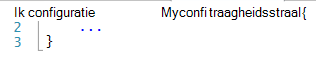
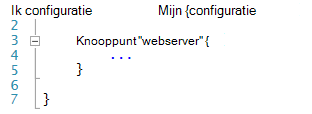
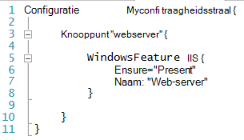
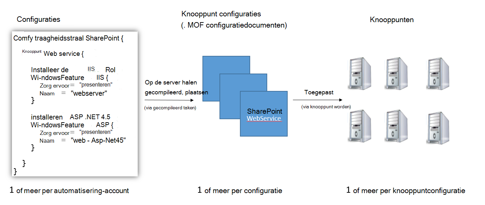
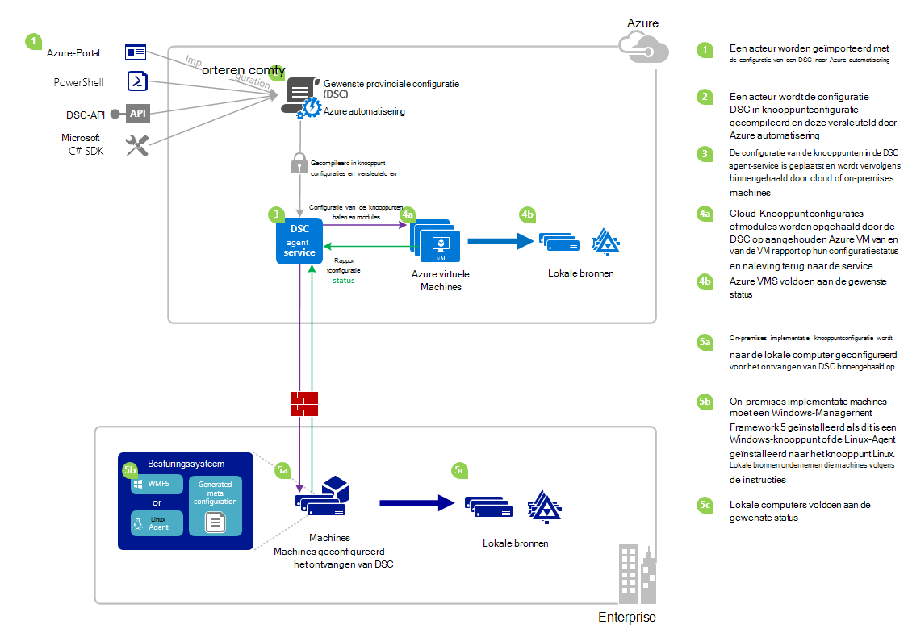

<properties 
   pageTitle="Overzicht van Azure automatisering DSC | Microsoft Azure" 
   description="Een overzicht van Azure automatisering gewenst staat configuratie (DSC), de voorwaarden en bekende problemen" 
   services="automation" 
   documentationCenter="dev-center-name" 
   authors="coreyp-at-msft" 
   manager="stevenka" 
   editor="tysonn"
   keywords="PowerShell dsc, configuratie van de gewenste status, powershell dsc azure"/>

<tags
   ms.service="automation"
   ms.devlang="NA"
   ms.topic="article"
   ms.tgt_pltfrm="powershell"
   ms.workload="TBD" 
   ms.date="05/10/2016"
   ms.author="magoedte;coreyp"/>

# Overzicht van Azure automatisering DSC #

##Wat is Azure automatisering DSC?##
Implementeert en onderhouden van de gewenste status van uw servers en de toepassing resources kunnen worden vervelende en fout vatbaar. Met Azure automatisering gewenste staat configuratie (DSC), kunt u consistente implementeren, betrouwbaar controleren en automatisch bijwerken de gewenste status van alle uw IT-medewerkers, bij het op schaal vanuit de cloud. Gebaseerd op PowerShell DSC en kunt automatisering DSC configuratie van de computer met een specifieke staat over fysieke en virtuele machines (VMs), met behulp van Windows of Linux, en klik in de cloud of on-premises implementatie uitlijnen. U kunt continue IT-services bezorging met consistente besturingselement inschakelen en snelle wijzigen beheren binnen uw heterogene hybride IT-omgeving met gemak.

Azure automatisering DSC genereert boven aan de basisprincipes geïntroduceerd in PowerShell DSC een nog gemakkelijker configuratie management ervaring te bieden. Azure automatisering DSC kunt u dezelfde management laag [PowerShell gewenst staat](https://msdn.microsoft.com/powershell/dsc/overview) configuratie zoals Azure automatisering biedt voor PowerShell-scripts vandaag.

Azure automatisering DSC kunt u [inhoud maken en beheren van PowerShell gewenst staat configuraties](https://technet.microsoft.com/library/dn249918.aspx), [DSC Resources](https://technet.microsoft.com/library/dn282125.aspx)importeren en genereren DSC knooppunt configuraties (MOF documenten), alles in de cloud. Deze artikelen DSC worden geplaatst op de Azure automatisering [DSC halen server](https://technet.microsoft.com/library/dn249913.aspx) zodat knooppunten van de doeltoepassing (zoals fysieke en virtuele machines) in de cloud of on-premises implementatie kunnen ophalen, automatisch voldoen aan de gewenste status die ze opgeven en te weer op de naleving van de gewenste status naar Azure automatisering rapporteren.

Wilt u bekijken om te lezen? Bekijk de onderstaande video van mei 2015 verlengt, wanneer Azure automatisering DSC voor het eerst is aangekondigd. **Notitie:** Terwijl de begrippen en de levenscyclus van besproken in deze video juist zijn, zich Azure automatisering DSC veel aangezien deze video is opgenomen. Dit is nu algemeen beschikbaar, bevat een veel uitgebreidere gebruikersinterface in de portal van Azure en veel meer mogelijkheden ondersteunt.

> [AZURE.VIDEO microsoft-ignite-2015-heterogeneous-configuration-management-using-microsoft-azure-automation]

## Azure automatisering DSC termen ##
### Configuratie ###
PowerShell DSC geïntroduceerd een nieuw concept configuraties genoemd. Configuraties kunnen u definieert, via PowerShell-syntaxis van de gewenste status van uw omgeving. Als u wilt gebruiken DSC voor het configureren van uw omgeving, eerst een Windows PowerShell-script-blok met het sleutelwoord configuratie definiëren en voert u deze met een id in, klik met de accolades ({}) om af te bakenen de blokkering.

U kunt binnen het configuratie-blok knooppunt configuratie blokken die Geef de gewenste configuratie voor een reeks knooppunten (computers) in uw omgeving die moeten worden geconfigureerd precies hetzelfde definiëren. Op deze manier vertegenwoordigt een knooppuntconfiguratie een 'rol' voor een of meer knooppunten te nemen. Een tekstblok van de configuratie knooppunt begint met het trefwoord knooppunt. Volg dit sleutelwoord met de naam van de rol, een variabele of expressie zijn kan. Gebruik de accolades om af te bakenen de blokkering van de configuratie knooppunt na de rolnaam van de.

 
U kunt binnen de blokkering van de configuratie knooppunt resource blokken om te configureren specifieke DSC resources definiëren. Een tekstblok resource begint met de naam van de resource, gevolgd door de id die u wilt opgeven voor dat blok en vervolgens accolades {} om te scheiden van de blokkering.

Voor meer informatie over het trefwoord configuratie gedetailleerde, Zie: [Wat configuratie trefwoord in staat configuratie gewenst](http://blogs.msdn.com/b/powershell/archive/2013/11/05/understanding-configuration-keyword-in-desired-state-configuration.aspx "Inzicht configuratie trefwoord in gewenst staat configuratie")

Actief (compileren) een DSC-configuratie zijn ingevoegd om een of meer DSC knooppunt configuraties (MOF documenten), die wat DSC knooppunten toepassen op de gewenste status voldoen.

Azure automatisering DSC kunt u importeren, auteur, en compileren DSC configuraties in Azure automatisering, vergelijkbaar met hoe runbooks kunnen worden geïmporteerd, geschreven en de slag met Azure automatisering.

>[AZURE.IMPORTANT] Een configuratie mag slechts één configuratie blok, met dezelfde naam als de configuratie, in Azure automatisering DSC bevatten. 

###Configuratie van knooppunten###

Als een DSC-configuratie is gecompileerd, worden een of meer knooppunt configuraties geproduceerd afhankelijk van het knooppunt blokken in de configuratie. Een knooppuntconfiguratie is hetzelfde als "MOF" of "configuratie document" (als u bekend met deze termen PS DSC bent) en vertegenwoordigt een 'rol,"zoals webserver of werknemer, waarin staat een of meer knooppunten moeten wordt ervan uitgegaan dat of controleren op naleving ten opzichte van de keuze. Namen van knooppunt configuraties in Azure automatisering DSC duren voordat de vorm van "Configuratie Name.NodeConfigurationBlockName".

PS Waarnemen DSC knooppunten knooppunt configuraties die ze via dit DSC push of halen methoden moeten vast. Azure automatisering DSC, is afhankelijk van de methode DSC halen, waar knooppunten knooppunt configuraties voor toepassing van de Azure automatisering DSC server halen. Omdat de knooppunten verzend het verzoek om te Azure automatisering DSC, knooppunten kunnen worden achter een firewall, hebt u alle binnenkomende poorten gesloten, enzovoort. Ze nodig hebben alleen uitgaande toegang tot Internet (rechtstreeks of via een proxyserver).

###Knooppunt###

Een knooppunt DSC is een computer waarop de configuratie beheerd door DSC. Dit kan zijn een Windows- of Linux Azure VM, on-premises implementatie VM / fysieke host of machine in een andere openbare cloud. Knooppunten vast knooppunt configuraties om te worden en voor het behoud van naleving van de gewenste status die ze definiëren en kunnen ook rapport terug naar een reporting server op hun configuratiestatus en naleving versus de gewenste status.

Azure automatisering DSC onboarding van knooppunten voor beheer door Azure automatisering DSC vergemakkelijkt en kunt wijzigen van de configuratie van de knooppunten die zijn toegewezen aan elke knooppunt servers, zodat het knooppunt gecontroleerd op de server voor instructies worden wordt ervan uitgegaan dat een andere rol en hoe deze is geconfigureerd en de status complaince wijzigen wanneer deze moet rapporteren om aan te passen.

###Resource###
DSC resources zijn de bouwstenen die u gebruiken kunt om te definiëren van een Windows PowerShell gewenst staat configuratie (DSC)-configuratie. DSC wordt geleverd voor een reeks ingebouwde resources zoals die voor bestanden en mappen, serverfuncties en rollen, registerinstellingen, omgevingsvariabelen en services en processen. Meer informatie over de volledige lijst met ingebouwde DSC resources en hoe ze worden gebruikt, Zie [Ingebouwde Windows PowerShell gewenst staat configuratie Resources](https://technet.microsoft.com/library/dn249921.aspx).

DSC resources kunnen ook worden geïmporteerd als onderdeel van de PowerShell-Modules voor het uitbreiden van de set ingebouwde DSC resources. Niet-standaard resources worden worden opgevraagd door DSC knooppunten van de server DSC halen, als een knooppuntconfiguratie die is bedoeld als het knooppunt vast verwijzingen naar deze resources bevat. Informatie over het maken van aangepaste resources, Zie [Bouwen aangepaste Windows PowerShell gewenst staat configuratie Resources](https://technet.microsoft.com/library/dn249927.aspx).

Azure automatisering DSC wordt geleverd met dezelfde ingebouwde DSC resources als PS DSC. Aanvullende informatie kunnen worden toegevoegd aan Azure automatisering DSC door deze te importeren met de resources in Azure automatisering PowerShell-modules.

###Gecompileerd taak###
Een taak gecompileerd in Azure automatisering DSC is een exemplaar van compilatie van een configuratie, een of meer knooppunt configuraties maken. Ze zijn vergelijkbaar met Azure automatisering runbook taken, behalve dat ze een taak behalve als u wilt maken van een knooppunt configuraties niet werkelijk uitvoeren. Gemaakt door een taak gecompileerd knooppunt configuraties automatisch op de server van Azure automatisering DSC halen worden geplaatst en eerdere versies van knooppunt configuraties overschrijven als ze bestaan voor deze configuratie. De naam van de configuratie van een knooppunt geproduceerd door een taak gecompileerd heeft de vorm van "ConfigurationName.NodeConfigurationBlockName". Bijvoorbeeld compileren de onder configuratie resulteert een configuratie met één knooppunt 'MyConfiguration.webserver' genoemd

>[AZURE.NOTE] Net als runbooks, kunnen configuraties worden gepubliceerd. Dit is niet zijn gerelateerd aan het plaatsen van DSC objecten op de server van Azure automatisering DSC halen. Gecompileerd taken veroorzaken DSC items moet worden geplaatst op de server van Azure automatisering DSC halen. Zie [publiceren van een Runbook](https://msdn.microsoft.com/library/dn903765.aspx)voor meer informatie over "publiceren' in Azure automatisering.

##Azure automatisering DSC LifeCycle##
Een reeks processen voor het definiëren van configuraties, deze configuraties in knooppunt configuraties en onboarding knooppunten Azure automatisering DSC en deze configuraties knooppunt schakelen heeft betrekking op naar een beheerde reeks correct geconfigureerde knooppunten van een lege automatisering-account te gaan. In het volgende diagram ziet u de levenscyclus van Azure automatisering DSC:

De volgende afbeelding ziet u gedetailleerde stapsgewijze proces in de levenscyclus van DSC. Het bevat verschillende manieren een configuratie is geïmporteerd en toegepast op knooppunten in Azure automatisering, onderdelen die vereist zijn voor een lokale computer om DSC en interacties tussen de verschillende onderdelen te ondersteunen. 

     

##Weetjes / bekende problemen:##

- Bij een upgrade naar het WMF 5 RTM, als de computer al is geregistreerd als een knooppunt in Azure automatisering DSC, deze uit Azure automatisering DSC unregister en deze opnieuw te registreren na de upgrade de WMF-5 RTM.

- Azure automatisering DSC biedt geen ondersteuning voor gedeeltelijke of samengestelde DSC configuraties op dit moment. DSC samengestelde bronnen kunnen echter worden geïmporteerd en gebruikt in Azure automatisering DSC configuraties net zoals in de lokale PowerShell, configuratie hergebruik inschakelen.

- De meest recente versie van WMF 5 moet zijn geïnstalleerd voor de PowerShell-DSC-agent voor Windows kunnen communiceren met Azure automatisering. De nieuwste versie van de PowerShell-DSC-agent voor Linux moet zijn geïnstalleerd voor Linux moeten kunnen communiceren met Azure automatisering.

- De traditionele PowerShell DSC halen server verwacht module bericht wordt nu om te worden geplaatst op de server halen in de indeling **ModuleName_Version.zip "**. Azure automatisering verwacht PowerShell modules moeten worden geïmporteerd met namen in de vorm van **ModuleName.zip**. Zie [dit blogbericht](https://azure.microsoft.com/blog/2014/12/15/authoring-integration-modules-for-azure-automation/) voor meer informatie over de integratiemodule-indeling die nodig zijn voor het importeren van de module in Azure automatisering. 

- PowerShell-modules die zijn geïmporteerd in Azure automatisering mogen geen .doc of DOCX-bestanden bevatten. Sommige PowerShell-modules DSC resources met bevatten deze bestanden, voor help doeleinden. Deze bestanden moeten worden verwijderd uit modules, vóór het importeren van Azure automatisering.

- Wanneer een knooppunt eerst met een account Azure automatisering is geregistreerd of het knooppunt wordt aangepast worden toegewezen aan een ander knooppunt configuratie serverzijde, zijn de status 'Compatibel', zelfs als de status van het knooppunt niet daadwerkelijk compatibel is met de configuratie van het knooppunt die is nu toegewezen is aan. Nadat het knooppunt de eerste halen voert en stuurt de eerste rapport na registratie of een wijziging in de toewijzing voor knooppunt-configuratie, is de status van het knooppunt kan worden vertrouwd.

- Wanneer een VM van de Windows Azure voor beheer door Azure automatisering DSC met een van onze methoden rechtstreekse onboarding onboarding, deze kan duurt maximaal een uur voor de VM weergeven als een knooppunt DSC in Azure automatisering. Dit is vanwege de installatie van Windows Management Framework 5.0 op de VM door de uitbreiding Azure VM DSC, die verplicht voor het ingebouwde is de VM naar Azure automatisering DSC.

- Na de registratie onderhandelingen elk knooppunt automatisch een unieke certificaat voor verificatie die na één jaar verloopt. Op dit moment kan vernieuwen geen het PowerShell DSC registratie-protocol automatisch certificaten wanneer ze verlooptijd, nadert dus u hoeft te registreren van de knooppunten van een jaar later. Zorg ervoor dat elk knooppunt wordt uitgevoerd op de Windows Management Framework 5.0 RTM voordat de nieuwe registratie. Als certificaat voor serververificatie van een knooppunt verloopt en het knooppunt niet is geregistreerd, het knooppunt geen om te communiceren met Azure automatisering en kunnen worden gemarkeerd 'Unresponsive'. Ruimen wordt uitgevoerd op dezelfde manier als die u het knooppunt in eerste instantie hebt geregistreerd. Ruimen uitgevoerd 90 dagen of kleiner vanuit de verlooptijd certificaat of op elk gewenst moment na de verlooptijd certificaat zijn ingevoegd om een nieuw certificaat wordt gegenereerd en gebruikt.

- Bij een upgrade naar het WMF 5 RTM, als de computer al is geregistreerd als een knooppunt in Azure automatisering DSC, deze uit Azure automatisering DSC unregister en deze opnieuw te registreren na de upgrade de WMF-5 RTM. Voordat u opnieuw te registreren, het $env:windir\system32\configuration\DSCEngineCache.mof-bestand te verwijderen.

- DSC PowerShell-cmdlets werkt mogelijk niet als WMF 5 RTM boven aan de WMF 5 productie Preview is geïnstalleerd. U lost dit op, voer de volgende opdracht in een verhoogde PowerShell-sessie (als administrator uitvoeren):`mofcomp $env:windir\system32\wbem\DscCoreConfProv.mof`
 

##Verwante artikelen##

- [Onboarding machines voor beheer door Azure automatisering DSC] (.. /Automation/Automation-DSC-onboarding.MD)
- [Compileren configuraties in Azure automatisering DSC] (.. /Automation/Automation-DSC-Compile.MD)
- [Azure automatisering DSC cmdlets] (https://msdn.microsoft.com/library/mt244122.aspx)
- [Azure automatisering DSC prijzen] (https://azure.microsoft.com/pricing/details/automation/)
- [Continue implementatie naar IaaS VMs met Azure automatisering DSC en Chocolatey] (automatisering-dsc-cd-chocolatey.md)
