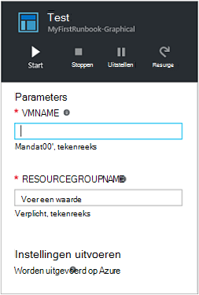

<properties
    pageTitle="Mijn eerste grafische runbook in Azure automatisering | Microsoft Azure"
    description="Zelfstudie dat u tijdens het maken begeleidt, testen en publiceren van een eenvoudige grafische runbook."
    services="automation"
    documentationCenter=""
    authors="mgoedtel"
    manager="jwhit"
    editor=""
    keywords="runbook, runbook sjabloon, runbook automatisering, azure runbook"/>
<tags
    ms.service="automation"
    ms.workload="tbd"
    ms.tgt_pltfrm="na"
    ms.devlang="na"
    ms.topic="get-started-article"
    ms.date="07/06/2016"
    ms.author="magoedte;bwren"/>

# <a name="my-first-graphical-runbook"></a>Mijn eerste grafische runbook

> [AZURE.SELECTOR] - [Grafische](automation-first-runbook-graphical.md) - [PowerShell](automation-first-runbook-textual-PowerShell.md) - [PowerShell-werkstroom](automation-first-runbook-textual.md)

Deze zelfstudie begeleidt u bij het maken van een [grafische runbook](automation-runbook-types.md#graphical-runbooks) in Azure automatisering.  We beginnen met een eenvoudige runbook die we testen en publiceren terwijl we wordt uitgelegd hoe u de status van de taak runbook bijhouden.  We wordt wijzigt u het runbook als u wilt dat is wel beheren Azure resources, in dit geval starten een Azure virtuele machines.  We vervolgens maken het runbook krachtiger door het runbook parameters en voorwaardelijke koppelingen toe te voegen.

## <a name="prerequisites"></a>Vereisten voor

Als u wilt deze zelfstudie hebt voltooid, moet u het volgende.

-   Azure-abonnement.  Als u een nog niet hebt, kunt u [de voordelen van uw MSDN-abonnee activeren](https://azure.microsoft.com/pricing/member-offers/msdn-benefits-details/) of <a href="/pricing/free-account/" target="_blank"> [registreren voor een gratis-account](https://azure.microsoft.com/free/).
-   [Azure uitvoeren als Account](automation-sec-configure-azure-runas-account.md) houdt van het runbook en geverifieerd bij Azure bronnen.  Dit account moet gemachtigd zijn om te starten en stoppen de virtuele machine.
-   Een Azure virtuele machines.  We stoppen en start deze computer, zodat deze niet productie moet worden.


## <a name="step-1---create-new-runbook"></a>Stap 1: maken van nieuwe runbook

We beginnen door te maken van een eenvoudige runbook dat de tekst *Hallo allemaal*oplevert.

1.  Klik in de Portal Azure uw automatisering-account te openen.  
    De accountpagina automatisering geeft u een snelle weergave van de informatiebronnen in dit account.  U moet bepaalde activa al hebt.  De meeste van de gebruikers zijn de modules die automatisch zijn opgenomen in een nieuw account voor automatisering.  U moet ook de referentie-activa dat wordt vermeld in de [vereisten](#prerequisites)hebben.
2.  Klik op de tegel **Runbooks** om de lijst van runbooks te openen.<br> 
3.  Maak een nieuwe runbook door te klikken op de knop **toevoegen een runbook** en vervolgens **een nieuwe runbook maken**.
4.  Geef het runbook de *MyFirstRunbook-grafische*naam.
5.  In dit geval gaan we maken van een [grafische runbook](automation-graphical-authoring-intro.md) dus selecteer **grafische** voor **Runbook type**.<br> <br>
6.  Klik op **maken** voor het maken van het runbook en de grafische editor openen.

## <a name="step-2---add-activities-to-the-runbook"></a>Stap 2: activiteiten toevoegen aan het runbook

Het besturingselement bibliotheek aan de linkerkant van de editor kunt u activiteiten toevoegen aan uw runbook selecteren.  Gaan we een **Schrijven-uitvoer** cmdlet uitvoeren van de tekst van het runbook toevoegen.

1.  In de bibliotheek, klikt u in het tekstvak zoeken en typ **Schrijven-uitvoer**.  Onder de lijst met zoekresultaten weergegeven. <br> 
2.  Schuif omlaag naar de onderkant van de lijst.  U kunt de **Schrijven-uitvoer** met de rechtermuisknop op en selecteer **toevoegen aan tekenpapier** of klik op de ellips naast de cmdlet en selecteer vervolgens **toevoegen aan canvas**.
3.  Klik op de activiteit **Schrijven-uitvoer** op het canvas.  Hiermee opent u het blad voor het beheer van configuratie waarmee u de activiteit configureren.
4.  De knop met het **Label** op de naam van de cmdlet, maar we kunt wijzigen in iets meer beschrijvende. Dit veranderen *Schrijven Hallo allemaal om uit te voeren*.
5.  Klik op **Parameters** om aan te bieden waarden voor de cmdlet van parameters.  
    Sommige cmdlets sets met meerdere parameters hebt en u wilt selecteren die u wilt gebruiken. In dit geval heeft **Schrijven-uitvoer** slechts één parameter is ingesteld, zodat u niet nodig hebt om een te selecteren. <br> 
6.  Selecteer de parameter **InputObject** .  Dit is de parameter waarop we de tekst te verzenden naar de stream uitvoer wordt opgeven.
7.  Selecteer in de vervolgkeuzelijst **gegevensbron** **PowerShell-expressie**.  De vervolgkeuzelijst van de **gegevensbron** bevat verschillende gegevensbronnen waarmee u kunt een parameterwaarde vullen.  
    U kunt de uitvoer van dergelijke bronnen zoals een andere activiteit, activa automatisering of een PowerShell-expressie.  In dit geval wilt we alleen weergeven van de tekst *Hallo allemaal*. We kunnen een PowerShell-expressie gebruiken en geef een tekenreeks.
8.  Typ *"Hallo wereld"* en klik op **OK** tweemaal om terug te keren naar het tekenpapier in het vak **expressie** .<br> 
9.  Sla het runbook door te klikken op **Opslaan**.<br> 

## <a name="step-3---test-the-runbook"></a>Stap 3: het runbook testen

Voordat we het runbook zodat deze beschikbaar is in productie publiceert, willen we testen om ervoor te zorgen dat het goed werkt.  Wanneer u een runbook test, kunt u **de conceptversie** uitvoeren en de uitvoer interactief weergeven.

1.  Klik op **deelvenster testen** om te openen van het blad Test.<br> 
2.  Klik op **Start** de test wilt starten.  Dit moet de enige optie is ingeschakeld.
3.  Een [runbook taak](automation-runbook-execution.md) is gemaakt en de status ervan weergegeven in het deelvenster.  
    De taakstatus wordt als *in wachtrij* dat aangeeft dat er een werknemer runbook in de cloud beschikbaar wordt gewacht gestart.  Dit gaat vervolgens naar *begint* wanneer een werknemer vorderingen de taak en vervolgens *actief* zodra het runbook daadwerkelijk gaat werken.  
4.  Als de taak runbook is voltooid, wordt de uitvoer wordt weergegeven. In ons hoofdletters/kleine letters zien we *Hallo allemaal*.<br> 
5.  Sluit het blad testen om terug te keren naar het canvas.

## <a name="step-4---publish-and-start-the-runbook"></a>Stap 4 - publiceren en het runbook starten

Het runbook die we zojuist hebt gemaakt, is nog steeds in de modus concept. Moeten we uw project publiceren voordat we kan worden uitgevoerd in productie.  Wanneer u een runbook publiceert, kunt u de bestaande Published versie overschrijven met de conceptversie.  In ons geval we nog geen hebt een gepubliceerde versie omdat we het runbook voor het zojuist hebt gemaakt.

1.  Klik op **publiceren** naar het runbook publiceren en klik vervolgens **Ja** wanneer u wordt gevraagd.<br> 
2.  Als u naar links om weer te geven van het runbook in het blad **Runbooks** schuift, wordt een **Authoring Status** van **Published**weergegeven.
3.  Ga terug naar rechts om te bekijken van het blad voor **MyFirstRunbook**.  
    De opties aan de bovenkant kunnen we het runbook starten, plannen om te beginnen bij enige tijd in de toekomst of een [webhook](automation-webhooks.md) maken, zodat deze kan worden gestart door een HTTP-oproep.
4.  We zojuist wilt starten van het runbook dus klikt u op **Start** en vervolgens op **Ja** wanneer u wordt gevraagd.<br> 
5.  Een taak blade wordt geopend voor de taak runbook die we zojuist hebt gemaakt.  We dit blade kunt sluiten, maar in dit geval we laten deze open zodat we de voortgang van het project kunt bekijken.
6.  De taakstatus wordt weergegeven in het **Overzicht van de taak** en komt overeen met de statussen die u hebt gezien wanneer we het runbook getest.<br> 
7.  Zodra de status van het runbook *voltooid ziet*, klikt u op **uitvoer**. Het blad **uitvoer** wordt geopend en kunnen we onze *Hallo allemaal* in het deelvenster zien.<br>   
8.  Sluit het blad uitvoer.
9.  Klik op **Alle logboeken** om te openen van het blad Streams voor de taak runbook.  We alleen *Hallo allemaal* in de stream uitvoer moet zien, maar dit kan worden gevuld met andere streams voor een taak runbook zoals uitgebreid en fout als het runbook gegevens worden geschreven naar deze.<br> 
10. Sluit het blad alle logboeken en het blad taak om terug te keren naar het blad MyFirstRunbook.
11. Klik op **taken** om te openen van het blad taken voor deze runbook.  Hier vindt u alle van de taken die zijn gemaakt door deze runbook. We ziet slechts één taak sinds we de taak slechts eenmaal hebt weergegeven.<br> 
12. U kunt klikken op deze taak om de dezelfde taakdeelvenster die wordt weergegeven wanneer we begonnen met het runbook te openen.  Hiermee kunt u gaat u terug in tijd en de details van een project dat is gemaakt voor een bepaalde runbook bekijken.

## <a name="step-5---create-variable-assets"></a>Stap 5: variabele activa maken

We hebt getest en onze runbook die zijn gepubliceerd, maar dusverre deze iets handig niet doen. Willen we hebben deze Azure bronnen beheren.  Voordat we het runbook om te verifiëren configureert, maakt we een variabele houdt u de abonnements-ID en verwijzen naar nadat we de activiteit om te verifiëren in stap 6 onderstaande instellen.  Een verwijzing naar de context van abonnement, kunt u eenvoudig schakelen tussen meerdere abonnementen.  Voordat u verder gaat, uw abonnements-ID van de optie abonnementen mensen uit het navigatiedeelvenster te kopiëren.  

1. In het blad automatisering Accounts, klikt u op de tegel **activa** en het blad **activa** wordt geopend.
2. Klik in het blad activa op de tegel **variabelen** .
3. Klik op het blad variabelen op **toevoegen een variabele**.<br>
4. Voer **AzureSubscriptionId** in het nieuwe variabele blad, in het vak **naam** en voer in het vak **waarde** uw abonnement.  Houd *tekenreeks* voor het **Type** en de standaardwaarde voor **versleuteling**.  
5. Klik op **maken** om de variabele te maken.  


## <a name="step-6---add-authentication-to-manage-azure-resources"></a>Stap 6: verificatie voor het beheren van Azure resources toevoegen

Nu dat we hebben een variabele hebben onze abonnements-ID voor, kunnen we onze runbook om te verifiëren met de referenties uitvoeren als waarnaar wordt verwezen in de [vereisten](#prerequisites)configureren.  We doen door de Azure uitvoeren als verbinding **activa** en **Toevoegen-AzureRMAccount** cmdlet toe te voegen aan het canvas.  

1.  Open de grafische editor door te klikken op **bewerken** op het blad MyFirstRunbook.<br> 
2.  We niet meer nodig hebt **Schrijven Hallo allemaal om uit te voeren** , dus op de rechtermuisknop en selecteer **verwijderen**.
3.  Vouw van **verbindingen** in de bibliotheek wilt instellen en **AzureRunAsConnection** toevoegen aan het tekenpapier door **toevoegen aan het tekenpapier**te selecteren.
4.  Op het canvas **AzureRunAsConnection** Selecteer en typ in het deelvenster van het besturingselement configuratie **Uitvoeren als verbinding ophalen** in het tekstvak **Label** .  Dit is de verbinding 
5.  Typ in het besturingselement bibliotheek **Toevoegen-AzureRmAccount** in het tekstvak zoeken.
6.  **Toevoegen-AzureRmAccount** toevoegen aan het canvas.<br> 
7.  Plaats de muisaanwijzer op **Uitvoeren als verbinding krijgen** totdat een cirkel wordt weergegeven op de onderkant van de vorm. Klik op de cirkel en sleep de pijl naar **Toevoegen-AzureRmAccount**.  De pijl die u zojuist hebt gemaakt, wordt een *koppeling*.  Het runbook wordt beginnen met **Krijgen uitvoeren als verbinding** en voer vervolgens **Toevoegen-AzureRmAccount**.<br> 
8.  Selecteer **Toevoegen-AzureRmAccount** en in de configuratie te beheren deelvenster type, **Meld u aan bij Azure** in het tekstvak **Label** op het canvas.
9.  Klik op **Parameters** en de activiteit Parameter configuratie blade wordt weergegeven. 
10.  **Toevoegen-AzureRmAccount** heeft sets met meerdere parameters, dus we een selecteren moeten voordat we parameterwaarden kunnen geven.  Klik op **Parameter instellen** en selecteer vervolgens het instellen van de parameter **ServicePrincipalCertificate** . 
11.  Zodra u de parameter ingesteld inschakelt, worden de parameters worden weergegeven in het blad activiteit Parameter configuratie.  Klik op **APPLICATIONID**.<br> 
12.  In het blad parameterwaarde **activiteit uitvoer** selecteren voor de **gegevensbron** en selecteer **Uitvoeren als verbinding krijgen** in de lijst in het **veld pad** tekstvak type **ApplicationId**, en klik vervolgens op **OK**.  We geeft de naam van de eigenschap van het veld pad omdat de activiteit Hiermee kunt u een object met meerdere eigenschappen.
13.  Klik op **CERTIFICATETHUMBPRINT**en selecteer in het blad parameterwaarde **activiteit uitvoer** voor de **gegevensbron**.  Selecteer **Uitvoeren als verbinding krijgen** in de lijst in het **veld pad** tekstvak type **CertificateThumbprint**, en klik vervolgens op **OK**. 
14.  **SERVICEPRINCIPAL**, klikt u op en selecteer in het blad parameterwaarde **ConstantValue** voor de **gegevensbron**, klikt u op de optie **waar**en klik vervolgens op **OK**.
15.  Klik op **TENANTID**en selecteer in het blad parameterwaarde **activiteit uitvoer** voor de **gegevensbron**.  Selecteer **Uitvoeren als verbinding krijgen** in de lijst in het **veld pad** tekstvak type **TenantId**, en klik tweemaal op **OK** .  
16.  Typ in het besturingselement bibliotheek **Set-AzureRmContext** in het tekstvak zoeken.
17.  **Set-AzureRmContext** toevoegen aan het canvas.
18.  Selecteer **Set-AzureRmContext** en in de configuratie te beheren deelvenster type **Abonnements-Id opgeven** in het tekstvak **Label** op het canvas.
19.  Klik op **Parameters** en de activiteit Parameter configuratie blade wordt weergegeven. 
20. **Set-AzureRmContext** heeft sets met meerdere parameters, dus we een selecteren moeten voordat we parameterwaarden kunnen geven.  Klik op **Parameter instellen** en selecteer vervolgens het instellen van de parameter **SubscriptionId** .  
21.  Zodra u de parameter ingesteld inschakelt, worden de parameters worden weergegeven in het blad activiteit Parameter configuratie.  Klik op **SubscriptionID**
22.  In het blad parameterwaarde **Variabele activum** selecteren voor de **gegevensbron** en selecteer **AzureSubscriptionId** in de lijst en klik tweemaal op **OK** .   
23.  Plaats de muisaanwijzer op **Login to Azure** totdat een cirkel wordt weergegeven op de onderkant van de vorm. Klik op de cirkel en sleep de pijl naar **Abonnements-Id opgeven**.


Uw runbook ziet er als volgt te werk op dit moment: <br>

## <a name="step-7---add-activity-to-start-a-virtual-machine"></a>Stap 7: activiteit om te starten een virtuele machine toevoegen

Nu gaan we een activiteit in een **Begin-AzureRmVM** om te starten een virtuele machine toevoegen.  U kunt een virtuele machine kiezen in uw Azure-abonnement kunt, en nu we hardcoding die naar de cmdlet een naam geven.

1. Typ in het besturingselement bibliotheek, **Begin-AzureRm** in het tekstvak zoeken.
2. **Start-AzureRmVM** toevoegen aan het tekenpapier en klik vervolgens op en sleept u deze onder **Abonnements-Id opgeven**.
3. Plaats de muisaanwijzer op **Abonnements-Id opgeven** totdat een cirkel wordt weergegeven op de onderkant van de vorm.  Klik op de cirkel en sleep de pijl aan **De slag-AzureRmVM**. 
4.  Selecteer **Start-AzureRmVM**.  Klik op **Parameters** en klik vervolgens **Parameter ingesteld** als wilt bekijken van de paren voor **Start-AzureRmVM**.  Selecteer de **ResourceGroupNameParameterSetName** parameter is ingesteld. Opmerking dat **ResourceGroupName** en **naam** punten uitroepteken naast hebben ze.  Hiermee wordt aangegeven dat ze afkomstig vereiste parameters zijn.  Bedenk ook dat beide tekenreekswaarden verwachten.
5.  Selecteer **naam**.  Selecteer de **PowerShell-expressie** voor de **gegevensbron** en typ de naam van de virtuele machine tussen dubbele aanhalingstekens dat we met deze runbook begint.  Klik op **OK**.<br>
6.  Selecteer **ResourceGroupName**. **PowerShell expressie** gebruiken voor de **gegevensbron** en typ de naam van de resourcegroep tussen dubbele aanhalingstekens.  Klik op **OK**.<br> 
8.  Klik op testen deelvenster zodat we het runbook kunt testen.
9.  Klik op **Start** de test wilt starten.  Zodra deze is voltooid, moet u controleren of de virtuele machine is gestart.

Uw runbook ziet er als volgt te werk op dit moment: <br>

## <a name="step-8---add-additional-input-parameters-to-the-runbook"></a>Stap 8: extra invoerparameters toevoegen aan het runbook

Onze runbook de virtuele machine momenteel in de resourcegroep die is opgegeven in de **Begin-AzureRmVM** -cmdlet wordt gestart, maar onze runbook wordt handiger als we beide opgeven kunt wanneer het runbook wordt gestart.  We wordt nu invoerparameters aan het runbook die functionaliteit toegevoegd.

1. Open de grafische editor door te klikken op **bewerken** in het deelvenster **MyFirstRunbook** .
2. Op **invoer en uitvoer** en klik vervolgens **invoer toevoegen** om het deelvenster Runbook invoerparameter te openen.<br> 
3. Geef *VMName* voor de **naam**.  *Tekenreeks* behouden voor het **Type**, maar wijzig **verplicht** in *Ja*.  Klik op **OK**.
4. Een tweede verplicht invoerparameter genoemd *ResourceGroupName* maken en klik vervolgens op **OK** om te sluiten van het deelvenster **invoer en uitvoer** .<br> 
5. Selecteer de **Begin-AzureRmVM** activiteit en klik vervolgens op **Parameters**.
6. De **gegevensbron** wijzigen **in te voeren** in **Runbook invoer** en selecteer vervolgens **VMName**.<br>
7. De **gegevensbron** voor **ResourceGroupName** wijzigen in **Runbook invoer** en selecteer vervolgens **ResourceGroupName**.<br> 
8. Sla het runbook en opent u het deelvenster Test.  Houd er rekening mee dat u kunt nu Verstrek waarden voor de twee invoer variabelen die wordt gebruikt in de test.
9. Sluit het deelvenster Test.
10. Klik op **publiceren** als u wilt publiceren van de nieuwe versie van het runbook.
11. Stop de virtuele machine die u in de vorige stap hebt gestart.
12. Klik op **Start** om te starten van het runbook.  Typ in de **VMName** en **ResourceGroupName** voor de virtuele machine die u wilt beginnen.<br> 
13. Wanneer het runbook is voltooid, controleert u of dat de virtuele machine is gestart.

## <a name="step-9---create-a-conditional-link"></a>Stap 9: een voorwaardelijke koppeling maken

We nu wijzigt het runbook zodat dit alleen gebeurt op de virtuele machine start als dit nog niet is gebeurd.  Hiervoor moet we een cmdlet **Get-AzureRmVM** toevoegen aan het runbook die de niveau status exemplaar van de virtuele machine krijgt. Een module PowerShell werkstroom **Status ophalen** naam met een codefragment PowerShell om te bepalen of de status van de virtuele machine uitgevoerd of is gestopt, zullen we vervolgens toevoegen.  Een voorwaardelijke koppeling van de module **Status ophalen** **Start-AzureRmVM** kan alleen worden uitgevoerd als de huidige actief is gestopt.  Ten slotte gaat we een bericht op de hoogte brengt u als de VM is gestart of niet werkt met het schrijven-uitvoer van PowerShell-cmdlet uitvoeren.

1. Open **MyFirstRunbook** in de grafische editor.
2. De koppeling tussen **Abonnements-Id opgeven** en de **Begin-AzureRmVM** verwijderen door erop te klikken en vervolgens op de toets *Delete* te drukken.
3. Typ in het besturingselement bibliotheek **Get-AzureRm** in het tekstvak zoeken.
4. **Get-AzureRmVM** toevoegen aan het canvas.
5. Selecteer **Get-AzureRmVM** en selecteer **Parameter ingesteld** om weer te geven van de paren voor **Get-AzureRmVM**.  Selecteer de **GetVirtualMachineInResourceGroupNameParamSet** parameter is ingesteld.  Opmerking dat **ResourceGroupName** en **naam** punten uitroepteken naast hebben ze.  Hiermee wordt aangegeven dat ze afkomstig vereiste parameters zijn.  Bedenk ook dat beide tekenreekswaarden verwachten.
6. Klik onder **gegevensbron** **in te voeren**, selecteert u **Runbook invoer** en selecteer vervolgens **VMName**.  Klik op **OK**.
7. Klik onder **gegevensbron** voor **ResourceGroupName** **Runbook invoer** selecteren en selecteer vervolgens **ResourceGroupName**.  Klik op **OK**.
8. Klik onder **gegevensbron** voor **Status** **constante waarde** selecteren en klik op **waar**.  Klik op **OK**.  
9. Een koppeling maken van **Abonnements-Id opgeven** naar **Get-AzureRmVM**.
10. In de bibliotheek, **Runbook** uitvouwteken en **Code** hebt toegevoegd aan het canvas.  
11. Een koppeling maken van **Get-AzureRmVM** naar **Code**.  
12. Klik op **Code** en klik in het deelvenster configuratie kunt u label wijzigen in **Status ophalen**.
13. Selecteer **Code** parameter en het blad **Code-Editor** wordt weergegeven.  
14. Plak de volgende codefragment in de code-editor:

     ```
     $StatusesJson = $ActivityOutput['Get-AzureRmVM'].StatusesText 
     $Statuses = ConvertFrom-Json $StatusesJson 
     $StatusOut ="" 
     foreach ($Status in $Statuses){ 
     if($Status.Code -eq "Powerstate/running"){$StatusOut = "running"} 
     elseif ($Status.Code -eq "Powerstate/deallocated") {$StatusOut = "stopped"} 
     } 
     $StatusOut 
     ```

15. Maak een koppeling **Ophalen** status aan **De slag-AzureRmVM**.<br>   
16. Selecteer de koppeling en klik in het deelvenster configuratie wijzigen van **de voorwaarde toepassen** op **Ja**.   Houd rekening met de koppeling verandert in een onderbroken lijn die aangeeft dat de doelactiviteit alleen worden uitgevoerd als de voorwaarde wordt omgezet in true.  
17. Voor de **voorwaarde expressie**, typt u *$ActivityOutput [' ophalen Status'] - eq 'Gestopt'*.  **Start-AzureRmVM** wordt nu alleen uitvoeren als de virtuele machine is gestopt.
18. Vouw in het besturingselement bibliotheek **Cmdlets** en **Microsoft.PowerShell.Utility**.
19. Voeg **Schrijven-uitvoer** tweemaal toe aan het canvas.<br> 
20. Op het eerste besturingselement **Schrijven-uitvoer** , klikt u op **Parameters** en wijzig de waarde van het **Label** in *Een melding VM gestart*.
21. Voor **InputObject**, **gegevensbron** **PowerShell expressie** te typen in de expressie *"$VMName is gestart."*te wijzigen.
22. Klik op het tweede **Schrijven-uitvoer** besturingselement, klikt u op **Parameters** en wijzig de waarde van het **Label** in *Hoogte VM starten is mislukt*
23. Voor **InputObject**, **gegevensbron** **PowerShell expressie** te typen in de expressie *"$VMName kan niet starten."*te wijzigen.
24. Een koppeling maken van **Start-AzureRmVM** **VM gestart een melding** en **Een melding VM starten is mislukt**.
25. Selecteer de koppeling naar **Een melding VM gestart** en wijzig **toepassen voorwaarde** in **waar**.
26. Voor de **voorwaarde expressie**, typt u *$ActivityOutput ['Start-AzureRmVM']. IsSuccessStatusCode - eq $true*.  Dit besturingselement schrijven-uitvoer wordt nu alleen uitvoeren als de virtuele machine is gestart.
27. Selecteer de koppeling naar **Een melding VM starten is mislukt** en wijzig **toepassen voorwaarde** in **waar**.
28. Voor de **voorwaarde expressie**, typt u *$ActivityOutput ['Start-AzureRmVM']. IsSuccessStatusCode - nieuwe $true*.  Dit besturingselement schrijven-uitvoer wordt nu alleen uitvoeren als de virtuele machine niet gestart.
29. Sla het runbook en opent u het deelvenster Test.
30. Begin van het runbook met de virtuele machine gestopt en de naam moet beginnen.

## <a name="next-steps"></a>Volgende stappen

-   Zie meer informatie over grafische Authoring [grafische beschikbaar is in Azure automatisering](automation-graphical-authoring-intro.md)
-   Als u wilt beginnen met PowerShell runbooks, raadpleegt u [Mijn eerste PowerShell-runbook](automation-first-runbook-textual-powershell.md)
-   Als u wilt beginnen met PowerShell werkstroom runbooks, raadpleegt u [Mijn eerste runbook voor PowerShell-werkstroom](automation-first-runbook-textual.md)
