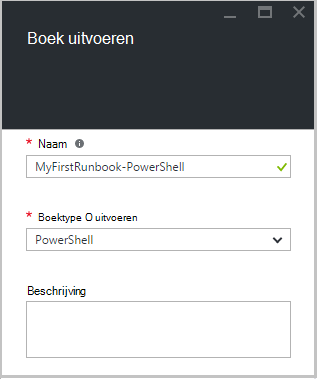

<properties
    pageTitle="Mijn eerste PowerShell runbook in Azure automatisering | Microsoft Azure"
    description="Zelfstudie dat u tijdens het maken begeleidt, testen en publiceren van een eenvoudige PowerShell-runbook."
    services="automation"
    documentationCenter=""
    authors="mgoedtel"
    manager="jwhit"
    editor=""
    keywords="Azure powershell, powershell-script zelfstudie, powershell automatisering"/>
<tags
    ms.service="automation"
    ms.workload="tbd"
    ms.tgt_pltfrm="na"
    ms.devlang="na"
    ms.topic="get-started-article"
    ms.date="07/19/2016"
    ms.author="magoedte;sngun"/>

# <a name="my-first-powershell-runbook"></a>Mijn eerste PowerShell-runbook

> [AZURE.SELECTOR] - [Grafische](automation-first-runbook-graphical.md) - [PowerShell](automation-first-runbook-textual-PowerShell.md) - [PowerShell-werkstroom](automation-first-runbook-textual.md)  

Deze zelfstudie begeleidt u bij het maken van een [PowerShell-runbook](automation-runbook-types.md#powershell-runbooks) in Azure automatisering. We beginnen met een eenvoudige runbook die we testen en publiceren terwijl we wordt uitgelegd hoe u de status van de taak runbook bijhouden. We wordt wijzigt u het runbook als u wilt dat is wel beheren Azure resources, in dit geval starten een Azure virtuele machines. We vervolgens maken het runbook krachtiger door runbook parameters toe te voegen.

## <a name="prerequisites"></a>Vereisten voor

Als u wilt deze zelfstudie hebt voltooid, moet u het volgende.

-   Azure-abonnement. Als u een nog niet hebt, kunt u [de voordelen van uw MSDN-abonnee activeren](https://azure.microsoft.com/pricing/member-offers/msdn-benefits-details/) of <a href="/pricing/free-account/" target="_blank"> [registreren voor een gratis-account](https://azure.microsoft.com/free/).
-   [Automatisering account](automation-security-overview.md) houdt van het runbook en geverifieerd bij Azure bronnen.  Dit account moet gemachtigd zijn om te starten en stoppen de virtuele machine.
-   Een Azure virtuele machines. We stoppen en start deze computer, zodat deze niet productie moet worden.

## <a name="step-1---create-new-runbook"></a>Stap 1: maken van nieuwe runbook

We beginnen door te maken van een eenvoudige runbook dat de tekst *Hallo allemaal*oplevert.

1.  Klik in de Portal Azure uw automatisering-account te openen.  
    De accountpagina automatisering geeft u een snelle weergave van de informatiebronnen in dit account. U moet bepaalde activa al hebt. De meeste van de gebruikers zijn de modules die automatisch zijn opgenomen in een nieuw account voor automatisering. U moet ook de referentie-activa dat wordt vermeld in de [vereisten](#prerequisites)hebben.
2.  Klik op de tegel **Runbooks** om de lijst van runbooks te openen.  
      
3.  Maak een nieuwe runbook door te klikken op de knop **toevoegen een runbook** en vervolgens **een nieuwe runbook maken**.
4.  Geef het runbook de naam *MyFirstRunbook PowerShell*.
5.  In dit geval gaan we een [PowerShell-runbook](automation-runbook-types.md#powershell-runbooks) maken dus selecteer **Powershell** voor **Runbook type**.  
      
6.  Klik op **maken** voor het maken van het runbook en de tekstuele editor openen.

## <a name="step-2---add-code-to-the-runbook"></a>Stap 2: de code hebt toegevoegd aan het runbook

Kunt u een van beide typecode rechtstreeks in het runbook of u kunt cmdlets, runbooks en activa Selecteer in het besturingselement bibliotheek en hen toegevoegd aan het runbook met alle bijbehorende parameters. Voor deze procedure wordt we direct in het runbook typen.

1.  Onze runbook is momenteel leeg type *schrijven-uitvoer "Hallo allemaal."*.  
      
2.  Sla het runbook door te klikken op **Opslaan**.  
      

## <a name="step-3---test-the-runbook"></a>Stap 3: het runbook testen

Voordat we het runbook zodat deze beschikbaar is in productie publiceert, willen we testen om ervoor te zorgen dat het goed werkt. Wanneer u een runbook test, kunt u **de conceptversie** uitvoeren en de uitvoer interactief weergeven.

1.  Klik op **deelvenster Test** u opent het deelvenster Test.  
      
2.  Klik op **Start** de test wilt starten. Dit moet de enige optie is ingeschakeld.
3.  Een [runbook taak](automation-runbook-execution.md) is gemaakt en de status ervan weergegeven.  
    De taakstatus wordt als *in wachtrij* dat aangeeft dat er een werknemer runbook in de cloud om uit te komen beschikbaar wordt gewacht gestart. Dit gaat vervolgens naar *begint* wanneer een werknemer vorderingen de taak en vervolgens *actief* zodra het runbook daadwerkelijk gaat werken.  
4.  Als de taak runbook is voltooid, wordt de uitvoer wordt weergegeven. In ons geval ziet we *Hallo allemaal*  
      
5.  Sluit het deelvenster testen om terug te keren naar het canvas.

## <a name="step-4---publish-and-start-the-runbook"></a>Stap 4 - publiceren en het runbook starten

Het runbook die we zojuist hebt gemaakt, is nog steeds in de modus concept. Moeten we uw project publiceren voordat we kan worden uitgevoerd in productie. Wanneer u een runbook publiceert, kunt u de bestaande Published versie overschrijven met de conceptversie. In ons geval we nog geen hebt een gepubliceerde versie omdat we het runbook voor het zojuist hebt gemaakt.

1.  Klik op **publiceren** naar het runbook publiceren en klik vervolgens **Ja** wanneer u wordt gevraagd.  
      
2.  Als u naar links om weer te geven van het runbook in het deelvenster **Runbooks** nu schuift, wordt een **Authoring Status** van **Published**weergegeven.
3.  Ga terug naar rechts om te bekijken van het deelvenster voor **MyFirstRunbook-PowerShell**.  
    De opties aan de bovenkant kunnen we het runbook starten, het runbook weergeven, plannen om te beginnen bij enige tijd in de toekomst of maak een [webhook](automation-webhooks.md) zodat deze kan worden gestart door een HTTP-oproep.
4.  We zojuist wilt starten van het runbook dus klik op **Start** en klik vervolgens op **Ok** wanneer het blad Runbook starten wordt geopend.  
      
5.  Het taakdeelvenster van een wordt geopend voor de taak runbook die we zojuist hebt gemaakt. We dit deelvenster kunt sluiten, maar in dit geval we laten deze open zodat we de voortgang van het project kunt bekijken.
6.  De taakstatus wordt weergegeven in het **Overzicht van de taak** en komt overeen met de statussen die we als we de runbook getest hebt gezien.  
      
7.  Zodra de status van het runbook *voltooid ziet*, klikt u op **uitvoer**. Het deelvenster Uitvoer wordt geopend en kunnen we onze *Hallo allemaal*zien.  
    
8.  Sluit het deelvenster Uitvoer.
9.  Klik op **Alle logboeken** u opent het deelvenster Streams voor de taak runbook. We alleen *Hallo allemaal* in de stream uitvoer moet zien, maar dit kan worden gevuld met andere streams voor een taak runbook zoals uitgebreid en fout als het runbook gegevens worden geschreven naar deze.  
      
10. Sluit het deelvenster Streams en het deelvenster taak om terug te keren naar het deelvenster MyFirstRunbook PowerShell.
11. Klik op **taken** u opent het deelvenster Taken voor deze runbook. Hier vindt u alle van de taken die zijn gemaakt door deze runbook. We ziet slechts één taak sinds we de taak slechts eenmaal hebt weergegeven.  
      
12. U kunt klikken op deze taak om de dezelfde taakdeelvenster die wordt weergegeven wanneer we begonnen met het runbook te openen. Hiermee kunt u gaat u terug in tijd en de details van een project dat is gemaakt voor een bepaalde runbook bekijken.

## <a name="step-5---add-authentication-to-manage-azure-resources"></a>Stap 5: verificatie voor het beheren van Azure resources toevoegen

We hebt getest en onze runbook die zijn gepubliceerd, maar dusverre deze iets handig niet doen. Willen we hebben deze Azure bronnen beheren. Dit kan niet worden dat te doen Hoewel tenzij we hebben deze met de referenties waarnaar wordt verwezen in de [vereisten](#prerequisites)wordt geverifieerd. We doen met de cmdlet **Toevoegen-AzureRmAccount** .

1.  Open de tekstuele editor door te klikken op **bewerken** in het deelvenster MyFirstRunbook PowerShell.  
      
2.  We de **schrijven -** uitvoerregel niet meer nodig, dus verdergaan en verwijder deze.
3.  Typ of kopieer en plak de volgende code waarmee de verificatie met uw account automatisering uitvoeren als worden verwerkt:

    ```
     $Conn = Get-AutomationConnection -Name AzureRunAsConnection 
     Add-AzureRMAccount -ServicePrincipal -Tenant $Conn.TenantID `
     -ApplicationId $Conn.ApplicationID -CertificateThumbprint $Conn.CertificateThumbprint
    ``` 
<br>
4.  Klik op **deelvenster testen** zodat we het runbook kunt testen.
5.  Klik op **Start** de test wilt starten. Zodra deze is voltooid, ontvangt u de uitvoer is vergelijkbaar met de volgende, met basisinformatie van uw account. Hierbij bevestigen dat de referentie geldig is. <br> 

## <a name="step-6---add-code-to-start-a-virtual-machine"></a>Stap 6: code als u wilt een virtuele machine start toevoegen

Nu dat onze runbook bij onze Azure-abonnement verifieert, kunnen we bronnen beheren. Een opdracht kiezen om een virtuele machine start, zullen we toevoegen. U kunt een virtuele machine kiezen in uw Azure-abonnement kunt, en nu we hardcoding die naar de cmdlet een naam geven.

1.  Na *Toevoegen-AzureRmAccount*, typt u *Start-AzureRmVM-naam 'VMName' - ResourceGroupName 'NameofResourceGroup'* bieden de naam en de naam van de resourcegroep van de virtuele machine te starten.  
    
    ```
     $Conn = Get-AutomationConnection -Name AzureRunAsConnection 
     Add-AzureRMAccount -ServicePrincipal -Tenant $Conn.TenantID `
     -ApplicationID $Conn.ApplicationID -CertificateThumbprint $Conn.CertificateThumbprint 
     Start-AzureRmVM -Name 'VMName' -ResourceGroupName 'ResourceGroupName'
     ```
<br>
2.  Het runbook opslaan en klik op **deelvenster testen** zodat we dit kunt testen.
3.  Klik op **Start** de test wilt starten. Zodra deze is voltooid, moet u controleren of de virtuele machine is gestart.

## <a name="step-7---add-an-input-parameter-to-the-runbook"></a>Stap 7: een invoerparameter toevoegen aan het runbook

Onze runbook momenteel begint de virtuele machine die we vastgelegde in het runbook, maar het is gebruiksvriendelijker als we de virtuele machine opgeven kunt wanneer het runbook wordt gestart. We wordt nu invoerparameters aan het runbook die functionaliteit toegevoegd.

1.  Parameters voor *VMName* en *ResourceGroupName* toevoegen aan het runbook en het gebruik van deze variabelen met de cmdlet **Start-AzureRmVM** zoals in het onderstaande voorbeeld.  
    
    ```
    Param(
       [string]$VMName,
       [string]$ResourceGroupName
    )
     $Conn = Get-AutomationConnection -Name AzureRunAsConnection 
     Add-AzureRMAccount -ServicePrincipal -Tenant $Conn.TenantID `
     -ApplicationID $Conn.ApplicationID -CertificateThumbprint $Conn.CertificateThumbprint 
     Start-AzureRmVM -Name $VMName -ResourceGroupName $ResourceGroupName
     ```
<br> 
2.  Sla het runbook en opent u het deelvenster Test. Houd er rekening mee dat u kunt nu Verstrek waarden voor de twee invoer variabelen die wordt gebruikt in de test.
3.  Sluit het deelvenster Test.
4.  Klik op **publiceren** als u wilt publiceren van de nieuwe versie van het runbook.
5.  Stop de virtuele machine die u in de vorige stap hebt gestart.
6.  Klik op **Start** om te starten van het runbook. Typ in de **VMName** en **ResourceGroupName** voor de virtuele machine die u wilt beginnen.  
      
7.  Wanneer het runbook is voltooid, controleert u of dat de virtuele machine is gestart.

## <a name="differences-from-powershell-workflow"></a>Verschillen van de PowerShell-werkstroom

PowerShell runbooks dezelfde levenscyclus, functies en management als PowerShell werkstroom runbooks maar er zijn enkele verschillen en beperkingen:

1.  PowerShell runbooks snel uitvoert vergeleken met PowerShell werkstroom runbooks terwijl ze niet gecompileerd stap hebben.
2.  PowerShell werkstroom runbooks controlepunten controlepunten met ondersteuning: PowerShell werkstroom runbooks kunt weer vanuit een willekeurige plaats in het runbook dat PowerShell runbooks kan alleen worden hervat vanaf het begin.
3.  PowerShell werkstroom runbooks ondersteuning parallelle en seriële execution dat PowerShell runbooks kunnen opdrachten alleen serie uitvoeren.
4.  In een runbook PowerShell werkstroom hebben een activiteit, een opdracht of een scriptblok eigen runspace dat in een PowerShell-runbook, alles in een script wordt uitgevoerd in een enkel runspace. Er zijn ook enkele [syntactische verschillen](https://technet.microsoft.com/magazine/dn151046.aspx) tussen een systeemeigen PowerShell-runbook en een runbook PowerShell-werkstroom.

## <a name="next-steps"></a>Volgende stappen

-   Zie [Mijn eerste grafische runbook](automation-first-runbook-graphical.md) om te beginnen met grafische runbooks
-   Als u wilt beginnen met PowerShell werkstroom runbooks, raadpleegt u [Mijn eerste runbook voor PowerShell-werkstroom](automation-first-runbook-textual.md)
-   Als u wilt meer weten over runbook typen, hun voordelen en beperkingen, raadpleegt u [Azure automatisering runbook typen](automation-runbook-types.md)
-   Voor meer informatie over PowerShell-script ondersteuning voor de functie, raadpleegt u [systeemeigen PowerShell-script ondersteuning in Azure automatisering](https://azure.microsoft.com/blog/announcing-powershell-script-support-azure-automation-2/)
