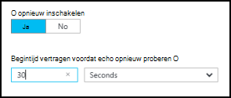
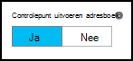
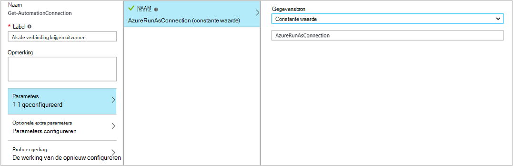

<properties 
    pageTitle="Grafische beschikbaar is in Azure automatisering | Microsoft Azure"
    description="Grafische authoring, kunt u runbooks maken voor Azure automatisering zonder het werken met code. In dit artikel vindt u een inleiding tot authoring op grafische en alle details nodig zijn om te beginnen met het maken van een grafische runbook."
    services="automation"   
    documentationCenter=""
    authors="mgoedtel"
    manager="jwhit"
    editor="tysonn" />
<tags 
    ms.service="automation"
    ms.devlang="na"
    ms.topic="article"
    ms.tgt_pltfrm="na"
    ms.workload="infrastructure-services"
    ms.date="06/03/2016"
    ms.author="magoedte;bwren" />

# Grafische beschikbaar is in Azure automatisering

## Inleiding

Grafische ontwerpen kunt u runbooks voor Azure automatisering maken zonder de complexiteit van de onderliggende code voor Windows PowerShell of PowerShell-werkstroom. U activiteiten aan het tekenpapier toevoegen vanuit een bibliotheek met cmdlets en runbooks, deze koppelen en configureren om een werkstroom.  Als u hebt gewerkt met systeem Center Orchestrator of Service Management automatisering (SMA), klikt u vervolgens ziet dit u vertrouwd voorkomen.   

In dit artikel vindt u een inleiding tot authoring op grafische en de concepten die u nodig hebt om te beginnen bij het maken van een grafische runbook.

## Grafische runbooks

Alle runbooks in Azure automatisering zijn Windows PowerShell werkstromen.  Grafische en grafische PowerShell werkstroom runbooks PowerShell-code die wordt uitgevoerd door de werknemers automatisering genereren, maar u zich niet kunt bekijken of deze rechtstreeks te wijzigen.  Een grafische runbook kan worden omgezet in een grafische PowerShell werkstroom runbook en vice versa, maar ze kunnen niet worden geconverteerd naar een tekstuele runbook. Een bestaande tekstuele runbook kan niet worden geïmporteerd in de grafische editor.  

## Overzicht van de grafische editor

U kunt de grafische editor openen in de portal van Azure door maken of bewerken van een grafische runbook.

De volgende secties worden de besturingselementen in de grafische editor.

### Tekenpapier
Het tekenpapier is waar u uw runbook ontwerpen.  U activiteiten van de knooppunten in een besturingselement voor de bibliotheek toevoegen aan het runbook en verbindt u deze met koppelingen naar de logica van het runbook definiëren.

U kunt de besturingselementen onderaan in het tekenpapier in-en uitzoomen.

### Beheer van de bibliotheek

Het besturingselement bibliotheek is waarin u [activiteiten](#activities) toevoegen aan uw runbook selecteren.  U toevoegen deze aan het canvas waar u deze aan andere activiteiten koppelen.  Het bevat vier secties wordt beschreven in de volgende tabel.

| Sectie | Beschrijving |
|:---|:---|
| Cmdlets voor | Bevat de cmdlets die kunnen worden gebruikt in uw runbook.  Cmdlets voor geordend op module.  Alle modules die u hebt geïnstalleerd in uw account automatisering zijn beschikbaar.  |
| Runbooks |  Bevat de runbooks in uw account automatisering. Deze runbooks kan worden toegevoegd aan het tekenpapier moet worden gebruikt als onderliggende runbooks. Alleen runbooks van hetzelfde type als het runbook wordt bewerkt core worden weergegeven; Grafische worden runbooks alleen op PowerShell gebaseerde runbooks weergegeven, terwijl voor grafische PowerShell werkstroom runbooks alleen PowerShell-werkstroom gebaseerde runbooks worden weergegeven.
| Activa | Bevat de [automatisering activa](http://msdn.microsoft.com/library/dn939988.aspx) in uw account voor automatisering die kan worden gebruikt in uw runbook.  Wanneer u een element aan een runbook toevoegen, wordt deze de werkstroomactiviteit in een waarvoor u de geselecteerde activa toegevoegd.  In het geval van variabele activa, kunt u of u wilt toevoegen van een activiteit ophalen van de variabele of instellen van de variabele selecteren.
| Runbook besturingselement | Runbook besturingselement activiteiten die kunnen worden gebruikt bevat in uw huidige runbook. Een *verbindingstabel* meerdere invoer wordt ingevoegd en wacht totdat alle hebt voltooid voordat u verdergaat de werkstroom. Een activiteit in een *Code* wordt uitgevoerd voor een of meer regels met PowerShell of PowerShell werkstroom code afhankelijk van het type grafische runbook.  U kunt deze activiteit voor aangepaste code of voor functionaliteit die is moeilijk te realiseren met andere activiteiten.|

### Configuratie van besturingselement

Het besturingselement configuratie is waar u informatie geven voor een object geselecteerd op het canvas. De eigenschappen die beschikbaar zijn in dit besturingselement is afhankelijk van het type object hebt geselecteerd.  Wanneer u een optie in het besturingselement configuratie selecteert, wordt deze extra bladen geopend kan alleen worden aangeboden aanvullende informatie.

### Besturingselement testen

Het besturingselement Test niet wordt weergegeven wanneer de grafische editor voor het eerst wordt gestart. Dit is geopend wanneer u interactief [testen van een grafische runbook](#graphical-runbook-procedures).  

## Grafische runbook procedures 

### Exporteren en importeren van een grafische runbook

U kunt alleen de gepubliceerde versie van een grafische runbook exporteren.  Als het runbook nog niet is gepubliceerd, klikt u vervolgens de knop **exporteren gepubliceerde** uitgeschakeld.  Wanneer u op de knop **exporteren die zijn gepubliceerd** , wordt het runbook gedownload naar uw lokale computer.  De naam van het bestand dat overeenkomt met de naam van het runbook met de extensie *graphrunbook* .

U kunt een grafische of grafische PowerShell werkstroom runbook-bestand importeren door de optie **importeren** bij het toevoegen van een runbook.   Wanneer u het bestand te importeren selecteert, kunt u dezelfde **naam** houden of een nieuw opgeven.  Nadat deze het bestand dat is geselecteerd beoordeelt en als u probeert te selecteren van een ander type die niet juist is, een bericht wordt weergegeven waarbij er conflicten zijn en tijdens de conversie, kan er syntaxisfouten in het veld Runbook Type het type runbook weergegeven.  

### Een grafische runbook testen

U kunt de conceptversie van een runbook testen in de portal van Azure terwijl de gepubliceerde versie van het runbook blijft ongewijzigd of u een nieuwe runbook testen kunt voordat deze is gepubliceerd. Hiermee kunt u om te bevestigen dat het runbook goed werkt voordat de gepubliceerde versie vervangen. Wanneer u een runbook test, het runbook concept wordt uitgevoerd en acties die worden uitgevoerd worden voltooid. Geen werkervaring wordt gemaakt, maar uitvoer wordt weergegeven in het deelvenster van de uitvoer Test. 

Open het besturingselement Test voor een runbook door het openen van het runbook voor bewerken en klik op de knop **Test** .

Het besturingselement Test vraagt om eventuele invoerparameters weergegeven en kunt u het runbook starten door te klikken op de knop **Start** .

### Een grafische runbook publiceren

Elke runbook in Azure automatisering heeft een voorlopige versie en een gepubliceerde versie. Alleen de gepubliceerde versie is kunnen worden uitgevoerd en alleen de conceptversie kan worden bewerkt. De gepubliceerde versie wordt niet beïnvloed door wijzigingen in de conceptversie. Wanneer de conceptversie klaar is kan worden gecontroleerd, klikt u de afbeelding publiceert die de versie Published met de conceptversie overschrijft.

U kunt een grafische runbook publiceren door het openen van het runbook voor bewerken en vervolgens te klikken op de knop **publiceren** .

Wanneer een runbook nog niet is gepubliceerd, is de status **Nieuw**.  Wanneer deze wordt gepubliceerd, heeft dit de status van **Published**.  Als u het runbook bewerken nadat deze is gepubliceerd, en de versies concept en Published verschillen, heeft het runbook een status **In bewerken**.

 

U hebt ook de optie als u wilt terugkeren naar de gepubliceerde versie van een runbook.  Hiermee verwijdert u alle wijzigingen hebt aangebracht sinds het runbook laatst is gepubliceerd en de conceptversie van het runbook vervangen door de gepubliceerde versie.

## Activiteiten

Activiteiten zijn de bouwstenen van een runbook.  Een activiteit kan zijn een PowerShell-cmdlet, een onderliggende runbook of werkstroomactiviteit in een.  U kunt een activiteit toevoegen aan het runbook rechtermuisknop erop te klikken in het besturingselement bibliotheek en selecteer **toevoegen aan het canvas**.  U kunt Klik en sleep de activiteit om het te plaatsen ergens op het canvas die u tevreden bent.  De locatie van de van de activiteit op het canvas heeft geen invloed op de werking van het runbook op geen enkele manier.  U kunt indeling uw runbook maar u het meest geschikt vindt voor het visualiseren van de werking ervan. 

Selecteer de activiteit op het canvas configureren eigenschappen en parameters in het blad configuratie.  U kunt het **Label** van de activiteit wijzigen in iets dat beschrijvende aan u is.  Nog steeds de oorspronkelijke cmdlet wordt uitgevoerd, wijzigt u gewoon de naam weer te geven die wordt gebruikt in de grafische editor.  Het label moet uniek zijn binnen het runbook. 

### Parametersets

Een parameterset definieert de verplichte en optionele parameters die waarden voor een bepaalde cmdlet worden geaccepteerd.  Alle cmdlets ten minste één parameter instellen hebben, en soms meerdere.  Als een cmdlet sets met meerdere parameters heeft, moet klikt u vervolgens u welke methode u wordt gebruikt voordat u kunt parameters configureren.  De parameters die u kunt configureren, is afhankelijk van de parameterset die u kiest.  U kunt de parameterset gebruikt door een activiteit door te selecteren **Parameter instellen** en een extra Stel wijzigen.  In dit geval gaan parameterwaarden voor dat u hebt geconfigureerd verloren.

In het volgende voorbeeld bevat de cmdlet Get-AzureRmVM drie parametersets.  U kunt geen parameterwaarden configureren totdat u een van de parametersets selecteren.  Het instellen van de parameter ListVirtualMachineInResourceGroupParamSet is bedoeld voor alle virtuele machines retourneren in een resourcegroep en heeft een enkele optionele parameter.  De GetVirtualMachineInResourceGroupParamSet is voor het opgeven van de virtuele machine u als resultaat wilt geven en heeft twee verplicht en een optionele parameter.

#### Parameterwaarden

Wanneer u een waarde voor een parameter opgeven, selecteert u een gegevensbron om te bepalen hoe de waarde wordt opgegeven.  De gegevensbronnen die beschikbaar voor een bepaalde parameter zijn, is afhankelijk van de geldige waarden voor deze parameter.  Null-waarden worden bijvoorbeeld niet een optie voor een parameter die geen null-waarden toestaat.

| Gegevensbron | Beschrijving |
|:---|:---|
|Constante waarde|Typ een waarde in voor de parameter.  Deze functie is alleen beschikbaar voor de volgende gegevenstypen: Int32, Int64, tekenreeks, Booleaanse waarde, DateTime, veranderen. |
|Activiteit uitvoer|De uitvoer van een activiteit die voorafgaat aan de huidige activiteit in de werkstroom.  Alle geldige activiteiten worden, vermeld.  Selecteer alleen de activiteit gebruik van de uitvoer voor de parameterwaarde.  Als de activiteit Hiermee kunt u een object met meerdere eigenschappen, kunt klikt u vervolgens u typen naam van de eigenschap nadat u de activiteit hebt geselecteerd.|
|Runbook invoer |Selecteer een invoerparameter runbook als invoer voor de parameter activiteit.|  
|Variabele activa|Selecteer een variabele automatisering als invoer.|  
|Referentie activa|Selecteer een referentie automatisering als invoer.|  
|Certificaat van activa|Selecteer een certificaat automatisering als invoer.|  
|Verbinding activa|Selecteer een verbinding automatisering als invoer.| 
|PowerShell-expressie|Eenvoudige [PowerShell expressie](#powershell-expressions)opgeven.  De expressie wordt geëvalueerd vóór de activiteit en het resultaat wordt gebruikt voor de parameterwaarde op te geven.  U kunt variabelen gebruiken om te verwijzen naar de uitvoer van een activiteit of een invoerparameter runbook.|
|Niet geconfigureerd|Hiermee wist u elke waarde die eerder is geconfigureerd.|

#### Optionele aanvullende parameters

Alle cmdlets heeft desgewenst aanvullende parameters.  Dit zijn de algemene parameters PowerShell of andere aangepaste parameters.  Er worden weergegeven met een tekstvak waarin u de syntaxis van de PowerShell met parameters kunt geven.  Bijvoorbeeld om de algemene parameter **uitgebreid** gebruikt, geeft u **"-uitgebreid: $True"**.

### Probeer de activiteit

**Probeer gedrag** kan een activiteit moet worden uitgevoerd meerdere keren tot een bepaalde voorwaarde is voldaan, net als een lus vormen.  U kunt deze functie kunt gebruiken voor activiteiten die meerdere keren moet worden uitgevoerd, zijn fout vatbaar en mogelijk nodig meer dan één probeert voor succes of testen van de uitvoergegevens van de activiteit voor geldige gegevens.    

Wanneer u opnieuw voor een activiteit inschakelt, kunt u een vertraging en een voorwaarde instellen.  De vertraging is de tijd (gemeten in seconden of minuten) dat het runbook wachten moet voordat de activiteit nogmaals uitgevoerd.  Als er geen vertraging is opgegeven, wordt klikt u vervolgens de activiteit opnieuw uitvoeren direct nadat deze is voltooid. 

De voorwaarde opnieuw is een PowerShell-expressie die wordt geëvalueerd na elke keer dat de activiteit wordt uitgevoerd.  Als de expressie wordt omgezet in True, klikt u vervolgens de activiteit wordt uitgevoerd opnieuw.  Als de expressie wordt omgezet in ONWAAR wordt de activiteit niet opnieuw uitgevoerd en het runbook verplaatst op naar de volgende activiteit. 

De voorwaarde opnieuw kunt een variabele met de naam van $RetryData biedt toegang tot informatie over de activiteit pogingen om opnieuw te gebruiken.  Deze variabele heeft de eigenschappen in de volgende tabel.

| Eigenschap | Beschrijving |
|:--|:--|
| NumberOfAttempts | Het aantal keren dat de activiteit is uitgevoerd.              |
| Uitvoer           | De uitvoer van de laatste uitvoeren van de activiteit.                    |
| TotalDuration    | Timed verstreken sinds de activiteit de eerste keer is gestart. |
| StartedAt        | Tijd in UTC-notatie die de activiteit voor het eerst is gestart.           |

Hieronder vindt u voorbeelden van activiteit voorwaarden opnieuw.

    # Run the activity exactly 10 times.
    $RetryData.NumberOfAttempts -ge 10 

    # Run the activity repeatedly until it produces any output.
    $RetryData.Output.Count -ge 1 

    # Run the activity repeatedly until 2 minutes has elapsed. 
    $RetryData.TotalDuration.TotalMinutes -ge 2

Nadat u een voorwaarde opnieuw voor een activiteit configureren, bevat de activiteit twee visuele aanwijzingen om u te herinneren.  Een wordt weergegeven in de activiteit en de andere is wanneer u de configuratie van de activiteit controleren.

### Werkstroom Script besturingselement

Een besturingselement voor een Code is een speciale activiteit die accepteert PowerShell of werkstroom PowerShell-script afhankelijk van het type grafische runbook waaraan wordt gewerkt kan alleen worden aangeboden functionaliteit gebruiken die anders mogelijk niet beschikbaar.  Deze parameters niet accepteren, maar deze variabelen kunt gebruiken voor activiteit uitvoer en runbook invoerparameters weergegeven.  Uitvoer van de activiteit wordt toegevoegd aan de databus, tenzij er geen uitgaande koppelen in dat geval worden toegevoegd aan de uitvoer van het runbook.

Bijvoorbeeld berekeningen de volgende code datum met een runbook invoer variabele $NumberOfDays genoemd.  Deze stuurt een berekende datum-tijd als uitvoer moet worden gebruikt door de volgende activiteiten in het runbook.

    $DateTimeNow = (Get-Date).ToUniversalTime()
    $DateTimeStart = ($DateTimeNow).AddDays(-$NumberOfDays)}
    $DateTimeStart

## Koppelingen en de werkstroom

Een **koppeling** in een grafische runbook verbindt twee activiteiten.  Als een pijl die wijst van de activiteit bron naar de bestemming activiteit wordt deze weergegeven op het canvas.  De activiteiten uitvoeren in de richting van de pijl met de bestemming activiteit starten nadat de bron-activiteit is voltooid.  

### Een koppeling maken

Maak een koppeling tussen twee activiteiten door de bron-activiteit te selecteren en te klikken op de cirkel onderaan in de vorm.  Sleep de pijl naar de bestemming activiteit en de definitieve versie.

Selecteer de koppeling voor het configureren van de eigenschappen in het blad configuratie.  Dit bevat het koppelingstype waarin wordt beschreven in de volgende tabel.

| Koppelingstype | Beschrijving |
|:---|:---|
| Verkooppijplijn | De bestemming activiteit wordt één keer uitgevoerd voor de objectuitvoer van elk uit de bron-activiteit.  De bestemming activiteit wordt niet uitgevoerd als de bron-activiteit in geen uitvoer resulteert.  Uitvoer van de activiteit bron is beschikbaar als een object.  |
| Reeks | De bestemming activiteit slechts één keer wordt uitgevoerd.  Wordt een matrix van objecten ontvangen van de activiteit bron.  Uitvoer van de activiteit bron is beschikbaar als een matrix van objecten. |

### Activiteit starten

Een grafische runbook begint met een activiteiten die ik heb een binnenkomende koppeling.  Dit is vaak slechts één activiteit die als de eerste activiteit voor het runbook fungeren zou.  Als meerdere activiteiten geen een binnenkomende koppeling hebt, klikt u vervolgens het runbook gestart door ze uit te voeren parallel.  Deze worden daarna volgt u de koppelingen als u wilt uitvoeren van andere activiteiten zoals elk is voltooid.

### Voorwaarden

Wanneer u een voorwaarde op een koppeling opgeeft, de bestemming activiteit kan alleen worden uitgevoerd als de voorwaarde wordt omgezet in true.  Meestal gebruikt u een variabele $ActivityOutput in een voorwaarde voor het ophalen van de uitvoer uit de bron-activiteit.  

Voor een koppeling verkooppijplijn, geeft u een voorwaarde voor één object, en de voorwaarde wordt geëvalueerd voor elke objectuitvoer door de bron-activiteit.  De bestemming activiteit wordt vervolgens voor elk object dat voldoet aan de voorwaarde uitgevoerd.  Bijvoorbeeld, met een activiteit in een bron van Get-AzureRmVm kan de syntaxis van de volgende worden gebruikt voor de koppeling naar voorwaardelijke verkooppijplijn om op te halen alleen virtuele machines in de resourcegroep met de naam *groep1*.  

    $ActivityOutput['Get Azure VMs'].Name -match "Group1"

Voor de koppeling van een reeks, de voorwaarde alleen geëvalueerd eenmaal aangezien een matrix als resultaat gegeven met alle objecten uitvoer van de activiteit bron.  Reden is een koppeling sequentie kan niet worden gebruikt voor het filteren van zoals een koppeling verkooppijplijn, maar wordt eenvoudig bepalen of de volgende activiteit wordt uitgevoerd. Neem bijvoorbeeld de volgende set van activiteiten in onze runbook VM starten.   
Er zijn drie verschillende reeks koppelingen dat bevestigt waarden zijn opgegeven naar twee runbook invoerparameters voor VM naam en de naam van de resourcegroep om te bepalen dat wil de desbetreffende actie zeggen moet worden uitgevoerd - een enkel VM start, alle VMs in de groep bronnen of alle VMs in een abonnement.  Voor de koppeling van de reeks tussen verbinding maken met Azure en één VM ophalen volgt de voorwaarde logica:

    <# 
    Both VMName and ResourceGroupName runbook input parameters have values 
    #>
    (
    (($VMName -ne $null) -and ($VMName.Length -gt 0))
    ) -and (
    (($ResourceGroupName -ne $null) -and ($ResourceGroupName.Length -gt 0))
    )

Wanneer u een voorwaardelijke koppeling gebruikt, wordt de beschikbaar van de activiteit bron tot andere activiteiten op die tak gegevens worden gefilterd door de voorwaarde.  Als een activiteit de bron aan meerdere koppelingen is, klikt u vervolgens hangt de gegevens die beschikbaar zijn voor activiteiten in elke tak voor de voorwaarde in de koppeling verbinding maken met die tak.

De **Begin-AzureRmVm** activiteit in het onderstaande runbook wordt bijvoorbeeld alle virtuele machines gestart.  Er worden twee voorwaardelijke koppelingen.  De eerste voorwaardelijke koppeling maakt gebruik van de expressie *$ActivityOutput ['Start-AzureRmVM']. IsSuccessStatusCode - eq $true* om te filteren als de begin-AzureRmVm activiteit is voltooid.  De tweede maakt gebruik van de expressie *$ActivityOutput ['Start-AzureRmVM']. IsSuccessStatusCode - nieuwe $true* om te filteren als de begin-AzureRmVm activiteit kan niet worden gestart van de virtuele machine.  

Een activiteit die volgt na de eerste koppeling en gebruik de activiteit-uitvoer van Get-AzureVM krijgt alleen de virtuele machines die zijn gestart op het moment dat Get-AzureVM is uitgevoerd.  Een activiteit die volgt op de tweede koppeling krijgt alleen de de virtuele machines die zijn gestopt op het moment dat Get-AzureVM is uitgevoerd.  Een activiteit na de derde koppeling krijgt alle virtuele machines ongeacht hun actief.

### Koppelingen

Een verbindingstabel is een speciale activiteit die wacht totdat alle binnenkomende vertakkingen hebt voltooid.  Hiermee kunt u meerdere activiteiten uitvoeren parallel en zorg ervoor dat alle hebt voltooid voordat u verdergaat.

Een verbindingstabel kunt beschikken over een onbeperkt aantal binnenkomende koppelingen, mag niet meer dan één van deze koppelingen een pijplijn.  Het aantal binnenkomende sequentie koppelingen wordt niet beperkt.  U mag de verbindingstabel met meerdere binnenkomende verkooppijplijn koppelingen maken en opslaan van het runbook, maar deze loopt vast wanneer deze wordt uitgevoerd.

In het onderstaande voorbeeld maakt deel uit van een runbook waarmee een reeks virtuele machines tijdens het downloaden van patches moeten worden toegepast om die machines tegelijk kan worden gestart.  Een verbinding wordt gebruikt om te controleren of beide processen worden uitgevoerd voordat het runbook zich blijft voordoen.

### Maal

Een cyclus is wanneer u een bestemming activiteit koppelingen terug naar de bron-activiteit of naar een andere activiteit die uiteindelijk koppelingen terug naar de bron.  Maal zijn momenteel niet toegestaan in de grafische authoring.  Als uw runbook een cyclus heeft, correct zult opslaan, maar wordt een foutbericht wanneer deze wordt uitgevoerd.

### Delen van gegevens tussen activiteiten

Alle gegevens die worden uitgevoerd door een activiteit met een uitgaande koppeling is naar de *databus* voor het runbook geschreven.  Een activiteit in het runbook gegevens op de databus parameterwaarden vullen of kunt opnemen in een script.  Een activiteit hebben toegang tot de uitvoer van een vorige activiteiten in de werkstroom.     

Hoe de gegevens naar de databus is geschreven, is afhankelijk van het type koppeling op de activiteit.  Voor een **verkooppijplijn**wordt de gegevens weergegeven als veelvouden objecten.  Voor de koppeling van een **reeks** wordt de gegevens weergegeven als een matrix.  Als er slechts één waarde is, worden deze wordt uitgevoerd als een matrix één element.

U kunt gegevens op de databus een van twee manieren openen.  Eerst gebruikt een **Activiteit uitvoer** gegevensbron om een parameter van een andere activiteit te vullen.  Als de uitvoer een object is, kunt u één eigenschap opgeven.

U kunt ook de uitvoer van een activiteit in een gegevensbron **PowerShell expressie** of van de activiteit in een **Script van de werkstroom** met een variabele ActivityOutput ophalen.  Als de uitvoer een object is, kunt u één eigenschap opgeven.  De syntaxis van de volgende ActivityOutput variabelen gebruiken

    $ActivityOutput['Activity Label']
    $ActivityOutput['Activity Label'].PropertyName 

### Controlepunten

U kunt [controlepunten](automation-powershell-workflow.md#checkpoints) instellen in een grafische PowerShell werkstroom runbook door in te schakelen *controlepunt runbook* voor een activiteit.  Hierdoor wordt een samenvatting worden ingesteld nadat de activiteit wordt uitgevoerd.

Controlepunten alleen in grafische PowerShell werkstroom runbooks zijn ingeschakeld, is deze niet beschikbaar in grafische runbooks.  Als u het runbook Azure cmdlets gebruikt, moet u eventuele controlepunt activiteit met een toevoegen-AzureRMAccount geval het runbook is geschorst en opnieuw is opgestart uit dit controlepunt op een andere werknemer. 

## Geverifieerd bij Azure resources

Runbooks in Azure automatisering die Azure bronnen beheren wordt Azure is verificatie vereist.  Het nieuwe [account uitvoeren als](automation-sec-configure-azure-runas-account.md) -functie (ook een service principal genoemd) is de standaardmethode Azure resourcemanager bronnen in uw abonnement met automatisering runbooks.  U kunt deze functionaliteit toevoegen aan een grafische runbook door toe te voegen van de **AzureRunAsConnection** verbinding activa en de PowerShell- [Get-AutomationConnection](https://technet.microsoft.com/library/dn919922%28v=sc.16%29.aspx) cmdlet en het tekenpapier [Toevoegen-AzureRmAccount](https://msdn.microsoft.com/library/mt619267.aspx) -cmdlet wordt gebruikt. Dit is geïllustreerd in het volgende voorbeeld.  
De activiteit uitvoeren als verbinding krijgen (dat wil zeggen Get-AutomationConnection), is geconfigureerd met een constante waarde gegevensbron met de naam AzureRunAsConnection.  
De volgende activiteit, toevoegen-AzureRmAccount, voegt het account voor geverifieerde uitvoeren als voor gebruik in het runbook. 
 
U moet de naam van de eigenschap van het veld pad opgeven omdat de activiteit Hiermee kunt u een object met meerdere eigenschappen voor de parameters **APPLICATIONID**, **CERTIFICATETHUMBPRINT**en **TENANTID** .  Anders als u het runbook uitvoert, mislukt dit poging om te verifiëren.  Dit is wat u moet ten minste verifiëren van uw runbook met het account uitvoeren als.

Als u wilt behouden achterwaartse compatibiliteit voor abonnees die een [Azure AD-gebruikersaccount](automation-sec-configure-aduser-account.md) gebruikt voor het beheren van Azure-Service Management (ASM) of Azure resourcemanager resources automatisering-account hebt gemaakt, is de methode om te verifiëren de cmdlet toevoegen-AzureAccount met een [referentie activa](http://msdn.microsoft.com/library/dn940015.aspx) die Active Directory-gebruiker met toegang tot de Azure-account vertegenwoordigt.

U kunt deze functionaliteit toevoegen aan een grafische runbook door een referentie-activa toe te voegen aan het canvas gevolgd door een activiteit toevoegen-AzureAccount.  De activiteit referentie toevoegen AzureAccount gebruikt om de invoer.  Dit is geïllustreerd in het volgende voorbeeld.

U moet aan het begin van het runbook en na elke controlepunt wordt geverifieerd.  Dit betekent dat het toevoegen van een activiteit toevoeging toevoegen-AzureAccount na elke activiteit controlepunt-werkstroom. U hoeft niet een toevoeging referentie activiteit omdat u hetzelfde kunt gebruiken 

## Runbook invoer en uitvoer

### Runbook invoer

Een runbook kan vragen om invoer van een gebruiker wanneer ze het runbook via de portal van Azure starten of van een andere runbook als de huidige rij wordt gebruikt als onderliggend item.
Als u een runbook waarmee een virtuele machine hebt, moet u mogelijk vindt u informatie zoals de naam van de virtuele machine en andere eigenschappen telkens wanneer u het runbook starten.  

U invoer voor een runbook accepteren door het definiëren van een of meer invoerparameters.  U opgeven waarden voor deze parameters telkens wanneer die het runbook wordt gestart.  Wanneer u een runbook met de portal van Azure begint, worden de volgende waarden op te geven voor elk van het runbook invoerparameters weergegeven.

U kunt invoerparameters voor een runbook openen door te klikken op de knop **invoer en uitvoer** op de werkbalk runbook.  

 

Hiermee opent u het besturingselement **en uitvoer** kunt u een bestaande invoerparameter bewerken of maak een nieuwe door te klikken op **invoer toevoegen**. 

Elke invoerparameter is gedefinieerd door de eigenschappen in de volgende tabel.

|Eigenschap|Beschrijving|
|:---|:---|
| Naam | De unieke naam van de parameter.  Hiermee kan alleen alfa numerieke tekens bevatten en kan geen spatie bevatten. |
| Beschrijving | Een optionele beschrijving voor de invoerparameter.  |
| Type | Gegevenstype voor de parameterwaarde verwacht.  De portal van Azure biedt een bijbehorend besturingselement voor het gegevenstype voor elke parameter wanneer vragen om invoer. |
| Verplicht | Hiermee geeft u of een waarde moet worden opgegeven voor de parameter.  Het runbook kan niet worden gestart als u een waarde niet opgeeft voor elke parameter is vereist dat geen een standaardwaarde gedefinieerd. |
| Standaardwaarde | Geeft aan welke waarde wordt gebruikt voor de parameter als een is opgegeven.  Dit zijn null-waarden of een bepaalde waarde. |

### Runbook uitvoer

Gegevens die zijn gemaakt door een activiteit die geen koppeling van een uitgaande worden, toegevoegd aan de [uitvoer van het runbook](http://msdn.microsoft.com/library/azure/dn879148.aspx).  De uitvoer is opgeslagen bij de taak runbook en is beschikbaar voor een bovenliggende runbook wanneer het runbook wordt gebruikt als onderliggend item.  

## PowerShell-expressies

Een van de voordelen van de grafische authoring biedt u met de mogelijkheid om te maken van een runbook met minimale kennis van PowerShell.  Momenteel, moet u weten iets van PowerShell Hoewel voor vullen met bepaalde [parameterwaarden](#activities) en voor de [Koppelingsvoorwaarden](#links-and-workflow)in te stellen.  Deze sectie bevat een snelle introductie over PowerShell-expressies voor gebruikers die mogelijk niet bekend zijn met deze.  Volledige details van PowerShell zijn beschikbaar bij het [uitvoeren van scripts met Windows PowerShell](http://technet.microsoft.com/library/bb978526.aspx). 

### PowerShell expressie-gegevensbron

U kunt een PowerShell-expressie gebruiken als gegevensbron om te vullen de waarde van een [activiteit parameter](#activities) met de resultaten van enkele PowerShell-code.  Dit kan één regel met code waarmee u een eenvoudige functie of meerdere regels die uitvoeren van bepaalde complexe logica zijn.  Een uitvoer van een opdracht die niet is toegewezen aan een variabele worden uitgevoerd in de parameterwaarde op te geven. 

De volgende opdracht zou bijvoorbeeld uitvoer van de huidige datum. 

    Get-Date

De volgende opdrachten bouwen van een tekenreeks vanaf de huidige datum en toewijzen aan een variabele.  De inhoud van de variabele worden vervolgens verzonden naar de uitvoer 

    $string = "The current date is " + (Get-Date)
    $string

De volgende opdrachten evalueren van de huidige datum en een tekenreeks die aangeeft of de huidige dag een weekend of weekdag te retourneren. 

    $date = Get-Date
    if (($date.DayOfWeek = "Saturday") -or ($date.DayOfWeek = "Sunday")) { "Weekend" }
    else { "Weekday" }
    
 
### Activiteit uitvoer

Als u de uitvoer van een activiteit in een vorige in het runbook, gebruikt u de variabele $ActivityOutput met de volgende syntaxis.

    $ActivityOutput['Activity Label'].PropertyName

Zoals u wellicht een activiteit met een eigenschap die u de naam van een virtuele machine moet in dat geval kunt u de volgende expressie gebruiken.

    $ActivityOutput['Get-AzureVm'].Name

Als de eigenschap die de virtuele machine vereist in plaats van alleen een eigenschap object, zou u het hele object met de volgende syntaxis terugkeren.

    $ActivityOutput['Get-AzureVm']

U kunt ook de uitvoer van een activiteit in een meer complexe expressie zoals de volgende die worden samengevoegd tekst naar de naam van de virtuele machine.

    "The computer name is " + $ActivityOutput['Get-AzureVm'].Name

### Voorwaarden

Gebruik [vergelijkingsoperatoren](https://technet.microsoft.com/library/hh847759.aspx) waarden vergelijken of vaststellen of een waarde overeenkomt met een bepaald patroon.  Een vergelijking geeft als resultaat een waarde van de $true of $false.

Bijvoorbeeld de volgende voorwaarde bepaalt u of de virtuele machine van een activiteit met de naam *Get-AzureVM* momenteel *gestopt is*. 

    $ActivityOutput["Get-AzureVM"].PowerState –eq "Stopped"

De volgende voorwaarde wordt gecontroleerd of dezelfde virtuele machine in een staat dan *gestopt is*.

    $ActivityOutput["Get-AzureVM"].PowerState –ne "Stopped"

U kunt deelnemen aan meerdere criteria met een [logische operatoren](https://technet.microsoft.com/library/hh847789.aspx) , zoals **- en** of **- of**.  Bijvoorbeeld de volgende voorwaarde wordt gecontroleerd of dezelfde virtuele machine in het vorige voorbeeld in een weergave van het *gestopt* of *Stoppen is*.

    ($ActivityOutput["Get-AzureVM"].PowerState –eq "Stopped") -or ($ActivityOutput["Get-AzureVM"].PowerState –eq "Stopping") 

### Hashtabellen

[Hashtabellen](http://technet.microsoft.com/library/hh847780.aspx) zijn naam/waardeparen die zijn handig om een verzameling waarden te retourneren.  Eigenschappen voor bepaalde activiteiten kunnen hashtable in plaats van een eenvoudige waarde verwachten.  Ziet u mogelijk ook als hashtable waarnaar wordt verwezen als een woordenlijst. 

U kunt een hashtable maken met de volgende syntaxis.  Een hashtable bevatten een willekeurig aantal vermeldingen maar elk is gedefinieerd door een naam en een waarde.

    @{ <name> = <value>; [<name> = <value> ] ...}

De volgende expressie wordt bijvoorbeeld een hashtable moet worden gebruikt in de gegevensbron voor een activiteit-parameter die een hashtable met waarden voor een zoekopdracht internet verwacht.

    $query = "Azure Automation"
    $count = 10
    $h = @{'q'=$query; 'lr'='lang_ja';  'count'=$Count}
    $h

Het volgende voorbeeld wordt de uitvoer van een activiteit *Twitter-verbinding krijgen* genoemd hashtable vullen.

    @{'ApiKey'=$ActivityOutput['Get Twitter Connection'].ConsumerAPIKey;
      'ApiSecret'=$ActivityOutput['Get Twitter Connection'].ConsumerAPISecret;
      'AccessToken'=$ActivityOutput['Get Twitter Connection'].AccessToken;
      'AccessTokenSecret'=$ActivityOutput['Get Twitter Connection'].AccessTokenSecret}

## Volgende stappen

- Als u wilt beginnen met PowerShell werkstroom runbooks, raadpleegt u [Mijn eerste runbook voor PowerShell-werkstroom](automation-first-runbook-textual.md) 
- Zie [Mijn eerste grafische runbook](automation-first-runbook-graphical.md) om te beginnen met grafische runbooks
- Als u wilt meer weten over runbook typen, hun voordelen en beperkingen, raadpleegt u [Azure automatisering runbook typen](automation-runbook-types.md)
- Als u wilt weten hoe u met het account automatisering uitvoeren als wordt geverifieerd, Zie [Azure uitvoeren als Account configureren](automation-sec-configure-azure-runas-account.md)
 
