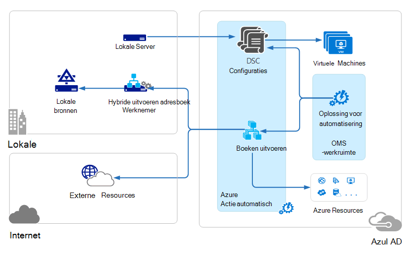
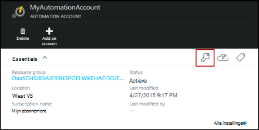
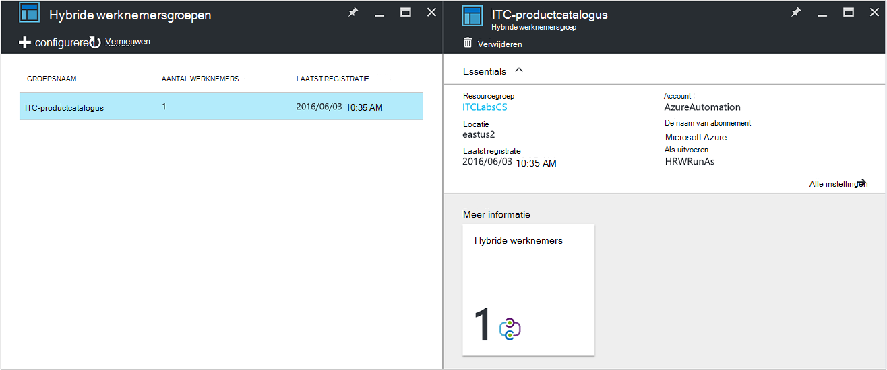
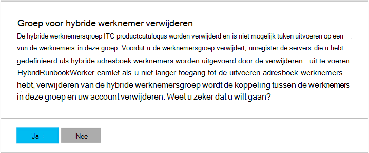

<properties
   pageTitle="Azure automatisering hybride Runbook werknemers | Microsoft Azure"
   description="In dit artikel wordt aandacht besteed aan installeren en gebruiken van hybride Runbook werknemer een functie van Azure automatisering waarmee u runbooks uitvoeren op computers in uw lokale Datacenter."
   services="automation"
   documentationCenter=""
   authors="mgoedtel"
   manager="jwhit"
   editor="tysonn" />
<tags
   ms.service="automation"
   ms.devlang="na"
   ms.topic="article"
   ms.tgt_pltfrm="na"
   ms.workload="infrastructure-services"
   ms.date="10/14/2016"
   ms.author="bwren" />

# Azure automatisering hybride Runbook werknemers

Runbooks in Azure automatisering heeft geen toegang tot resources in uw lokale Datacenter aangezien ze in de cloud Azure worden uitgevoerd.  De functie Hybride Runbook werknemer van Azure automatisering kunt u runbooks uitvoeren op computers zich in uw datacenter om te kunnen lokale bronnen beheren. De runbooks worden opgeslagen en beheerd in Azure automatisering en vervolgens afgeleverd in een of meer computers van de on-premises implementatie.  

Deze functionaliteit is geïllustreerd in de volgende afbeelding.   

U kunt een of meer computers in uw datacenter fungeren als een hybride Runbook werknemer en runbooks onderdelen uitvoeren vanaf Azure automatisering aanwijzen.  Elke werknemer is vereist voor Microsoft Management Agent met een verbinding met Microsoft bewerkingen Management Suite en de Azure automatisering runbook-omgeving.  Bewerkingen Management Suite wordt alleen gebruikt voor het installeren en voor het behoud van de management-agent en om de functionaliteit van de werknemer de te houden.  De bezorging van runbooks en de instructies uit te voeren ze worden uitgevoerd door Azure automatisering.

Er zijn geen binnenkomende firewallvereisten voor de ondersteuning van hybride Runbook werknemers. De agent op de lokale computer start alle communicatie met Azure automatisering in de cloud. Wanneer een runbook wordt gestart, Azure automatisering Hiermee maakt u een instructie die zijn opgehaald door agent. De agent haalt vervolgens omlaag het runbook en eventuele parameters voordat deze wordt uitgevoerd.  [Activa](http://msdn.microsoft.com/library/dn939988.aspx) die worden gebruikt door het runbook van Azure automatisering worden ook opgehaald.

>[AZURE.NOTE] Hybride Runbook werknemers ondersteunen momenteel niet [DSC configuraties](automation-dsc-overview.md).

## Hybride Runbook werknemer groepen

Elke werknemer van de Runbook hybride is een lid van een hybride Runbook werknemer-groep die u tijdens de installatie van de agent opgeeft.  Een groep een enkel agent kunt opnemen, maar u kunt meerdere gebruikersagenten installeren in een groep voor maximale beschikbaarheid.

Wanneer u een runbook op een hybride Runbook werknemer start, geeft u de groep die kan worden uitgevoerd op.  De leden van de groep wordt bepalen welke werknemer wordt het verzoek.  U kunt geen een bepaalde werknemer opgeven.

## Vereisten voor hybride Runbook werknemer

U moet ten minste één lokale computer om uit te voeren hybride runbook taken aanwijzen.  Deze computer moet het volgende:

- Windows Server 2012 of hoger
- Windows PowerShell 4.0 of later
- Minimaal twee cores en 4 GB RAM

Houd rekening met de volgende aanbevelingen voor hybride werknemers: 

- Meerdere hybride werknemers in elke groep beschikbaarheid aanwijzen.  
- Hybride werknemers kunnen naast Service Management automatisering of systeem Center Orchestrator runbook-servers.
- Kunt u overwegen een computer fysiek zich bevindt in of nabij de regio van uw account automatisering aangezien de taakgegevens terug naar Azure automatisering wordt verzonden wanneer een taak is voltooid.

>[AZURE.NOTE] Hybride Runbook werknemer versie 7.2.11136.0 ondersteund momenteel communiceren via een proxyserver alleen voor gebruik met PowerShell-scripts.  Ondersteuning voor de werkstroom PowerShell-scripts zijn beschikbaar in toekomstige versie.  

### Proxy- en firewall-instellingen configureren

Voor de on-premises hybride Runbook werknemer te verbinden met de service Microsoft bewerkingen Management Suite Kantoorbeheersysteem registreren, moet deze hebben toegang tot het poortnummer en de URL's hieronder beschreven.  Dit is naast de [poorten en URL's die zijn vereist voor de Microsoft-Agent Monitoring](../log-analytics/log-analytics-proxy-firewall.md#configure-proxy-and-firewall-settings-with-the-microsoft-monitoring-agent) verbinding maken met OMS. Als u een proxyserver voor communicatie tussen de agent en de OMS-service gebruiken, moet u ervoor zorgen dat de juiste bronnen toegankelijk zijn. Als u een firewall gebruikt voor het beperken van toegang met Internet, moet u uw firewall om toegang te verlenen configureren. 

De onderstaande informatie bevatten de poort en URL's die zijn vereist voor de werknemer van de hybride-Runbook om te communiceren met automatisering.

- Poort: Alleen TCP 443 is vereist voor uitgaande internettoegang
- Globale URL: *.azure-automation.net

Als u een gedefinieerd voor een bepaalde regio automatisering-account hebt en u wilt beperken, communicatie met deze regionale datacenter, vindt de volgende tabel u de DNS-record voor elke regio.

|**Regio**|**DNS-Record**|
|--------------|--------------|
|Zuid-Central US|scus-jobruntimedata-productcatalogus-su1.azure-automation.net|
|Oost-Amerikaanse 2|eus2-jobruntimedata-productcatalogus-su1.azure-automation.net|
|West Europa|We-jobruntimedata-productcatalogus-su1.azure-automation.net|
|Noord-Europa|nieuwe-jobruntimedata-productcatalogus-su1.azure-automation.net|
|Canada centraal|CC-jobruntimedata-productcatalogus-su1.azure-automation.net|
|Zuid-Oost-Azië|zee-jobruntimedata-productcatalogus-su1.azure-automation.net|
|Centraal India|CID-jobruntimedata-productcatalogus-su1.azure-automation.net|
|Japan Oost|jpe-jobruntimedata-productcatalogus-su1.azure-automation.net|
|Zuidoost Australië|ASE-jobruntimedata-productcatalogus-su1.azure-automation.net|

## Installatie van hybride Runbook werknemer

De volgende procedure wordt beschreven hoe installeren en configureren van hybride Runbook werknemer.  De eerste twee stappen één keer uitvoeren voor uw omgeving automatisering en herhaalt u de overige stappen voor elke werknemer-computer.

### 1. bewerkingen Management Suite-werkruimte maken

Als u nog een werkruimte bewerkingen Management Suite, klikt u vervolgens een maken volgens de instructies bij het [instellen van uw werkruimte](https://technet.microsoft.com/library/mt484119.aspx). Als u dat gedaan hebt, kunt u een bestaande werkruimte gebruiken.

### 2. automatiseringsoplossing aan bewerkingen Management Suite werkruimte toevoegen

Functionaliteit toevoegen oplossingen aan bewerkingen Management Suite.  De oplossing automatisering voegt functionaliteit voor Azure automatisering inclusief ondersteuning voor hybride Runbook werknemer.  Wanneer u de oplossing aan uw werkruimte toevoegt, wordt deze automatisch omlaag werknemer onderdelen push naar de agentcomputer die u in de volgende stap installeert.

Volg de instructies bij het [toevoegen van een oplossing die via de galerie met oplossingen](../log-analytics/log-analytics-add-solutions.md) voor de oplossing **automatisering** toevoegen aan uw werkruimte bewerkingen Management Suite.

### 3. Installeer het Microsoft Agent bewaken

De Microsoft-Agent Monitoring verbonden computers bewerkingen Management Suite.  Wanneer u de agent op uw lokale computer installeren en deze verbinden met uw werkruimte, wordt deze automatisch de onderdelen die zijn vereist voor hybride Runbook werknemer downloaden.

Volg de instructies in [verbinding maken met Windows-computers Log Analytics](../log-analytics/log-analytics-windows-agents.md) de agent op de lokale computer installeren.  Herhaal deze procedure voor meerdere computers meerdere werknemers toevoegen aan uw omgeving.

Wanneer de-agent is verbonden met bewerkingen Management Suite, wordt deze wordt weergegeven op het tabblad **Verbonden bronnen** van het deelvenster bewerkingen Management Suite- **Instellingen** .  U kunt controleren of dat de agent correct de oplossing automatisering is gedownload wanneer er een map genaamd **AzureAutomationFiles** in C:\Program Files\Microsoft Monitoring Agent\Agent.  Controleer de versie van de hybride Runbook werknemer, kunt u navigeren naar C:\Program Files\Microsoft Monitoring Agent\Agent\AzureAutomation\ en notitie de \\submap *versie* .   

### 4. de omgeving runbook installeren en verbinden met Azure automatisering

Wanneer u een agent bewerkingen Management Suite toevoegt, worden de oplossing automatisering omlaag de **HybridRegistration** PowerShell-module waarin de cmdlet **Toevoegen-HybridRunbookWorker** .  U kunt deze cmdlet de omgeving runbook op computer installeren en registreren met Azure automatisering.

Open een PowerShell-sessie beheerdersaccount en voer de volgende opdrachten de module te importeren.

    cd "C:\Program Files\Microsoft Monitoring Agent\Agent\AzureAutomation\<version>\HybridRegistration"
    Import-Module HybridRegistration.psd1

Voer de **Toevoegen-HybridRunbookWorker** -cmdlet die met de volgende syntaxis:

    Add-HybridRunbookWorker –Name <String> -EndPoint <Url> -Token <String>

U kunt de informatie die is vereist voor deze cmdlet uit het blad **Sleutels beheren** in de portal van Azure krijgen.  Open dit blade door te klikken op het pictogram van de sleutel in het deelvenster elementen voor het account automatisering.

- **Naam** is de naam van de hybride Runbook werknemer groep. Als deze groep al in het account dat automatisering bestaat, wordt klikt u vervolgens de huidige computer toegevoegd aan deze.  Als deze niet bestaat nog, wordt deze toegevoegd.
- **Eindpunt** is het veld **URL** in het blad **Sleutels beheren** .
- **Token** is de **Primaire sleutel van Access** in het blad **Sleutels beheren** .  

Gebruik de **-uitgebreide** schakeloptie met **Toevoegen-HybridRunbookWorker** voor het ontvangen van gedetailleerde informatie over de installatie.

### 5. PowerShell modules installeren

Runbooks kunt u elk van de activiteiten en de bijbehorende cmdlets gedefinieerd in de modules in uw omgeving Azure automatisering is geïnstalleerd.  Deze modules worden niet automatisch geïmplementeerd in on-premises implementatie computers, zodat u ze handmatig moet installeren.  De uitzondering is de Azure module die al dan niet standaard toegang hiertoe te cmdlets voor alle Azure services en activiteiten voor Azure automatisering is geïnstalleerd.

Aangezien het primaire doel van de functie Hybride Runbook werknemer is voor het beheren van lokale bronnen, moet u waarschijnlijk de modules die ondersteuning bieden voor deze resources installeren.  U kunt verwijzen naar [Modules installeren](http://msdn.microsoft.com/library/dd878350.aspx) voor informatie over het installeren van Windows PowerShell-modules.

## Hybride Runbook werknemer verwijderen

U kunt een of meer hybride Runbook werknemers verwijderen uit een groep of u de groep, afhankelijk van uw vereisten kunt verwijderen.  Als u wilt een hybride Runbook werknemer verwijderen uit een lokale computer, opent u een PowerShell-sessie beheerdersaccount en voer de volgende opdracht uit - **Verwijderen HybridRunbookWorker** cmdlet.  Gebruik de **-uitgebreide** schakelen voor een gedetailleerd logboek van het proces. 

Hiermee verwijdert geen Microsoft Monitoring Agent van de computer, alleen de functionaliteit en configuratie van de rol van de hybride Runbook werknemer.  

Als u wilt verwijderen van een groep, moet u eerst de hybride Runbook werknemer verwijderen uit elke computer die deel uitmaakt van de groep met de opdracht eerder weergegeven en voer de volgende stappen om te zorgen dat de groep.  

1. Open de automatisering-account in de portal van Azure.
2. Selecteer de tegel **Hybride werknemersgroepen** en selecteer in het blad **Hybride werknemersgroepen** de groep die u wilt verwijderen.  Nadat u de specifieke groep selecteert, wordt het blad met **hybride werknemersgroep** eigenschappen weergegeven.     
3. Klik op het blad Eigenschappen voor de geselecteerde groep, op **verwijderen**.  Een bericht wordt weergegeven waarin u deze actie te bevestigen en klik op **Ja** als u weet zeker van te zijn dat u wilt doorgaan.    Dit proces kan enkele minuten duren en u kunt de voortgang daarvan onder **meldingen** bijhouden in het menu.  

## Runbooks starten op hybride Runbook werknemer

[Een Runbook in Azure automatisering starten](automation-starting-a-runbook.md) , worden verschillende methoden voor het starten van een runbook beschreven.  Hybride Runbook werknemer voegt een optie voor **RunOn** waarin u de naam van een hybride Runbook werknemer groep kunt opgeven.  Als een groep is opgegeven, is klikt u vervolgens het runbook opgehaald en macro's starten met van de werknemers in die groep.  Als deze optie niet opgeeft is, wordt deze uitgevoerd in Azure automatisering als normale.

Wanneer u een runbook in de portal van Azure start, u krijgt een optie voor het **uitvoeren op** waarin u **Azure** of **Hybride werknemer**kunt selecteren.  Als u de **Hybride werknemer**selecteert, kunt u de groep selecteren in een vervolgkeuzelijst.

Gebruik de **RunOn** parameter die u kunt de volgende opdracht uit om te starten een runbook met de naam Test-Runbook op hybride Runbook werknemer groep MyHybridGroup via Windows PowerShell.

    Start-AzureRmAutomationRunbook –AutomationAccountName "MyAutomationAccount" –Name "Test-Runbook" -RunOn "MyHybridGroup"

>[AZURE.NOTE] De parameter **RunOn** is toegevoegd aan de **Slag-AzureAutomationRunbook** -cmdlet in versie 0.9.1 van Microsoft Azure PowerShell.  U moet [de nieuwste versie downloaden](https://azure.microsoft.com/downloads/) als er een eerdere een geïnstalleerd.  U hoeft deze versie te installeren op een werkstation waarin u wordt worden vanaf het runbook Windows PowerShell.  U hoeft niet te installeren op de computer werknemer, tenzij u van plan bent om te beginnen runbooks vanaf de computer.  U starten niet momenteel een runbook op een hybride Runbook werknemer uit een andere runbook, omdat hiervoor de nieuwste versie van Azure Powershell in uw account automatisering zijn geïnstalleerd.  De meest recente versie worden automatisch bijgewerkt in Azure automatisering en automatisch vanaf de werknemers binnenkort.

## Runbook machtigingen

Runbooks uitgevoerd op een hybride Runbook werknemer niet gebruiken de dezelfde [methode die meestal voor runbooks gebruikt wordt geverifieerd bij Azure resources](automation-configuring.md#configuring-authentication-to-azure-resources) aangezien ze toegang resources buiten Azure tot.  Het runbook kan een eigen verificatie tot lokale bronnen bieden of kunt u een RunAs-account als u een gebruikerscontext bieden voor alle runbooks wilt opgeven.

### Runbook verificatie

Standaard runbooks kan worden uitgevoerd in de context van de lokale systeemaccount op de lokale computer, zodat ze moeten hun eigen verificatie naar bronnen die ze toegang tot opgeven.  

U kunt [referentie](http://msdn.microsoft.com/library/dn940015.aspx) en [certificaat](http://msdn.microsoft.com/library/dn940013.aspx) activa gebruiken in uw runbook met cmdlets waarmee u kunt de referenties opgeven, zodat u bij verschillende bronnen verifiëren kunt.  Het volgende voorbeeld ziet u een deel van een runbook die een computer opnieuw opstarten.  Deze referenties uit een referentie-activa en de naam van de computer van een variabele actief zijn opgehaald en worden deze waarden vervolgens met de Computer opnieuw opstarten-cmdlet wordt gebruikt.

    $Cred = Get-AzureRmAutomationCredential -ResourceGroupName "ResourceGroup01" -Name "MyCredential"
    $Computer = Get-AzureRmAutomationVariable -ResourceGroupName "ResourceGroup01" -Name  "ComputerName"

    Restart-Computer -ComputerName $Computer -Credential $Cred

U kunt ook gebruikmaken van [InlineScript](automation-powershell-workflow.md#inline-script) waarmee u blokken code uitvoeren op een andere computer met referenties die zijn opgegeven door de [algemene parameter PSCredential](http://technet.microsoft.com/library/jj129719.aspx).

### RunAs-account

In plaats van na runbooks hun eigen verificatie tot lokale bronnen, kunt u een account **RunAs** voor een hybride werknemer-groep.  Geeft u een [referentie activa](automation-credentials.md) die toegang tot lokale bronnen heeft, en alle runbooks onder deze referenties worden uitgevoerd wanneer u zich in een hybride Runbook werknemer in de groep.  

De gebruikersnaam voor de referenties moet zijn in een van de volgende indelingen:

- domein\gebruikersnaam 
- username@domain
- gebruikersnaam (voor lokaal op de computer van de on-premises implementatie-accounts)

Gebruik de volgende procedure om op te geven van een RunAs-account voor een hybride werknemer-groep:

1. Maak een [referentie activa](automation-credentials.md) met toegang tot lokale bronnen.
2. Open de automatisering-account in de portal van Azure.
2. Selecteer de tegel **Hybride werknemersgroepen** en selecteer vervolgens de groep.
3. Selecteer **alle instellingen** en klik vervolgens op **Groepsinstellingen voor hybride werknemer**.
4. Wijzig **uitvoeren als** van **standaard** op **aangepast**.
5. Selecteer de referentie en klik op **Opslaan**.

## Runbooks maken voor hybride Runbook werknemer

Er is geen verschil tussen de structuur van runbooks die worden uitgevoerd in Azure automatisering en die op een hybride Runbook werknemer. Runbooks dat u met elk gebruikt waarschijnlijk verschillen aanzienlijk al sinds runbooks voor hybride Runbook werknemer meestal lokale bronnen in uw datacenter beheert terwijl runbooks in Azure automatisering meestal bronnen in de cloud Azure beheren. 

U kunt een runbook voor hybride Runbook werknemer in Azure automatisering bewerken, maar moet u wellicht problemen als u probeert te testen van het runbook in de editor.  De PowerShell-modules die toegang tot de lokale resources kunnen niet worden geïnstalleerd in uw omgeving Azure automatisering in dat geval, de test zou mislukt.  Als u de vereiste modules installeert, klikt u vervolgens het runbook wordt uitgevoerd, maar deze worden niet toegang tot lokale bronnen voor een volledige test.

## Probleemoplossing runbooks op hybride Runbook werknemer

[Runbook uitvoer en berichten](automation-runbook-output-and-messages.md) worden verzonden naar Azure automatisering van hybride werknemers net als runbook taken uitvoeren in de cloud.  U kunt de streams uitgebreid en de voortgang ook u net als voor andere runbooks inschakelen.  

Logboeken worden lokaal opgeslagen op elke werknemer hybride bij C:\ProgramData\Microsoft\System Center\Orchestrator\7.2\SMA\Sandboxes.

Als uw runbooks niet maken van de verbinding met succes zijn en de taak samenvatting ziet u de status **geschorst**, raadpleegt u het artikel [hybride Runbook werknemer: een taak runbook eindigt met de status geschorst](automation-troubleshooting-hrw-runbook-terminates-suspended.md).   

## Relatie hebben met Service Management automatisering

[Service Management automatisering (SMA)](https://technet.microsoft.com/library/dn469260.aspx) kunt u de dezelfde runbooks die worden ondersteund door Azure automatisering in uw lokale Datacenter uitvoeren. SMA is gewoonlijk geïmplementeerd samen met Windows Azure Pack, zoals Windows Azure Pack een grafische gebruikersinterface voor SMA management bevat. In tegenstelling tot Azure automatisering vereist SMA een lokale installatie waarin endwebservers als host voor de API, een database voor het runbooks en SMA configuratie bevatten en Runbook werknemers om runbook taken te voeren. Azure automatisering biedt deze services in de cloud en alleen, moet u voor het behoud van de hybride Runbook werknemers in uw lokale omgeving.

Als u een bestaande SMA-gebruiker bent, kunt u uw runbooks verplaatsen naar Azure automatisering om te worden gebruikt met hybride Runbook werknemer zonder wijzigingen, ervan uitgaande dat zij hun eigen verificatie tot bronnen als uitvoeren die worden beschreven in [runbooks voor hybride Runbook werknemer maken](#creating-runbooks-for-hybrid-runbook-worker).  Runbooks in SMA uitvoeren in de context van de serviceaccount op de server werknemer die dat verificatie voor de runbooks voorschrijven.

Om te bepalen of Azure automatisering met hybride Runbook werknemer of Service Management automatisering meer geschikt voor uw vereisten is kunt u de volgende criteria voldoet.

- SMA vereist een lokale installatie van de onderliggende onderdelen die met Windows Azure Pack verbonden zijn als een interface grafische management vereist is. Meer lokale bronnen nodig met hogere onderhoudskosten dan Azure automatisering, die alleen een agent die op de lokale runbook werknemers zijn geïnstalleerd moet. De agenten worden beheerd door uw onderhoudskosten verder verkleinen-bewerkingen Management Suite.
- Azure automatisering de runbooks opgeslagen in de cloud en zorgt ervoor dat deze naar de on-premises implementatie hybride Runbook werknemers. Als uw beveiligingsbeleid dit gedrag niet toestaat, kunt u SMA moet gebruiken.
- SMA is opgenomen in de systeem-centrum; en daarom vereist een systeem Center 2012 R2-licentie. Azure automatisering is gebaseerd op een abonnementsmodel doorverbonden.
- Azure automatisering heeft geavanceerde functies zoals grafische runbooks die niet beschikbaar in SMA zijn.

## Volgende stappen

- Meer informatie over de verschillende methoden die kunnen worden gebruikt voor het starten van een runbook, Zie [een Runbook in Azure automatisering starten](automation-starting-a-runbook.md)
- Als u wilt weten over de verschillende procedures voor het werken met PowerShell en de PowerShell-werkstroom runbooks in Azure automatisering met de tekstuele editor, raadpleegt u [een Runbook in Azure automatisering bewerken](automation-edit-textual-runbook.md)

 
