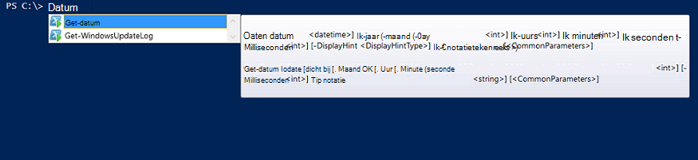

<properties
   pageTitle="Een Module van de integratie van Azure automatisering maken | Microsoft Azure"
   description="Zelfstudievideo die begeleidt u bij het maken, testen en voorbeeld gebruik van de integratiemodules in Azure automatisering."
   services="automation"
   documentationCenter=""
   authors="mgoedtel"
   manager="jwhit"
   editor="" />

<tags
   ms.service="automation"
   ms.workload="tbd"
   ms.tgt_pltfrm="na"
   ms.devlang="na"
   ms.topic="get-started-article"
   ms.date="09/12/2016"
   ms.author="magoedte" />

# <a name="azure-automation-integration-modules"></a>Azure automatisering integratiemodules

PowerShell is de fundamentele technologie achter Azure automatisering. Aangezien Azure automatisering is gebaseerd op PowerShell en vormen PowerShell modules sleutel tot de uitbreiding van Azure automatisering. In dit artikel begeleidt we u bij de details van Azure-automatisering gebruik van de PowerShell-modules, 'integratiemodules', en aanbevolen procedures voor het maken van uw eigen PowerShell-modules om ervoor te zorgen dat ze werken als integratiemodules binnen Azure automatisering genoemd. 

## <a name="what-is-a-powershell-module"></a>Wat is een PowerShell-Module?

Een PowerShell-module is een groep PowerShell-cmdlets zoals **Get-datum** - of **Item kopiëren**, dat kan worden gebruikt vanaf de PowerShell-console, scripts, werkstromen, runbooks en PowerShell DSC resources zoals WindowsFeature of bestand en die kan worden gebruikt vanaf PowerShell DSC configuraties. De functionaliteit van PowerShell wordt weergegeven via de cmdlets en DSC resources, en elke resource cmdlet/DSC wordt ondersteund door een PowerShell-module, veel van die met PowerShell zelf verzenden. Bijvoorbeeld de cmdlet **Get-datum** maakt deel uit van de Microsoft.PowerShell.Utility PowerShell-module, en **Item kopiëren** cmdlet maakt deel uit van de Microsoft.PowerShell.Management PowerShell-module en de resource pakket DSC maakt deel uit van de PSDesiredStateConfiguration PowerShell-module. Beide van deze modules geleverd met PowerShell. Maar veel PowerShell-modules niet als onderdeel van PowerShell geleverd en zijn in plaats daarvan wordt verdeeld met de eerste of derde partij producten zoals System Center 2012 Configuration Manager of door de vast PowerShell-community in locaties zoals PowerShell-galerie.  De modules zijn handig omdat ze eenvoudiger complexe taken tot en met encapsulated functionaliteit.  U kunt meer informatie over [PowerShell-modules op MSDN](https://msdn.microsoft.com/library/dd878324%28v=vs.85%29.aspx). 

## <a name="what-is-an-azure-automation-integration-module"></a>Wat is een Module Azure automatisering integratie?

Een Module integratie is niet erg afwijkt van een PowerShell-module. De gewoon een PowerShell-module (optioneel) met één extra bestand - een bestand met metagegevens opgeven van een type Azure automatisering verbinding moet worden gebruikt met de cmdlets van de module in runbooks. Optioneel archiveren of niet, deze modules kunnen worden geïmporteerd in Azure automatisering hun cmdlets om beschikbaar te maken voor gebruik in runbooks en de resources DSC beschikbaar maken voor gebruik in DSC configuraties PowerShell. Achter de schermen, Azure automatisering worden opgeslagen deze modules en laadt ze aan runbook taak en tijd voor DSC compiliation taak kan worden uitgevoerd in de sandboxen Azure automatisering waar runbooks worden uitgevoerd en DSC configuraties worden gecompileerd.  DSC bronnen in modules worden ook automatisch geplaatst op de server automatisering DSC halen, zodat deze kunnen worden opgevraagd door machines probeert toe te passen DSC configuraties.  We verzenden een aantal Azure PowerShell modules uit het vak in Azure automatisering voor u gebruiken zodat u aan de slag kunt automatiseren Azure management direct af, maar u eenvoudig PowerShell modules voor ongeacht systeem, de service of het hulpmiddel die u integreren importeren kunt wilt met. 

>[AZURE.NOTE] Bepaalde modules worden verzonden als 'algemene modules' in de service automatisering. Deze globale modules zijn u afmelden bij het vak wanneer u een account automatisering maakt en we bijgewerkt om ze soms dat ze automatisch af bij uw account automatisering worden beschikbaar. Als u niet dat deze automatisch wordt bijgewerkt wilt, kunt u altijd importeren dezelfde module uzelf en die voorrang op de globale moduleversie van deze module die we in de service verzenden. 

De indeling waarin u een pakket integratiemodule importeren is een gecomprimeerd bestand met dezelfde naam als de module en extensie. Het bevat de module Windows PowerShell en eventuele ondersteunende bestanden, zoals een manifest bestand (.psd1) indien de module.

Als de module een verbindingstype Azure automatisering bevat, moet deze ook een bestand met de naam bevatten *<ModuleName>*-Automation.json waarmee de eigenschappen van het type verbinding. Dit is een json-bestand in de module map van een ZIP-bestand geplaatst, en de velden van een 'de verbinding' bevat die is vereist voor het verbinding maken met het systeem of de service de module vertegenwoordigt. Dit uiteindelijk maken van een verbindingstype in Azure automatisering. Met dit bestand kunt u instellen dat de veldnamen, typt, en of de velden moeten worden versleuteld en / of optioneel, voor het verbindingstype van de module. Hieronder ziet u een sjabloon in de json-bestandsindeling.

```
{ 
   "ConnectionFields": [
   {
      "IsEncrypted":  false,
      "IsOptional":  false,
      "Name":  "ComputerName",
      "TypeName":  "System.String"
   },
   {
      "IsEncrypted":  false,
      "IsOptional":  true,
      "Name":  "Username",
      "TypeName":  "System.String"
   },
   {
      "IsEncrypted":  true,
      "IsOptional":  false,
      "Name":  "Password",
   "TypeName":  "System.String"
   }],
   "ConnectionTypeName":  "DataProtectionManager",
   "IntegrationModuleName":  "DataProtectionManager"
}
```

Als u hebt geïmplementeerd Service Management automatisering en integratiemodules-pakketten voor uw runbooks automatisering gemaakt, ziet dit er erg bekend voorkomen voor u. 


## <a name="authoring-best-practices"></a>Aanbevolen procedures ontwerpen

Het simpele feit dat integratiemodules zijn in principe PowerShell modules, betekent dat niet dat we een reeks procedures rond authoring ze niet hebt. Er is nog steeds een aantal dingen dat u rekening houden raden tijdens het ontwerpen van een PowerShell-module, zodat u deze handigste in Azure automatisering. Enkele voorbeelden hiervan zijn Azure automatisering specifieke en sommige van deze zijn handig is alleen om uw modules werken ook in de PowerShell-werkstroom, ongeacht of u automatisering gebruikt. 

1. Een samenvatting, beschrijving, opnemen en help-URI voor elke cmdlet in de module. U kunt bepaalde help-informatie voor cmdlets zodat de gebruiker voor het ontvangen van Help-informatie over het gebruik van deze met de cmdlet **Get-Help** definiëren in PowerShell. Bijvoorbeeld: Hier ziet u hoe u een samenvatting definiëren en help-URI voor een PowerShell-module geschreven in een bestand .psm1.<br>  

    ```
    <#
        .SYNOPSIS
         Gets all outgoing phone numbers for this Twilio account 
    #>
    function Get-TwilioPhoneNumbers {
    [CmdletBinding(DefaultParameterSetName='SpecifyConnectionFields', `
    HelpUri='http://www.twilio.com/docs/api/rest/outgoing-caller-ids')]
    param(
       [Parameter(ParameterSetName='SpecifyConnectionFields', Mandatory=$true)]
       [ValidateNotNullOrEmpty()]
       [string]
       $AccountSid,

       [Parameter(ParameterSetName='SpecifyConnectionFields', Mandatory=$true)]
       [ValidateNotNullOrEmpty()]
       [string]
       $AuthToken,

       [Parameter(ParameterSetName='UseConnectionObject', Mandatory=$true)]
       [ValidateNotNullOrEmpty()]
       [Hashtable]
       $Connection
    )

    $cred = CreateTwilioCredential -Connection $Connection -AccountSid $AccountSid -AuthToken $AuthToken

    $uri = "$TWILIO_BASE_URL/Accounts/" + $cred.UserName + "/IncomingPhoneNumbers"
    
    $response = Invoke-RestMethod -Method Get -Uri $uri -Credential $cred

    $response.TwilioResponse.IncomingPhoneNumbers.IncomingPhoneNumber
    }
    ```
<br> 
Voorwaarde dat deze informatie wordt niet alleen weergeven voor deze hulp bij het gebruik van de cmdlet **Get-Help** in de PowerShell-console, wordt dit ook in dit help-functionaliteit binnen Azure automatisering, bijvoorbeeld bij het invoegen van activiteiten tijdens het ontwerpen van runbook laten zien. Te klikken op 'Gedetailleerde help weergeven', wordt de help-URI geopend in een ander tabblad van de webbrowser die u gebruikt voor toegang tot Azure automatisering.<br>
2. Als de module wordt uitgevoerd op een extern systeem, een. Een Module integratie metagegevens-bestand waarin de gegevens die nodig zijn om te verbinden met dat externe systeem, wat betekent dat het verbindingstype moet bevatten. b. Elke cmdlet in de module moeten kunnen maken in een connection-object (een exemplaar van dit verbindingstype) als een parameter.  
    Cmdlets voor de module worden eenvoudig te gebruiken in Azure automatisering als u het geven van een object met de velden van het verbindingstype als een parameter voor de cmdlet toestaat. Deze manier waarop gebruikers hoeft niet te parameters van de activa verbinding toewijzen aan de bijbehorende parameters van de cmdlet telkens wanneer die ze een cmdlet bellen. Op basis van het bovenstaande voorbeeld van runbook, gebruikt de functie een Twilio verbinding activum genaamd CorpTwilio om toegang te Twilio en alle telefoonnummers in het account te retourneren.  Zoals u ziet hoe deze de velden van de verbinding is toewijzen aan de parameters van de cmdlet?<br>

    ```
    workflow Get-CorpTwilioPhones
    {
      $CorpTwilio = Get-AutomationConnection -Name 'CorpTwilio'
    
      Get-TwilioPhoneNumbers 
        -AccountSid $CorpTwilio.AccountSid  
        -AuthToken $CorptTwilio.AuthToken
    }
    ```
<br>
Een gemakkelijker en betere manier benadering dit is het verbindingsobject rechtstreeks doorgeven aan de cmdlet-

    ```
    workflow Get-CorpTwilioPhones
    {
      $CorpTwilio = Get-AutomationConnection -Name 'CorpTwilio'

      Get-TwilioPhoneNumbers -Connection $CorpTwilio
    }
    ```
<br>
Door hen een connection-object rechtstreeks als een parameter, in plaats van alleen verbinding velden voor parameters accepteren, kunt u hiervoor als volgt uw cmdlets inschakelen. Gewoonlijk zult u een parameter instellen voor elk label, zodat een gebruiker die geen gebruikmaakt van Azure automatisering uw cmdlets zonder het bouwen van een hashtable fungeert als het verbindingsobject kunt bellen. Parameterset **SpecifyConnectionFields** hieronder wordt gebruikt om door te geven van de verbinding veldeigenschappen één voor één. **UseConnectionObject** kunt u de verbinding tot en met rechte doorgeven. Zoals u ziet, kan de cmdlet verzenden TwilioSMS in de [Twilio PowerShell-module](https://gallery.technet.microsoft.com/scriptcenter/Twilio-PowerShell-Module-8a8bfef8) doorgeven in beide gevallen: 

    ```
    function Send-TwilioSMS {
      [CmdletBinding(DefaultParameterSetName='SpecifyConnectionFields', `
      HelpUri='http://www.twilio.com/docs/api/rest/sending-sms')]
      param(
         [Parameter(ParameterSetName='SpecifyConnectionFields', Mandatory=$true)]
         [ValidateNotNullOrEmpty()]
         [string]
         $AccountSid,

         [Parameter(ParameterSetName='SpecifyConnectionFields', Mandatory=$true)]
         [ValidateNotNullOrEmpty()]
         [string]
         $AuthToken,

         [Parameter(ParameterSetName='UseConnectionObject', Mandatory=$true)]
         [ValidateNotNullOrEmpty()]
         [Hashtable]
         $Connection

       )
    }
    ```
<br>
3. Uitvoertype voor alle cmdlets definiëren in de module. Een uitvoer van Excel voor een cmdlet definiëren, kunt ontwerpmodus IntelliSense om te bepalen de eigenschappen van de uitvoer van de cmdlet, voor gebruik tijdens het ontwerpen. Dit is vooral handig tijdens het automatisering runbook grafische ontwerpen, waar ontwerp tijd knowledge toets om een eenvoudig-ervaring met uw module is.<br> <br> Dit is vergelijkbaar met de functionaliteit "Typ de verder" van de uitvoer van een cmdlet in PowerShell ISE zonder te worden uitgevoerd.<br> <br>
4. Cmdlets voor de module neemt complexe objecttypen voor parameters. PowerShell werkstroom verschilt van PowerShell in dat complexe typen in gedeserialiseerde formulier wordt opgeslagen. Primitieve typen blijft als primitieven, maar complexe typen worden geconverteerd naar hun gedeserialiseerde versies, die in principe Eigenschappenverzamelingen. Als u de cmdlet **Get-proces** in een runbook (of een PowerShell-werkstroom eigenlijk) gebruikt, zou dit bijvoorbeeld een object van het type [Deserialized.System.Diagnostic.Process], niet het verwachte [System.Diagnostic.Process] type retourneren. Dit type heeft dezelfde eigenschappen als het type niet-gedeserialiseerd, maar geen van de methoden. En als u deze waarde als een parameter doorgeven aan een cmdlet wilt, waar de cmdlet een [System.Diagnostic.Process]-waarde voor deze parameter verwacht, ontvangt u de volgende fout: *argument transformatie op parameter 'process' kan niet worden verwerkt. Fout: ' de waarde "System.Diagnostics.Process (CcmExec)" van het type 'Deserialized.System.Diagnostics.Process' om te typen "System.Diagnostics.Process" kan niet worden geconverteerd.*   Dit is omdat er een overeenkomend type gevonden tussen de verwachte [System.Diagnostic.Process]-type en het opgegeven [Deserialized.System.Diagnostic.Process]. De manier om dit probleem is om ervoor te zorgen dat de cmdlets van de module hebben geen complexe typen voor parameters. Hieronder volgt de verkeerde manier om het te doen.

    ```
    function Get-ProcessDescription {
      param (
            [System.Diagnostic.Process] $process
      )
      $process.Description
    }
    ``` 
<br>
En hier ziet u de juiste wijze in een primitief die kan worden gebruikt intern door de cmdlet het complexe object en deze gebruiken. Aangezien cmdlets in de context van PowerShell uitvoeren, wordt niet PowerShell Workflow, binnen de cmdlet $process het juiste type voor [System.Diagnostic.Process].  

    ```
    function Get-ProcessDescription {
      param (
            [String] $processName
      )
      $process = Get-Process -Name $processName

      $process.Description
    }
    ```
<br>
Verbinding activa in runbooks zijn hashtabellen, die een complexe type zijn, en nog deze hashtabellen lijken kunnen worden doorgegeven naar cmdlets voor hun-parameter voor gegevensverbinding voor perfect, met geen uitzondering cast. Technisch gesproken bepaalde typen PowerShell mogen correct conversie van hun serienummer formulier aan hun gedeserialiseerde formulier en daarom kunnen worden doorgegeven naar cmdlets voor het accepteren van het gedeserialiseerde type niet - parameters. Hashtable is een van de volgende. Is het mogelijk dat voor de gedefinieerde typen van de auteur van een module moeten worden uitgevoerd op een manier die ze correct ook terugconverteren kunnen, maar er zijn enkele compromissen nodig zijn om te maken. Het type moet een standaardconstructor hebben, hebt alle openbare eigenschappen en een PSTypeConverter hebben. Voor al gedefinieerde typen die de module auteur niet de eigenaar, er is echter geen enkele manier 'herstellen', dus de aanbeveling om te voorkomen van complexe typen voor parameters bij elkaar. Runbook Authoring tip: als voor enkele cmdlets hoeft te maken van een complexe typeparameter reden, of als u van iemand anders module die is vereist een typeparameter complexe, de tijdelijke oplossing in PowerShell werkstroom runbooks en PowerShel werkstromen in lokale PowerShell, is om te laten teruglopen de cmdlet waarmee het complexe type en de cmdlet waarbij het complexe type in dezelfde InlineScript activiteit worden gegenereerd. Aangezien InlineScript voert de inhoud ervan als PowerShell in plaats van de werkstroom PowerShell, zou de cmdlet voor het genereren van het complexe type dat juiste type, niet het gedeserialiseerde complexe type produceren.
5. Breng alle cmdlets in de module stateless. PowerShell-werkstroom wordt uitgevoerd voor elke cmdlet genoemd in de werkstroom in een andere sessie. Dit betekent elke cmdlets die afhankelijk van de status van de sessie gemaakt zijn / gewijzigd door andere cmdlets in dezelfde module werkt niet in PowerShell werkstroom runbooks.  Hier volgt een voorbeeld van wat u niet moet doen.

    ```
    $globalNum = 0
    function Set-GlobalNum {
       param(
           [int] $num
       )
      
       $globalNum = $num
    }
    function Get-GlobalNumTimesTwo {
       $output = $globalNum * 2
     
       $output
    }
    ```
<br>
6. De module moet volledig zijn opgenomen in een Xcopy kunnen-pakket. Omdat Azure automatisering modules zijn verdeeld over de sandboxen automatisering wanneer runbooks moet uitvoeren, moeten ze werken afzonderlijk van de host die ze op worden uitgevoerd. Dit houdt in dat u kunnen Zip moet het pakket module, verplaatst u deze naar een andere host met de PowerShell dezelfde of een nieuwere versie en deze functie normaal wanneer geïmporteerd in die hostomgeving PowerShell. In de volgorde voor die optreden, de module niet afhankelijk zijn op alle bestanden buiten de module (de map die wordt ingepakte omhoog bij het importeren in Azure automatisering) of op een unieke registerinstellingen op een host, zoals die door de installatie van een product zijn ingesteld. Als deze aanbevolen procedure wordt niet gevolgd, kunnen de module wordt niet worden gebruikt in Azure automatisering.  

## <a name="next-steps"></a>Volgende stappen

- Als u wilt beginnen met PowerShell werkstroom runbooks, raadpleegt u [Mijn eerste runbook voor PowerShell-werkstroom](automation-first-runbook-textual.md)
- Meer informatie over het maken van de PowerShell-Modules, Zie [schrijven van een Windows PowerShell-Module](https://msdn.microsoft.com/library/dd878310%28v=vs.85%29.aspx)