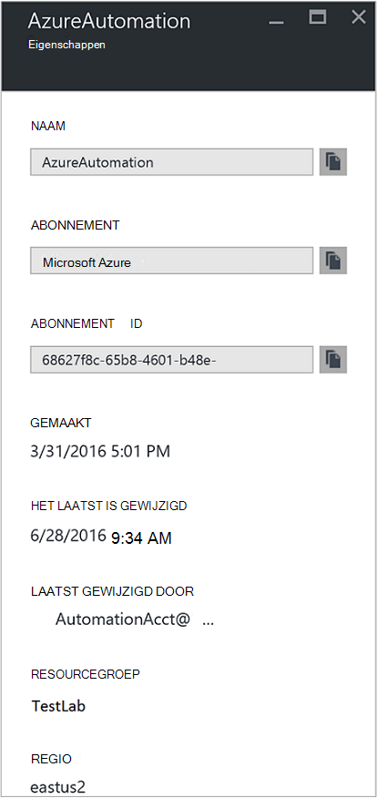
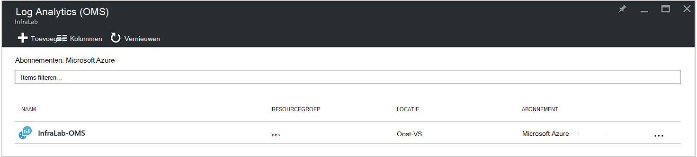
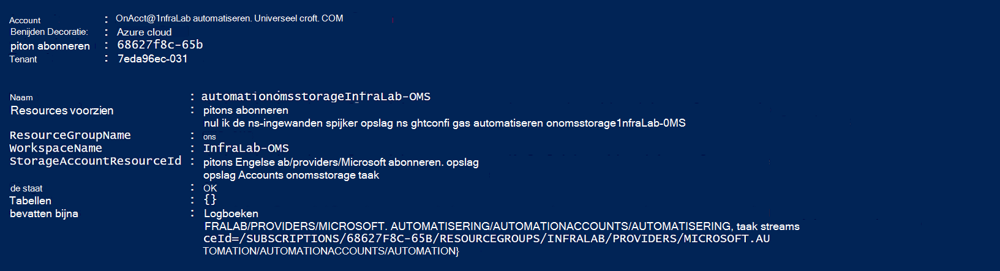
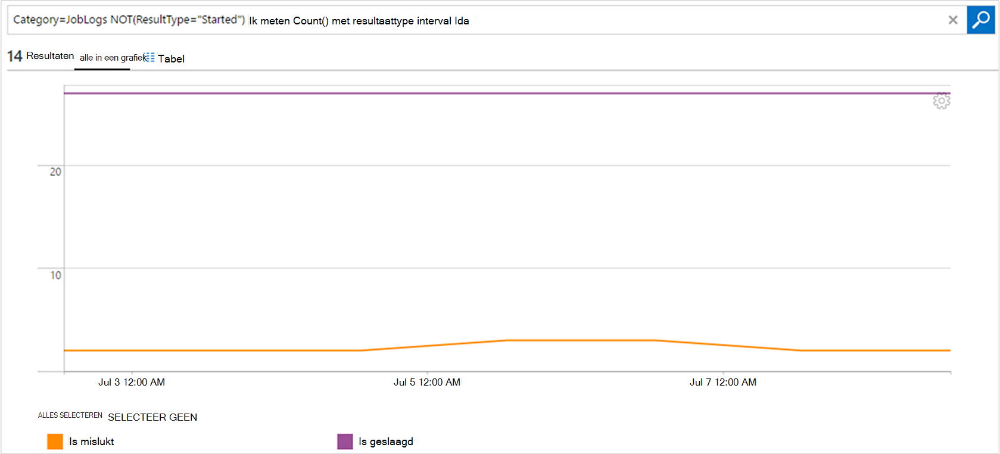

<properties
    pageTitle="Taakstatus en taak streams van doorsturen automatisering naar Log Analytics Kantoorbeheersysteem | Microsoft Azure"
    description="In dit artikel wordt beschreven hoe taakstatus en runbook taak streams verzenden naar Microsoft bewerkingen Management Suite Log Analytics om uit te voeren als u meer inzicht en beheer."
    services="automation"
    documentationCenter=""
    authors="MGoedtel"
    manager="jwhit"
    editor="tysonn" />
<tags
    ms.service="automation"
    ms.devlang="na"
    ms.topic="article"
    ms.tgt_pltfrm="na"
    ms.workload="infrastructure-services"
    ms.date="09/22/2016"
    ms.author="magoedte" />

# Taakstatus en taak streams van doorsturen automatisering naar Log Analytics (OMS)

Automatisering kunt runbook taak status en taak streams verzenden naar uw Microsoft bewerkingen Management Suite Kantoorbeheersysteem Log Analytics-werkruimte.  Terwijl u deze informatie in de portal van Azure of met PowerShell door afzonderlijke taakstatus of alle taken voor een bepaalde automatisering-account weergeven kunt, moet iets geavanceerde ter ondersteuning van uw vereisten voor operationele u aangepaste PowerShell-scripts maken.  Met Log Anaytics kunt u nu:

- Inzicht te krijgen voor uw projecten automatisering 
- Trigger een e-mail of de waarschuwing die zijn gebaseerd op uw taakstatus runbook (bijvoorbeeld is mislukt of geschorst) 
- Geavanceerde query's in uw project-streams schrijven 
- Taken relateren automatisering-accounts 
- Uw werkervaring na verloop van tijd visualiseren     

## Vereisten en overwegingen bij de implementatie

Als u wilt beginnen met het verzenden van uw automatisering logboeken naar Log analyses, hebt u het volgende:

1. Een OMS-abonnement. Zie [aan de slag met Log Analytics](../log-analytics/log-analytics-get-started.md)voor aanvullende informatie.  

    >[AZURE.NOTE]De werkruimte OMS en automatisering account moeten worden in hetzelfde Azure-abonnement om deze configuratie goed. 
  
2. Een [opslag van Azure-account](../storage/storage-create-storage-account.md).  
   
    >[AZURE.NOTE]De opslagruimte account *moet* zich in hetzelfde gebied, als het automatisering-account. 
 
3. Azure PowerShell met versie 1.0.8 of hoger van de cmdlets operationele inzichten. Zie voor informatie over deze release en hoe u het kunt installeren, [het installeren en configureren van Azure PowerShell](../powershell-install-configure.md).
4. Azure Diagnostic and Log Analytics PowerShell.  Zie [Azure Diagnostic and Log Analytics](https://www.powershellgallery.com/packages/AzureDiagnosticsAndLogAnalytics/0.1)voor meer informatie over deze release en hoe u het kunt installeren.  
5. De PowerShell-script **Inschakelen-AzureDiagnostics.ps1** downloaden vanuit de [Galerie met PowerShell](https://www.powershellgallery.com/packages/Enable-AzureDiagnostics/1.0/DisplayScript). Dit script wordt het volgende configureren:
 - Een opslag-account hebben voor de runbook taak status en stream gegevens voor een account automatisering die u opgeeft.
 - Het verzamelen van deze gegevens uit uw account automatisering wilt opslaan in een Azure Blob storage-account in de indeling van JSON inschakelen.
 - Configureer het verzamelen van de gegevens van uw Blob storage-account aan OMS Log Analytics.
 - De automatisering Log Analytics-oplossing uw werkruimte OMS inschakelen.   

Het script **Inschakelen-AzureDiagnostics.ps1** worden de volgende parameters tijdens het uitvoeren van:

- *AutomationAccountName* - de naam van uw account automatisering
- *LogAnalyticsWorkspaceName* - de naam van uw werkruimte OMS

U vindt de waarden voor *AutomationAccountName*, in de portal van Azure Selecteer uw account automatisering in het blad **automatisering account** en selecteer **alle instellingen**.  Selecteer in het blad **alle instellingen** onder **Accountinstellingen** **Eigenschappen**.  In het blad **Eigenschappen** kunt u deze waarden verwijst.  .

## Integratie met Log Analytics instellen

1. Op uw computer, start u **Windows PowerShell** in **het startscherm** .  
2. Vanaf de opdrachtregel PowerShell-shell, navigeer naar de map waarin het script die u hebt gedownload en uitvoeren voor het wijzigen van de waarden voor parameters *- AutomationAccountName* en *-LogAnalyticsWorkspaceName*.

    >[AZURE.NOTE] U wordt gevraagd om te verifiëren met Azure nadat u het script uitvoeren.  U **moet** zich aanmelden met een account dat is een lid van de rol abonnement beheerders en collega beheerder van het abonnement.   
    
        .\Enable-AzureDiagnostics -AutomationAccountName <NameofAutomationAccount> `
        -LogAnalyticsWorkspaceName <NameofOMSWorkspace> `

3. Na het uitvoeren van deze script ziet u records in Log Analytics ongeveer 30 minuten nadat nieuwe diagnostische gegevens naar opslag is geschreven.  Als records niet beschikbaar zijn nadat ditmaal verwijzen naar de sectie Probleemoplossing in [JSON-bestanden in-blobopslag](../log-analytics/log-analytics-azure-storage-json.md#troubleshooting-configuration-for-azure-diagnostics-written-to-blob-in-json).

### Configuratie controleren

Om te bevestigen dat het script uw automatisering-account en OMS wokspace is geconfigureerd, kunt u de volgende stappen uitvoeren in PowerShell.  Voordat u dit doen, om te zoeken met de waarden voor uw OMS werkruimte naam en de groepsnaam van de resource, in de portal Azure navigeren naar Log Analytics (OMS) en klik in het blad Log Analytics Kantoorbeheersysteem Noteer de waarde voor de **naam** en **Resourcegroep**.   We gebruiken deze twee waarden als we de configuratie in uw OMS werkruimte met de PowerShell-cmdlet [Get-AzureRmOperationalInsightsStorageInsight](https://msdn.microsoft.com/library/mt603567.aspx)verifiëren.

1.  Navigeer naar opslag Accounts en zoek naar de volgende opslag-account, waarin de naamgevingsconventie - *AutomationAccountNameomsstorage*in de portal Azure.  Na een runbook taak is voltooid, kort achteraf ziet u twee Blob containers gemaakt - **inzichten-logboeken-joblogs** en **inzichten-logboeken-jobstreams**.  

2.  Voer de volgende PowerShell-code, het wijzigen van de waarden voor de parameters **ResourceGroupName** en **Werkruimtenaam** die u hebt gekopieerd of genoteerd eerder uit PowerShell.  

    Login-AzureRmAccount Get-AzureRmSubscription - SubscriptionName 'SubscriptionName' | Set-AzureRmContext Get-AzureRmOperationalInsightsStorageInsight - ResourceGroupName "OMSResourceGroupName" '-werkruimte "OMSWorkspaceName" 

    Hiermee herstelt u de inzicht opslag voor de opgegeven OMS-werkruimte.  Wij willen het inzicht opslag voor het automatisering account dat we eerder opgegeven aanwezig is en het object **staat** ziet u een waarde van **OK**.  .

## Logboekrecords Analytics

Automatisering Hiermee maakt u twee soorten records in de bibliotheek OMS.

### Logboeken aan de taak

Eigenschap | Beschrijving|
----------|----------|
Tijd | Datum en tijd waarop de taak runbook uitgevoerd.|
resourceId | Hiermee geeft u het resourcetype in Azure wordt aangegeven.  Voor automatisering is de waarde van het automatisering-account dat is gekoppeld aan het runbook.|
operationName | Hiermee geeft u het type bewerking uitgevoerd in Azure wordt aangegeven.  Voor automatisering, wordt de waarde worden voor de taak.|
resultType | De status van de taak runbook.  Mogelijke waarden zijn: -Gestart -Gestopt -Geschorst -Is mislukt -Is geslaagd|
resultDescription | Beschrijving van het hulpprogramma voor het resultaat van het runbook-taakstatus.  Mogelijke waarden zijn: -Taak is gestart -Taak is mislukt -Taak voltooid|
CorrelationId | GUID die de correlatie-Id van de taak runbook is.|
Categorie | Classificatie van het type gegevens.  Voor automatisering is de waarde JobLogs.|
RunbookName | De naam van het runbook.|
Taak-id | GUID die is de Id van de taak runbook.|
Beller |  Wie de bewerking gestart.  Mogelijke waarden zijn een e-mailadres of een systeem voor geplande taken.|

### Taak-Streams
Eigenschap | Beschrijving|
----------|----------|
Tijd | Datum en tijd waarop de taak runbook uitgevoerd.|
resourceId | Hiermee geeft u het resourcetype in Azure wordt aangegeven.  Voor automatisering is de waarde van het automatisering-account dat is gekoppeld aan het runbook.|
operationName | Hiermee geeft u het type bewerking uitgevoerd in Azure wordt aangegeven.  Voor automatisering, wordt de waarde worden voor de taak.|
resultType | De status van de taak runbook.  Mogelijke waarden zijn: -InProgress|
resultDescription | Bevat de stream uitvoer van het runbook.|
CorrelationId | GUID die de correlatie-Id van de taak runbook is.|
Categorie | Classificatie van het type gegevens.  Voor automatisering is de waarde JobStreams.|
RunbookName | De naam van het runbook.|
Taak-id | GUID die is de Id van de taak runbook.|
Beller | Wie de bewerking gestart.  Mogelijke waarden zijn een e-mailadres of een systeem voor geplande taken.| 
StreamType | Het type taak stream. Mogelijke waarden zijn: -Voortgang -Uitvoer -Waarschuwing -Fout -Foutopsporing -Uitgebreide|

## Weergeven van automatisering Logboeken in Log Analytics 

Nu dat u uw automatisering taak logboeken verzenden naar een logboek analyses hebt, laten we eens kijken wat u kunt doen met deze logboeken binnen OMS.   

### Een e-mailbericht verzenden wanneer een taak runbook mislukt of onderbreekt 

Een van onze grootste klant wordt gevraagd om is bedoeld voor de mogelijkheid om te verzenden van een e-mailbericht of een tekstvak wanneer er iets mis aan een project runbook gaat.   

Een waarschuwing als regel wilt maken, begint u met het maken van een zoekopdracht log voor de taak-records voor runbook die de waarschuwing moet roepen.  De knop **Waarschuwing** zijn beschikbaar zodat u kunt maken en configureren van de huidige regel.

1.  Klik op **Log zoeken**op de pagina OMS overzicht.
2.  Een zoekopdracht log voor de waarschuwing maken door te typen in de volgende handelingen uit in het queryveld: `Category=JobLogs (ResultType=Failed || ResultType=Suspended)`.  U kunt ook de RunbookName groeperen met behulp van: `Category=JobLogs (ResultType=Failed || ResultType=Suspended) | measure Count() by RunbookName_s`.   
  
    Als u aan uw werkruimte Logboeken uit meer dan één automatisering account of een abonnement hebt ingesteld, kunt u mogelijk ook geïnteresseerd in het groeperen van taken in uw waarschuwingen met het abonnement of automatisering-account.  De naam van de automatisering-account kan worden afgeleid van het resourceveld in het zoeken van JobLogs.  

3.  Klik op een **Waarschuwing** boven aan de pagina om de **Waarschuwingsregel toevoegen** -venster te openen.  Voor meer informatie over de opties voor het configureren van de melding, raadpleegt u [waarschuwingen in Log Analytics](../log-analytics/log-analytics-alerts.md#creating-an-alert-rule).

### Alle taken die u hebt voltooid met fouten zoeken 

Naast de waarschuwing gebaseerd op fouten, u waarschijnlijk graag weten wanneer een taak runbook heeft een fout niet-beëindigen (PowerShell de foutstroom van een oplevert, maar niet wordt beëindigd fouten veroorzaken geen uw taak onderbreken of mislukt).    

1. Klik op **Log zoeken**in de portal OMS.
2. Typ in het queryveld `Category=JobStreams StreamType_s=Error | measure count() by JobId_g` en klik vervolgens op **Zoeken**.

### Weergave taak streams voor een taak  

Wanneer u een taak foutopsporing, kunt u ook om te zoeken naar de taak-streams.  De query hieronder toont alle streams voor één taak met GUID 2ebd22ea-e05e-4eb9 - 9d 76-d73cbd4356e0:   

`Category=JobStreams JobId_g="2ebd22ea-e05e-4eb9-9d76-d73cbd4356e0" | sort TimeGenerated | select ResultDescription` 

### Historische taakstatus bekijken 

Tot slot wilt u uw werkervaring visualiseren na verloop van tijd.  U kunt deze query gebruiken om te zoeken naar de status van uw taken na verloop van tijd. 

`Category=JobLogs NOT(ResultType="started") | measure Count() by ResultType interval 1day`  
   

## Overzicht

Uw status en stream-gegevens voor de taak voor automatisering naar Log Analytics verzendt, kunt u meer inzicht in de status van uw taken automatisering door het instellen van waarschuwingen om u te waarschuwen wanneer er een probleem en aangepaste dashboards geavanceerde query's met uw runbook resultaten wilt visualiseren, runbook taakstatus, en andere gerelateerde indicatoren of aan de doelstellingen ophalen.  Hierdoor groter operationele zichtbaarheid en adres incidenten sneller opgeven.  

## Volgende stappen

- Zie voor meer informatie over het maken van verschillende zoekquery's en controleer de logboeken aan de taak automatisering met Log analyses, [Log zoekopdrachten in Log Analytics](../log-analytics/log-analytics-log-searches.md)
- Zie informatie over het maken en uitvoer-en foutberichten ophalen uit runbooks [Runbook uitvoer en berichten](automation-runbook-output-and-messages.md) 
- Zie voor meer informatie over runbook uitvoering, hoe taken om de runbook te houden, en andere technische details, [bijhouden een taak runbook](automation-runbook-execution.md)
- Meer informatie over OMS Log analyses en gegevensbronnen van de siteverzameling, Zie [Azure verzamelen opslaggegevens in Log Analytics-overzicht](../log-analytics/log-analytics-azure-storage.md)