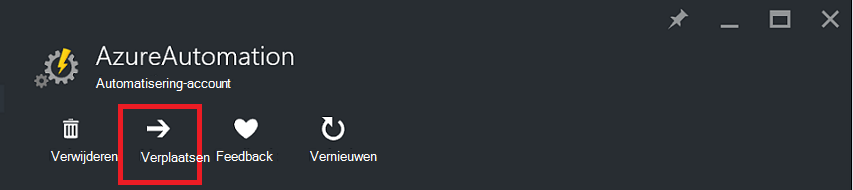
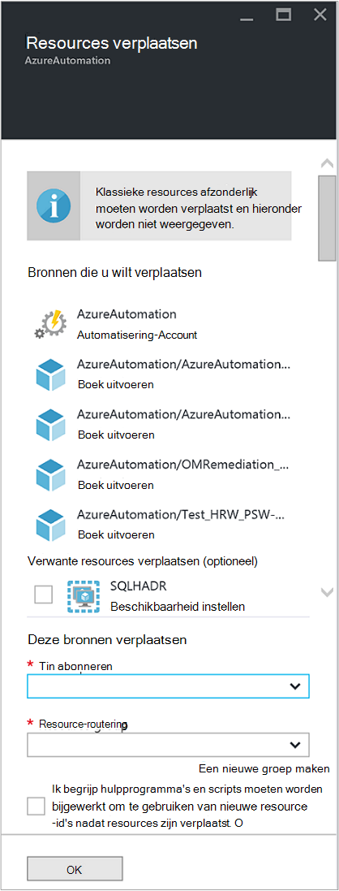

<properties
   pageTitle="Automatisering-Account en Resources migreren | Microsoft Azure"
   description="In dit artikel wordt beschreven hoe een automatisering-Account in Azure automatisering en bijbehorende hulpbronnen uit één abonnement naar de andere verplaatsen."
   services="automation"
   documentationCenter=""
   authors="MGoedtel"
   manager="jwhit"
   editor="tysonn" />
<tags
   ms.service="automation"
   ms.devlang="na"
   ms.topic="article"
   ms.tgt_pltfrm="na"
   ms.workload="infrastructure-services"
   ms.date="07/07/2016"
   ms.author="magoedte" />

# <a name="migrate-automation-account-and-resources"></a>Automatisering-Account en resources migreren

Voor automatisering accounts en de bijbehorende hulpbronnen (dat wil zeggen activa, runbooks, modules, enzovoort) die u hebt gemaakt in de portal van Azure en wilt migreren van een resourcegroep naar een andere of van een abonnement op een ander, kunt u dit doen eenvoudig met de functie [verplaatsen van resources](../resource-group-move-resources.md) beschikbaar zijn in de portal van Azure. Echter voordat u deze actie, moet u eerst nagaan de volgende [Controlelijst voordat u verdergaat resources](../resource-group-move-resources.md#Checklist-before-moving-resources) en bovendien de onderstaande specifiek voor automatisering.   

1.  De bestemming abonnement/resourcegroep moet zich in dezelfde regio als bron.  Wat betekent worden niet automatisering accounts tussen regio's verplaatst.
2.  Wanneer u resources (bijvoorbeeld runbooks, taken, enzovoort) verplaatst, worden zowel de bronnengroep en de doelgroep vergrendeld voor de duur van de bewerking. Schrijven en verwijderen op de groepen worden geblokkeerd totdat de overstap is voltooid.  
3.  Een runbooks of variabelen die verwijzen naar een abonnement of resource-ID van het bestaande abonnement moet worden bijgewerkt nadat de migratie is voltooid.   


>[AZURE.NOTE] Deze functie biedt geen ondersteuning voor zwevend klassieke automatisering resources.

## <a name="to-move-the-automation-account-using-the-portal"></a>Het automatisering-Account met behulp van de portal verplaatsen

1. Van uw account automatisering, klikt u op **verplaatsen** aan de bovenkant van het blad.<br> <br> 
2. Klik op het blad **verplaatsen van resources** , houd er rekening mee dat daaraan resources die zijn gerelateerd aan uw account automatisering zowel de groep(en) waaraan de resource.  Selecteer het **abonnement** en de **resourcegroep** in de vervolgkeuzelijsten, of Selecteer de optie **een nieuwe resourcegroep maken** en voer een nieuwe naam van de resource-groep in het desbetreffende veld.  
3. Controleer en selecteer het selectievakje om te bevestigen dat u *begrijpen hulpprogramma's en scripts moeten worden bijgewerkt om te gebruiken van nieuwe resource-id nadat resources zijn verplaatst* en klik vervolgens op **OK**.<br> <br>   

Deze actie worden enkele minuten duren om te voltooien.  In **meldingen**, wordt weergegeven met de status van elke actie die uitgevoerd - validatie, migratie wordt en kiest u vervolgens ten slotte waarop deze is voltooid.     

## <a name="to-move-the-automation-account-using-powershell"></a>Het automatisering-Account via PowerShell verplaatsen

Bestaande automatisering om bronnen te verplaatsen naar een ander resourcegroep of -abonnement, gebruikt u de cmdlet **Get-AzureRmResource** om het specifieke automatisering-account en klik op **Verplaatsen-AzureRmResource** -cmdlet voor het uitvoeren van de verplaatsen.

Het eerste voorbeeld ziet hoe u een account automatisering verplaatsen naar een nieuwe resourcegroep.

   ```
    $resource = Get-AzureRmResource -ResourceName "TestAutomationAccount" -ResourceGroupName "ResourceGroup01"
    Move-AzureRmResource -ResourceId $resource.ResourceId -DestinationResourceGroupName "NewResourceGroup"
   ``` 

Nadat u het bovenstaande voorbeeld uitvoert, wordt u gevraagd om te controleren of dat u wilt deze actie uitvoeren.  Zodra u klikt u op **Ja** en het script om verder te toestaan, ontvangt u geen geen meldingen terwijl dit de migratie uitvoert.  

Als u wilt verplaatsen naar een nieuw abonnement, moet u een waarde voor de parameter *DestinationSubscriptionId* bevatten.

   ```
    $resource = Get-AzureRmResource -ResourceName "TestAutomationAccount" -ResourceGroupName "ResourceGroup01"
    Move-AzureRmResource -ResourceId $resource.ResourceId -DestinationResourceGroupName "NewResourceGroup" -DestinationSubscriptionId "SubscriptionId"
   ``` 

Net als met het vorige voorbeeld, wordt u gevraagd om te bevestigen verplaatsen.  

## <a name="next-steps"></a>Volgende stappen

- Zie voor meer informatie over het verplaatsen van resources naar nieuwe resourcegroep abonnement [resources naar nieuwe resourcegroep abonnement verplaatsen](../resource-group-move-resources.md)
- Raadpleeg voor meer informatie over Rolgebaseerd toegangsbeheer in Azure automatisering, [Rolgebaseerd toegangsbeheer in Azure automatisering](../automation/automation-role-based-access-control.md).
- Meer informatie over PowerShell-cmdlets voor het beheren van uw abonnement, raadpleegt u [Azure PowerShell gebruiken met bronbeheer](../powershell-azure-resource-manager.md)
- Zie voor meer informatie over de functies van de portal voor het beheren van uw abonnement, [met behulp van de Azure-Portal als u wilt resources beheren](../azure-portal/resource-group-portal.md). 
