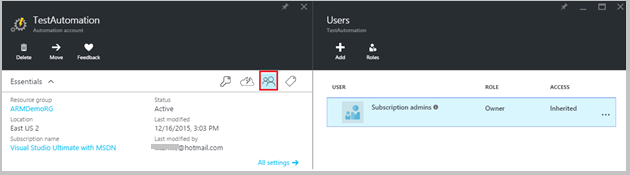
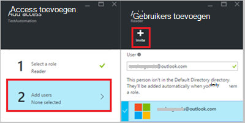
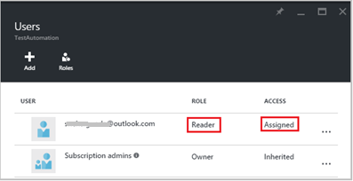

<properties 
   pageTitle="Rolgebaseerd toegangsbeheer in Azure automatisering | Microsoft Azure"
   description="Rolgebaseerd toegangsbeheer (RBAC) kunt toegangsbeheer voor Azure resources. In dit artikel wordt beschreven hoe RBAC in Azure automatisering instellen."
   services="automation"
   documentationCenter=""
   authors="mgoedtel"
   manager="jwhit"
   editor="tysonn"
   keywords="automatisering rbac, azure rbac toegangsbeheer op basis van rollen" />
<tags 
   ms.service="automation"
   ms.devlang="na"
   ms.topic="get-started-article"
   ms.tgt_pltfrm="na"
   ms.workload="infrastructure-services"
   ms.date="09/12/2016"
   ms.author="magoedte;sngun"/>

# Rolgebaseerd toegangsbeheer in Azure automatisering

## Toegangsbeheer op basis van rollen

Rolgebaseerd toegangsbeheer (RBAC) kunt toegangsbeheer voor Azure resources. [RBAC](../active-directory/role-based-access-control-configure.md)gebruikt, kunt u scheiden van taken in uw team en alleen de hoeveelheid toegang verlenen aan gebruikers, groepen en toepassingen die ze nodig hebben om uit te voeren hun taken. Rolgebaseerd toegang kan worden verleend voor gebruikers met de Azure-portal, Azure opdrachtregel extra of Azure Management-API's.

## RBAC in automatisering-Accounts

Access wordt in Azure automatisering verleend door de juiste RBAC rol toewijzen aan gebruikers, groepen en toepassingen voor het bereik van de account automatisering. Hier volgen de ingebouwde functies worden ondersteund door een automatisering-account:  

|**Rol** | **Beschrijving** |
|:--- |:---|
| Eigenaar | De rol van eigenaar voor toegang tot alle resources en acties binnen een automatisering-account om toegang tot andere gebruikers, groepen en toepassingen voor het beheren van het account dat automatisering inclusief. |
| Inzender | De rol Inzender kunt u alles behalve het wijzigen van de toegangsmachtigingen van andere gebruiker met een automatisering-account beheren. |
| Lezer | De rol van de lezer kunt u alle bronnen weergeven in een automatisering-account, maar geen wijzigingen kunt aanbrengen.|
| Automatisering Operator | De rol automatisering Operator kunt u uitvoeren van operationele taken zoals starten, stoppen, onderbreken, hervatten en taken plannen. Deze functie is handig als u wilt beveiligen van uw resources automatisering Account zoals referenties activa en runbooks wordt bekeken of gewijzigd, maar nog wel leden van uw organisatie deze runbooks uitvoeren. |
| Beheerder van de gebruiker toegang | De gebruiker toegang-beheerdersrol kunt u de toegang van gebruikers met Azure automatisering accounts beheren. |

>[AZURE.NOTE] U kunt geen toegangsrechten op een specifieke runbook of runbooks, alleen op de resources en de acties in automatisering account verlenen.  

In dit artikel wordt we u begeleid RBAC in Azure automatisering instellen. Maar eerst eens nader bekijken afzonderlijke machtigingen de inzender, Reader, automatisering Operator en Access Gebruikersbeheerder zodat we een goed inzicht voordat u iedereen rechten aan het account automatisering krijgen.  Anders dit kan leiden tot onbedoelde of ongewenste consequenties.     

## Machtigingen voor rol Inzender

De volgende tabel vindt de specifieke acties die kunnen worden uitgevoerd door de rol Inzender in automatisering.

| **Resourcetype** | **Lezen** | **Schrijven** | **Verwijderen** | **Andere acties** |
|:--- |:---|:--- |:---|:--- |
| Azure automatisering-Account |  |  |  | | 
| Automatisering certificaat activa |  |  |  | |
| Automatisering verbinding activa |  |  |  | | 
| Automatisering verbinding Type activa |  |  |  | | 
| Automatisering referentie activa |  |  |  | |
| Automatisering planning activa |  |  |  | |
| Automatisering variabele activa |  |  |  | |
| Automatisering gewenst provinciale configuratie | | | |  |
| Resourcetype van hybride Runbook werknemer |  | |  | | 
| Azure automatisering taak |  |  | |  | 
| Automatisering taak Stream |  | | | | 
| Automatisering projectplanning |  |  |  | |
| Automatisering Module |  |  |  | |
| Azure automatisering Runbook |  |  |  |  |
| Automatisering Runbook concept |  | | |  |
| Automatisering Runbook concept testtaak |  |  | |  | 
| Automatisering Webhook |  |  |  |  |

## Lezer rolmachtigingen

De volgende tabel vindt de specifieke acties die kunnen worden uitgevoerd door de rol van de lezer in automatisering.

| **Resourcetype** | **Lezen** | **Schrijven** | **Verwijderen** | **Andere acties** |
|:--- |:---|:--- |:---|:--- |
| Klassieke abonnement beheerder |  | | | 
| Management vergrendelen |  | | | 
| Machtiging |  | | |
| Provider bewerkingen |  | | | 
| Roltoewijzing |  | | | 
| De roldefinitie van de |  | | | 

## Automatisering Operator rolmachtigingen

De volgende tabel vindt de specifieke acties die kunnen worden uitgevoerd door de rol automatisering Operator in automatisering.

| **Resourcetype** | **Lezen** | **Schrijven** | **Verwijderen** | **Andere acties** |
|:--- |:---|:--- |:---|:--- |
| Azure automatisering-Account |  | | | 
| Automatisering certificaat activa | | | |
| Automatisering verbinding activa | | | |
| Automatisering verbinding Type activa | | | |
| Automatisering referentie activa | | | |
| Automatisering planning activa |  |  | | |
| Automatisering variabele activa | | | |
| Automatisering gewenst provinciale configuratie | | | | |
| Resourcetype van hybride Runbook werknemer | | | | | 
| Azure automatisering taak |  |  | |  | 
| Automatisering taak Stream |  | | |  
| Automatisering projectplanning |  |  | | |
| Automatisering Module | | | |
| Azure automatisering Runbook |  | | | |
| Automatisering Runbook concept | | | |
| Automatisering Runbook concept testtaak | | | |  
| Automatisering Webhook | | | |

Voor meer informatie bevat de [automatisering operatoracties](../active-directory/role-based-access-built-in-roles.md#automation-operator) de acties die worden ondersteund door de rol van de operator automatisering op het account dat automatisering en de bijbehorende bronnen.

## Gebruiker toegang beheerdersmachtigingen rol

De volgende tabel vindt de specifieke acties die kunnen worden uitgevoerd door de gebruiker toegang-beheerdersrol in automatisering.

| **Resourcetype** | **Lezen** | **Schrijven** | **Verwijderen** | **Andere acties** |
|:--- |:---|:--- |:---|:--- |
| Azure automatisering-Account |  | | | |
| Automatisering certificaat activa |  | | | |
| Automatisering verbinding activa |  | | | |
| Automatisering verbinding Type activa |  | | | |
| Automatisering referentie activa |  | | | |
| Automatisering planning activa |  | | | |
| Automatisering variabele activa |  | | | |
| Automatisering gewenst provinciale configuratie | | | | |
| Resourcetype van hybride Runbook werknemer |  | | | | 
| Azure automatisering taak |  | | | | 
| Automatisering taak Stream |  | | | | 
| Automatisering projectplanning |  | | | |
| Automatisering Module |  | | | |
| Azure automatisering Runbook |  | | | |
| Automatisering Runbook concept |  | | | |
| Automatisering Runbook concept testtaak |  | | | | 
| Automatisering Webhook |  | | |

## RBAC configureren voor uw automatisering-Account met behulp van Azure-Portal

1.  Meld u aan bij de [Portal van Azure](https://portal.azure.com/) en uw account automatisering openen vanuit het blad automatisering Accounts.  

2.  Klik op het **Access** -besturingselement in de rechterbovenhoek. Hiermee opent u het **gebruikers** blad waarin u de nieuwe gebruikers, groepen en toepassingen voor het beheren van uw account automatisering en bestaande rollen die kunnen worden geconfigureerd voor het Account automatisering weergeven kunt toevoegen.  

      

>[AZURE.NOTE] Er bestaat al **abonnement beheerders** als de standaardgebruiker. Het abonnement beheerders active directory-groep bevat de service databasebeheerder (s) en co-administrator(s) voor uw Azure-abonnement. De Service-beheerder is de eigenaar van uw Azure-abonnement en de bijbehorende bronnen en wordt de rol van eigenaar overgenomen hebben voor de automatisering-accounts te. Dit betekent dat de toegang **overgenomen** voor **servicebeheerders en co-beheerders** van een abonnement en de **toegewezen** voor alle andere gebruikers. Klik op **abonnement beheerders** als u meer details over de machtigingen.  

### Een nieuwe gebruiker toevoegen en toewijzen van een rol

1.  Klik op het blad gebruikers op **toevoegen** om te openen van de **access-blade toevoegen** kunt u een gebruiker, groep of toepassing toevoegen, en wijs een rol toe aan.  

      

2.  Selecteer een rol in de lijst met beschikbare rollen. Kiezen we de functie **lezer** , maar u kunt een van de beschikbare ingebouwde rollen die ondersteuning biedt voor een automatisering-Account of een aangepaste rol die u hebt gedefinieerd.  

      

3.  Klik op **gebruikers toevoegen** om te openen van het blad **gebruikers toevoegen** . Als u alle gebruikers hebt toegevoegd, kunt groepen, of andere toepassingen voor het beheren van uw abonnement en vervolgens deze gebruikers worden weergegeven en u ze selecteren om toe te voegen van access. Als er geen gebruikers weergegeven of als de gebruiker waarin u geïnteresseerd bent toevoegen niet wordt vermeld klikt u op **uitnodigen** om te openen van het blad **uitnodigen Gast** , waar u een gebruiker met een geldig e-mailadres van een Microsoft-account zoals Outlook.com, OneDrive of Xbox Live-id's kunt uitnodigen. Nadat u het e-mailadres van de gebruiker hebt ingevoerd, klikt u op de optie **selecteren** als u wilt toevoegen van de gebruiker en klik vervolgens op **OK**. 

      
 
    Nu ziet u de gebruiker die is toegevoegd aan het blad **gebruikers** met de rol van de **lezer** toegewezen.  

      

    U kunt ook een rol toewijzen aan de gebruiker in het blad **rollen** . 

1. Klik op **rollen** van het blad gebruikers de **rollen blade**openen. Vanuit deze blade, kunt u de naam van de rol, het aantal gebruikers en groepen die zijn toegewezen aan die rol bekijken.

      
   
    >[AZURE.NOTE] Rolgebaseerd toegangsbeheer kan alleen worden ingesteld op het niveau automatisering Account en niet op elke resource onder het automatisering-Account.

    U kunt meer dan één rol toewijzen aan een gebruiker, groep of toepassing. Bijvoorbeeld als we de rol **Automatisering Operator** samen met de **rol van lezer** aan de gebruiker toevoegt, kunnen klikt u vervolgens ze bekijken van alle automatisering resources, evenals de runbook taken uitvoeren. U kunt de vervolgkeuzelijst voor een overzicht van rollen toegewezen aan de gebruiker uitvouwen.  

      
 
### Een gebruiker verwijderen

De toegangsmachtiging voor een gebruiker die niet de automatisering-Account wordt beheerd, of die werkt niet meer voor de organisatie, kunt u verwijderen. Hier volgen de stappen voor het verwijderen van een gebruiker: 

1.  Selecteer in het blad **gebruikers** de roltoewijzing die u wilt verwijderen.

2.  Klik op de knop **verwijderen** in het blad van toewijzing details.

3.  Klik op **Ja** om te bevestigen. 

      

## Rol toegewezen gebruiker

Wanneer een gebruiker die zijn toegewezen aan een rol zich aanmelden bij hun automatisering-account, kunnen ze de eigenaar van de account wordt vermeld in de lijst met **Mappen standaard**nu zien. Om te kunnen weergeven het automatisering-account dat ze zijn toegevoegd aan, moeten ze de standaardmap overschakelen naar de standaardmap van de eigenaar.  

  

### De gebruikerservaring voor automatisering operator rol

Wanneer een gebruiker die is toegewezen aan de weergaven van de rol automatisering Operator het automatisering account dat ze zijn toegewezen, ze kunnen alleen weergeven de lijst met runbooks, runbook taken en schema's die zijn gemaakt in het account dat automatisering maar geen hun definitie. Ze kunnen starten, stoppen, onderbreken, hervatten of de taak runbook plannen. De gebruiker hebben geen toegang tot andere bronnen automatisering zoals configuraties hybride werknemersgroepen of DSC knooppunten.  

  

Wanneer de gebruiker op het runbook klikt, zijn de opdrachten in de bron weergeven of bewerken van het runbook niet wordt opgegeven als de rol van de operator automatisering toegang tot deze niet is toegestaan.  

  

De gebruiker toegang heeft om te bekijken en schema's maken, maar hebben geen toegang tot een ander activatype.  

  

Deze gebruiker ook heeft geen toegang tot de webhooks die is gekoppeld aan een runbook weergeven

  

## RBAC configureren voor uw automatisering-Account via Azure PowerShell

Op basis van een rol kan ook worden geconfigureerd met een automatisering-Account gebruik van de volgende [Azure PowerShell-cmdlets](../active-directory/role-based-access-control-manage-access-powershell.md).

• [Get-AzureRmRoleDefinition](https://msdn.microsoft.com/library/mt603792.aspx) bevat alle RBAC rollen die beschikbaar in Azure Active Directory zijn. U kunt deze opdracht samen met de **naam van** eigenschap gebruiken voor een overzicht van de acties die kunnen worden uitgevoerd door een specifieke rol.  
    **Voorbeeld:**  
      

• [Get-AzureRmRoleAssignment](https://msdn.microsoft.com/library/mt619413.aspx) lijsten Azure AD RBAC roltoewijzingen voor het opgegeven bereik. Deze opdracht zonder parameters, geeft als resultaat alle roltoewijzingen die zijn aangebracht onder het abonnement. Gebruik de parameter **ExpandPrincipalGroups** op lijst access toewijzingen voor de opgegeven gebruiker, evenals de groepen die de gebruiker lid van is.  
    **Voorbeeld:** Gebruik de volgende opdracht uit voor een overzicht van alle gebruikers en hun rollen in een automatisering-mailaccount.

    Get-AzureRMRoleAssignment -scope “/subscriptions/<SubscriptionID>/resourcegroups/<Resource Group Name>/Providers/Microsoft.Automation/automationAccounts/<Automation Account Name>” 

• [Nieuw AzureRmRoleAssignment](https://msdn.microsoft.com/library/mt603580.aspx) access toewijzen aan gebruikers, groepen en toepassingen naar een bepaald bereik.  
    **Voorbeeld:** Gebruik de volgende opdracht uit de rol 'Automatisering Operator' voor een gebruiker in het bereik automatisering Account toewijzen.

    New-AzureRmRoleAssignment -SignInName <sign-in Id of a user you wish to grant access> -RoleDefinitionName "Automation operator" -Scope “/subscriptions/<SubscriptionID>/resourcegroups/<Resource Group Name>/Providers/Microsoft.Automation/automationAccounts/<Automation Account Name>”  

• Gebruik [Verwijderen AzureRmRoleAssignment](https://msdn.microsoft.com/library/mt603781.aspx) toegang van een opgegeven gebruiker, groep of toepassing verwijderen uit een bepaald bereik.  
    **Voorbeeld:** Gebruik de volgende opdracht uit de gebruiker verwijderen uit de rol 'Automatisering Operator' in het bereik automatisering-Account.

    Remove-AzureRmRoleAssignment -SignInName <sign-in Id of a user you wish to remove> -RoleDefinitionName "Automation Operator" -Scope “/subscriptions/<SubscriptionID>/resourcegroups/<Resource Group Name>/Providers/Microsoft.Automation/automationAccounts/<Automation Account Name>”

Vervang **Id aanmelden**, **abonnements-Id**, **de naam van de resource-groep** en **automatisering accountnaam** met uw accountgegevens in de voorbeelden hierboven. Kies **Ja** wanneer u wordt gevraagd om te bevestigen voordat u verdergaat roltoewijzing gebruiker verwijderen.   

## Volgende stappen
-  Voor informatie over de verschillende manieren RBAC configureren voor Azure automatisering, raadpleegt u voor het [beheren van RBAC met Azure PowerShell](../active-directory/role-based-access-control-manage-access-powershell.md).
- Zie voor meer informatie over de verschillende manieren om te starten een runbook, [een runbook starten](automation-starting-a-runbook.md)
- Raadpleeg voor meer informatie over de verschillende runbook [Azure automatisering runbook typen](automation-runbook-types.md)

