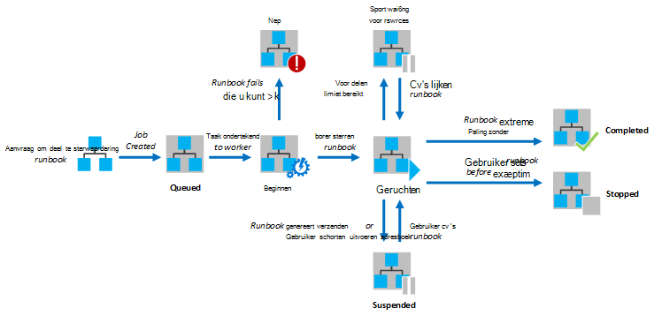
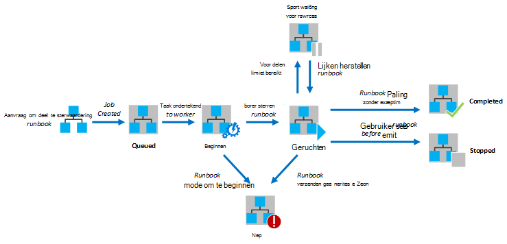

<properties
   pageTitle="Runbook uitvoering in Azure automatisering"
   description="Beschrijving van de details van hoe een runbook in Azure automatisering wordt verwerkt."
   services="automation"
   documentationCenter=""
   authors="mgoedtel"
   manager="stevenka"
   editor="tysonn" />
<tags
   ms.service="automation"
   ms.devlang="na"
   ms.topic="article"
   ms.tgt_pltfrm="na"
   ms.workload="infrastructure-services"
   ms.date="03/21/2016"
   ms.author="bwren" />

# Runbook uitvoering in Azure automatisering

Wanneer u een runbook in Azure automatisering begint, wordt een taak gemaakt. Een taak is een exemplaar van één uitvoering van een runbook. Een werknemer Azure automatisering is toegewezen aan elke taak uitvoeren. Terwijl werknemers worden gedeeld door meerdere Azure-accounts, zijn taken uit verschillende automatisering accounts van elkaar gescheiden. U beschikt niet over controle over welke werknemer service wordt de aanvraag voor uw taak.  Een enkel runbook kan meerdere taken tegelijkertijd uitvoert hebben. Wanneer u de lijst met runbooks in de portal van Azure weergeeft, wordt deze lijst met de status van de laatste opdracht die voor elke runbook is gestart. U kunt de lijst met taken voor elke runbook weergeven om te kunnen bijhouden van de status van de verschillende. Zie voor een beschrijving van de verschillende statussen, [Statussen van de taak](#job-statuses).

In het volgende diagram ziet u de levensduur van een taak runbook voor [grafische runbooks](automation-runbook-types.md#graphical-runbooks) en [runbooks PowerShell-werkstroom](automation-runbook-types.md#powershell-workflow-runbooks).

In het volgende diagram ziet u de levensduur van een taak runbook voor [PowerShell runbooks](automation-runbook-types.md#powershell-runbooks).

Uw taken hebben toegang tot uw resources Azure doordat een verbinding met uw Azure-abonnement. Ze alleen hebt toegang tot bronnen in uw datacenter als deze resources toegankelijk zijn vanuit de openbare cloud zijn.

## Statussen die taak

De volgende tabel beschrijft de verschillende statussen die voor een taak mogelijk zijn.

| Status| Beschrijving|
|:---|:---|
|Voltooid|De taak is voltooid.|
|Is mislukt| Voor [grafische en de PowerShell-werkstroom runbooks](automation-runbook-types.md), is het runbook mislukt compileren.  Voor [PowerShell-Script runbooks](automation-runbook-types.md), het runbook kan niet worden gestart of de taak is een uitzondering opgetreden. |
|Is mislukt, wachten op resources|De taak is mislukt omdat deze de limiet van de [reële delen](#fairshare) driemaal bereikt en vanuit het dezelfde controlepunt of vanaf het begin van het runbook telkens wanneer gestart.|
|In de wachtrij|De taak is resources wachten op een werknemer Automatisering beschikbaar komen, zodat deze kan worden gestart.|
|Starten|De taak is toegewezen aan een werknemer en het systeem wordt starten.|
|Hervatten|Het systeem wordt de taak hervatten nadat deze is onderbroken.|
|Uitgevoerd|De taak is uitgevoerd.|
|Actief is, wachten op resources|De taak is verwijderd omdat de limiet [fair delen](#fairshare) is bereikt. Hierbij wordt kort van de laatste controlepunt.|
|Gestopt|De taak is door de gebruiker afgebroken voordat deze is voltooid.|
|Stoppen|Het systeem wordt momenteel het stoppen van de taak.|
|Geschorst|De taak is geblokkeerd door de gebruiker, door het systeem of door een opdracht in het runbook. Een taak die is geschorst opnieuw kan worden gestart en wordt hervat vanaf de laatste controlepunt of vanaf het begin van het runbook als er geen controlepunten. Het runbook wordt alleen worden geblokkeerd door het systeem in het geval van een uitzondering. ErrorActionPreference is standaard ingesteld op **Doorgaan** wil zeggen dat de taak wordt behouden uitgevoerd op een fout. Als deze voorkeur-variabele is ingesteld op **niet meer** schorten de taak op een fout.  Alleen van toepassing op [grafische en de PowerShell-werkstroom runbooks](automation-runbook-types.md) .|
|Geschorst|Het systeem wordt geprobeerd om op te schorten van de taak op verzoek van de gebruiker. Het runbook moet de volgende controlepunt hebt bereikt voordat deze kan worden uitgeschakeld. Als al de laatste controlepunt is verstreken, klikt u vervolgens duurt het voordat deze kan worden uitgeschakeld.  Alleen van toepassing op [grafische en de PowerShell-werkstroom runbooks](automation-runbook-types.md) .|

## Taakstatus via Azure Management Portal weergeven

### Automatisering Dashboard

Het Dashboard automatisering bevat een overzicht van alle de runbooks voor een bepaalde automatisering-account. Het bevat ook een overzicht van het gebruik van het account. De samenvatting grafiek bevat het nummer van de totale taken voor alle runbooks die elke status over een bepaald aantal dagen of uren ingevoerd. U kunt het tijdsbereik in de rechterbovenhoek van de grafiek kunt selecteren. De tijdas van de van de grafiek wordt gewijzigd op basis van het type Tijdsbereik die u selecteert. U kunt kiezen of om weer te geven van de regel voor een bepaalde status door erop te klikken boven aan het scherm.

U kunt de volgende stappen uit om het Dashboard automatisering weer te geven.

1. In de beheerportal Azure **automatisering** selecteren en de naam van een account automatisering klik vervolgens op.
1. Selecteer het tabblad **Dashboard** .

### Runbook Dashboard

Het Runbook Dashboard bevat een overzicht voor een enkele runbook. De samenvatting grafiek bevat het nummer van de totale taken voor het runbook die elke status over een bepaald aantal dagen of uren ingevoerd. U kunt het tijdsbereik in de rechterbovenhoek van de grafiek kunt selecteren. De tijdas van de van de grafiek wordt gewijzigd op basis van het type Tijdsbereik die u selecteert. U kunt kiezen of om weer te geven van de regel voor een bepaalde status door erop te klikken boven aan het scherm.

U kunt de volgende stappen uit om het Runbook Dashboard weer te geven.

1. In de beheerportal Azure **automatisering** selecteren en de naam van een account automatisering klik vervolgens op.
1. Klik op de naam van een runbook.
1. Selecteer het tabblad **Dashboard** .

### Taakoverzicht van de

U kunt een lijst met alle taken die zijn gemaakt voor een bepaalde runbook en de meest recente status weergeven. U kunt deze lijst door de taakstatus en het datumbereik voor de laatste wijziging van de taak filteren. Klik op de naam van een taak om gedetailleerde informatie en de uitvoer te geven. De gedetailleerde weergave van de taak bevat de waarden voor de runbook parameters die zijn opgegeven naar die taak.

De volgende stappen kunt u de taken voor een runbook weergeven.

1. In de beheerportal Azure **automatisering** selecteren en de naam van een account automatisering klik vervolgens op.
1. Klik op de naam van een runbook.
1. Selecteer het tabblad **taken** .
1. Klik op de kolom **Taak gemaakt** voor een taak voor het weergeven van de details en uitvoer.

## Taakstatus via Windows PowerShell ophalen

U kunt de [Get-AzureAutomationJob](http://msdn.microsoft.com/library/azure/dn690263.aspx) gebruiken om op te halen van de taken die zijn gemaakt voor een runbook en de details van een bepaalde taak. Als u een runbook met Windows PowerShell gebruiken [Start-AzureAutomationRunbook](http://msdn.microsoft.com/library/azure/dn690259.aspx)begint, retourneert deze de resulterende taak. Gebruik de uitvoer [Get-AzureAutomationJob](http://msdn.microsoft.com/library/azure/dn690263.aspx)om de uitvoer van een taak.

De volgende opdrachten in de steekproef de laatste opdracht voor het runbook van een steekproef zijn opgehaald en weergegeven dat de status, de waarden bieden voor de parameters runbook en de uitvoer van de taak.

    $job = (Get-AzureAutomationJob –AutomationAccountName "MyAutomationAccount" –Name "Test-Runbook" | sort LastModifiedDate –desc)[0]
    $job.Status
    $job.JobParameters
    Get-AzureAutomationJobOutput –AutomationAccountName "MyAutomationAccount" -Id $job.Id –Stream Output

## Reële delen

Om te delen bronnen tussen alle runbooks in de cloud, wordt Azure automatisering tijdelijk elke taak verwijderd nadat deze al bezig 3 uur.    [Grafische](automation-runbook-types.md#graphical-runbooks) en de [PowerShell-werkstroom](automation-runbook-types.md#powershell-workflow-runbooks) runbooks wordt hervat van hun laatste [controlepunt](http://technet.microsoft.com/library/dn469257.aspx#bk_Checkpoints). Tijdens deze periode, wordt de taak weergegeven de status actief is, wachten op Resources. Als het runbook geen controlepunten heeft of de taak niet het eerste controlepunt bereikt heeft voordat het geheugen wordt verwijderd, wordt deze opnieuw vanaf het begin starten.  [PowerShell](automation-runbook-types.md#powershell-runbooks) runbooks worden altijd opnieuw gestart vanaf het begin omdat ze geen ondersteuning biedt voor controlepunten.

>[AZURE.NOTE] De limiet fair delen is niet van toepassing op runbook taken uitvoeren op hybride Runbook werknemers.

Als het runbook opnieuw is opgestart vanaf het dezelfde controlepunt of vanaf het begin van het runbook opeenvolgende driemaal, wordt deze met de status mislukt, wachten op resources worden beëindigd. Dit is beschermen tegen runbooks uitgevoerd voor onbepaalde tijd zonder is voltooid, zoals ze niet kunnen deze aanbrengen in het volgende controlepunt zijn zonder geheugen opnieuw wordt verwijderd. In dit geval ontvangt u de volgende uitzondering met de fout.

*De taak kan niet worden voortgezet uitgevoerd omdat deze net zo vaak verwijdering uit het dezelfde controlepunt. Zorg ervoor dat uw Runbook wordt niet langdurige bewerkingen zonder dat de staat.*

Wanneer u een runbook maakt, moet u ervoor zorgen dat de tijd om uit te voeren van alle activiteiten tussen twee controlepunten niet meer dan 3 uur. Mogelijk moet u controlepunten toevoegen aan uw runbook om ervoor te zorgen dat deze niet 3 uur limiet of verdeel lang bewerkingen uitgevoerd. Uw runbook mogelijk bijvoorbeeld een opnieuw indexeren uitvoeren op een grote SQL-database. Als deze één bewerking niet wordt voltooid binnen de kolomgrenzen fair delen, klikt u vervolgens de taak verwijderd en opnieuw worden gestart vanaf het begin. In dit geval moet u het opnieuw indexeren betrekking heeft in meerdere stappen, zoals het opnieuw indexeren van één tabel per keer, maar verdeel en vervolgens een controlepunt invoegen na elke bewerking, zodat de taak kan hervatten na de laatste bewerking is voltooid.

## Volgende stappen

- [Een runbook starten in Azure automatisering](automation-starting-a-runbook.md)
