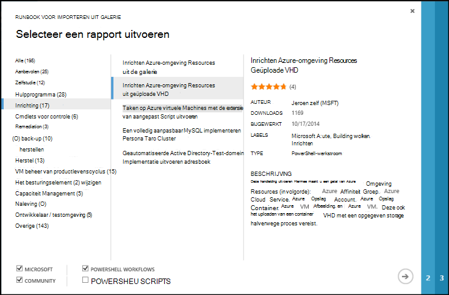
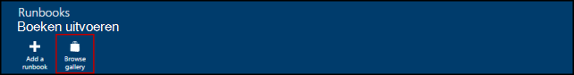
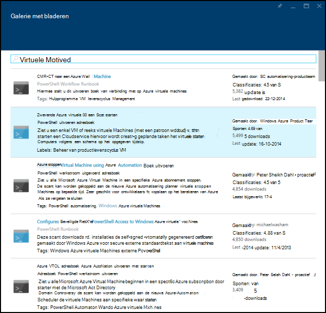
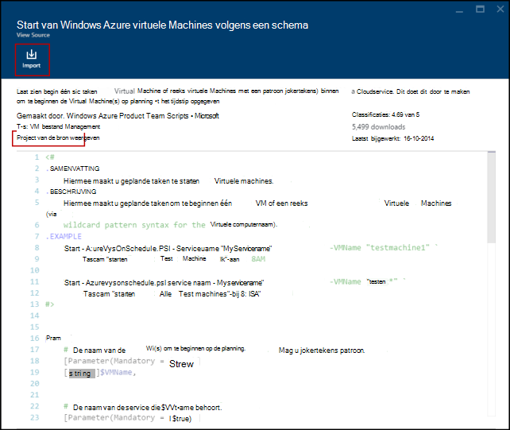
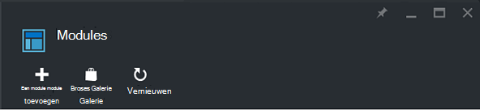
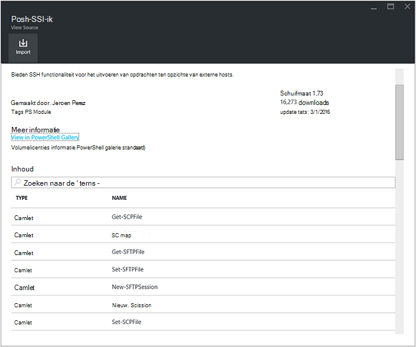
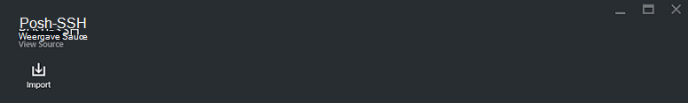
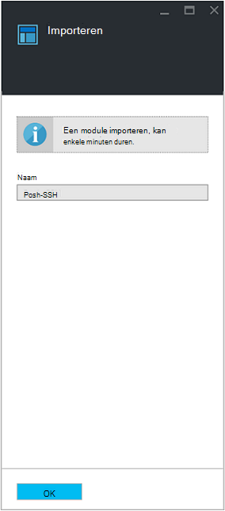

<properties
    pageTitle="Runbook en module galerieën voor Azure automatisering | Microsoft Azure"
    description="Runbooks en modules van Microsoft en de community zijn beschikbaar voor het installeren en gebruiken in uw omgeving Azure automatisering.  In dit artikel wordt beschreven hoe u deze resources kunt openen en uw runbooks in de galerie met bijdragen."
    services="automation"
    documentationCenter=""
    authors="mgoedtel"
    manager="jwhit"
    editor="tysonn" />
<tags
    ms.service="automation"
    ms.devlang="na"
    ms.topic="article"
    ms.tgt_pltfrm="na"
    ms.workload="infrastructure-services"
    ms.date="09/18/2016"
    ms.author="magoedte;bwren" />

# Runbook en module galerieën voor het automatiseren van Azure

In plaats van uw eigen runbooks en modules in Azure automatisering maakt, zijn er verschillende scenario's die al zijn ingebouwd van Microsoft en de community.  U kunt deze scenario's ongewijzigd gebruiken of u kunt ze gebruiken als uitgangspunt en bewerk ze voor uw specifieke vereisten.

U kunt runbooks krijgen van de [Galerie met Runbook](#runbooks-in-runbook-gallery) en modules vanuit de [Galerie met PowerShell](#modules-in-powerShell-gallery).  U kunt ook bijdragen aan de community door het delen van scenario's die u ontwikkelen.

## Runbooks in Runbook-galerie

De [Galerie met Runbook](http://gallery.technet.microsoft.com/scriptcenter/site/search?f[0].Type=RootCategory&f[0].Value=WindowsAzure&f[1].Type=SubCategory&f[1].Value=WindowsAzure_automation&f[1].Text=Automation) biedt allerlei runbooks van Microsoft en de community die u in Azure automatisering importeren kunt. U kunt beide downloaden een runbook vanuit de galerie die wordt gehost in het [TechNet Script Center](http://gallery.technet.microsoft.com/)of u kunt rechtstreeks runbooks importeren uit de galerie uit het Azure klassieke portal of Azure-portal.

U kunt alleen met de importeren rechtstreeks vanuit de galerie Runbook via de portal van Azure klassieke of Azure-portal. U kunt deze functie via Windows PowerShell niet uitvoeren.

>[AZURE.NOTE] Moet u de inhoud van een runbooks dat u vanuit de galerie met Runbook en extreme voorzichtig in installeren en uitvoeren van deze in een productieomgeving valideren. |

### Een runbook uit de galerie Runbook in de portal van Azure klassieke importeren

1. Klik in de Portal Azure klikt u op, **New**, **App-Services**, **automatisering**, **Runbook**, **Uit galerie**.
2. Selecteer een categorie om weer te geven gerelateerde runbooks en selecteer een runbook voor details. Wanneer u het runbook die u wilt selecteren, klikt u op de pijl naar rechts.

    

3. Controleer de inhoud van het runbook en eventuele vereisten in de beschrijving van de opmerking. Klik op de knop pijl-rechts wanneer u klaar bent.
4. Geef de details van het runbook en klik op de knop vinkje. De naam van het runbook al ingevuld.
5. Het runbook wordt weergegeven op het tabblad **Runbooks** voor het Account dat automatisering.

### Een runbook importeren uit de galerie Runbook in de portal van Azure

1. Klik in de Portal Azure uw automatisering-account te openen.
2. Klik op de tegel **Runbooks** om de lijst van runbooks te openen.
3. Klik op de knop **Bladeren galerie** .

    

4. Zoek naar de galerie-item u wilt gebruiken en selecteer deze om de berichtdetails te bekijken.

    

4. Klik op **het bronproject weergave** het item in de [TechNet Script Center](http://gallery.technet.microsoft.com/)bekijken.
5. Als u wilt importeren in een item, klikt u op de details weergeven en klik vervolgens op de knop **importeren** .

    

6. (Optioneel) de naam van het runbook wijzigen en klik vervolgens op **OK** als u wilt importeren van het runbook.
5. Het runbook wordt weergegeven op het tabblad **Runbooks** voor het Account dat automatisering.

### Een runbook toevoegen aan de galerie runbook

Microsoft adviseert runbooks toevoegen aan de galerie met Runbook die volgens u nuttig aan andere klanten kunnen.  U kunt een runbook toevoegen door te [uploaden naar het beheercentrum Script](http://gallery.technet.microsoft.com/site/upload) rekening houdend met de volgende informatie.

- U moet *Windows Azure* opgeven voor de **categorie** en *automatisering* voor de **subcategorie** voor het runbook moet worden weergegeven in de wizard.  

- De upload moet één .ps1 of .graphrunbook-bestand.  Als het runbook vereist is voor eventuele modules, onderliggende runbooks of activa, klik u moet een lijst met mensen in de beschrijving van de indiening en in de sectie Opmerkingen van het runbook.  Als er een scenario voor meerdere runbooks vereisen, elk afzonderlijk uploaden en een lijst met de namen van de gerelateerde runbooks in elk van de bijbehorende beschrijvingen. Zorg ervoor dat u dezelfde tags gebruiken, zodat ze worden weergegeven in dezelfde categorie. Een gebruiker moet lees de beschrijving als u wilt weten dat andere runbooks vereist zijn het scenario om te werken.

- De markering 'GraphicalPS' toevoegen als u een **grafische runbook** (niet in een grafische werkstroom) publiceert. 

- Een PowerShell- of PowerShell werkstroom codefragment invoegen in de beschrijving met het pictogram **codesectie invoegen** .

- Het overzicht voor het uploaden wordt weergegeven in de galerie met Runbook resultaten zodat u moet bevatten gedetailleerde informatie waarmee een gebruiker die de functionaliteit van het runbook identificeren.

- U moet één tot drie van de volgende codes toewijzen aan de upload.  Het runbook worden, vermeld in de wizard onder de categorieën die overeenkomen met de labels.  Alle labels niet op deze lijst worden genegeerd door de wizard. Als u een bijbehorende tags niet opgeeft, wordt het runbook weergegeven onder de andere categorie.

 - Back-up maken
 - Beheer van de capaciteit
 - Besturingselement wijzigen
 - Naleving
 - Ontwikkelaar / testen omgevingen
 - Problemen oplossen
 - Cmdlets voor controle
 - Herstellen
 - Inrichten
 - Remediation
 - Beheer van productlevenscyclus VM

- Automatisering bijgewerkt via de galerie met één keer per uur, zodat uw bijdragen aan goede doelen onmiddellijk niet weergegeven.

## Modules in PowerShell-galerie

PowerShell modules bevatten cmdlets die u in uw runbooks gebruiken kunt en bestaande modules die u in Azure automatisering installeren kunt beschikbaar zijn in de [Galerie met PowerShell](http://www.powershellgallery.com).  U kunt deze galerie van de Azure portal starten en installeer deze rechtstreeks in Azure automatisering of u kunt deze downloaden en ze handmatig te installeren.  U kunt de modules rechtstreeks van de Azure klassieke portal installeren, maar kunt u deze downloaden Installeer deze zoals u zou doen met een andere module.

### Een module importeren vanuit de galerie met automatisering Module met de portal van Azure

1. Klik in de Portal Azure uw automatisering-account te openen.
2. Klik op de tegel **activa** om de lijst van activa te openen.
3. Klik op de tegel **Modules** de lijst met modules te openen.
4. Klik op de knop **Bladeren galerie** en het blad van de galerie bladeren wordt gestart.

      
5. Wanneer u het blad van de galerie bladeren hebt gestart, kunt u zoeken door de volgende velden:

   - De modulenaam van de
   - Labels
   - Auteur
   - De naam van cmdlet/DSC resource

6. Een module waarin u geïnteresseerd bent Zoek en selecteer deze om de berichtdetails te bekijken.  
Wanneer u op een specifieke module inzoomen, kunt u meer informatie weergeven over de module, een koppeling terug naar de PowerShell-galerie, inclusief eventuele vereiste afhankelijkheden en alle de cmdlets en/of DSC resources die de module bevat.

      

7. Klik op de knop **importeren** om de module rechtstreeks aan op Azure automatisering.

    

8. Wanneer u op de knop importeren klikt, ziet u de naam van de module die u wilt importeren. Als alle afhankelijkheden zijn geïnstalleerd, wordt de knop **OK** actief zijn. Als u afhankelijkheden ontbreekt, moet u die importeren voordat u deze module kunt importeren.
9. Klik op **OK** als u wilt importeren de module, en het blad module wordt gestart. Als een module Azure automatisering geïmporteerd bij uw account, haalt deze metagegevens over de module en de cmdlets.

    

    Dit kan enkele minuten duren, omdat elke activiteit moet worden geëxtraheerd.
10. U ontvangt een melding dat de module wordt ingezet en een melding wanneer deze is voltooid.
11. Nadat de module is geïmporteerd, ziet u de beschikbare activiteiten en kunt u de resources in uw runbooks en de gewenste staat configuratie.

## Aanvragen van een runbook of de module

U kunt aanvragen verzenden naar de [Voicemail van de gebruiker](https://feedback.azure.com/forums/246290-azure-automation/).  Als u nodig hebt voor het schrijven van een runbook-help of een vraag over PowerShell hebt, kunt u een vraag naar onze [forum](http://social.msdn.microsoft.com/Forums/windowsazure/en-US/home?forum=azureautomation&filter=alltypes&sort=lastpostdesc)plaatsen.

## Volgende stappen

- Als u wilt beginnen met runbooks, raadpleegt u [maken of importeren van een runbook in Azure automatisering](automation-creating-importing-runbook.md)
- Als u wilt weten over de verschillen tussen PowerShell en de PowerShell-werkstroom met runbooks, Zie [leren PowerShell-werkstroom](automation-powershell-workflow.md)
