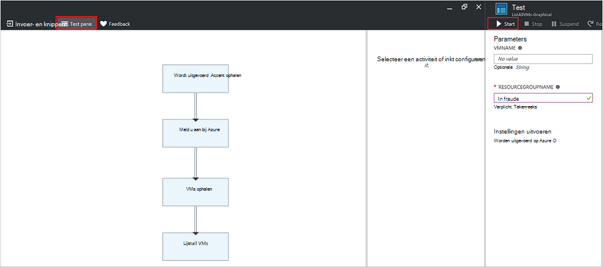

<properties
   pageTitle="Runbook invoerparameters | Microsoft Azure"
   description="Runbook invoerparameters vergroot de flexibiliteit van runbooks doordat u gegevens aan een runbook doorgeven wanneer deze wordt gestart. In dit artikel worden verschillende scenario's waarin invoerparameters worden gebruikt in runbooks."
   services="automation"
   documentationCenter=""
   authors="MGoedtel"
   manager="jwhit"
   editor="tysonn" />
<tags
   ms.service="automation"
   ms.devlang="na"
   ms.topic="article"
   ms.tgt_pltfrm="na"
   ms.workload="infrastructure-services"
   ms.date="10/11/2016"
   ms.author="sngun"/>

# <a name="runbook-input-parameters"></a>Runbook invoerparameters weergegeven

Runbook invoerparameters vergroot de flexibiliteit van runbooks doordat u gegevens aan deze doorgeven wanneer deze wordt gestart. De parameters toestaan de runbook acties die moeten worden gericht voor specifieke scenario's en -omgevingen. In dit artikel wordt we u begeleid verschillende scenario's waarin invoerparameters worden gebruikt in runbooks.

## <a name="configure-input-parameters"></a>Invoerparameters configureren

Invoerparameters kunnen worden geconfigureerd in PowerShell, PowerShell-werkstroom en grafische runbooks. Een runbook kan meerdere parameters met verschillende gegevenstypen, of hebben geen parameters helemaal. Invoerparameters kunnen niet verplicht of optioneel en u kunt een standaardwaarde voor optionele parameters toewijzen. U kunt waarden toewijzen aan de invoerparameters voor een runbook wanneer u deze via een van de beschikbare methoden starten. Deze methoden bevatten een runbook beginnend bij de portal of een webservice. U kunt ook een als een onderliggende runbook die inline in een andere runbook heet starten.

## <a name="configure-input-parameters-in-powershell-and-powershell-workflow-runbooks"></a>Invoerparameters configureren in PowerShell en de PowerShell-werkstroom runbooks

PowerShell en [PowerShell werkstroom runbooks](automation-first-runbook-textual.md) in Azure automatisering ondersteuning voor invoerparameters weergegeven die zijn gedefinieerd door de volgende kenmerken.  

| **Eigenschap** | **Beschrijving** |
|:--- |:---|
| Type | Vereist. Het gegevenstype voor de parameterwaarde verwacht. Een willekeurig type .NET is ongeldig. |
| Naam | Vereist. De naam van de parameter. Dit moet uniek zijn binnen het runbook, en kunnen alleen letters, cijfers bevatten of onderstrepingstekens. Moet beginnen met een letter. |
| Verplicht | Optioneel. Hiermee geeft u of een waarde moet worden opgegeven voor de parameter. Als u dit op **$true instelt**, moet klikt u vervolgens een waarde worden opgegeven als het runbook wordt gestart. Als u dit op **$false instelt**, klikt u vervolgens is een waarde optioneel. |
| Standaardwaarde | Optioneel.  Geeft een waarde die wordt gebruikt voor de parameter als een waarde niet wordt doorgegeven wanneer het runbook wordt gestart. Een standaardwaarde kan worden ingesteld voor elke parameter en wordt automatisch de parameter optioneel maken ongeacht de instelling. |

Windows PowerShell ondersteunt meer kenmerken van invoerparameters dan die hier wordt vermeld, zoals validatie, aliassen en parameter wordt ingesteld. Azure-automatisering ondersteunt echter momenteel alleen de invoerparameters hierboven wordt genoemd.

De parameterdefinitie van een in PowerShell werkstroom runbooks heeft de volgende algemene vorm, waarin meerdere parameters zijn gescheiden door komma's.

   ```
     Param
     (
         [Parameter (Mandatory= $true/$false)]
         [Type] Name1 = <Default value>,

         [Parameter (Mandatory= $true/$false)]
         [Type] Name2 = <Default value>
     )
   ```

>[AZURE.NOTE] Wanneer u parameters, definieert als u de **verplicht** kenmerk niet opgeeft, wordt standaard de parameter als beschouwd optioneel. Ook als u een standaardwaarde voor een parameter in PowerShell werkstroom runbooks instelt, wordt deze verwerkt door PowerShell als een optionele parameter, ongeacht de **verplicht** kenmerkwaarde.

Als voorbeeld, laten we de invoerparameters configureren voor een werkstroom voor het PowerShell-runbook die Hiermee kunt u meer informatie over virtuele machines, een enkel VM of alle VMs binnen een resourcegroep. Deze runbook heeft twee parameters, zoals wordt weergegeven in de volgende schermafbeelding: de naam van virtuele machine en de naam van het resourceveld groep.


In deze parameter zijn definitie, de parameters **$VMName** en **$resourceGroupName** eenvoudige parameters van het type tekenreeks. PowerShell en de PowerShell-werkstroom runbooks ondersteunen echter alle eenvoudige typen en complexe typen, zoals **object** of **PSCredential** voor invoerparameters weergegeven.

Als uw runbook een invoerparameter van het object type heeft, gebruikt u een PowerShell-hashtable met (naam, waarde) paren om door te geven in een waarde. Bijvoorbeeld als u de volgende parameter in een runbook hebt:

     [Parameter (Mandatory = $true)]
     [object] $FullName

U kunt de volgende waarde vervolgens doorgeven aan de parameter:

    @{"FirstName"="Joe";"MiddleName"="Bob";"LastName"="Smith"}


## <a name="configure-input-parameters-in-graphical-runbooks"></a>Invoerparameters configureren in grafische runbooks

Voor het [configureren van een grafische runbook](automation-first-runbook-graphical.md) met invoerparameters, laten we een grafische runbook die Hiermee kunt u meer informatie over virtuele machines, een enkel VM of alle VMs binnen een resourcegroep maken. Het configureren van een runbook bestaat uit twee belangrijke activiteiten, zoals hieronder beschreven.

[**Runbooks verifiëren met Azure uitvoeren als account**](automation-sec-configure-azure-runas-account.md) om te verifiëren met Azure.

[**Get-AzureRmVm**](https://msdn.microsoft.com/library/mt603718.aspx) om de eigenschappen van een virtuele machines.

U kunt de activiteit [**Schrijven-uitvoer**](https://technet.microsoft.com/library/hh849921.aspx) gebruiken om de namen van virtuele machines. De activiteit **Get-AzureRmVm** accepteert twee parameters, de **naam van de virtuele machine** en de **naam van de resource-groep**. Omdat deze parameters verschillende waarden telkens wanneer die u het runbook start vereist kunnen, kunt u invoerparameters toevoegen aan uw runbook. Hier volgen de stappen voor het toevoegen van invoerparameters weergegeven:

1. Selecteer het grafische runbook in het blad **Runbooks** en klik vervolgens op [**bewerken**](automation-graphical-authoring-intro.md) dit.

2. Klik op **invoer en uitvoer** om te openen van het blad **en uitvoer** van het runbook-editor.

    

3. Het blad **en uitvoer** bevat een overzicht van invoerparameters weergegeven die zijn gedefinieerd voor het runbook. Klik op deze blade, kunt u een nieuwe invoerparameter toevoegen of de configuratie van een bestaande invoerparameter bewerken. Als u wilt een nieuwe parameter voor het runbook hebt toegevoegd, klikt u op **invoer toevoegen** als u wilt openen van het blad voor **de invoerparameter Runbook** . Hiervoor kunt u de volgende parameters configureren:

  	| **Eigenschap** | **Beschrijving** |
  	|:--- |:---|
  	| Naam | Vereist.  De naam van de parameter. Dit moet uniek zijn binnen het runbook, en kunnen alleen letters, cijfers bevatten of onderstrepingstekens. Moet beginnen met een letter. |
  	| Beschrijving | Optioneel. De beschrijving over het doel van invoerparameter. |
  	| Type | Optioneel. Het gegevenstype dat voor de parameterwaarde wordt verwacht. Ondersteunde parametertypen zijn **tekenreeks**, **Int32** **Int64**, **decimalen**, **Booleaanse**, **DateTime**en **Object**. Als een gegevenstype niet is geselecteerd, wordt standaard **tekenreeks**. |
  	| Verplicht | Optioneel. Hiermee geeft u of een waarde moet worden opgegeven voor de parameter. Als u **Ja**kiest, moet klikt u vervolgens een waarde worden opgegeven als het runbook wordt gestart. Als u **geen**kiest, klikt u vervolgens is een waarde niet vereist wanneer het runbook wordt gestart en een standaardwaarde kan worden ingesteld. |
  	| Standaardwaarde | Optioneel. Geeft een waarde die wordt gebruikt voor de parameter als een waarde niet wordt doorgegeven wanneer het runbook wordt gestart. Een standaardwaarde kan worden ingesteld voor een parameter weer die is niet verplicht. Als u wilt een standaardwaarde instellen, kies **aangepast**. Deze waarde wordt gebruikt, tenzij een andere waarde is opgegeven als het runbook wordt gestart. Kies **geen** als u niet wilt bieden een standaardwaarde. |  

    

4. Maak twee parameters met de volgende eigenschappen die worden gebruikt door de activiteit **Get-AzureRmVm** :

    - **Parameter1:**
      - Name - VMName
      - Type - tekenreeks
      - Verplicht - Nee

    - **Parameter2:**
      - Name - resourceGroupName
      - Type - tekenreeks
      - Verplicht - Nee
      - Standaardwaarde - aangepast
      - Aangepaste standaardwaarde - \<naam van het resourceveld groep waarin de virtuele machines >

5. Nadat u de parameters hebt toegevoegd, klikt u op **OK**.  U kunt nu deze wilt weergeven in de **invoer en uitvoer blade**. Klik nogmaals op **OK** en klik vervolgens op **Opslaan** en **publiceren** uw runbook.

## <a name="assign-values-to-input-parameters-in-runbooks"></a>Geef waarden op invoerparameters in runbooks

U kunt waarden voor het invoeren van parameters in runbooks in de volgende scenario's doorgeven.

### <a name="start-a-runbook-and-assign-parameters"></a>Start een runbook en parameters toewijzen

Een runbook tal van manieren kan worden gestart: via de portal van Azure, met een webhook, met PowerShell-cmdlets, met de REST API of met de SDK. Hieronder wordt besproken verschillende methoden voor het starten van een runbook en het toewijzen van parameters.

#### <a name="start-a-published-runbook-by-using-the-azure-portal-and-assign-parameters"></a>Een gepubliceerde runbook starten met behulp van de Azure-portal en parameters toewijzen

Wanneer u [het runbook starten](automation-starting-a-runbook.md#starting-a-runbook-with-the-azure-portal), het blad **Runbook starten** wordt geopend en kunt u waarden voor de parameters die u zojuist hebt gemaakt.


In het label onder het vak Invoerbereik ziet u de kenmerken die zijn ingesteld voor de parameter. Kenmerken zijn verplicht of optioneel, type en standaardwaarde. Klik in de tekstballon help naast de parameternaam van de ziet u alle belangrijke informatie die u moet beslissingen nemen over parameter invoerwaarden. Deze informatie bevat of als u een parameter verplicht of optioneel is. Het bevat ook het type en standaardwaarde (indien aanwezig) en andere handige notities.


>[AZURE.NOTE] Tekenreeks typeparameters ondersteuning **lege** tekenreekswaarden.  **[Lege tekenreeks]** in het vak invoerparameter invoeren, wordt een lege tekenreeks doorgeven aan de parameter. Tekenreeks typeparameters, ondersteunt ook niet **Null** -waarden worden doorgegeven. Als u niet elke waarde aan de parameter tekenreeks doorgeeft, worden klikt u vervolgens PowerShell geïnterpreteerd als null.

#### <a name="start-a-published-runbook-by-using-powershell-cmdlets-and-assign-parameters"></a>Een gepubliceerde runbook starten via PowerShell-cmdlets en parameters toewijzen

  - **Azure resourcemanager cmdlets:** U kunt een automatisering runbook die in een resourcegroep is gemaakt met behulp van de [Begin-AzureRmAutomationRunbook](https://msdn.microsoft.com/library/mt603661.aspx)starten.

    **Voorbeeld:**

   ```
    $params = @{“VMName”=”WSVMClassic”;”resourceGroupeName”=”WSVMClassicSG”}
 
    Start-AzureRmAutomationRunbook -AutomationAccountName “TestAutomation” -Name “Get-AzureVMGraphical” –ResourceGroupName $resourceGroupName -Parameters $params
   ```

  - **Cmdlets voor gebruikersbeheer van azure-Service:** U kunt een automatisering runbook die in een standaard-resourcegroep is gemaakt met behulp van de [Begin-AzureAutomationRunbook](https://msdn.microsoft.com/library/dn690259.aspx)starten.

    **Voorbeeld:**

   ```
    $params = @{“VMName”=”WSVMClassic”; ”ServiceName”=”WSVMClassicSG”}

    Start-AzureAutomationRunbook -AutomationAccountName “TestAutomation” -Name “Get-AzureVMGraphical” -Parameters $params
   ```

>[AZURE.NOTE] Wanneer u een runbook starten via PowerShell-cmdlets, een standaardparameter wordt met de waarde **PowerShell** **MicrosoftApplicationManagementStartedBy** gemaakt. U kunt deze parameter in het blad **Taakdetails** weergeven.  

#### <a name="start-a-runbook-by-using-an-sdk-and-assign-parameters"></a>Een runbook starten met een SDK en parameters toewijzen

  - **Azure resourcemanager methode:** U kunt een runbook starten met behulp van de SDK van een programmeertaal. Hieronder ziet u een C#-codefragment voor het starten van een runbook in uw account automatisering. U kunt alle code onze [GitHub opslagplaats](https://github.com/Azure/azure-sdk-for-net/blob/master/src/ResourceManagement/Automation/Automation.Tests/TestSupport/AutomationTestBase.cs)bekijken.  

   ```
     public Job StartRunbook(string runbookName, IDictionary<string, string> parameters = null)
        {
          var response = AutomationClient.Jobs.Create(resourceGroupName, automationAccount, new JobCreateParameters
           {
              Properties = new JobCreateProperties
               {
                  Runbook = new RunbookAssociationProperty
                   {
                     Name = runbookName
                   },
                     Parameters = parameters
               }
           });
        return response.Job;
        }
   ```

  - **Azure servicebeheer methode:** U kunt een runbook starten met behulp van de SDK van een programmeertaal. Hieronder ziet u een C#-codefragment voor het starten van een runbook in uw account automatisering. U kunt alle code onze [GitHub opslagplaats](https://github.com/Azure/azure-sdk-for-net/blob/master/src/ServiceManagement/Automation/Automation.Tests/TestSupport/AutomationTestBase.cs)bekijken.

   ```      
    public Job StartRunbook(string runbookName, IDictionary<string, string> parameters = null)
      {
        var response = AutomationClient.Jobs.Create(automationAccount, new JobCreateParameters
      {
        Properties = new JobCreateProperties
           {
             Runbook = new RunbookAssociationProperty
           {
             Name = runbookName
                },
                  Parameters = parameters
                }
         });
        return response.Job;
      }
   ```

  Als u wilt deze methode, een woordenlijst voor het opslaan van de parameters runbook, **VMName** en **resourceGroupName**en de bijbehorende waarden te maken. Start het runbook. Hieronder vindt u de C#-codefragment voor het bellen van de methode die gedefinieerd hierboven.

   ```
    IDictionary<string, string> RunbookParameters = new Dictionary<string, string>();

    // Add parameters to the dictionary.
    RunbookParameters.Add("VMName", "WSVMClassic");
    RunbookParameters.Add("resourceGroupName", "WSSC1");

    //Call the StartRunbook method with parameters
    StartRunbook(“Get-AzureVMGraphical”, RunbookParameters);
   ```

#### <a name="start-a-runbook-by-using-the-rest-api-and-assign-parameters"></a>Een runbook starten met behulp van de REST API en parameters toewijzen

Een taak runbook worden gemaakt en de slag met de Azure automatisering REST API met behulp van de methode **plaatsen** met de volgende aanvraag URI.

    https://management.core.windows.net/<subscription-id>/cloudServices/<cloud-service-name>/resources/automation/~/automationAccounts/<automation-account-name>/jobs/<job-id>?api-version=2014-12-08`

Vervang de volgende parameters in het verzoek URI:

  - **abonnement-id:** Uw abonnement op Azure-ID.  
  - **cloud-service-naam:** De naam van de cloudservice waarvoor de aanvraag moet worden verzonden.  
  - **automatisering accountnaam:** De naam van uw account voor automatisering die wordt gehost binnen de opgegeven cloudservice.  
  - **taak-id:** De GUID voor de taak. GUID's in PowerShell kunnen worden gemaakt met behulp van de **[GUID]::NewGuid(). ToString()** opdracht.

Gebruik het hoofdgedeelte van de aanvraag om te kunnen parameters doorgeven aan de taak runbook. Het kost de volgende twee eigenschappen die beschikbaar zijn in de indeling van JSON:

  - **Runbook naam:** Vereist. De naam van het runbook voor de taak te starten.  
  - **Runbook parameters:** Optioneel. Een woordenlijst van de lijst met parameters in (naam, waarde) opmaken waarbij moet naam van het type tekenreeks en waarde is een geldige JSON-waarde.

Als u starten van het runbook **Get-AzureVMTextual** die eerder is gemaakt met **VMName** en **resourceGroupName** als parameters wilt, gebruikt u de volgende indeling van JSON voor het hoofdgedeelte van de aanvraag.

   ```
    {
      "properties":{
        "runbook":{
        "name":"Get-AzureVMTextual"},
      "parameters":{
         "VMName":"WSVMClassic",
         "resourceGroupName":”WSCS1”}
        }
    }
   ```

Een HTTP-statuscode 201 wordt geretourneerd als de taak is gemaakt. Voor meer informatie over antwoord kop- en de hoofdtekst van het antwoord, raadpleegt u het artikel over het [maken van een taak runbook met behulp van de REST API.](https://msdn.microsoft.com/library/azure/mt163849.aspx)

### <a name="test-a-runbook-and-assign-parameters"></a>Een runbook testen en het toewijzen van parameters

Wanneer u [de conceptversie van uw runbook testen](automation-testing-runbook.md) met behulp van de optie test, het blad **testen** wordt geopend en kunt u waarden voor de parameters die u zojuist hebt gemaakt.



### <a name="link-a-schedule-to-a-runbook-and-assign-parameters"></a>Een planning koppelen aan een runbook en parameters toewijzen

U kunt [koppelen een planning](automation-schedules.md) aan uw runbook zo instellen dat het runbook op een bepaald tijdstip begint. U toewijzen invoerparameters weergegeven wanneer u de planning maken en het runbook deze waarden worden gebruikt wanneer deze wordt gestart door de planning. U kunt de planning niet opslaan, totdat alle verplichte parameterwaarden worden gegeven.


### <a name="create-a-webhook-for-a-runbook-and-assign-parameters"></a>Een webhook voor een runbook maken en toewijzen van parameters

U kunt een [webhook](automation-webhooks.md) voor uw runbook maken en configureren van runbook invoerparameters weergegeven. U kunt de webhook niet opslaan, totdat alle verplichte parameterwaarden worden gegeven.


Wanneer u een runbook uitvoert met behulp van een webhook, de vooraf gedefinieerde invoerparameter **[Webhookdata](automation-webhooks.md#details-of-a-webhook)** is verstuurd, samen met de invoerparameters die u hebt gedefinieerd. U kunt klikken om uit te vouwen van de parameter **WebhookData** voor meer informatie.


## <a name="next-steps"></a>Volgende stappen

- Zie voor meer informatie over runbook en uitvoer, [Azure automatisering: runbook invoer, uitvoer en geneste runbooks](https://azure.microsoft.com/blog/azure-automation-runbook-input-output-and-nested-runbooks/).
- Zie [het starten van een runbook](automation-starting-a-runbook.md)voor meer informatie over andere manieren waarop u een runbook starten.
- Als u wilt bewerken een tekstuele runbook, raadpleegt u [tekstuele runbooks bewerken](automation-edit-textual-runbook.md).
- Als u wilt bewerken in een grafische runbook, raadpleegt u [grafische beschikbaar is in Azure automatisering](automation-graphical-authoring-intro.md).
