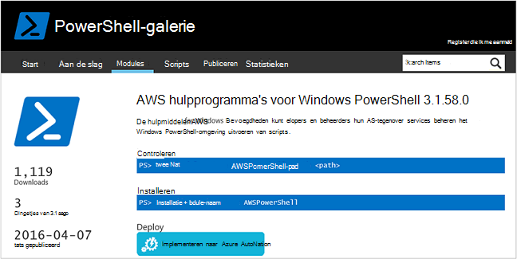
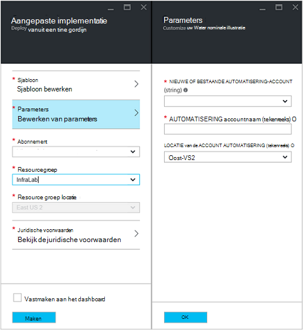
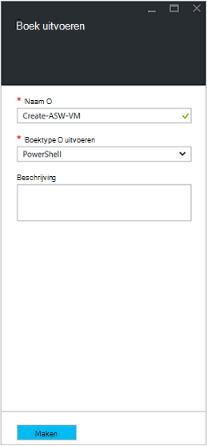
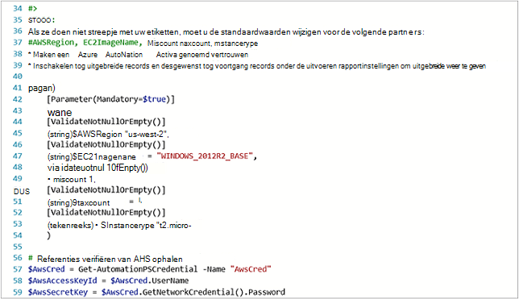
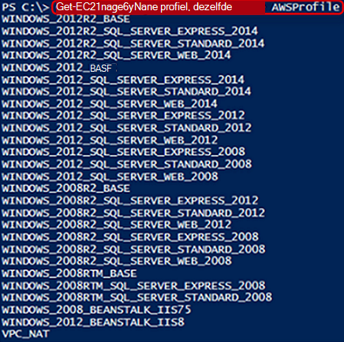
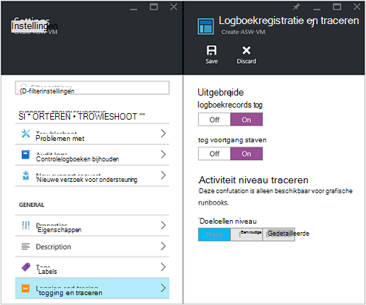
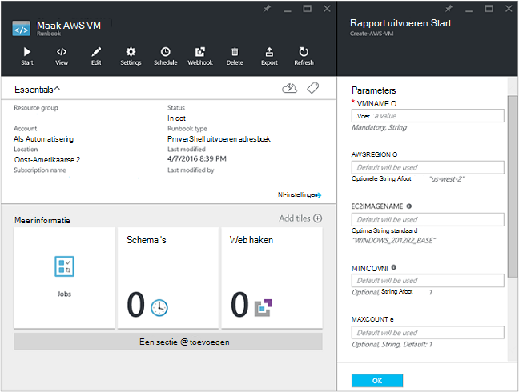
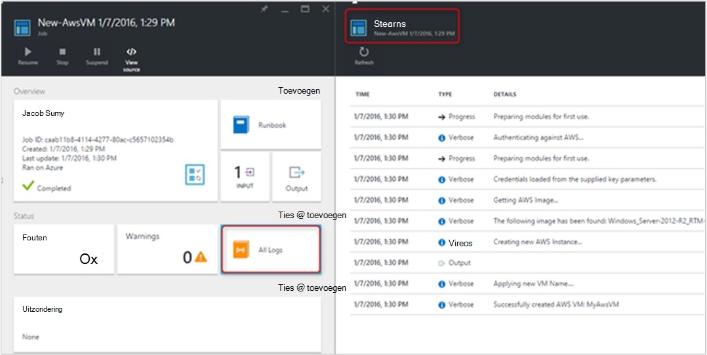
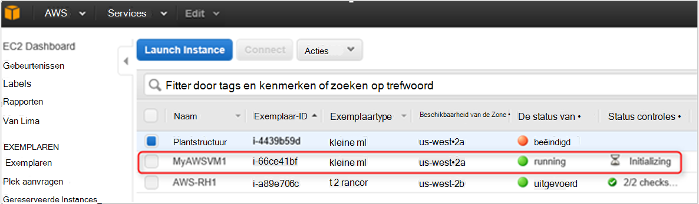

<properties
   pageTitle="Implementatie van een VM in Amazon Web Services automatiseren | Microsoft Azure"
   description="In dit artikel wordt beschreven hoe Azure automatisering gebruiken om u te maken van een Amazon Web Service VM automatiseren"
   services="automation"
   documentationCenter=""
   authors="mgoedtel"
   manager="jwhit"
   editor="" />
<tags
   ms.service="automation"
   ms.devlang="na"
   ms.topic="article"
   ms.tgt_pltfrm="na"
   ms.workload="na"
   ms.date="08/17/2016"
   ms.author="tiandert; bwren" />

# <a name="azure-automation-scenario---provision-an-aws-virtual-machine"></a>Azure automatisering scenario - bepaling een VM AWS 

In dit artikel wordt gedemonstreerd hoe u kunt gebruikmaken van Azure automatiseren om inrichten van een virtuele machine in uw abonnement Amazon Web Service (AWS) en geef deze VM een specifieke naam – die AWS verwijst naar als de VM "labelen".

## <a name="prerequisites"></a>Vereisten voor

Voor de toepassing van dit artikel moet u beschikken over een automatisering Azure-account en een AWS-abonnement. Lees voor meer informatie over een automatisering Azure-account instellen en configureren met uw referenties AWS-abonnement, [Verificatie configureren met Amazon-webservices](../automation/automation-sec-configure-aws-account.md).  Dit account moet worden gemaakt of bijgewerkt met uw referenties AWS abonnement voordat u verder gaat, zoals we verwijst naar dit account in de onderstaande stappen.


## <a name="deploy-amazon-web-services-powershell-module"></a>Amazon Web Services PowerShell-Module implementeren

Onze VM inrichting runbook maken gebruik van de AWS PowerShell-module als u wilt uitvoeren. De volgende stappen als u de module toevoegen aan uw automatisering-account dat is geconfigureerd met uw referenties AWS-abonnement wilt uitvoeren.  

1. Open de webbrowser en navigeer naar de [Galerie met PowerShell](http://www.powershellgallery.com/packages/AWSPowerShell/) en klik op het **distribueren naar de knop Azure automatisering**.<br> 

2. U naar de aanmeldingspagina van Azure en na het verifiëren van zijn gemaakt, u wordt doorgestuurd naar de Portal Azure en gepresenteerd met het volgende blad.<br> 

3. Selecteer de resourcegroep uit de vervolgkeuzelijst van het **Resourceveld groep** en klik op het blad Parameters, de onderstaande informatie opgeven:
   * Selecteer **bestaande**in de vervolgkeuzelijst **Nieuw of bestaand automatisering-Account (tekenreeks)** .  
   * Typ in het vak **Accountnaam automatisering (tekenreeks)** in de naam van het account automatisering met de referenties voor uw abonnement AWS exact.  Bijvoorbeeld: als u een speciale rekening met de naam **AWSAutomation**hebt gemaakt, klikt u vervolgens die is wat u in het vak typt.
   * Selecteer de gewenste regio in de vervolgkeuzelijst **Automatisering Account locatie** .

4. Wanneer u klaar bent met het invoeren van de vereiste informatie, klikt u op **maken**.

    >[AZURE.NOTE]Tijdens het importeren van een PowerShell-module in Azure automatisering, het ook van de cmdlets extraheren is en deze activiteiten niet weergegeven worden totdat de module volledig is voltooid importeren en extraheren van de cmdlets. Dit kan een paar minuten duren.  
<br>
5. Open uw automatisering account waarnaar wordt verwezen in stap 3 in de Portal Azure.
6. Klik op de tegel van de **activa** en klik op het blad **activa** , selecteer de tegel **Modules** .
7. Klik op het blad **Modules** ziet u de module **AWSPowerShell** in de lijst.

## <a name="create-aws-deploy-vm-runbook"></a>Maak AWS VM runbook implementeren

Zodra de AWS PowerShell-Module is geïmplementeerd, kunnen we nu een runbook wilt automatiseren inrichting van een virtuele machine in AWS met een PowerShell-script schrijven. De onderstaande stappen laat zien hoe u gebruikmaken van native PowerShell-script in Azure automatisering.  

>[AZURE.NOTE] Voor meer opties en informatie over dit script, gaat u naar de [Galerie met PowerShell](https://www.powershellgallery.com/packages/New-AwsVM/DisplayScript).


1. De PowerShell-script nieuw AwsVM downloaden vanuit de PowerShell-galerie openen van een PowerShell-sessie en typt u het volgende:<br>
   ```
   Save-Script -Name New-AwsVM -Path \<path\>
   ```
<br>
2. Uw account automatisering opent in de Portal Azure en klik op de tegel **Runbooks** .  
3. Selecteer in het blad **Runbooks** **toevoegen een runbook**.
4. Selecteer **Snelle maken** (maken een nieuwe runbook) op het blad **toevoegen een runbook** .
5. Klik op het blad **Runbook** eigenschappen, typ een naam in het vak naam voor uw runbook en van het **Runbook type** vervolgkeuzelijst Selecteer **PowerShell**en klik vervolgens op **maken**.<br> 
6. Wanneer het blad PowerShell Runbook bewerken wordt weergegeven, kopieer en plak de PowerShell-script in het runbook authoring canvas.<br> <br>

    >[AZURE.NOTE] Let op de volgende manieren te werk wanneer u werkt met het voorbeeld PowerShell-script:
    >
    > - Het runbook bevat een aantal standaardwaarden voor parameters. Alle standaardwaarden evalueren en eventueel bijwerken.
    > - Als u uw referenties AWS hebt opgeslagen als een referentie actief anders dan **AWScred**met de naam, moet u bij het script op regel 57 om aan te passen dienovereenkomstig gewijzigd.  
    > - Tijdens het werken met de opdrachten AWS CLI in PowerShell, met name in dit voorbeeld runbook, moet u de AWS regio. Anders de cmdlets, mislukt.  Bekijk AWS onderwerp [Opgeven AWS regio](http://docs.aws.amazon.com/powershell/latest/userguide/pstools-installing-specifying-region.html) in de AWS hulpprogramma's voor PowerShell-document voor meer informatie.  
<br>
7. Als u wilt een lijst met namen van de afbeelding ophalen uit uw abonnement AWS, PowerShell ISE starten en importeer de AWS PowerShell-Module.  Door het vervangen van **Get-AutomationPSCredential** in uw omgeving wissen met worden geverifieerd bij AWS **AWScred = Get-referentie**.  Hiermee wordt u gevraagd om uw referenties en u kunt uw **Access-sleutel-ID** voor de gebruikersnaam en het **Geheim toegangstoets** opgeven voor het wachtwoord.  Zie het voorbeeld hieronder:

        #Sample to get the AWS VM available images
        #Please provide the path where you have downloaded the AWS PowerShell module
        Import-Module AWSPowerShell
        $AwsRegion = "us-west-2"
        $AwsCred = Get-Credential
        $AwsAccessKeyId = $AwsCred.UserName
        $AwsSecretKey = $AwsCred.GetNetworkCredential().Password

        # Set up the environment to access AWS
        Set-AwsCredentials -AccessKey $AwsAccessKeyId -SecretKey $AwsSecretKey -StoreAs AWSProfile
        Set-DefaultAWSRegion -Region $AwsRegion

        Get-EC2ImageByName -ProfileName AWSProfile
   De volgende uitvoergegevens:<br>
     
8. Kopieer en plak een van de namen van de afbeelding in een automatiseringsvariabele waarnaar wordt verwezen in het runbook als **$InstanceType**. Omdat in dit voorbeeld we gebruiken de gratis AWS doorverbonden abonnement, gebruiken we **t2.micro** in ons voorbeeld runbook.
9. Het runbook opslaan en klik op **publiceren** naar het runbook publiceren en klik vervolgens **Ja** wanneer u wordt gevraagd.


### <a name="testing-the-aws-vm-runbook"></a>Het runbook AWS VM testen
Voordat we verdergaat met het testen van het runbook, moeten we een aantal zaken controleren. Name:

   -  Activa voor verificatie ten opzichte van AWS genoemd **AWScred** is gemaakt of het script is bijgewerkt om te verwijzen naar de naam van uw activa referentie.  
   -  De AWS PowerShell-module is geïmporteerd in Azure automatisering
   -  Een nieuwe runbook is gemaakt en parameterwaarden zijn geverifieerd en eventueel bijgewerkt
   -  **Uitgebreide logboekrecords** en eventueel **voortgang logboekrecords** onder het runbook instellen **logboekregistratie en traceren** hebt ingesteld op **op**.<br> 

1. We wilt starten van het runbook, dus klik op **Start** en klik vervolgens op **OK** wanneer het blad Runbook starten wordt geopend.
2. Geef een **VMname**op het blad Runbook starten.  Accepteer de standaardwaarden voor de andere parameters die u eerder een vooraf in het script geconfigureerd.  Klik op **OK** om de taak runbook start.<br> 
3. Het taakdeelvenster van een wordt geopend voor de taak runbook die we zojuist hebt gemaakt. In dit deelvenster sluiten.
4. We de voortgang van de taak kunt bekijken en weergave **Streams** uitvoeren door de tegel **Alle logboeken** van het runbook taak blad selecteren.<br> 
5. Om te bevestigen dat de VM wordt ingericht, meld u aan bij de beheerconsole AWS als u momenteel niet bent aangemeld.<br> 

## <a name="next-steps"></a>Volgende stappen
-   Zie [Mijn eerste grafische runbook](automation-first-runbook-graphical.md) om te beginnen met grafische runbooks
-   Als u wilt beginnen met PowerShell werkstroom runbooks, raadpleegt u [Mijn eerste runbook voor PowerShell-werkstroom](automation-first-runbook-textual.md)
-   Als u wilt meer weten over runbook typen, hun voordelen en beperkingen, raadpleegt u [Azure automatisering runbook typen](automation-runbook-types.md)
-   Voor meer informatie over PowerShell-script ondersteuning voor de functie, raadpleegt u [systeemeigen PowerShell-script ondersteuning in Azure automatisering](https://azure.microsoft.com/blog/announcing-powershell-script-support-azure-automation-2/)
