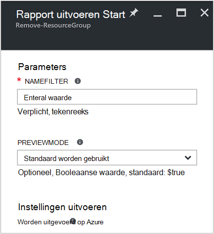
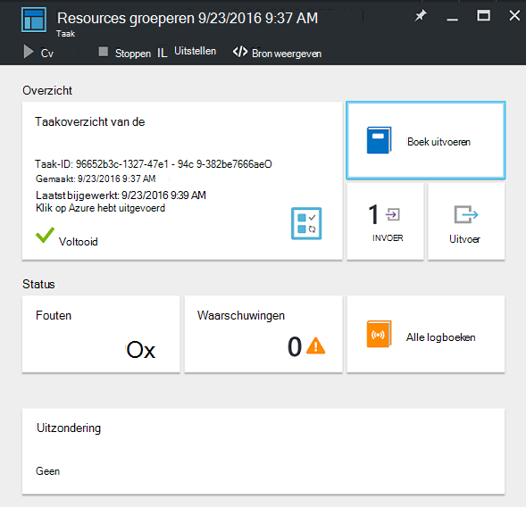
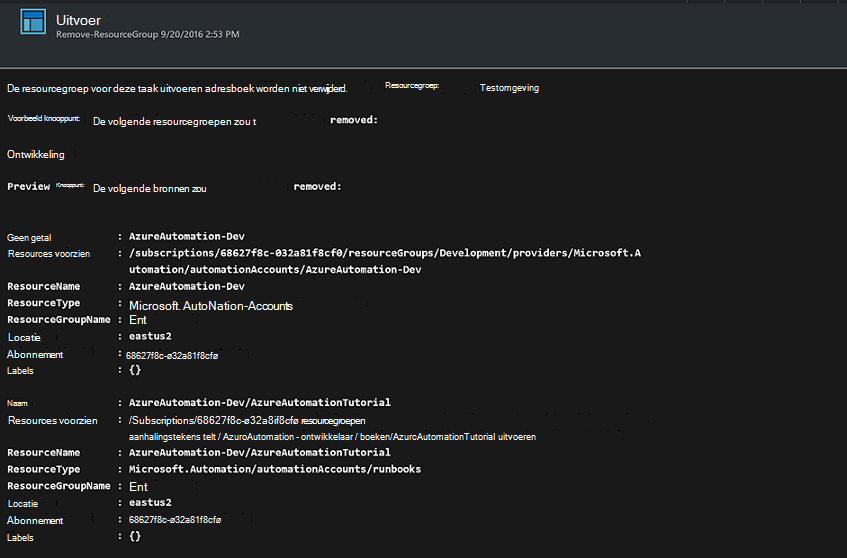

<properties
    pageTitle="Verwijdering van resourcegroepen automatiseren | Microsoft Azure"
    description="Werkstroom voor het PowerShell-versie van een Azure automatisering mogelijkheid inclusief runbooks als u wilt verwijderen van alle resourcegroepen in uw abonnement."
    services="automation"
    documentationCenter=""
    authors="MGoedtel"
    manager="jwhit"
    editor=""
    />
<tags
    ms.service="automation"
    ms.workload="tbd"
    ms.tgt_pltfrm="na"
    ms.devlang="na"
    ms.topic="get-started-article"
    ms.date="09/26/2016"
    ms.author="magoedte"/>

# Scenario voor automatisering op Azure - verwijdering van resourcegroepen automatiseren

Veel klanten maken meer dan één resourcegroep. Enkele kan worden gebruikt voor het beheren van productietoepassingen en anderen kunnen worden gebruikt als ontwikkeling, testen en tijdelijke omgevingen. Automatische implementatie van deze resources één criterium is, maar een ander kunt nemen resourcegroep met één klik van de knop is. U kunt deze algemene management taak stroomlijnen met behulp van Azure automatisering. Dit is handig als u werkt met een Azure-abonnement dat een limiet uitgaven tot en met een aanbieding lid zoals MSDN of het Microsoft Partner Network Cloud Essentials-programma geldt.

In dit scenario is gebaseerd op een PowerShell-runbook en is ontworpen voor het verwijderen van een of meer resourcegroepen die u uit uw abonnement opgeeft. De standaardinstelling van het runbook is om te testen voordat u verdergaat. Dit zorgt ervoor dat u niet per ongeluk de resourcegroep verwijderen voordat u iets wilt u deze procedure hebt voltooid.   

## Het scenario ophalen

Dit scenario bestaat uit een PowerShell-runbook die u vanuit de [Galerie met PowerShell downloaden kunt](https://www.powershellgallery.com/packages/Remove-ResourceGroup/1.0/DisplayScript). U kunt dit ook rechtstreeks vanuit de [Galerie met Runbook](automation-runbook-gallery.md) in de portal van Azure importeren.  

Runbook | Beschrijving|
----------|------------|
Verwijderen ResourceGroup | Hiermee verwijdert u een of meer Azure resourcegroepen en bijbehorende hulpbronnen van het abonnement.  
 
De volgende invoerparameters zijn gedefinieerd voor deze runbook:

Parameter | Beschrijving|
----------|------------|
NameFilter (vereist) | Hiermee geeft u een filter de naam van de resourcegroepen die u van plan over het verwijderen bent beperken. U kunt meerdere waarden met behulp van een door komma's gescheiden lijst doorgeven. Het filter is niet hoofdlettergevoelig en komen overeen met een resourcegroep die de tekenreeks bevat.|
PreviewMode (optioneel) | Wordt uitgevoerd van het runbook om te zien welke resourcegroepen wordt verwijderd, maar geen actie duurt. De standaardwaarde is **voldaan** om u te helpen vermijden onbedoeld verwijderen van een of meer resourcegroepen doorgegeven aan het runbook.  

## Installeren en configureren van dit scenario

### Vereisten voor

Deze runbook verifieert via het [Azure uitvoeren als account](automation-sec-configure-azure-runas-account.md).    

### Installeren en de runbooks publiceren

Nadat u het runbook hebt gedownload, kunt u deze kunt importeren met behulp van de procedure in [importeren runbook procedures](automation-creating-importing-runbook.md#importing-a-runbook-from-a-file-into-Azure-Automation). Publiceren het runbook nadat deze is geïmporteerd in uw account automatisering.

## Gebruik van het runbook

De volgende stappen wordt u begeleid bij de uitvoering van deze runbook en help die u vertrouwd raken te met hoe dit werkt. U wordt alleen worden testen van het runbook in dit voorbeeld de resourcegroep niet werkelijk te verwijderen.  

1. De Azure-portal openen van uw account automatisering en klik op **Runbooks**.
2. Selecteer het runbook **Verwijderen ResourceGroup** en klik op **Start**.
3. Wanneer u het runbook begint, het blad **Runbook starten** wordt geopend en kunt u de parameters. Voer de namen van resourcegroepen in uw abonnement die u gebruiken voor het testen van kunt en geen schade veroorzaakt als per ongeluk hebt verwijderd.  

    >[AZURE.NOTE] Controleer of **dat previewmode** is ingesteld op **waar** om te voorkomen dat de geselecteerde resourcegroepen verwijderd.  **Opmerking** deze runbook worden geen resourcegroep met het account automatisering waarop deze runbook wordt verwijderd.  

4. Nadat u de parameter all hebt geconfigureerd, klikt u op **OK**en het runbook voor uitvoering wordt wordt geplaatst.  

Als u wilt de details van de taak van de runbook **Verwijderen ResourceGroup** bekijken in de portal van Azure, selecteert u de **taken** in het runbook. De taak samenvatting geeft de invoerparameters en de stream uitvoer naast algemene informatie over de taak en eventuele uitzonderingen die zijn aangebracht.  .

Het **Overzicht van de taak** bevat berichten uit de uitvoer, waarschuwing en fout streams. Selecteer **uitvoer** gedetailleerde resultaten van de uitvoering van het runbook weergeven.  

## Volgende stappen

- Zie [maken of importeren van een runbook in Azure automatisering](automation-creating-importing-runbook.md)eerst uw eigen runbook maken.
- Zie [Mijn eerste PowerShell werkstroom runbook](automation-first-runbook-textual.md)om te beginnen met PowerShell werkstroom runbooks.
