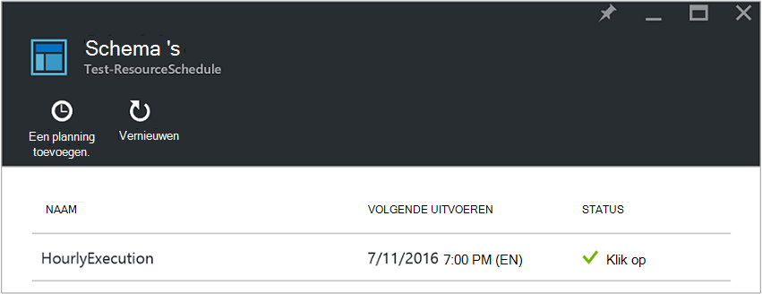
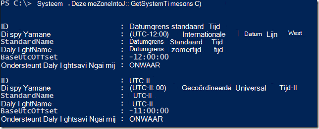
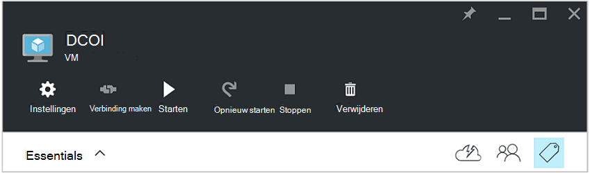
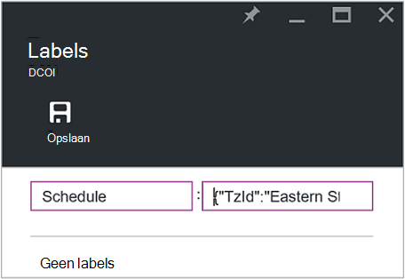
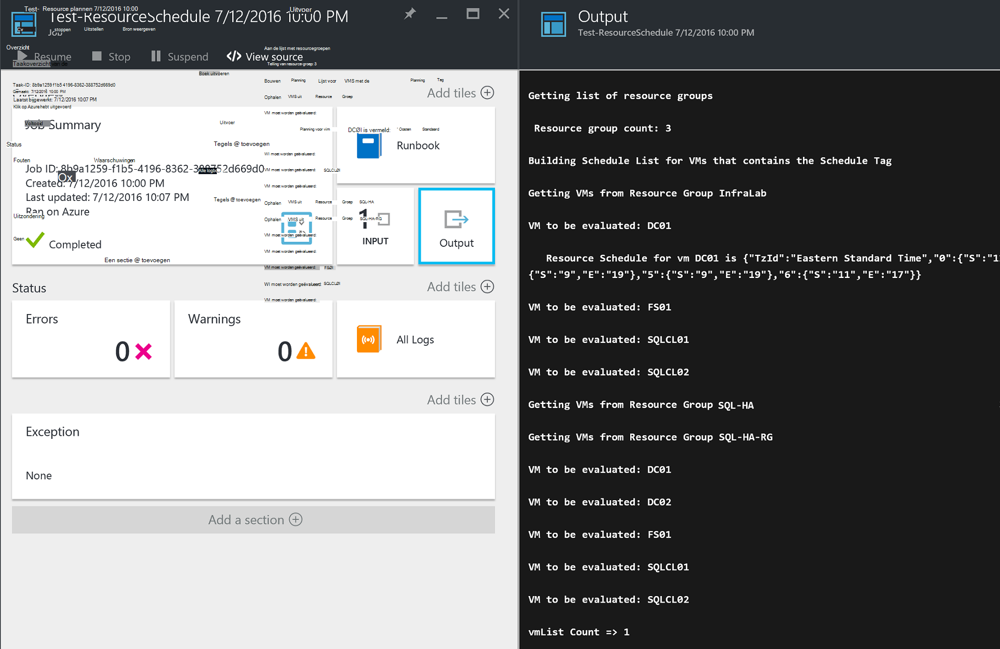

<properties
   pageTitle="Markeringen JSON-indeling gebruiken om u te maken van een schema voor Azure VM opstarten en afsluiten | Microsoft Azure"
   description="In dit artikel wordt beschreven hoe JSON tekenreeksen op markeringen gebruiken om te automatiseren de planning van VM opstarten en afsluiten."
   services="automation"
   documentationCenter=""
   authors="MGoedtel"
   manager="jwhit"
   editor="tysonn" />
<tags
   ms.service="automation"
   ms.devlang="na"
   ms.topic="article"
   ms.tgt_pltfrm="na"
   ms.workload="infrastructure-services"
   ms.date="07/18/2016"
   ms.author="magoedte;paulomarquesc" />

# Azure automatisering scenario: markeringen JSON-indeling gebruiken om u te maken van een schema voor Azure VM opstarten en afsluiten

Klanten wilt vaak plannen het opstarten en afsluiten van virtuele machines om te verlagen abonnement of ondersteuning bieden voor bedrijven en technische vereisten.  

De volgende scenario kunt u geautomatiseerd opstarten en afsluiten van uw VMs instellen met behulp van een tag planning op een resource groepeerniveau of VM in Azure genoemd. Dit schema kan worden geconfigureerd van zondag tot zaterdag een opstarten en afsluiten.  

We hebben bepaalde out-van-het-box-opties. Hierbij:
-  [Hiermee stelt u VM schaal](../virtual-machine-scale-sets/virtual-machine-scale-sets-overview.md) met automatisch schalen instellingen waarmee u aan de nieuwe schaal in- of uitzoomen.
- [DevTest Labs](../devtest-lab/devtest-lab-overview.md) -service, met de ingebouwde mogelijkheid van opstarten en afsluiten bewerkingen plannen.

Deze opties ondersteuning echter alleen specifieke scenario's en kan niet worden toegepast op de infrastructuur-als-een-service (IaaS) VMs.   

Wanneer de tag planning wordt toegepast op een resourcegroep, wordt dit ook toegepast op alle virtuele machines binnen die resourcegroep. Als een planning is ook rechtstreeks op een VM hebt toegepast, heeft de laatste planning voorrang in de volgende volgorde:

1.  Planning toegepast op een resourcegroep
2.  Planning toegepast op een resourcegroep en virtuele machine in de resourcegroep
3.  Planning toegepast op een virtuele machine

In dit scenario in feite een tekenreeks JSON met een opgegeven opmaak en toegevoegd als de waarde voor een tag planning genoemd. Vervolgens een runbook bevat alle resourcegroepen en virtuele machines en geeft u de planningen voor elke VM op basis van de scenario's die eerder is vermeld. Vervolgens de VMs met's die zijn bijgevoegd doorlopen en evalueert welke actie moet worden ondernomen. Bijvoorbeeld: deze bepaalt welke VMs moeten worden gestopt, afgesloten of genegeerd.

Deze runbooks verifiëren met behulp van de [Azure uitvoeren als account](../automation/automation-sec-configure-azure-runas-account.md).

## Download de runbooks voor het scenario

Dit scenario bestaat uit vier PowerShell werkstroom runbooks die u uit de [Galerie met TechNet](https://gallery.technet.microsoft.com/Azure-Automation-Runbooks-84f0efc7) of de bibliotheek [GitHub](https://github.com/paulomarquesdacosta/azure-automation-scheduled-shutdown-and-startup) voor dit project downloaden kunt.

Runbook | Beschrijving
----------|----------
Test-ResourceSchedule | Hiermee wordt gecontroleerd elke VM planning en afsluiten of opstarten afhankelijk van de planning wordt uitgevoerd.
Toevoegen ResourceSchedule | Wordt de planning tag toegevoegd aan een groep VM of resource.
Update-ResourceSchedule | Hiermee wijzigt u de planning tag door deze te vervangen door een andere plattegrond.
Verwijderen ResourceSchedule | Hiermee verwijdert de planning tag uit een groep VM of resource.

## Installeren en configureren van dit scenario

### Installeren en de runbooks publiceren

Na het runbooks downloadt, kunt u deze met behulp van de procedure in [maken of importeren van een runbook in Azure automatisering](automation-creating-importing-runbook.md#importing-a-runbook-from-a-file-into-Azure-Automation)importeren.  Elke runbook publiceren nadat deze is geïmporteerd in uw account automatisering.

### Een planning toevoegen aan het runbook Test-ResourceSchedule

Volg deze stappen om de planning van het runbook Test-ResourceSchedule inschakelen. Dit is het runbook dat wordt gecontroleerd met welke virtuele machines moet worden gestart, afgesloten of ongewijzigd.

1. Uw account automatisering opent in de portal Azure en klik vervolgens op de tegel **Runbooks** .
2. Klik op het blad **Test-ResourceSchedule** op de tegel **planningen** .
3. Klik op het blad **planningen** op **een planning toevoegen**.
4. Klik op het blad **planningen** , selecteert u **koppeling een plan voor uw runbook**. Selecteer **een nieuwe planning maken**.
5.  Klik op het blad **nieuwe planning** , typ de naam van deze schema, bijvoorbeeld: *HourlyExecution*.
6. Voor de planning **starten**, moet u de begintijd instellen op een reeks uur.
7. Selecteer **Terugkeerpatroon**en voor **elke interval terugkerende**, selecteer **1 uur staan**.
8. Verifiëren of **Set verlooptijd** is ingesteld op **Nee**en klik vervolgens op **maken** om op te slaan van uw nieuwe planning.
9. Selecteer op het blad van de opties voor **Planning Runbook** **Parameters en instellingen voor uitvoeren**. Voer de naam van uw abonnement in het veld **SubscriptionName** in het blad Test-ResourceSchedule **Parameters** .  Dit is de enige parameter weer die is vereist voor het runbook.  Wanneer u klaar bent, klikt u op **OK**.  

De planning van het runbook ziet er als volgt te werk wanneer deze voltooid:

 

## De JSON-tekenreeks opmaken

Deze oplossing in principe wordt een JSON tekenreeks met een opgegeven opmaak en wordt deze toegevoegd als de waarde voor een tag genoemd planning. Vervolgens een runbook bevat alle resourcegroepen en virtuele machines en de planningen voor elke virtuele machine aangeeft.

Het runbook lussen via de virtuele machines met's die zijn gekoppeld en wordt gecontroleerd welke acties moeten worden gehouden. Hier volgt een voorbeeld van hoe de oplossingen moeten worden weergegeven:

    {
       "TzId": "Eastern Standard Time",
        "0": {  
           "S": "11",
           "E": "17"
        },
        "1": {
           "S": "9",
           "E": "19"
        },
        "2": {
           "S": "9",
           "E": "19"
        },
    }

Hier vindt u meer gedetailleerde informatie over deze structuur:

1. De opmaak van deze JSON-structuur is geoptimaliseerd voor de beperking 256 tekens van een waarde één tag in Azure omzeilen.

2. *TzId* Hiermee geeft u de tijdzone van de virtuele machine. Deze ID kunt ophalen met behulp van de klas TimeZoneInfo .NET in een PowerShell-sessie--**[System.TimeZoneInfo]:: GetSystemTimeZones()**.

    

    - Weekdagen worden aangegeven met een numerieke waarde nul op zes. De waarde nul is gelijk aan zondag.
    - De begintijd wordt aangeduid met het kenmerk **S** , en de waarde in een 24-uursnotatie.
    - De tijd end of afsluiten wordt aangeduid met het **E** -kenmerk en de waarde staat in een 24-uursnotatie.

    Als de **S** **E** kenmerken en elke waarde nul (0), wordt de virtuele machine op het moment van evaluatie in zijn huidige staat links.   

3. Als u overslaan evaluatie voor een bepaalde dag van de week wilt, geen een sectie toevoegen voor die dag van de week. Klik in het volgende voorbeeld wordt alleen maandag wordt geëvalueerd en de andere dagen van de week worden genegeerd:

        {
          "TzId": "Eastern Standard Time",
           "1": {
             "S": "11",
             "E": "17"
           }
        }

## Tag resourcegroepen of VMs

Als u wilt afsluiten VMs, moet u een melding geven voor de VMs of de resourcegroepen waarin deze zich bevinden. Virtuele machines die niet over een tag planning worden niet geëvalueerd. Ze niet zijn er daarom gestart of afgesloten.

Er zijn twee manieren tag resourcegroepen of VMs met deze oplossing. U kunt dit doen rechtstreeks vanuit de portal. Of u kunt de toevoegen-ResourceSchedule, Update-ResourceSchedule en verwijderen ResourceSchedule runbooks.

### Een melding geven via de portal

Volg deze stappen om een melding geven voor een virtuele machine of de resourcegroep in de portal:

1. De JSON-tekenreeks samenvoegen en controleer of er geen spaties.  De JSON-tekenreeks ziet er als volgt:

        {"TzId":"Eastern Standard Time","0":{"S":"11","E":"17"},"1":{"S":"9","E":"19"},"2": {"S":"9","E":"19"},"3":{"S":"9","E":"19"},"4":{"S":"9","E":"19"},"5":{"S":"9","E":"19"},"6":{"S":"11","E":"17"}}

2. Selecteer het pictogram **label** voor een groep VM of resource om toe te passen deze planning.

    
3. Markeringen zijn gedefinieerd volgen een paar sleutelwaarde /. Typ **planning** in het veld **sleutel** en plak de JSON-tekenreeks in het veld **waarde** . Klik op **Opslaan**. Uw nieuwe tag wordt nu weergegeven in de lijst met labels voor de resource.

### Markering van PowerShell

Alle geïmporteerde runbooks bevatten help-informatie aan het begin van het script dat wordt beschreven hoe u het uitvoeren van de runbooks rechtstreeks vanuit PowerShell. U kunt de runbooks toevoegen-ScheduleResource en Update-ScheduleResource bellen vanuit PowerShell. U doen dit via vereiste parameters waarmee u kunt maken of bijwerken van de planning-code op een groep VM of resource buiten de portal.  

Als u wilt maken, toevoegen en verwijderen van tags via PowerShell, moet u eerst voor het [instellen van uw omgeving PowerShell voor Azure](../powershell-install-configure.md). Nadat de installatie is voltooid, kunt u doorgaan met de volgende stappen uit.

### Een tag planning maken met PowerShell

1. Open een PowerShell-sessie. Klik in het volgende voorbeeld gebruiken om te verifiëren met uw account uitvoeren als en om op te geven van een abonnement:   

        Conn = Get-AutomationConnection -Name AzureRunAsConnection
        Add-AzureRMAccount -ServicePrincipal -Tenant $Conn.TenantID `
        -ApplicationId $Conn.ApplicationID -CertificateThumbprint $Conn.CertificateThumbprint
        Select-AzureRmSubscription -SubscriptionName "MySubscription"

2. Een planning hashtabel definiëren. Hier volgt een voorbeeld van hoe deze moet worden opgesteld:

        $schedule= @{ "TzId"="Eastern Standard Time"; "0"= @{"S"="11";"E"="17"};"1"= @{"S"="9";"E"="19"};"2"= @{"S"="9";"E"="19"};"3"= @{"S"="9";"E"="19"};"4"= @{"S"="9";"E"="19"};"5"= @{"S"="9";"E"="19"};"6"= @{"S"="11";"E"="17"}}

3. Definieer de parameters die zijn vereist voor het runbook. In het volgende voorbeeld, we hebt samengesteld een VM:

        $params = @{"SubscriptionName"="MySubscription";"ResourceGroupName"="ResourceGroup01"; `
        "VmName"="VM01";"Schedule"=$schedule}

    Als u een resourcegroep labelen bent, verwijdert u de parameter *VMName* uit de hashtabel $params als volgt:

        $params = @{"SubscriptionName"="MySubscription";"ResourceGroupName"="ResourceGroup01"; `
        "Schedule"=$schedule}

4. Het runbook toevoegen-ResourceSchedule uitvoeren met de volgende parameters de tag planning maken:

        Start-AzureRmAutomationRunbook -Name "Add-ResourceSchedule" -Parameters $params `
        -AutomationAccountName "AutomationAccount" -ResourceGroupName "ResourceGroup01"

5. Als u wilt bijwerken van een resourcegroep of VM tag, het **Update-ResourceSchedule** runbook met de volgende parameters worden uitgevoerd:

        Start-AzureRmAutomationRunbook -Name "Update-ResourceSchedule" -Parameters $params `
        -AutomationAccountName "AutomationAccount" -ResourceGroupName "ResourceGroup01"

### Een tag planning met PowerShell verwijderen

1. Open een PowerShell-sessie en uitvoeren van de volgende handelingen uit om te verifiëren met uw account uitvoeren als en als u wilt selecteren en geef een abonnement:

        Conn = Get-AutomationConnection -Name AzureRunAsConnection
        Add-AzureRMAccount -ServicePrincipal -Tenant $Conn.TenantID `
        -ApplicationId $Conn.ApplicationID -CertificateThumbprint $Conn.CertificateThumbprint
        Select-AzureRmSubscription -SubscriptionName "MySubscription"

2. Definieer de parameters die zijn vereist voor het runbook. In het volgende voorbeeld, we hebt samengesteld een VM:

        $params = @{"SubscriptionName"="MySubscription";"ResourceGroupName"="ResourceGroup01" `
        ;"VmName"="VM01"}

    Als u een tag uit een resourcegroep verwijderen wilt, verwijdert u de parameter *VMName* uit de hashtabel $params als volgt:

        $params = @{"SubscriptionName"="MySubscription";"ResourceGroupName"="ResourceGroup01"}

3. Voer het runbook verwijderen ResourceSchedule om de code van de planning te verwijderen:

        Start-AzureRmAutomationRunbook -Name "Remove-ResourceSchedule" -Parameters $params `
        -AutomationAccountName "AutomationAccount" -ResourceGroupName "ResourceGroup01"

4. Als u wilt bijwerken van een resourcegroep of VM tag, het runbook verwijderen ResourceSchedule met de volgende parameters worden uitgevoerd:

        Start-AzureRmAutomationRunbook -Name "Remove-ResourceSchedule" -Parameters $params `
        -AutomationAccountName "AutomationAccount" -ResourceGroupName "ResourceGroup01"

>[AZURE.NOTE] We raden u aan dat u proactief te bewaken deze runbooks (en de Staten VM) om te bevestigen dat uw virtuele machines zijn wordt sluiten omlaag en hiervan aan de slag kunt.  

Als u wilt de details van de Test-ResourceSchedule runbook taak in de portal van Azure bekijken, selecteert u de tegel van de **taken** van het runbook. De taak samenvatting wordt de invoerparameters en de stream uitvoer, naast het algemene informatie over de taak en eventuele uitzonderingen weergegeven als ze zijn aangebracht.  

Het **Overzicht van de taak** bevat berichten uit de uitvoer, waarschuwing en fout streams. Selecteer de tegel **uitvoer** gedetailleerde resultaten van de uitvoering van het runbook weergeven.

  

## Volgende stappen

-  Zie [Mijn eerste PowerShell werkstroom runbook](automation-first-runbook-textual.md)om te beginnen met PowerShell werkstroom runbooks.
-  Meer informatie over runbook typen, en hun voordelen en beperkingen, raadpleegt u [Azure automatisering runbook typen](automation-runbook-types.md).
-  Voor meer informatie over PowerShell-script ondersteuning van functies: Zie [systeemeigen PowerShell-script ondersteuning in Azure automatisering](https://azure.microsoft.com/blog/announcing-powershell-script-support-azure-automation-2/).
-  Meer informatie over het runbook logboekregistratie en uitvoer, Zie [Runbook uitvoer en berichten in Azure automatisering](automation-runbook-output-and-messages.md).
-  Zie meer informatie over een account Azure uitvoeren als en hoe u uw runbooks verifiëren met behulp van deze [verifiëren runbooks met Azure uitvoeren als account](../automation/automation-sec-configure-azure-runas-account.md).
