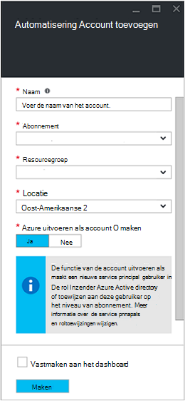
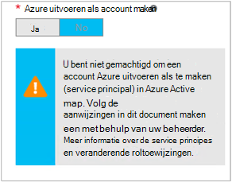

<properties
   pageTitle="Azure AD-gebruikersaccount configureren | Microsoft Azure"
   description="In dit artikel wordt beschreven hoe Azure AD-gebruiker account referentie voor runbooks configureren in Azure automatisering om te verifiëren tegen ARM en ASM."
   services="automation"
   documentationCenter=""
   authors="MGoedtel"
   manager="jwhit"
   editor="tysonn"
   keywords="Azure active directory gebruiker, azure-service management, azure ad-gebruikersaccount" />
<tags
   ms.service="automation"
   ms.devlang="na"
   ms.topic="get-started-article"
   ms.tgt_pltfrm="na"
   ms.workload="infrastructure-services"
   ms.date="09/12/2016"
   ms.author="magoedte" />

# Runbooks met Azure servicebeheer en resourcemanager verifiëren

In dit artikel worden de stappen beschreven die u uitvoeren moet om het configureren van een Azure AD-gebruikersaccount voor Azure automatisering runbooks uitgevoerd op Azure-Service Management (ASM) of Azure Resource Manager (ARM) resources.  Terwijl u zich nog steeds dat de identiteit van een ondersteunde verificatietypen voor uw ARM op basis van runbooks, wordt aangeraden het nieuwe account Azure uitvoeren als gebruikt.       

## Maak een nieuwe Azure Active Directory-gebruiker

1. Meld u aan bij de klassieke Azure-Portal als de servicebeheerder van een voor het Azure abonnement dat u wilt beheren.
2. Selecteer **Active Directory**en selecteer vervolgens de naam van de adreslijst van uw organisatie.
3. Selecteer het tabblad **gebruikers** en selecteer vervolgens in het gebied opdracht **Gebruiker toevoegen**.
4. Klik op de pagina **Vertel ons over deze gebruiker** onder **Type gebruiker**, selecteert u **nieuwe gebruiker in uw organisatie**.
5. Typ de naam van een gebruiker.  
6. Selecteer de naam van de map die is gekoppeld aan uw Azure abonnement op de pagina Active Directory.
7. Klik op de pagina **gebruikersprofiel** bieden u een eerste en laatste naam, een beschrijvende naam en gebruiker in de lijst **rollen** .  Kan geen **meervoudige verificatie inschakelen**.
8. Houd rekening met de volledige naam van de gebruiker en het tijdelijke wachtwoord.
9. Selecteer **Instellingen > beheerders > toevoegen**.
10. Typ de volledige naam van de gebruiker die u hebt gemaakt.
11. Selecteer het abonnement dat u wilt dat de gebruiker om te beheren.
12. Meld u af bij Azure en meld u opnieuw aan met het account dat u zojuist hebt gemaakt. U wordt gevraagd het wachtwoord van de gebruiker wijzigen.

## Een account automatisering in klassieke Azure-Portal maken
In deze sectie, wordt u de volgende stappen uit om een nieuwe automatisering Azure-account maken in de Portal van Azure die wordt gebruikt bij het beheren van resources in de modus voor ASM en ARM runbooks uitvoeren.  

>[AZURE.NOTE] Automatisering accounts die zijn gemaakt met de Portal van Azure-klassieke kunnen worden beheerd door zowel het Azure klassieke en Azure-Portal als een set cmdlets. Nadat het account is gemaakt, is het maakt niet uit hoe u maken en beheren van bronnen binnen het account. Als u van plan bent om door te gaan naar de klassieke Azure-Portal gebruiken, moet klikt u vervolgens u deze in plaats van de Portal Azure eventuele automatisering-accounts te maken.

1. Meld u aan bij de klassieke Azure-Portal als de servicebeheerder van een voor het Azure abonnement dat u wilt beheren.
2. Selecteer **automatisering**.
3. Selecteer op de pagina **automatisering** **een automatisering-Account maken**.
4. Typ een naam voor uw nieuwe automatisering-account in het vak **een automatisering-Account maken** en selecteer een **regio** in de vervolgkeuzelijst.  
5. Klik op **OK** om uw instellingen te accepteren en maken van het account.
6. Nadat deze is gemaakt worden, deze vermeld op de pagina **automatisering** .
7. Klik op het account en deze wordt zorgen voor de dashboardpagina.  
8. Selecteer op de pagina automatisering Dashboard **activa**.
9. Selecteer **Instellingen toevoegen** onder aan de pagina zich bevindt op de pagina **activa** .
10. Selecteer **Referentie toevoegen**op de pagina **Toevoegen-instellingen** .
11. Klik op de pagina **Definiëren referentie** Selecteer **Windows PowerShell referentie** in de vervolgkeuzelijst **Type referentie** en geef een naam voor de referentie.
12. Eerder in het veld **Gebruikersnaam in te voeren** en het wachtwoord in de velden **wachtwoord** en **Bevestig het wachtwoord** van de volgende **Referentie definiëren** paginatype in de gebruikersnaam van de AD-gebruikersaccount hebt gemaakt. Klik op **OK** om uw wijzigingen op te slaan.

## Maak een automatisering-account in de Portal van Azure

In deze sectie, wordt u de volgende stappen uit om een nieuwe automatisering Azure-account maken in de Portal van Azure die wordt gebruikt met uw runbooks beheren resources in de modus ARM uitvoeren.  

1. Meld u aan bij de Azure-portal als de servicebeheerder van een voor het Azure abonnement dat u wilt beheren.
2. **Automatisering Accounts**selecteren.
3. Klik in het blad automatisering Accounts op **toevoegen**. 
2. Klik in het blad **Automatisering-Account toevoegen** in het vak **naam** een naam voor uw nieuwe automatisering-account.
5. Als u meer dan één abonnement hebt, geeft u het account voor het nieuwe account, evenals een nieuwe of bestaande **resourcegroep** en een Azure datacenter **locatie**.
3. Selecteer de waarde **Nee** om de optie **maken Azure uitvoeren als account** en klik op de knop **maken** .  

    >[AZURE.NOTE] Als u niet de account uitvoeren als maken door de optie **Nee**, u krijgt een waarschuwing ziet in het blad **Automatisering-Account toevoegen** .  Terwijl het account is gemaakt en aan de rol **Inzender** in het abonnement toegewezen, wordt er een bijbehorende verificatie-identiteit binnen uw abonnementen adreslijstservice en dus geen toegang tot bronnen in uw abonnement.  Hierdoor wordt een runbooks die verwijst naar dit account kan verifiëren en uitvoeren van taken vergelijken ARM resources.

    

4. Terwijl Azure het account voor automatisering maakt, kunt u de voortgang onder **meldingen** bijhouden in het menu.

Wanneer het maken van de referentie is voltooid, moet u vervolgens referentie activa om te koppelen van het Account dat automatisering met het gebruikersaccount van AD eerder hebt gemaakt wilt maken.  Onthoud dat we hebben alleen het automatisering-account hebt gemaakt en is niet gekoppeld aan een verificatie-identiteit.  De stappen in de [referentie activa in Azure automatisering artikel](../automation/automation-credentials.md#creating-a-new-credential) uitvoeren en voer de waarde in voor de **gebruikersnaam** in de notatie **domein\gebruiker**.

## De referenties gebruiken in een runbook

U kunt de referentie in een runbook voor het gebruik van de activiteit [Get-AutomationPSCredential](http://msdn.microsoft.com/library/dn940015.aspx) ophalen en deze vervolgens gebruiken met [Toevoegen-AzureAccount](http://msdn.microsoft.com/library/azure/dn722528.aspx) verbinding maken met uw Azure-abonnement. Als de referentie een beheerder van meerdere Azure abonnementen is, moet u ook [Selecteren-AzureSubscription](http://msdn.microsoft.com/library/dn495203.aspx) gebruiken om op te geven van de juiste is. Dit wordt weergegeven in de steekproef Windows PowerShell onderstaande die meestal wordt weergegeven boven aan de meeste Azure automatisering runbooks.

    $cred = Get-AutomationPSCredential –Name "myuseraccount.onmicrosoft.com"
    Add-AzureAccount –Credential $cred
    Select-AzureSubscription –SubscriptionName "My Subscription"

U moet deze regels na elke [controlepunten](http://technet.microsoft.com/library/dn469257.aspx#bk_Checkpoints) herhalen in uw runbook. Als het runbook is geschorst en klik vervolgens op een andere werknemer cv's, moet deze de verificatie opnieuw uitvoeren.

## Volgende stappen
* Controleer de verschillende runbook typen en de stappen voor het maken van uw eigen runbooks in het volgende artikel [Azure automatisering runbook typen](../automation/automation-runbook-types.md)
