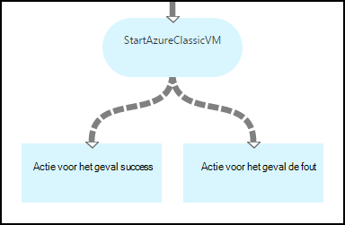
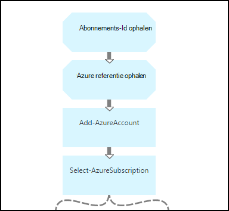
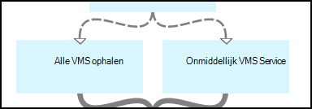
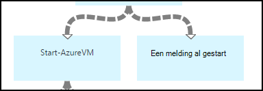
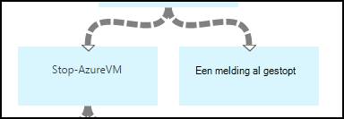
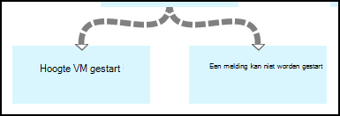
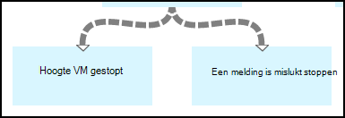

<properties 
    pageTitle="Starten en stoppen virtuele machines - Graph | Microsoft Azure"
    description="PowerShell Werkstroomversie van Azure automatisering scenario inclusief runbooks om te starten en stoppen klassieke virtuele machines."
    services="automation"
    documentationCenter=""
    authors="mgoedtel"
    manager="jwhit"
    editor="tysonn" />
<tags 
    ms.service="automation"
    ms.devlang="na"
    ms.topic="article"
    ms.tgt_pltfrm="na"
    ms.workload="infrastructure-services"
    ms.date="07/06/2016"
    ms.author="bwren" />

# Azure automatisering scenario - starten en stoppen virtuele machines

Dit scenario Azure automatisering bevat runbooks om te starten en stoppen klassieke virtuele machines.  U kunt dit scenario naar een of meer van de volgende opties:  

- Gebruik de runbooks ongewijzigd in uw eigen omgeving. 
- Wijzig de runbooks om uit te voeren aangepaste functionaliteit.  
- De runbooks bellen vanuit een ander runbook als onderdeel van een algemene oplossing. 
- Gebruik de runbooks als zelfstudies voor meer informatie over runbook authoring concepten. 

> [AZURE.SELECTOR]
- [Grafische](automation-solution-startstopvm-graphical.md)
- [PowerShell-werkstroom](automation-solution-startstopvm-psworkflow.md)

Dit is de grafische runbook-versie van dit scenario. Het is ook beschikbaar met [PowerShell werkstroom runbooks](automation-solution-startstopvm-psworkflow.md).

## Het scenario ophalen

In dit scenario bestaat uit twee twee grafische runbooks die u van de volgende koppelingen downloaden kunt.  Zie de [PowerShell-Werkstroomversie](automation-solution-startstopvm-psworkflow.md) van dit scenario voor koppelingen naar de runbooks PowerShell-werkstroom.

| Runbook | Koppeling | Type | Beschrijving |
|:---|:---|:---|:---|
| StartAzureClassicVM | [Azure klassieke VM grafische Runbook starten](https://gallery.technet.microsoft.com/scriptcenter/Start-Azure-Classic-VM-c6067b3d) | Grafische | Hiermee start u alle klassieke virtuele machines in een Azure-abonnement of alle virtuele machines met de naam van een bepaalde service. |
| StopAzureClassicVM | [Azure klassieke VM grafische Runbook stoppen](https://gallery.technet.microsoft.com/scriptcenter/Stop-Azure-Classic-VM-397819bd) | Grafische | Alle virtuele machines in een automatisering-account of alle virtuele machines met de naam van een bepaalde service stopt.  |

## Installeren en configureren van het scenario

### 1. de runbooks installeren

Na het runbooks downloadt, kunt u deze met de procedure in [grafische runbook procedures](automation-graphical-authoring-intro.md#graphical-runbook-procedures)importeren.

### 2. Bekijk de beschrijving en vereisten
De runbooks bevatten een activiteit **Leesmij** met een beschrijving en vereiste activa genoemd.  U kunt deze informatie weergeven door in te schakelen van de activiteit **Leesmij** en klik vervolgens op de **Werkstroom voor het Script** -parameter.  U kunt ook dezelfde gegevens krijgen van dit artikel. 

### 3. activa configureren
De runbooks vragen om de volgende elementen die u moet maken en vullen met de juiste waarden.  De namen worden standaard.  Als u namen in de [Invoerparameters opgeeft](#using-the-runbooks) tijdens het starten van het runbook, kunt u activa met verschillende namen.

| Activatype | Standaardnaam | Beschrijving |
|:---|:---|:---|:---|
| [Referentie](automation-credentials.md) | AzureCredential | Referenties voor een account die gemachtigd is om te starten en stoppen virtuele machines in het Azure abonnement bevat.  |
| [Variabele](automation-variables.md) | AzureSubscriptionId | Bevat de ID van het abonnement van uw Azure-abonnement. |

## Gebruik het scenario

### Parameters

De runbooks hebben de volgende [Invoerparameters weergegeven](automation-starting-a-runbook.md#runbook-parameters).  U moet waarden opgeven voor parameters die verplicht en u kunt desgewenst waarden voor andere parameters afhankelijk van uw vereisten.

| Parameter | Type | Verplicht | Beschrijving |
|:---|:---|:---|:---|
| Servicenaam | tekenreeks | Nee | Als een waarde beschikbaar is, zijn klikt u vervolgens alle virtuele machines met de servicenaam van die gestart of gestopt.  Als u geen waarde beschikbaar is, zijn klikt u vervolgens alle klassieke virtuele machines in het Azure abonnement gestart of gestopt. |
| AzureSubscriptionIdAssetName | tekenreeks | Nee | Bevat de naam van de [variabele activa](#installing-and-configuring-the-scenario) waarin de abonnements-ID van uw Azure-abonnement.  Als u een waarde niet opgeeft, wordt *AzureSubscriptionId* gebruikt.  |
| AzureCredentialAssetName | tekenreeks | Nee | Bevat de naam van de [activa referentie](#installing-and-configuring-the-scenario) met de referenties voor het runbook gebruiken.  Als u een waarde niet opgeeft, wordt *AzureCredential* gebruikt.  |

### De runbooks starten

U kunt een van de methoden bij het [starten van een runbook in Azure automatisering](automation-starting-a-runbook.md) starten een van de runbooks in dit artikel.

De volgende opdrachten in de steekproef gebruikt Windows PowerShell voor het uitvoeren van **StartAzureClassicVM** om alle virtuele machines beginnen met de naam van de service *MyVMService*.

    $params = @{"ServiceName"="MyVMService"}
    Start-AzureAutomationRunbook –AutomationAccountName "MyAutomationAccount" –Name "StartAzureClassicVM" –Parameters $params

### Uitvoer

De runbooks wordt [uitvoer van een bericht](automation-runbook-output-and-messages.md) voor elke virtuele machine die aangeeft dat u al dan niet de instructie start of stop het is verzonden.  U kunt zoeken naar een bepaalde tekenreeks in de uitvoer om te bepalen van het resultaat voor elke runbook.  De mogelijke uitvoertekenreeksen worden in de volgende tabel weergegeven.

| Runbook | Voorwaarde | Bericht |
|:---|:---|:---|
| StartAzureClassicVM | VM wordt al uitgevoerd  | MyVM wordt al uitgevoerd |
| StartAzureClassicVM | Aanvraag starten voor VM verzonden | MyVM is gestart |
| StartAzureClassicVM | Start-aanvraag voor virtuele machine is mislukt  | MyVM kan niet worden gestart |
| StopAzureClassicVM | VM wordt al uitgevoerd  | MyVM is al gestopt |
| StopAzureClassicVM | Aanvraag starten voor VM verzonden | MyVM is gestart |
| StopAzureClassicVM | Start-aanvraag voor virtuele machine is mislukt  | MyVM kan niet worden gestart |

Hier volgt een afbeelding van het gebruik van de **StartAzureClassicVM** als een [onderliggende runbook](automation-child-runbooks.md) in een grafische runbook voorbeeld.  Hiermee wordt de voorwaardelijke koppelingen gebruikt in de volgende tabel.

| Koppeling | Criteria |
|:---|:---|
| Success koppeling | $ActivityOutput [StartAzureClassicVM]-zoals "\* is gestart"    |
| Fout-koppeling   | $ActivityOutput [StartAzureClassicVM]-notlike "\* is gestart" |

## In detail

Hieronder volgt een gedetailleerd overzicht van de runbooks in dit scenario.  Deze informatie kunt u zojuist hebt meer hiertegen voor het ontwerpen van uw eigen automatisering scenario's of de runbooks aanpassen.
 

### Verificatie

Het runbook begint met activiteiten om de [referenties](automation-configuring.md#configuring-authentication-to-azure-resources) en Azure-abonnement dat wordt gebruikt voor de rest van het runbook te stellen.

De eerste twee activiteiten, **Krijgen abonnements-Id** en **Azure referentie ophalen**, de [activa](#installing-the-runbook) die worden gebruikt door de volgende twee activiteiten worden opgehaald.  Deze activiteiten kunnen rechtstreeks opgeven voor de activa, maar ze nodig hebben de namen van de activa.  Aangezien we de gebruiker om op te geven van namen in de [Invoerparameters staat](#using-the-runbooks), moeten we deze activiteiten om op te halen van de activa met een naam die wordt aangegeven door een invoerparameter.

**Toevoegen-AzureAccount** Hiermee stelt u de referenties die wordt gebruikt voor de rest van het runbook.  De referentie-activa waarin deze worden opgehaald uit **Krijgen Azure referentie** moet access starten en stoppen virtuele machines in het Azure abonnement hebben.  Het abonnement dat wordt gebruikt is door **Selecteer-AzureSubscription** waarin de abonnements-Id van **Abonnements-Id ophalen**geselecteerd.

### Virtuele machines ophalen

Het runbook nodig heeft om te bepalen welke virtuele machines deze met werkt en of ze zijn al gestart of (afhankelijk van het runbook gestopt).   Een van twee activiteiten worden de VMs opgehaald.  **VMs krijgen in de Service** wordt uitgevoerd als een waarde voor de invoerparameter *servicenaam* voor het runbook bevat.  **Alle VMs ophalen** wordt uitgevoerd als de *servicenaam* invoerparameter voor het runbook niet een waarde bevat.  Deze logica wordt uitgevoerd door de voorwaardelijke koppelingen voorafgaand aan elke activiteit.

Beide activiteiten gebruik de cmdlet **Get-AzureVM** .  **Alle VMs ophalen** gebruikt de **ListAllVMs** -parameter wordt ingesteld om alle virtuele machines.  **VMs krijgen in de Service** beschikt over het instellen van de parameter **GetVMByServiceAndVMName** en biedt de invoerparameter **servicenaam** voor de parameter **servicenaam** .  

### VMs samenvoegen

De activiteit **VMs samenvoegen** is verplicht voor het leveren input voor de **Begin-AzureVM** dat vereist is de naam en de servicenaam van de vm(s) te starten.  Deze invoer kan afkomstig zijn uit **Alle VMs ophalen** of **VMs krijgen in de Service**, maar **Begin-AzureVM** kunt slechts één activiteit om de invoer opgeven.   

Het scenario is het opzetten van **VMs samenvoegen** waarmee de cmdlet **Schrijven-uitvoer** .  De parameter **InputObject** voor deze cmdlet is een PowerShell-expressie die de invoer van de vorige twee activiteiten combineert.  Slechts één van deze activiteiten wordt uitgevoerd, zodat alleen één set uitvoer wordt verwacht.  **Start-AzureVM** kunt die uitvoer gebruiken voor de invoerparameters weergegeven. 

### Virtuele machines starten en stoppen

 

Afhankelijk van het runbook, wordt de volgende activiteiten probeert te starten of stoppen van het runbook **Start-AzureVM** of **Stoppen-AzureVM**gebruikt.  Aangezien de activiteit voorafgegaan door een koppeling verkooppijplijn, wordt deze eenmaal uitgevoerd voor elk object dat uit **Samenvoegen VMs**geretourneerd.  De koppeling is voorwaardelijke zodat de activiteit kan alleen worden uitgevoerd als de *RunningState* van de virtuele machine *gestopt* voor **Start-AzureVM** en *gestart* voor **Stoppen-AzureVM is**. Als deze voorwaarde is voldaan, wordt **Een melding al gestart** of **Een melding al gestopt** uitgevoerd als u wilt een bericht verzenden met **Schrijven-uitvoer**.

### Uitvoer verzenden

 

De laatste stap in het runbook is uitvoer verzenden of de start of stop het verzoek voor elke virtuele machine is verzonden. Er is een afzonderlijke **Schrijven-uitvoer** activiteit voor elk label, en we weten welke versie om uit te voeren met voorwaardelijke koppelingen.  **Een melding VM gestart** of **Gestopt van VM hoogte** wordt uitgevoerd als *OperationStatus* *geslaagd is*.  Als de *OperationStatus* een andere waarde is, wordt **Een melding is mislukt om te beginnen** of **Een melding kan niet worden niet meer** uitgevoerd.

## Volgende stappen

- [Grafische beschikbaar is in Azure automatisering](automation-graphical-authoring-intro.md)
- [Onderliggende runbooks in Azure automatisering](automation-child-runbooks.md) 
- [Runbook uitvoer en berichten in Azure automatisering](automation-runbook-output-and-messages.md)