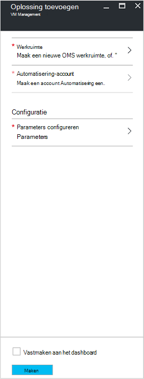
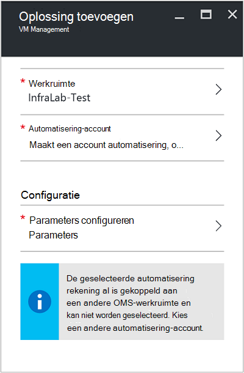
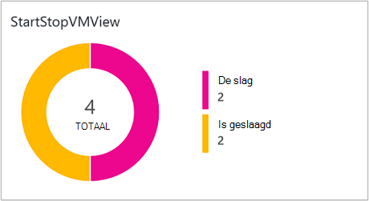
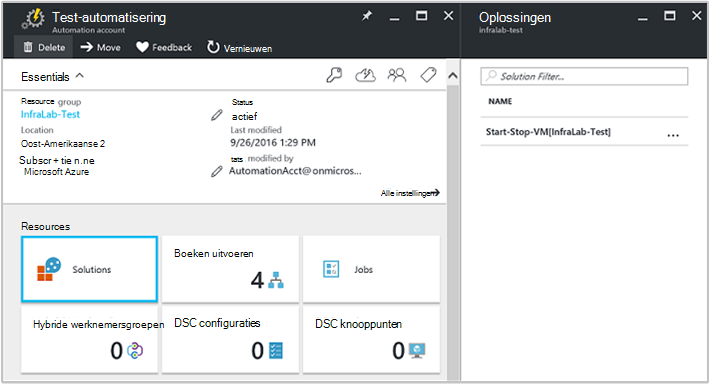
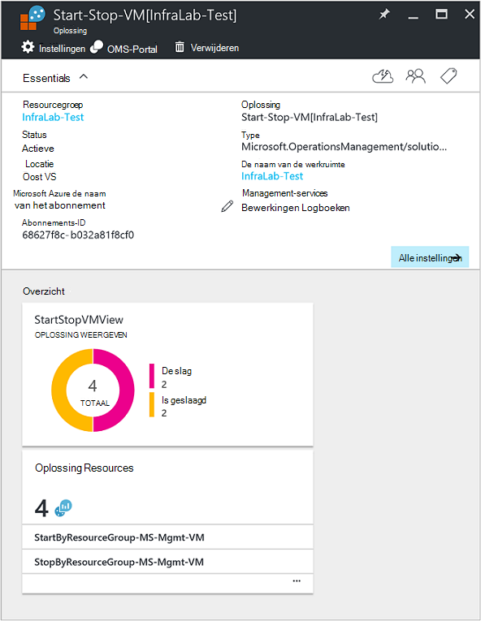

<properties
    pageTitle="Starten en stoppen VMs tijdens rustige uren [Preview] oplossing | Microsoft Azure"
    description="De oplossingen VM Management wordt gestart en uw Azure resourcemanager virtuele Machines stopt volgens een schema en proactief te controleren van Log analyseprogramma."
    services="automation"
    documentationCenter=""
    authors="MGoedtel"
    manager="jwhit"
    editor=""
    />
<tags
    ms.service="automation"
    ms.workload="tbd"
    ms.tgt_pltfrm="na"
    ms.devlang="na"
    ms.topic="get-started-article"
    ms.date="10/07/2016"
    ms.author="magoedte"/>

# Starten en stoppen VMs tijdens rustige uren [Preview]-oplossing in automatisering

De VMs starten en stoppen tijdens rustige uren [Preview] oplossing wordt gestart en uw resourcemanager Azure virtuele machines volgens een schema voor de gebruiker gedefinieerde stopt en inzicht in de automatisering-taken die starten en stoppen uw virtuele machines met OMS Log Analytics al dan niet geslaagde bevat.  

## Vereisten voor

- De runbooks werken met een [Azure uitvoeren als account](automation-sec-configure-azure-runas-account.md).  Het account uitvoeren als is de gewenste verificatiemethode omdat deze verificatie via clientcertificaat gebruikt in plaats van een wachtwoord die mogelijk verlopen of die vaak worden gewijzigd.  

- Deze oplossing kan alleen beheren voor VMs welke de hetzelfde abonnement en de resourcegroep als waarin het account dat automatisering zich bevindt.  

- Deze oplossing implementeert alleen naar de volgende Azure regio's - Australië Zuidoost, Oost VS, Zuidoost-Azië en West Europe.  De runbooks onder beheer van de planning VM kunt afstemmen VMs in elke regio.  

- Als u wilt verzenden e-mailmeldingen wanneer de start en beëindiging VM runbooks voltooit, is een abonnement op Office 365 business-klasse vereist.  

## Onderdelen van oplossingen

Deze oplossing bestaat uit de volgende bronnen die kan worden geïmporteerd en toegevoegd aan uw account automatisering.

### Runbooks

Runbook | Beschrijving|
--------|------------|
CleanSolution-MS-Mgmt-VM | Deze runbook worden alle bronnen en planningen worden verwijderd wanneer u gaat u naar de oplossing verwijderen uit uw abonnement.|  
SendMailO365-MS-Mgmt | Deze runbook stuurt een e-mailbericht via Office 365 Exchange.|
StartByResourceGroup-MS-Mgmt-VM | Deze runbook is bedoeld om te beginnen VMs (beide klassieke en ARM gebaseerd VMs) die zich bevindt in een bepaalde lijst met Azure resource groep(en).
StopByResourceGroup-MS-Mgmt-VM | Deze runbook is bedoeld om te stoppen VMs (beide klassieke en ARM gebaseerd VMs) die zich bevindt in een bepaalde lijst met Azure resource groep(en).|
 

### Variabelen

Variabele | Beschrijving|
---------|------------|
**SendMailO365-MS-Mgmt** Runbook ||
SendMailO365-IsSendEmail-MS-Mgmt | Hiermee geeft u als StartByResourceGroup-MS-Mgmt-VM en StopByResourceGroup-MS-Mgmt-VM runbooks e-mailmelding na voltooiing kunt verzenden.  Selecteer **waar** om in te schakelen en **Onwaar** e-mail waarschuwingen uitschakelen. Standaardwaarde is **Onwaar**.| 
**StartByResourceGroup-MS-Mgmt-VM** Runbook ||
StartByResourceGroup-ExcludeList-MS-Mgmt-VM | Voer de namen VM moet worden uitgesloten uit management bewerking. Scheid de namen met behulp van puntkomma (;). Waarden zijn hoofdlettergevoelig en jokertekens (sterretje) wordt ondersteund.|
StartByResourceGroup-SendMailO365-EmailBodyPreFix-MS-Mgmt | Tekst die kan worden toegevoegd aan het begin van de berichttekst van e-mail.|
StartByResourceGroup-SendMailO365-EmailRunBookAccount-MS-Mgmt | Hiermee geeft u de naam van de automatisering rekening met het e-runbook.  **Deze variabele niet wijzigen.**|
StartByResourceGroup-SendMailO365-EmailRunbookName-MS-Mgmt | Hiermee geeft u de naam van het e-runbook.  Dit wordt gebruikt door de StartByResourceGroup-MS-Mgmt-VM en StopByResourceGroup-MS-Mgmt-VM runbooks om e-mail te verzenden.  **Deze variabele niet wijzigen.**|
StartByResourceGroup-SendMailO365-EmailRunbookResourceGroup-MS-Mgmt | Geeft de naam van de resourcegroep met het e-runbook.  **Deze variabele niet wijzigen.**|
StartByResourceGroup-SendMailO365-EmailSubject-MS-Mgmt | Hiermee geeft u de tekst voor de onderwerpregel van het e-mailbericht.|  
StartByResourceGroup-SendMailO365-EmailToAddress-MS-Mgmt | Hiermee geeft u de geadresseerden van het e-mailbericht.  Voer de namen in afzonderlijke met behulp van puntkomma (;).|
StartByResourceGroup-TargetResourceGroups-MS-Mgmt-VM | Voer de namen VM moet worden uitgesloten uit management bewerking. Scheid de namen met behulp van puntkomma (;). Waarden zijn hoofdlettergevoelig en jokertekens (sterretje) wordt ondersteund.  Standaardwaarde (sterretje) bevat alle resourcegroepen in het abonnement.|
StartByResourceGroup-TargetSubscriptionID-MS-Mgmt-VM | Hiermee geeft u het abonnement waaraan VMs worden beheerd door deze oplossing bevat.  Dit moet hetzelfde abonnement waarin het account automatisering van deze oplossing zich bevindt.|
**StopByResourceGroup-MS-Mgmt-VM** Runbook ||
StopByResourceGroup-ExcludeList-MS-Mgmt-VM | Voer de namen VM moet worden uitgesloten uit management bewerking. Scheid de namen met behulp van puntkomma (;). Waarden zijn hoofdlettergevoelig en jokertekens (sterretje) wordt ondersteund.|
StopByResourceGroup-SendMailO365-EmailBodyPreFix-MS-Mgmt | Tekst die kan worden toegevoegd aan het begin van de berichttekst van e-mail.|
StopByResourceGroup-SendMailO365-EmailRunBookAccount-MS-Mgmt | Hiermee geeft u de naam van de automatisering rekening met het e-runbook.  **Deze variabele niet wijzigen.**|
StopByResourceGroup-SendMailO365-EmailRunbookResourceGroup-MS-Mgmt | Geeft de naam van de resourcegroep met het e-runbook.  **Deze variabele niet wijzigen.**|
StopByResourceGroup-SendMailO365-EmailSubject-MS-Mgmt | Hiermee geeft u de tekst voor de onderwerpregel van het e-mailbericht.|  
StopByResourceGroup-SendMailO365-EmailToAddress-MS-Mgmt | Hiermee geeft u de geadresseerden van het e-mailbericht.  Voer de namen in afzonderlijke met behulp van puntkomma (;).|
StopByResourceGroup-TargetResourceGroups-MS-Mgmt-VM | Voer de namen VM moet worden uitgesloten uit management bewerking. Scheid de namen met behulp van puntkomma (;). Waarden zijn hoofdlettergevoelig en jokertekens (sterretje) wordt ondersteund.  Standaardwaarde (sterretje) bevat alle resourcegroepen in het abonnement.|
StopByResourceGroup-TargetSubscriptionID-MS-Mgmt-VM | Hiermee geeft u het abonnement waaraan VMs worden beheerd door deze oplossing bevat.  Dit moet hetzelfde abonnement waarin het account automatisering van deze oplossing zich bevindt.|  
 

### Schema 's

Planning | Beschrijving|
---------|------------|
StartByResourceGroup-planning-MS-Mgmt | Planning voor StartByResourceGroup runbook, waarmee het starten van VMs beheerd door deze oplossing.|
StopByResourceGroup-planning-MS-Mgmt | Planning voor StopByResourceGroup runbook, waarmee het afsluiten van VMs beheerd door deze oplossing.|

### Referenties

Referentie | Beschrijving|
-----------|------------|
O365Credential | Hiermee geeft u een geldig Office 365-gebruikersaccount e-mail te verzenden.  Alleen vereist als variabele SendMailO365-IsSendEmail-MS-Mgmt is ingesteld op **waar**.

## Configuratie

De volgende stappen als u de VMs starten en stoppen tijdens rustige uren [Preview] oplossing toevoegen aan uw account automatisering en configureer de variabelen als u wilt aanpassen van de oplossing wilt uitvoeren.

1. Selecteer de **Marketplace** -tegel in het Start-scherm in de portal van Azure.  Als de tegel niet langer aan de start-scherm, in het linkernavigatiedeelvenster vastgemaakt is, selecteert u **Nieuw**.  
2. Typ **VM starten** in het zoekvak in het blad Marketplace en selecteer vervolgens de oplossing **Starten en stoppen VMs kantooruren [Preview]** in de lijst met zoekresultaten.  
3. In het blad **Starten en stoppen VMs kantooruren [Preview]** voor de geselecteerde oplossing, Controleer de samenvatting van de gegevens en klik op **maken**.  
4. Het blad **Oplossing toevoegen** wordt weergegeven waarbij u voor het configureren van de oplossing voordat u deze in uw abonnement automatisering importeren kunt wordt gevraagd.     
5.  Klik op het blad **Oplossing toevoegen** , selecteer **werkruimte** en hier het selecteren van een werkruimte OMS die is gekoppeld aan hetzelfde Azure-abonnement dat het account dat automatisering is in of maak een nieuwe OMS-werkruimte.  Als u een werkruimte OMS niet hebt, kunt u **Nieuwe werkruimte maken** selecteren en klik op het blad **OMS werkruimte** als volgt te werk: 
   - Geef een naam voor de nieuwe **OMS werkruimte**.
   - Selecteer een **abonnement** op de koppeling naar door te selecteren in de vervolgkeuzelijst als het standaard geselecteerd niet nodig is.
   - U kunt een nieuwe resourcegroep maken of Selecteer een bestaande resourcegroep voor **Resourcegroep**.  
   - Selecteer een **locatie**.  De enige locaties opgegeven voor selectie zijn momenteel **Australië Zuidoost**, **Oost VS**, **Zuidoost-Azië**en **West Europe**.
   - Selecteer een **prijzen laag**.  De oplossing wordt aangeboden in twee lagen: vrij te geven en OMS betaald laag.  De gratis laag geldt een limiet van de hoeveelheid gegevens die zijn verzameld dagelijks, bewaarperiode en runbook taak runtime minuten.  De laag OMS dat is betaald heeft geen een limiet van de hoeveelheid gegevens die worden verzameld dagelijks.  

        > [AZURE.NOTE]
        > Terwijl de zelfstandige versie van laag betaald als optie wordt weergegeven, is het niet van toepassing.  Als u deze selecteren en doorgaan met het maken van deze oplossing in uw abonnement, mislukt dit.  Hiermee wordt opgelost wanneer deze oplossing officieel wordt uitgebracht. Als u deze oplossing gebruikt, wordt deze alleen automatisering taak minuten gebruiken en meld u opname.  De oplossing geen extra OMS knooppunten toegevoegd aan uw omgeving.  

6. Na het opgeven van de vereiste gegevens op het blad **OMS werkruimte** , klikt u op **maken**.  Terwijl de informatie is geverifieerd, en de werkruimte is gemaakt, kunt u de voortgang daarvan onder **meldingen** bijhouden in het menu.  U keert terug naar het blad **Oplossing toevoegen** .  
7. Selecteer op het blad **Toevoegen oplossing** **Automatisering-Account**.  Als u een nieuwe OMS-werkruimte maakt, moet u moeten ook maken een nieuw account voor automatisering die gekoppeld aan de nieuwe OMS werkruimte opgegeven eerder worden, inclusief uw Azure-abonnement, resourcegroep en regio.  U kunt **een automatisering-account maken** selecteren en geef op het blad **toevoegen automatisering account** het volgende: 
  - Voer in het veld **naam** de naam van het account dat automatisering.

    Alle andere opties worden automatisch ingevuld op basis van de werkruimte OMS is geselecteerd en deze opties kunnen niet worden gewijzigd.  Een account Azure uitvoeren als is de standaardmethode voor de verificatie voor de runbooks opgenomen in deze oplossing.  Nadat u op **OK**hebt geklikt, wordt de configuratieopties worden gevalideerd en wordt het automatisering-account is gemaakt.  U kunt de voortgang daarvan onder **meldingen** bijhouden in het menu. 

    Anders kunt u een bestaand account automatisering uitvoeren als selecteren.  Opmerking dat het account dat u selecteert kan niet al zijn gekoppeld aan een andere werkruimte OMS, anders een bericht wordt weergegeven in het blad op de hoogte brengt u.  Als deze al is gekoppeld, moet u een nieuw account maken of selecteren van een ander account automatisering uitvoeren als.    

8. Ten slotte op het blad **Oplossing toevoegen** , selecteer **configuratie** en het blad **Parameters** wordt weergegeven.  Klik op het blad **Parameters** , wordt u gevraagd naar:  
   - Geef het **Doel ResourceGroup namen**, waarin de naam van een resource-groep met VMs worden beheerd door deze oplossing is.  U kunt meer dan één naam invoeren en scheidt u elk door een puntkomma (waarden zijn hoofdlettergevoelig).  Gebruik een jokerteken wordt ondersteund als u doel VMs in alle resourcegroepen in het abonnement wilt.
   - Selecteer een **planning** is een terugkerende datum en tijd voor starten en stoppen in de doellijst resource groep(en) waaraan van de VM.  

10. Als u klaar bent met het configureren van de eerste instellingen vereist voor de oplossing, schakelt u **maken**.  Alle instellingen worden gevalideerd en vervolgens probeert te implementeren van de oplossing in uw abonnement.  Dit proces kan enkele minuten duren en u kunt de voortgang daarvan onder **meldingen** bijhouden in het menu. 

## Frequentie van de siteverzameling

Gegevens uit de automatisering taak log en taak-stream is ingenomen naar de bibliotheek OMS om de vijf minuten.  

## Gebruik van de oplossing

Wanneer u de VM beheeroplossing toevoegt, in uw werkruimte OMS **StartStopVM weergave** van de worden tegel, toegevoegd aan uw dashboard OMS.  Een aantal en grafische weergave van de runbooks taken voor de oplossing die u hebt gestart en hebt voltooid, worden deze tegel weergegeven.     

U kunt in uw account automatisering, toegang tot en beheer van de oplossing op de tegel **oplossingen** te selecteren en vervolgens van het blad **oplossingen** de oplossing **Start-stoppen-VM [werkruimte]** in de lijst te selecteren.     

Als u de oplossing, wordt het **Start-stoppen-VM [werkruimte]** oplossing blad, waar u belangrijke details zoals de tegel **StartStopVM** zoals kunt bekijken in uw werkruimte OMS, die een aantal en grafische weergave van de runbooks taken voor de oplossing die u hebt gestart en hebt voltooid weergegeven.     

Hier kunt u ook uw werkruimte OMS openen en verdere analyse van de Taakrecords uitvoeren.  Alleen Klik op **alle instellingen**, en selecteer in het blad **Instellingen** **Snel starten** en selecteer vervolgens in het blad **Snel aan de slag** **OMS-Portal**.   Hiermee wordt een nieuw tabblad of een nieuwe browsersessie openen en presenteren van uw OMS werkruimte dat is gekoppeld aan uw account voor automatisering en abonnementen.  

### E-mailmeldingen configureren

E-mailmeldingen inschakelen wanneer de start en beëindiging VM runbooks dat voltooid, moet u voor het wijzigen van de **O365Credential** referenties en ten minste de volgende variabelen:

 - SendMailO365-IsSendEmail-MS-Mgmt
 - StartByResourceGroup-SendMailO365-EmailToAddress-MS-Mgmt
 - StopByResourceGroup-SendMailO365-EmailToAddress-MS-Mgmt

Als u wilt de referentie **O365Credential** configureren, moet u de volgende stappen uitvoeren:

1. Van uw account automatisering, klikt u op **Alle instellingen** boven aan het venster. 
2. Selecteer op het blad **Instellingen** onder de sectie **Automatisering Resources**, **activa**. 
3. Klik op het blad **activa** , selecteer de tegel **referentie** en selecteer in het blad **referentie** de **O365Credential**.  
4. Voer een geldig Office 365-gebruikersnaam en wachtwoord en klik vervolgens op **Opslaan** als uw wijzigingen wilt opslaan.  

Als u wilt configureren de variabelen die eerder gemarkeerd, moet u de volgende stappen uitvoeren:

1. Van uw account automatisering, klikt u op **Alle instellingen** boven aan het venster. 
2. Selecteer op het blad **Instellingen** onder de sectie **Automatisering Resources**, **activa**. 
3. Klik op het blad **activa** , selecteert u de tegel **variabelen** en van het blad **variabelen** , selecteert u de bovenstaande variabele en wijzig vervolgens de waarde na de beschrijving voor deze eerder in de sectie [variabele opgegeven](##variables) .  
4. Klik op **Opslaan** om de wijzigingen in de variabele opslaan.   

### Wijzigen van de planning opstarten en afsluiten

Beheer van de planning opstarten en afsluiten in deze oplossing, volgt dezelfde stappen zoals wordt beschreven in het [plannen van een runbook in Azure automatisering](automation-scheduling-a-runbook.md).  Onthoud dat u de planning-configuratie niet wijzigen.  U moet de bestaande planning uitschakelen en maakt u een nieuwe record en klik vervolgens koppeling naar de **StartByResourceGroup-MS-Mgmt-VM** of **StopByResourceGroup-MS-Mgmt-VM** runbook die u wilt dat de planning toe te passen op.   

## Logboekrecords Analytics

Automatisering Hiermee maakt u twee soorten records in de bibliotheek OMS.

### Logboeken aan de taak

Eigenschap | Beschrijving|
----------|----------|
Beller |  Wie de bewerking gestart.  Mogelijke waarden zijn een e-mailadres of een systeem voor geplande taken.|
Categorie | Classificatie van het type gegevens.  Voor automatisering is de waarde JobLogs.|
CorrelationId | GUID die de correlatie-Id van de taak runbook is.|
Taak-id | GUID die is de Id van de taak runbook.|
operationName | Hiermee geeft u het type bewerking uitgevoerd in Azure wordt aangegeven.  Voor automatisering, wordt de waarde worden voor de taak.|
resourceId | Hiermee geeft u het resourcetype in Azure wordt aangegeven.  Voor automatisering is de waarde van het automatisering-account dat is gekoppeld aan het runbook.|
ResourceGroup | Hiermee geeft u de naam van de resource van de taak runbook.|
ResourceProvider | Hiermee geeft u de Azure-service waaruit de bronnen die u kunt implementeren en te beheren.  Voor automatisering is de waarde Azure automatisering.|
Brontype | Hiermee geeft u het resourcetype in Azure wordt aangegeven.  Voor automatisering is de waarde van het automatisering-account dat is gekoppeld aan het runbook.|
resultType | De status van de taak runbook.  Mogelijke waarden zijn: -Gestart -Gestopt -Geschorst -Is mislukt -Is geslaagd|
resultDescription | Beschrijving van het hulpprogramma voor het resultaat van het runbook-taakstatus.  Mogelijke waarden zijn: -Taak is gestart -Taak is mislukt -Taak voltooid|
RunbookName | Hiermee geeft u de naam van het runbook.|
SourceSystem | Hiermee geeft u het bronsysteem voor de ingediende gegevens.  Voor automatisering, de waarde is: OpsManager|
StreamType | Hiermee geeft u het type gebeurtenis. Mogelijke waarden zijn: -Uitgebreide -Uitvoer -Fout -Waarschuwing|
SubscriptionId | Hiermee geeft u de abonnements-ID van de taak.
Tijd | Datum en tijd waarop de taak runbook uitgevoerd.|

### Taak-streams

Eigenschap | Beschrijving|
----------|----------|
Beller |  Wie de bewerking gestart.  Mogelijke waarden zijn een e-mailadres of een systeem voor geplande taken.|
Categorie | Classificatie van het type gegevens.  Voor automatisering is de waarde JobStreams.|
Taak-id | GUID die is de Id van de taak runbook.|
operationName | Hiermee geeft u het type bewerking uitgevoerd in Azure wordt aangegeven.  Voor automatisering, wordt de waarde worden voor de taak.|
ResourceGroup | Hiermee geeft u de naam van de resource van de taak runbook.|
resourceId | Hiermee geeft u de resource-Id in Azure wordt aangegeven.  Voor automatisering is de waarde van het automatisering-account dat is gekoppeld aan het runbook.|
ResourceProvider | Hiermee geeft u de Azure-service waaruit de bronnen die u kunt implementeren en te beheren.  Voor automatisering is de waarde Azure automatisering.|
Brontype | Hiermee geeft u het resourcetype in Azure wordt aangegeven.  Voor automatisering is de waarde van het automatisering-account dat is gekoppeld aan het runbook.|
resultType | Het resultaat van de taak runbook op het moment dat de gebeurtenis is gegenereerd.  Mogelijke waarden zijn: -InProgress|
resultDescription | Bevat de stream uitvoer van het runbook.|
RunbookName | De naam van het runbook.|
SourceSystem | Hiermee geeft u het bronsysteem voor de ingediende gegevens.  De waarde is voor automatisering, OpsManager|
StreamType | Het type taak stream. Mogelijke waarden zijn: -Voortgang -Uitvoer -Waarschuwing -Fout -Foutopsporing -Uitgebreide|
Tijd | Datum en tijd waarop de taak runbook uitgevoerd.|

Wanneer u een zoekopdracht log die resulteert in records van de categorie van **JobLogs** of **JobStreams**uitvoert, kunt u de **JobLogs** of **JobStreams** weergave waarin een reeks tegels samenvatten van de updates die het resultaat van de zoekopdracht.

## Voorbeeld log zoekopdrachten

De volgende tabel vindt steekproef log wordt gezocht naar Taakrecords die zijn verzameld met deze oplossing. 

Query | Beschrijving|
----------|----------|
Taken zoeken voor runbook StartVM die zijn voltooid | Categorie = JobLogs RunbookName_s = "StartByResourceGroup-MS-Mgmt-VM" ResultType = is geslaagd & #124; count() door JobId_g meten|
Taken zoeken voor runbook StopVM die zijn voltooid | Categorie = JobLogs RunbookName_s = "StartByResourceGroup-MS-Mgmt-VM" ResultType = is mislukt & #124; count() door JobId_g meten
Taakstatus na verloop van tijd voor StartVM en StopVM runbooks weergeven | Categorie JobLogs RunbookName_s = "StartByResourceGroup-MS-Mgmt-VM" of "StopByResourceGroup-MS-Mgmt-VM" NOT(ResultType="started") = | meten Count() door ResultType interval 1 dag|

## Volgende stappen

- Zie voor meer informatie over het maken van verschillende zoekquery's en controleer de logboeken aan de taak automatisering met Log analyses, [Log zoekopdrachten in Log Analytics](../log-analytics/log-analytics-log-searches.md)
- Zie voor meer informatie over runbook uitvoering, hoe taken om de runbook te houden, en andere technische details, [bijhouden een taak runbook](automation-runbook-execution.md)
- Meer informatie over OMS Log analyses en gegevensbronnen van de siteverzameling, Zie [Azure verzamelen opslaggegevens in Log Analytics-overzicht](../log-analytics/log-analytics-azure-storage.md)

   

