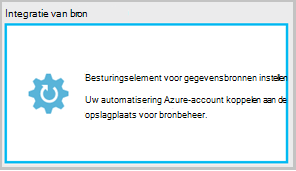
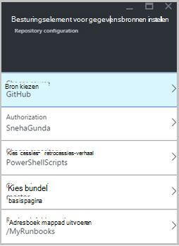
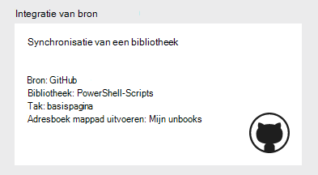
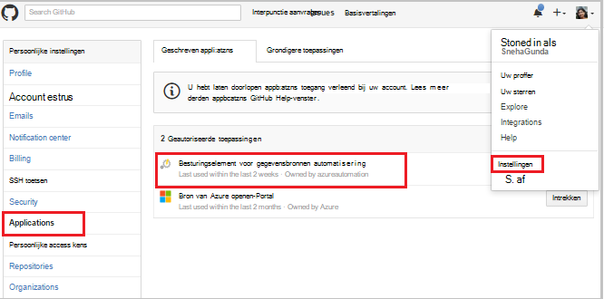
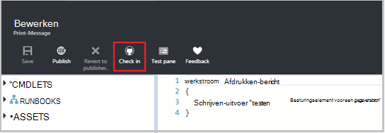
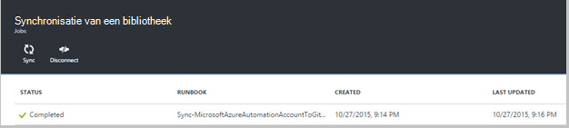
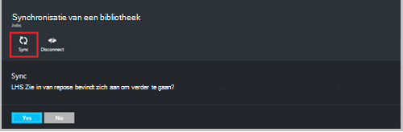
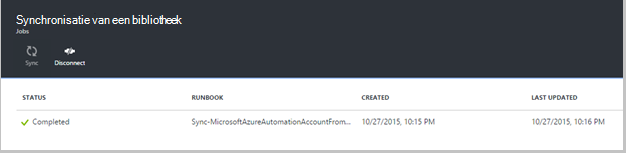
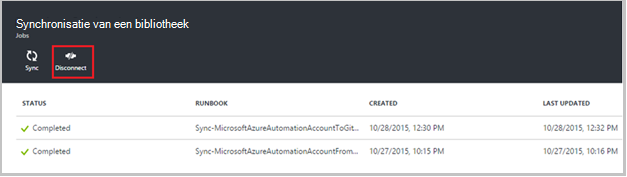

<properties 
    pageTitle=" Besturingselement-integratie in Azure automatisering gegevensbron | Microsoft Azure"
    description="In dit artikel worden de bron besturingselement integratie met GitHub in Azure automatisering."
    services="automation"
    documentationCenter=""
    authors="mgoedtel"
    manager="jwhit"
    editor="tysonn" />    
<tags 
    ms.service="automation"
    ms.devlang="na"
    ms.topic="article"
    ms.tgt_pltfrm="na"
    ms.workload="infrastructure-services"
    ms.date="09/12/2016"
    ms.author="magoedte;sngun" />

# Integratie van bron in Azure automatisering

Integratie van bron kunt u runbooks in uw account automatisering naar een bibliotheek GitHub bron besturingselement koppelen. Besturingselement voor gegevensbronnen kunt u eenvoudig samenwerken met uw team, wijzigingen bijhouden en terugkeren naar eerdere versies van uw runbooks. Besturingselement voor gegevensbronnen bijvoorbeeld, kunt u verschillende vertakkingen in een besturingselement voor gegevensbronnen naar ontwikkeling, test of productie automatisering accounts, zodat u gemakkelijk kunt promoveren code die is getest in uw ontwikkelomgeving aan uw productie automatisering account synchroniseren.

Besturingselement voor gegevensbronnen kunt u push-code van Azure automatisering aan een besturingselement voor gegevensbronnen of uw runbooks van het besturingselement voor gegevensbronnen om Automation Azure te halen. Dit artikel wordt beschreven hoe u een besturingselement voor gegevensbronnen in uw omgeving Azure automatisering instelt. Wordt begin met het configureren van Azure automatisering voor toegang tot uw bibliotheek GitHub en doorlopen van verschillende bewerkingen die kunnen worden uitgevoerd met de integratie van bron. 

>[AZURE.NOTE]Besturingselement voor gegevensbronnen ondersteunt ophalen en [PowerShell werkstroom runbooks](automation-runbook-types.md#powershell-workflow-runbooks) , evenals [PowerShell runbooks](automation-runbook-types.md#powershell-runbooks)opslaan. [Grafische runbooks](automation-runbook-types.md#graphical-runbooks) worden nog niet ondersteund.  

Er zijn twee eenvoudige stappen die zijn vereist voor het besturingselement voor gegevensbronnen voor uw account automatisering en slechts één configureren als u al een account GitHub. Ze zijn:
## Stap 1 – een opslagplaats GitHub maken

Als u al een account GitHub en een locatie die u wilt koppelen aan Azure automatisering, en meld u vervolgens aan uw bestaande account en start vanaf stap 2 hieronder. Anders naar [GitHub](https://github.com/), teken omhoog navigeren voor een nieuw account en [een nieuwe bibliotheek maken](https://help.github.com/articles/create-a-repo/).

## Stap 2 – besturingselement voor gegevensbronnen in Azure automatisering instellen

1. Klik op het blad automatisering Account in de portal van Azure, **Bronbeheer instellen.** 
 
    

2. Het **Besturingselement voor gegevensbronnen** blad wordt geopend, waar u de details van uw GitHub kunt configureren. Hieronder vindt u de lijst met parameters te configureren:  

  	|**Parameter**            |**Beschrijving** |
  	|:---|:---| 
  	|Bron kiezen   | Selecteer de gegevensbron. Op dit moment wordt alleen **GitHub** ondersteund. |
  	|Autorisatie | Klik op de knop **autoriseren** Azure automatisering toegang verlenen tot uw bibliotheek GitHub. Als u al bent aangemeld bij uw account GitHub in een ander venster, klikt u vervolgens de referenties van dat account gebruikt. Wanneer de verificatie is gelukt, wordt het blad de gebruikersnaam van uw GitHub onder **Autorisatie eigenschap**weergegeven. |
  	|Kies opslagplaats | Selecteer een GitHub-bibliotheek in de lijst met beschikbare opslagplaatsen. |
  	|Kies tak | Selecteer een tak in de lijst met beschikbare vertakkingen. Alleen de **basispagina** tak wordt weergegeven als u eventuele vertakkingen nog niet hebt gemaakt. |
  	|Runbook mappad | Het pad van de map runbook geeft het pad in de GitHub opslagplaats waaruit u wilt push of uw code halen. Deze moet worden ingevoerd in de indeling **/foldername/subfoldername**. Alleen runbooks in het pad van de map runbook wordt gesynchroniseerd met uw account automatisering. Runbooks in de submappen van het runbook map pad kan **niet** worden gesynchroniseerd. Gebruik **/** om alle runbooks onder de bibliotheek te synchroniseren. |

3. Als u een bibliotheek met **PowerShellScripts** die een map genaamd **RootFolder**bevat de naam, die een map bevat bijvoorbeeld **submap**de naam. U kunt de volgende tekenreeksen gebruiken om elk mapniveau te synchroniseren:

    1. Als u wilt synchroniseren runbooks uit **opslagplaats**, is runbook mappad*/*
    2. Als u wilt synchroniseren runbooks uit **RootFolder**, is runbook mappad */RootFolder*
    3. Als u wilt synchroniseren runbooks van de **submap**, is het mappad runbook */RootFolder/SubFolder*.
  

4. Nadat u de parameters hebt geconfigureerd, worden weergegeven op de **Bronbeheer instellen blade.**  
 
    

5. Nadat u op OK hebt geklikt, wordt bron besturingselement integratie is nu geconfigureerd voor uw account automatisering en moet worden bijgewerkt door uw gegevens GitHub. U kunt nu op dit onderdeel om alle uw werkervaring bron besturingselement synchronisatie weer te klikken.  

    

6. Nadat u het besturingselement voor gegevensbronnen hebt ingesteld, wordt de volgende bronnen voor automatisering worden gemaakt in uw account automatisering:  
 Twee [variabele activa](automation-variables.md) worden gemaakt.  
      
    * De variabele **Microsoft.Azure.Automation.SourceControl.Connection** bevat de waarden van de verbindingsreeks, zoals hieronder wordt weergegeven.  

  	|**Parameter**            |**Waarde** |
  	|:---|:---|
  	| Naam  | Microsoft.Azure.Automation.SourceControl.Connection |
  	| Type | Tekenreeks |
  	| Waarde  | {'Tak':\<*de naam van uw tak*>, "RunbookFolderPath":\<*Runbook mappad*>, "ProviderType":\<*heeft een waarde 1 voor GitHub*>, "Opslagplaats":\<*naam van uw bibliotheek*>, "Gebruikersnaam":\<*gebruikersnaam uw GitHub*>} |   

    * De variabele **Microsoft.Azure.Automation.SourceControl.OAuthToken**, bevat de beveiligde versleutelde waarde van uw OAuthToken.  

  	|**Parameter**            |**Waarde** |
  	|:---|:---|
  	| Naam  | Microsoft.Azure.Automation.SourceControl.OAuthToken |
  	| Type | Unknown(Encrypted) |
  	| Waarde | <*Versleutelde OAuthToken*> |  

      

    * **Besturingselement voor gegevensbronnen automatisering** wordt toegevoegd als een geautoriseerde toepassing bij uw account GitHub. Naar de toepassing weergeven: Ga vanaf de startpagina van GitHub, aan uw **profiel** > **Instellingen** > **toepassingen**. Deze toepassing kunnen Azure automatisering om uw bibliotheek GitHub bij een account automatisering te synchroniseren.  

    

## Besturingselement voor gegevensbronnen gebruiken in automatisering

### Een runbook van Azure automatisering op bronbeheer inchecken

Kunt u de wijzigingen die u hebt aangebracht in een runbook in Azure automatisering in de opslagplaats voor bronbeheer push Runbook inchecken. Hieronder vindt u de stappen voor het inchecken een runbook:

1. Vanuit uw automatisering-Account, [een nieuwe tekstuele runbook maken](automation-first-runbook-textual.md)of [bewerken van een bestaande, tekstuele runbook](automation-edit-textual-runbook.md). Een werkstroom voor het PowerShell of een PowerShell-script runbook, kan dit runbook zijn.  

2. Nadat u uw runbook bewerken, opslaan en klik op **inchecken** van het blad **bewerken** .  

    

     >[AZURE.NOTE] Inchecken van Azure automatisering overschrijft de code die momenteel in het besturingselement voor gegevensbronnen aanwezig zijn. De instructie van de overeenkomstige opdrachtregel cijfer voor inchecken is **cijfer toevoegen + cijfer doorvoeren + cijfer push**  

3. Wanneer u op **inchecken**, kunt u met een bevestigingsbericht wordt gevraagd, klikt u op Ja om door te gaan.  

    

4. Hiermee start u de bron besturingselement runbook inchecken: **Synchronisatie-MicrosoftAzureAutomationAccountToGitHubV1**. Deze runbook maakt verbinding met GitHub en wijzigingen van Azure automatisering verplaatst naar de bibliotheek. Als u wilt weergeven in de geschiedenis inchecken, gaat u terug naar het tabblad **Bron besturingselement integratie** en opent u het blad opslagplaats synchronisatie. Deze blade ziet u alle van uw taken van de besturing bron.  Selecteer de taak die u wilt weergeven en klik op om de details weer te geven.  

    

    >[AZURE.NOTE] Bron besturingselement runbooks zijn speciale automatisering runbooks die u niet kunt bekijken of bewerken. Terwijl ze niet in de lijst runbook weergegeven worden, ziet u de synchronisatie-taken niet weergegeven in de takenlijst.
 
5. De naam van het gewijzigde runbook wordt verzonden als invoerparameter naar het runbook inchecken. U kunt [de taakdetails van een weergeven](automation-runbook-execution.md#viewing-job-status-using-the-azure-management-portal) door het runbook in **Opslagplaats synchronisatie** blade uitvouwen.  

    

6. Vernieuw uw bibliotheek GitHub zodra de taak is voltooid als de wijzigingen wilt weergeven.  Moet er een doorvoeren in de bibliotheek met een bericht dat doorvoeren: * *Bijgewerkte *Runbook naam* in Azure Automation.* *  

### Runbooks van de synchronisatie van een besturingselement voor gegevensbronnen naar Azure automatisering 

De knop synchroniseren op het blad opslagplaats synchronisatie kunt u alle runbooks in het pad van de map runbook van uw bibliotheek met uw account automatisering halen. De dezelfde opslagplaats kan worden gesynchroniseerd met meer dan één automatisering-account. Hieronder vindt u de stappen voor het synchroniseren van een runbook:

1. Van het account automatisering waar u bronbeheer instellen, opent u de **bron besturingselement integratie/opslagplaats synchronisatie blade** en klikt u op **synchroniseren** en vervolgens wordt u gevraagd met een bevestigingsbericht weergegeven, klikt u op **Ja** om door te gaan.  

    

2. Synchronisatie van het runbook wordt gestart: **Synchronisatie-MicrosoftAzureAutomationAccountFromGitHubV1**. Deze runbook maakt verbinding met GitHub en Hiermee worden de wijzigingen van uw bibliotheek naar Azure automatisering. Klik op het blad **Opslagplaats synchronisatie** voor deze actie ziet u een nieuwe taak. Gedetailleerde informatie over de synchronisatie-taak, klik op om het blad van de details van taak.  
 
    

 
    >[AZURE.NOTE] Een synchronisatie van een besturingselement voor gegevensbronnen overschrijft de conceptversie van de runbooks die momenteel beschikbaar zijn in uw account voor automatisering voor **alle** runbooks die momenteel in een besturingselement voor gegevensbronnen. Het cijfer equivalente opdrachtregel-instructie voor het synchroniseren is **cijfer halen**

## Bron besturingselement oplossen

Als er fouten aan een project inchecken of synchroniseren, wordt de taakstatus moet worden geschorst en vindt u meer informatie over de fout in het blad voor de taak.  Het deel achter de **Alle logboeken** ziet u alle van de PowerShell-streams die is gekoppeld aan die taak. Hier krijgt u de details die nodig zijn om u te helpen u Verhelp eventuele problemen met uw inchecken of synchroniseren. Deze ook ziet u de volgorde van de acties die zijn opgetreden bij het synchroniseren van of controleren in een runbook.  

## Besturingselement voor gegevensbronnen verbreken

Uw account GitHub verbreken, opent u het blad opslagplaats synchronisatie en klikt u op **verbinding verbreken**. Nadat u een besturingselement voor gegevensbronnen verbreken, runbooks die eerder zijn gesynchroniseerd blijven in uw account automatisering, maar het blad opslagplaats synchronisatie wordt niet ingeschakeld.  

  

## Volgende stappen

Zie de volgende bronnen voor meer informatie over de integratie van de bron-besturingselement:  
- [Azure automatisering: Integratie bron in Azure automatisering](https://azure.microsoft.com/blog/azure-automation-source-control-13/)  
- [Stemmen op uw favoriete bron control-mailsysteem](https://www.surveymonkey.com/r/?sm=2dVjdcrCPFdT0dFFI8nUdQ%3d%3d)  
- [Azure automatisering: Integratie Runbook besturingselement voor gegevensbronnen met behulp van Visual Studio Team Services](https://azure.microsoft.com/blog/azure-automation-integrating-runbook-source-control-using-visual-studio-online/)  
