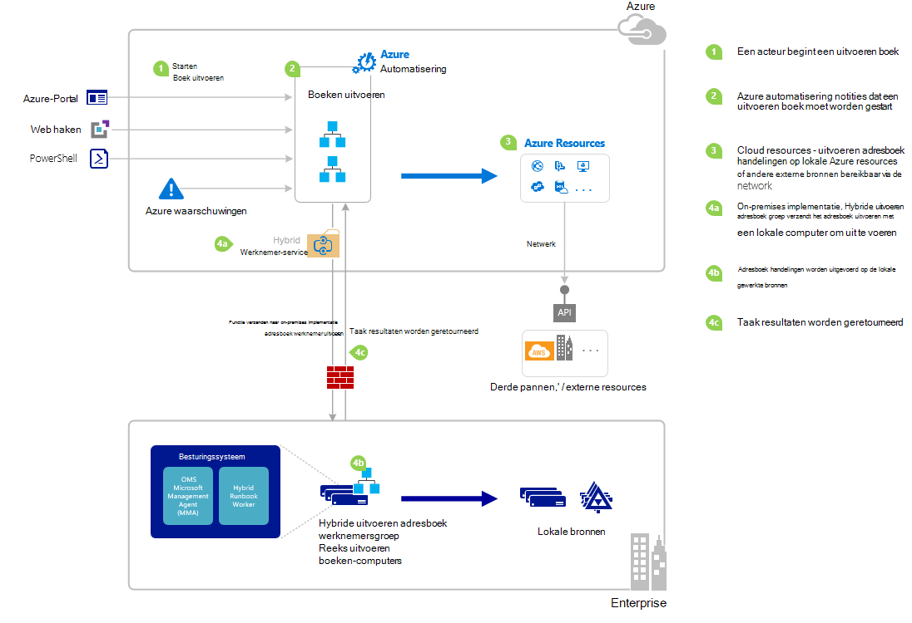

<properties
   pageTitle="Een runbook in Azure automatisering starten | Microsoft Azure"
   description="Bevat een overzicht van de verschillende methoden die kunnen worden gebruikt voor het starten van een runbook in Azure automatisering en bevat informatie over het gebruik van de Azure-portal en de Windows PowerShell."
   services="automation"
   documentationCenter=""
   authors="mgoedtel"
   manager="jwhit"
   editor="tysonn" />
<tags
   ms.service="automation"
   ms.devlang="na"
   ms.topic="article"
   ms.tgt_pltfrm="na"
   ms.workload="infrastructure-services"
   ms.date="10/08/2016"
   ms.author="magoedte;bwren"/>

# <a name="starting-a-runbook-in-azure-automation"></a>Een runbook starten in Azure automatisering

De volgende tabel kunt u de methode voor het starten van een runbook in Azure automatisering die het meest geschikt is voor uw specifieke scenario bepalen. In dit artikel bevat informatie over het starten van een runbook met de portal van Azure en met Windows PowerShell. Meer informatie over de andere methoden beschikbaar in andere documentatie die u in de onderstaande koppelingen openen kunt.

| **METHODE**                                                                    | **KENMERKEN**                                                                                                                                                                                                                                                                                                                                                |
|-------------------------------------------------------------------------------|--------------------------------------------------------------------------------------------------------------------------------------------------------------------------------------------------------------------------------------------------------------------------------------------------------------------------------------------------------------------|
| [Azure-Portal](#starting-a-runbook-with-the-azure-portal)                     | <li>Het eenvoudigst met interactieve gebruikersinterface.<br> <li>Formulier eenvoudige parameterwaarden op te geven.<br> <li>Eenvoudig kunnen bijhouden taakstatus.<br> <li>Toegang met Azure aanmelding geverifieerd.                                                                                                                                                                               |
| [Windows PowerShell](https://msdn.microsoft.com/library/dn690259.aspx)        | <li>Bel vanaf de opdrachtregel met Windows PowerShell-cmdlets.<br> <li>In geautomatiseerde oplossing met meerdere stappen kunnen worden opgenomen.<br> <li>Aanvraag is geverifieerd met certificaat of OAuth gebruiker principal / antwoordgroepservice principal.<br> <li>Eenvoudige en complexe parameterwaarden opgeven.<br> <li>Taakstatus bijhouden.<br> <li>Client vereist ter ondersteuning van de PowerShell-cmdlets. |
| [Azure automatisering-API](https://msdn.microsoft.com/library/azure/mt662285.aspx) | <li>Meest flexibele methode, maar ook de meeste complex.<br> <li>Bellen vanuit een aangepaste code die HTTP-aanvragen kunt aanbrengen.<br> <li>Aanvraag geverifieerd met certificaat of Oauth gebruiker principal / service principal.<br> <li>Eenvoudige en complexe parameterwaarden opgeven.<br> <li>Taakstatus bijhouden.                                                                          |
| [Webhooks](automation-webhooks.md)                                            | <li>Start runbook in één HTTP-aanvraag.<br> <li>Geverifieerd met beveiligingstoken in URL.<br> <li>Client overschrijven niet is opgegeven als webhook gemaakt parameterwaarden. Runbook kunt enkele parameter die wordt gevuld met de details van de aanvraag HTTP definiëren.<br> <li>Geen mogelijkheid voor het bijhouden van de taakstatus via webhook-URL.                                      |
| [Melding van Azure beantwoorden](../log-analytics/log-analytics-alerts.md)               | <li>Start een runbook in antwoord op Azure waarschuwing.<br> <li>Webhook voor runbook en koppeling naar Waarschuw configureren.<br> <li>Geverifieerd met beveiligingstoken in URL.<br> <li>Ondersteunt momenteel melding van een maatstelsel alleen.                                                                                                                                                       |
| [Planning](automation-schedules.md)                                | <li>Automatisch starten runbook op ieder uur, dagelijks of wekelijks planning.<br> <li>Planning via Azure-portal, PowerShell-cmdlets of Azure-API bewerken.<br> <li>Geef parameterwaarden voor gebruik met de planning.                                                                                                                                               |
| [Vanuit een ander Runbook](automation-child-runbooks.md)                          | <li>Gebruik een runbook als een activiteit in een andere runbook.<br> <li>Dit is handig voor functionaliteit die worden gebruikt door meerdere runbooks.<br> <li>Parameterwaarden aan onderliggende runbook bieden en het gebruik van uitvoer in bovenliggende runbook.                                                                                                                                                               |

De volgende afbeelding ziet u gedetailleerde stapsgewijze proces in de levenscyclus van een runbook. Het bevat verschillende manieren die een runbook wordt gestart in Azure automatisering, onderdelen die zijn vereist voor hybride Runbook werknemer Azure automatisering runbooks en interacties tussen de verschillende onderdelen uitvoeren. Voor meer informatie over het uitvoeren van automatisering runbooks in uw datacenter, raadpleegt u [hybride runbook werknemers](automation-hybrid-runbook-worker.md)



## <a name="starting-a-runbook-with-the-azure-portal"></a>Een runbook beginnen met de portal van Azure

1.  Klik in de portal Azure **automatisering** selecteren en vervolgens klik vervolgens op de naam van een automatisering-account.
2.  Selecteer het tabblad **Runbooks** .
3.  Selecteer een runbook en klik vervolgens op **starten**.
4.  Als het runbook parameters heeft, wordt u gevraagd naar waarden met een tekstvak opgeven voor elke parameter. Zie [Runbook Parameters](#Runbook-parameters) hieronder voor meer informatie over parameters.
5.  **Taak weergeven** Selecteer naast het bericht van de runbook **starten** of Selecteer het tabblad **taken** voor het runbook om weer te geven van de status van de taak van het runbook.

## <a name="starting-a-runbook-with-the-azure-portal"></a>Een runbook beginnen met de portal van Azure

1.  Van uw account automatisering, klikt u op het deel achter de **Runbooks** als u wilt openen van het blad **Runbooks** .
2.  Klik op een runbook als u wilt de blade **Runbook** openen.
3.  Klik op **Start**.
4.  Als het runbook geen parameters heeft, wordt u gevraagd om te bevestigen of u wilt starten. Als het runbook parameters heeft, wordt het blad **Runbook starten** worden geopend, zodat u parameterwaarden kan geven. Zie [Runbook Parameters](#Runbook-parameters) hieronder voor meer informatie over parameters.
5.  Het blad voor de **taak** wordt geopend, zodat u de status van de taak kunt bijhouden.

## <a name="starting-a-runbook-with-windows-powershell"></a>Een runbook beginnen met Windows PowerShell

U kunt de [Begin-AzureRmAutomationRunbook](https://msdn.microsoft.com/library/mt603661.aspx) een runbook start met Windows PowerShell gebruiken. De volgende code begint een runbook Test-Runbook genoemd.

```
Start-AzureRmAutomationRunbook -AutomationAccountName "MyAutomationAccount" -Name "Test-Runbook" -ResourceGroupName "ResourceGroup01"
```

Start-AzureRmAutomationRunbook retourneert een taak die u gebruiken kunt voor het bijhouden van de status ervan zodra het runbook wordt gestart. U kunt deze taakobject vervolgens gebruiken met [Get-AzureRmAutomationJob](https://msdn.microsoft.com/library/mt619440.aspx) om de status van de taak en [Get-AzureRmAutomationJobOutput](https://msdn.microsoft.com/library/mt603476.aspx) om de uitvoer te bepalen. De volgende code begint een runbook Test-Runbook, wacht totdat deze is voltooid, en vervolgens de uitvoer geeft genoemd.

```
$runbookName = "Test-Runbook"
$ResourceGroup = "ResourceGroup01"
$AutomationAcct = "MyAutomationAccount"

$job = Start-AzureRmAutomationRunbook –AutomationAccountName $AutomationAcct -Name $runbookName -ResourceGroupName $ResourceGroup

$doLoop = $true
While ($doLoop) {
   $job = Get-AzureRmAutomationJob –AutomationAccountName $AutomationAcct -Id $job.JobId -ResourceGroupName $ResourceGroup
   $status = $job.Status
   $doLoop = (($status -ne "Completed") -and ($status -ne "Failed") -and ($status -ne "Suspended") -and ($status -ne "Stopped"))
}

Get-AzureRmAutomationJobOutput –AutomationAccountName $AutomationAcct -Id $job.JobId -ResourceGroupName $ResourceGroup –Stream Output
```

Als het runbook parameters vereist, moet u opgeven ze als [hashtable](http://technet.microsoft.com/library/hh847780.aspx) waar de sleutel van de hashtable overeenkomt met de parameternaam en de waarde is de waarde van de parameter. Het volgende voorbeeld ziet u hoe u een runbook start met twee tekenreeksparameters voornaam en achternaam, een geheel getal aantalherhalingen met de naam en een Booleaanse parameter benoemde weergave met de naam. Zie voor meer informatie over parameters, [Runbook Parameters](#Runbook-parameters) onderstaande.

```
$params = @{"FirstName"="Joe";"LastName"="Smith";"RepeatCount"=2;"Show"=$true}
Start-AzureRmAutomationRunbook –AutomationAccountName "MyAutomationAccount" –Name "Test-Runbook" -ResourceGroupName "ResourceGroup01" –Parameters $params
```

## <a name="runbook-parameters"></a>Runbook parameters

Wanneer u een runbook vanuit de Azure-beheerportal of Windows PowerShell starten, wordt de instructie verzonden via de webservice Azure automatisering. Deze service biedt geen ondersteuning voor parameters met complexe gegevenstypen. Als u een waarde opgeven voor een complexe parameter moet, moet klik u bellen deze inline uit een andere runbook zoals is beschreven in de [onderliggende runbooks in Azure automatisering](automation-child-runbooks.md).

De webservice Azure automatisering, speciale functies voor parameters voor het gebruik van bepaalde gegevenstypen zoals is beschreven in de volgende secties vindt.

### <a name="named-values"></a>Benoemde waarden

Als de parameter gegevenstype [object], dan kunt u de volgende indeling van JSON om het te verzenden een lijst met benoemde waarden: *{naam1: 'Waarde1', Naam2: 'Waarde2', Naam3: 'Waarde3'}*. Eenvoudige typen, moeten deze waarden zijn. Het runbook ontvangt de parameter weer als een [PSCustomObject](https://msdn.microsoft.com/library/system.management.automation.pscustomobject%28v=vs.85%29.aspx) met eigenschappen die met elke naamwaarde overeenkomen.

Houd rekening met het volgende test runbook waarin een parameter met de naam van de gebruiker.

```
Workflow Test-Parameters
{
   param (
      [Parameter(Mandatory=$true)][object]$user
   )
    $userObject = $user | ConvertFrom-JSON
    if ($userObject.Show) {
        foreach ($i in 1..$userObject.RepeatCount) {
            $userObject.FirstName
            $userObject.LastName
        }
    }
}
```

De volgende tekst kan worden gebruikt voor de parameter van de gebruiker.

```
{FirstName:'Joe',LastName:'Smith',RepeatCount:'2',Show:'True'}
```

Dit resulteert in de volgende uitvoer.

```
Joe
Smith
Joe
Smith
```

### <a name="arrays"></a>Matrices

Als de parameter een matrix zoals [matrix is] of [tekenreeks []], kunt u de volgende JSON-indeling gebruiken om het te verzenden een lijst met waarden: *[waarde1, waarde2, Waarde3]*. Eenvoudige typen, moeten deze waarden zijn.

Houd rekening met het volgende test runbook waarin een parameter met de naam van de *gebruiker*.

```
Workflow Test-Parameters
{
   param (
      [Parameter(Mandatory=$true)][array]$user
   )
    if ($user[3]) {
        foreach ($i in 1..$user[2]) {
            $ user[0]
            $ user[1]
        }
    }
}
```

De volgende tekst kan worden gebruikt voor de parameter van de gebruiker.

```
["Joe","Smith",2,true]
```

Dit resulteert in de volgende uitvoer.

```
Joe
Smith
Joe
Smith
```

### <a name="credentials"></a>Referenties

Als de parameter gegevenstype **PSCredential**, kunt u de naam van een Azure automatisering [referentie activa](automation-credentials.md)opgeven. Het runbook ophaalt de referentie met de naam die u opgeeft.

Houd rekening met het volgende test runbook waarin een parameter referentie genoemd.

```
Workflow Test-Parameters
{
   param (
      [Parameter(Mandatory=$true)][PSCredential]$credential
   )
   $credential.UserName
}
```

De volgende tekst kan worden gebruikt voor de parameter van de gebruiker ervan uitgaande dat er is een referentie activum met de naam van *Mijn referenties*.

```
My Credential
```

Veronderstellende dat de gebruikersnaam in de referentie is *Jjansen*, resulteert dit in de volgende uitvoer.

```
jsmith
```

## <a name="next-steps"></a>Volgende stappen

-   De architectuur van het runbook in huidige artikel biedt een overzicht van runbooks om resources in Azure en on-premises met de hybride Runbook werknemer te beheren.  Voor meer informatie over het uitvoeren van automatisering runbooks in uw datacenter, raadpleegt u [Hybride Runbook werknemers](automation-hybrid-runbook-worker.md).
-   Meer informatie over het maken van de modulaire runbooks moet worden gebruikt door andere runbooks voor specifieke of veelgebruikte functies, raadpleegt u [Onderliggende Runbooks](automation-child-runbooks.md).
