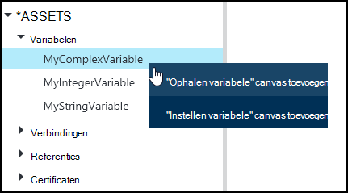
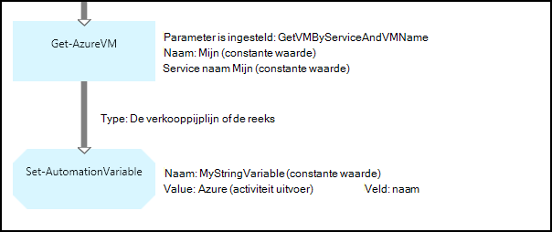
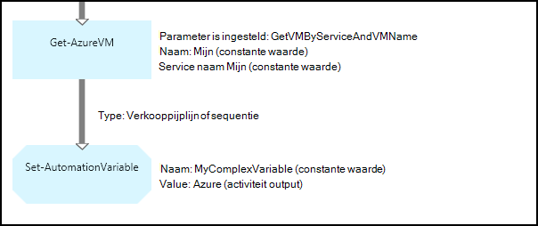
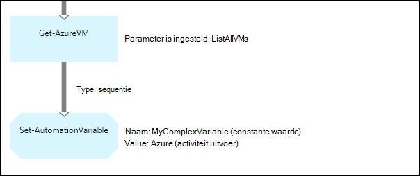
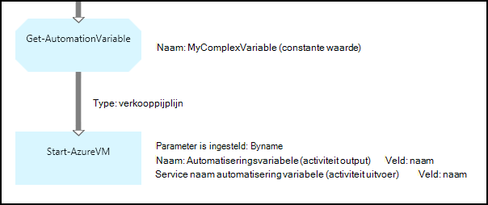
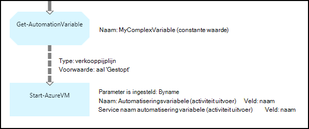

<properties 
   pageTitle="Variabele activa in Azure automatisering | Microsoft Azure"
   description="Variabele activa zijn waarden die beschikbaar voor alle runbooks en DSC configuraties in Azure automatisering zijn.  In dit artikel wordt uitgelegd dat de details van variabelen en hoe u Hiermee werkt in zowel tekstuele en grafische authoring."
   services="automation"
   documentationCenter=""
   authors="mgoedtel"
   manager="jwhit"
   editor="tysonn" />
<tags 
   ms.service="automation"
   ms.devlang="na"
   ms.topic="article"
   ms.tgt_pltfrm="na"
   ms.workload="infrastructure-services"
   ms.date="05/24/2016"
   ms.author="magoedte;bwren" />

# Variabele activa in Azure automatisering

Variabele activa zijn waarden die beschikbaar voor alle runbooks en DSC configuraties in uw account automatisering zijn. Ze kunnen worden gemaakt, gewijzigd en opgehaald van de Azure Windows PowerShell-portal en vanuit een runbook of DSC configuratie. Automatisering variabelen zijn handig om de volgende scenario's:

- Een waarde tussen meerdere runbooks of DSC configuraties delen.

- Delen van een waarde tussen meerdere taken uit de dezelfde runbook of DSC configuratie.

- Het beheren van een waarde van de portal of van de Windows PowerShell-opdrachtregel die wordt gebruikt door runbooks of DSC configuraties.

Automatisering variabelen worden doorgevoerd zodat ze verder kan worden gecontroleerd, zelfs als de runbook of DSC-configuratie mislukt.  Hierdoor kunnen ook een waarde die moet worden ingesteld door één runbook die vervolgens wordt gebruikt door een andere of wordt gebruikt door de dezelfde runbook of DSC configuratie van de volgende keer dat deze wordt uitgevoerd.

Wanneer een variabele is gemaakt, kunt u opgeven dat deze opgeslagen op de versleutelde.  Wanneer een variabele is versleuteld, wordt deze opgeslagen veilig in Azure automatisering en de waarde kan niet worden opgehaald uit de cmdlet [Get-AzureAutomationVariable](http://msdn.microsoft.com/library/dn913772.aspx) die wordt geleverd als onderdeel van de Azure PowerShell-module.  Er is de enige manier dat een versleutelde waarde kan worden opgehaald uit de **Get-AutomationVariable** activiteit in een runbook of DSC configuratie.

>[AZURE.NOTE]Secure activa in Azure automatisering zijn referenties, certificaten, verbindingen en versleutelde variabelen. Deze activa zijn versleuteld en opgeslagen in de Azure automatisering met een unieke sleutel die wordt gegenereerd voor elke account automatisering. Deze sleutel is van een basispagina certificaat versleuteld en opgeslagen in Azure automatisering. Voordat u een secure activa op te slaan, de sleutel voor het account dat automatisering is ontsleuteld met behulp van de basispagina certificaat en vervolgens worden gebruikt voor het coderen van de activa.

## Typen variabelen

Wanneer u een variabele met de portal van Azure maakt, kunt u een gegevenstype in de vervolgkeuzelijst moet opgeven, zodat de portal het juiste besturingselement voor het invoeren van de variabele waarde weergegeven. De variabele is niet beperkt tot dit type, maar u moet de variabele via Windows PowerShell als u wilt opgeven een waarde van een ander type instellen. Als u hebt opgegeven **niet gedefinieerd**, klikt u vervolgens de waarde van de variabele wordt worden ingesteld op **$null**en moet u de waarde met de cmdlet [Set-AzureAutomationVariable](http://msdn.microsoft.com/library/dn913767.aspx) of **Set-AutomationVariable** activiteit instellen.  U kunt maken of wijzigen van de waarde van een complex variabele type in de portal, maar u kunt een waarde van elk type via Windows PowerShell opgeven. Complexe typen worden geretourneerd als een [PSCustomObject](http://msdn.microsoft.com/library/system.management.automation.pscustomobject.aspx).

U kunt meerdere waarden mogen één variabele opslaan door te maken van een matrix of een hashtable en deze naar de variabele op te slaan.

## Cmdlets en werkstroomacties

De cmdlets in de volgende tabel worden gebruikt om te maken en beheren van automatisering variabelen met Windows PowerShell. Wordt verzonden als onderdeel van de [Azure PowerShell-module](../powershell-install-configure.md) die beschikbaar voor gebruik in automatisering runbooks en DSC configuratie is.

|Cmdlets voor|Beschrijving|
|:---|:---|
|[Get-AzureAutomationVariable](http://msdn.microsoft.com/library/dn913772.aspx)|Haalt de waarde van een bestaande variabele.|
|[Nieuwe AzureAutomationVariable](http://msdn.microsoft.com/library/dn913771.aspx)|Hiermee maakt u een nieuwe variabele en wordt de waarde.|
|[Verwijderen AzureAutomationVariable](http://msdn.microsoft.com/library/dn913775.aspx)|Hiermee verwijdert u een bestaande variabele.|
|[Set-AzureAutomationVariable](http://msdn.microsoft.com/library/dn913767.aspx)|Hiermee stelt u de waarde voor een bestaande variabele.|

De werkstroomactiviteiten in de volgende tabel worden gebruikt voor toegang tot automatisering variabelen in een runbook. Ze zijn alleen beschikbaar voor gebruik in een runbook of DSC configuratie en niet worden geleverd als onderdeel van de Azure PowerShell-module.

|Werkstroomactiviteiten|Beschrijving|
|:---|:---|
|Get-AutomationVariable|Haalt de waarde van een bestaande variabele.|
|Set-AutomationVariable|Hiermee stelt u de waarde voor een bestaande variabele.|

>[AZURE.NOTE] Vermijd het gebruik van variabelen in het gedeelte-parameter van de naam van **Get-AutomationVariable** in een runbook of DSC configuratie omdat dit ontdekken afhankelijkheden tussen runbooks of DSC configuratie en automatisering variabelen tijdens de ontwerpfase bemoeilijken kunt.

## Een nieuwe automatiseringsvariabele maken

### Een nieuwe variabele maken in de portal van Azure

1. Van uw account automatisering, klikt u op **activa** boven aan het venster.
1. Klik onder aan het venster, op **Instelling toevoegen**.
1. Klik op **variabele toevoegen**.
1. Voltooi de wizard en klik op het selectievakje om op te slaan van de nieuwe variabele.

### Een nieuwe variabele maken in de portal van Azure

1. Klik op het deel van de **activa** als u wilt openen van het blad **activa** van uw account automatisering.
1. Klik op het deel achter de **variabelen** om te openen van het blad **variabelen** .
1. Klik op **een variabele toevoegen** aan de bovenkant van het blad.
1. Vul het formulier en klik op **maken** om de nieuwe variabele opslaan.

### Een nieuwe variabele maken met Windows PowerShell

De cmdlet [New-AzureAutomationVariable](http://msdn.microsoft.com/library/dn913771.aspx) Hiermee maakt u een nieuwe variabele en Hiermee stelt u de oorspronkelijke waarde. U kunt de waarde aan de hand van [Get-AzureAutomationVariable](http://msdn.microsoft.com/library/dn913772.aspx)ophalen. Als de waarde een eenvoudig type is, wordt die hetzelfde type geretourneerd. Als dit een complex type is, wordt een **PSCustomObject** geretourneerd.

De volgende opdrachten in de steekproef laten zien hoe een variabele van het type tekenreeks maken en klik vervolgens op de retourwaarde.

    New-AzureAutomationVariable –AutomationAccountName "MyAutomationAccount" –Name 'MyStringVariable' –Encrypted $false –Value 'My String'
    $string = (Get-AzureAutomationVariable –AutomationAccountName "MyAutomationAccount" –Name 'MyStringVariable').Value

De volgende opdrachten in de steekproef laten zien hoe een variabele met een complex type maken en daarna opnieuw de eigenschappen. In dit geval wordt een object VM uit **Get-AzureVM** gebruikt.

    $vm = Get-AzureVM –ServiceName "MyVM" –Name "MyVM"
    New-AzureAutomationVariable –AutomationAccountName "MyAutomationAccount" –Name "MyComplexVariable" –Encrypted $false –Value $vm
    
    $vmValue = (Get-AzureAutomationVariable –AutomationAccountName "MyAutomationAccount" –Name "MyComplexVariable").Value
    $vmName = $vmValue.Name
    $vmIpAddress = $vmValue.IpAddress

## Met behulp van een variabele in een runbook of DSC configuratie

Gebruik de **Set-AutomationVariable** -activiteit om de waarde van een automatiseringsvariabele instellen in een runbook of DSC configuratie en de **Get-AutomationVariable** om op te halen.  U kunt de cmdlets **Set-AzureAutomationVariable** of **Get-AzureAutomationVariable** in een runbook of DSC configuratie niet mag gebruiken, omdat ze minder efficiënt dan de werkstroomactiviteiten.  U ook niet de waarde van secure variabelen met **Get-AzureAutomationVariable**kunt ophalen.  De enige manier om te maken van een nieuwe variabele uit vanuit een runbook of DSC configuratie is de cmdlet [New-AzureAutomationVariable](http://msdn.microsoft.com/library/dn913771.aspx) gebruiken.

### Voorbeelden van tekstcriteria runbook

#### Instellen en een eenvoudige waarde ophalen uit een variabele

De volgende opdrachten in de steekproef hoe instellen en een variabele in een tekstuele runbook op te halen. In dit voorbeeld wordt ervan uitgegaan dat variabelen van het type integer naam *NumberOfIterations* en *NumberOfRunnings* en een variabele van het type tekenreeks benoemde *SampleMessage* al zijn gemaakt.

    $NumberOfIterations = Get-AutomationVariable -Name 'NumberOfIterations'
    $NumberOfRunnings = Get-AutomationVariable -Name 'NumberOfRunnings'
    $SampleMessage = Get-AutomationVariable -Name 'SampleMessage'
    
    Write-Output "Runbook has been run $NumberOfRunnings times."
    
    for ($i = 1; $i -le $NumberOfIterations; $i++) {
       Write-Output "$i`: $SampleMessage"
    }
    Set-AutomationVariable –Name NumberOfRunnings –Value ($NumberOfRunnings += 1)

#### Instellen en een complexe object in een variabele ophalen

De volgende code ziet hoe u een variabele met een complexe waarde in een tekstuele runbook bijwerken. In dit voorbeeld is een Azure virtuele machines met **Get-AzureVM** opgehaald en opgeslagen in een bestaande automatiseringsvariabele.  Zoals wordt uitgelegd in [variabele typen](#variable-types), wordt deze opgeslagen als een PSCustomObject.

    $vm = Get-AzureVM -ServiceName "MyVM" -Name "MyVM"
    Set-AutomationVariable -Name "MyComplexVariable" -Value $vm

In de volgende code, wordt de waarde opgehaald uit de variabele en gebruikt voor het starten van de virtuele machine.

    $vmObject = Get-AutomationVariable -Name "MyComplexVariable"
    if ($vmObject.PowerState -eq 'Stopped') {
       Start-AzureVM -ServiceName $vmObject.ServiceName -Name $vmObject.Name
    }

#### Instellen en ophalen van een siteverzameling in een variabele

De volgende code ziet u hoe u een variabele met een verzameling complexe waarden in een tekstuele runbook. In dit voorbeeld zijn meerdere Azure virtuele machines met **Get-AzureVM** opgehaald en opgeslagen in een bestaande automatiseringsvariabele.  Zoals wordt uitgelegd in [variabele typen](#variable-types), wordt deze opgeslagen als een verzameling PSCustomObjects.

    $vms = Get-AzureVM | Where -FilterScript {$_.Name -match "my"}     
    Set-AutomationVariable -Name 'MyComplexVariable' -Value $vms

In de volgende code, is de verzameling opgehaald uit de variabele en gebruikt voor het starten van elke virtuele machine.

    $vmValues = Get-AutomationVariable -Name "MyComplexVariable"
    ForEach ($vmValue in $vmValues)
    {
       if ($vmValue.PowerState -eq 'Stopped') {
          Start-AzureVM -ServiceName $vmValue.ServiceName -Name $vmValue.Name
       }
    }

### Voorbeelden van de grafische runbook

In een grafische runbook voegt u de **Get-AutomationVariable** of **Set-AutomationVariable** door met de rechtermuisknop op de variabele in het deelvenster bibliotheek van de grafische editor en de gewenste activiteit te selecteren.

#### Instellen van waarden in een variabele

De volgende afbeelding ziet u activiteiten van de steekproef een variabele met een eenvoudige waarde in een grafische runbook bijwerken. In dit voorbeeld wordt een enkel Azure virtuele machine met **Get-AzureVM** zijn opgehaald en de naam van de computer is opgeslagen op een bestaande automatiseringsvariabele van het type tekenreeks.  Het maakt niet uit of de [koppeling is een verkooppijplijn of een reeks](automation-graphical-authoring-intro.md#links-and-workflow) omdat we slechts één object in de uitvoer zou verwachten.

De volgende afbeelding ziet u de activiteiten die wordt gebruikt voor het bijwerken van een variabele met een complexe waarde in een grafische runbook. De enige veranderd ten opzichte van het vorige voorbeeld is niet een **veld pad** opgeven voor de **activiteit uitvoer** van de activiteit van de **Set-AutomationVariable** zodat het object wordt opgeslagen in plaats van alleen een eigenschap van het object.  Zoals wordt uitgelegd in [variabele typen](#variable-types), wordt deze opgeslagen als een PSCustomObject.

De volgende afbeelding ziet u vergelijkbare functionaliteit biedt als het vorige voorbeeld, met meerdere virtuele machines die zijn opgeslagen in de variabele.  Een [reeks koppeling](automation-graphical-authoring-intro.md#links-and-workflow) moet hier worden gebruikt, zodat de activiteit **Set-AutomationVariable** de volledige reeks virtuele machines als één verzameling ontvangt.  Als een [koppeling verkooppijplijn](automation-graphical-authoring-intro.md#links-and-workflow) is gebruikt, wordt klikt u vervolgens de **Set-AutomationVariable** activiteit uitgevoerd afzonderlijk voor elk object met het resultaat dat alleen de laatste virtuele machine in de siteverzameling wordt opgeslagen.  Zoals wordt uitgelegd in [variabele typen](#variable-types), wordt deze opgeslagen als een verzameling PSCustomObjects.

#### Waarden ophalen uit een variabele

De volgende afbeelding ziet u voorbeeld-activiteiten die ophalen en gebruiken van een variabele in een grafische runbook.  De eerste activiteit haalt de virtuele machines die zijn opgeslagen in de variabele in het vorige voorbeeld.  De koppeling moet een [verkooppijplijn](automation-graphical-authoring-intro.md#links-and-workflow) zodat de **Begin-AzureVM** activiteit één keer wordt uitgevoerd voor elk object dat is verzonden vanuit de activiteit **Get-AutomationVariable** .  Dit werkt hetzelfde of een één object of meerdere objecten zijn opgeslagen in de variabele.  De **Begin-AzureVM** activiteit wordt gebruikt voor eigenschappen van het PSCustomObject dat elke virtuele machine vertegenwoordigt. 

De volgende afbeelding ziet hoe u de objecten die zijn opgeslagen naar een variabele in een grafische runbook filteren.  Een [voorwaarde](automation-graphical-authoring-intro.md#links-and-workflow) is toegevoegd aan de koppeling in het vorige voorbeeld om te filteren alleen deze virtuele machines die zijn gestopt toen de variabele werd ingesteld.

## Volgende stappen

- Zie meer informatie over het verbinden van activiteiten op grafische authoring, [koppelingen in het grafische ontwerpen](automation-graphical-authoring-intro.md#links-and-workflow)
- Zie [Mijn eerste grafische runbook](automation-first-runbook-graphical.md) om te beginnen met grafische runbooks 
