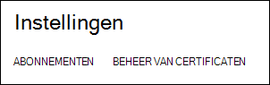
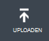
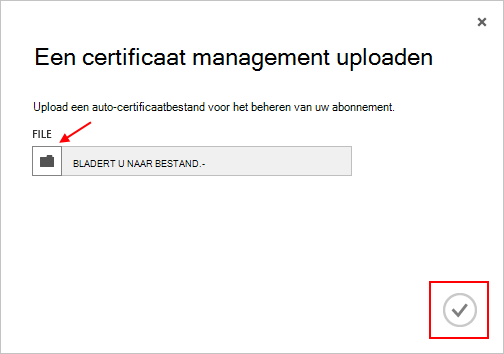

<properties 
    pageTitle="Een Azure Management API-certificaat uploaden | Microsoft Azure" 
    description="Informatie over het uploaden van athe Management API certificaat voor de klassieke Azure-Portal." 
    services="cloud-services" 
    documentationCenter=".net" 
    authors="Thraka" 
    manager="timlt" 
    editor=""/>

<tags 
    ms.service="na" 
    ms.workload="tbd" 
    ms.tgt_pltfrm="na" 
    ms.devlang="na" 
    ms.topic="article" 
    ms.date="04/18/2016"
    ms.author="adegeo"/>

# Een Azure Management API Management-certificaat uploaden

Beheer van certificaten kunnen u met de API voor het beheer van Service verstrekt door Azure wordt geverifieerd. Veel programma's en hulpprogramma's (zoals Visual Studio of de SDK Azure) worden met deze certficates kunt automatiseren configuratie en implementatie van verschillende Azure services. **Dit geldt alleen voor de Azure klassieke portal**. 

>[AZURE.WARNING] Wees voorzichtig! Dit soort van certificaten dat alle gebruikers met hen verifieert voor het beheren van het abonnement dat ze zijn gekoppeld. 

Meer informatie over Azure certificaten (inclusief een zelfondertekend certificaat maken) is [beschikbaar](cloud-services/cloud-services-certs-create.md#what-are-management-certificates) voor u als u deze nodig hebt.

U kunt ook [Azure Active Directory](/services/active-directory/) gebruiken om te verifiëren client-code voor automatisering doeleinden.

## Een certificaat management uploaden

Nadat u hebt een management-certificaat hebt gemaakt, (.cer-bestand met alleen de openbare sleutel) kunt u deze kunt uploaden naar de portal. Wanneer het certificaat beschikbaar in de portal is, kan iedereen met een overeenkomende certficiate (persoonlijke sleutel) Maak verbinding via de API voor beheer en toegang tot de bronnen voor het abonnement gekoppeld.

1. Meld u aan bij de [portal van Azure klassieke](http://manage.windowsazure.com).

2. Zorg ervoor dat het juiste abonnement die u wilt verbinden met een certificaat met. Druk op de tekst **abonnementen** rechtsboven van de portal.

    

3. Nadat u het juiste abonnement is geselecteerd hebt, drukt u op **Instellingen** aan de linkerkant van de portal (mogelijk moet u omlaag schuiven). 
    
    

4. Druk op het tabblad **Management certificaten** .

    
    
5. Druk op de knop **uploaden** .

    
    
6. Vul de gegevens van het dialoogvenster en druk op de gereed **vinkje**.

    

## Volgende stappen

Nu u een management-certificaat dat is gekoppeld aan een abonnement hebt, u kunt (nadat u de overeenkomende certificaat lokaal hebt geïnstalleerd) via programmacode verbinding maken met de [Service Management REST API](https://msdn.microsoft.com/library/azure/mt420159.aspx) en automatiseren van de verschillende Azure bronnen die ook zijn gekoppeld aan dit abonnement. 