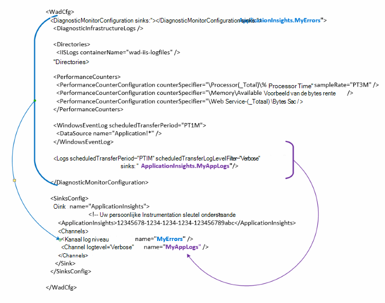

<properties
   pageTitle="Diagnostisch hulpprogramma Azure om gegevens te verzenden naar toepassing inzichten configureren | Microsoft Azure"
   description="De openbare configuratie van de Azure diagnostische gegevens om naar te verzenden toepassing inzichten bijwerken."
   services="multiple"
   documentationCenter=".net"
   authors="sbtron"
   manager="douge"
   editor="" />
<tags
   ms.service="application-insights"
   ms.devlang="na"
   ms.topic="article"
   ms.tgt_pltfrm="na"
   ms.workload="na"
   ms.date="12/15/2015"
   ms.author="saurabh" />

# Diagnostisch hulpprogramma Azure om gegevens te verzenden inzicht krijgen in toepassing configureren

Azure diagnostische gegevens worden opgeslagen gegevens aan Azure Storage tabellen.  U kunt echter ook alle recht streepje of een deel van de gegevens inzicht krijgen in toepassing door te configureren 'sinks' en 'kanalen' in de configuratie bij gebruik van Azure diagnostisch hulpprogramma extensie 1,5 of hoger.

In dit artikel wordt beschreven hoe u de openbare configuratie voor de extensie Azure diagnostisch hulpprogramma dat de geconfigureerde gegevens te verzenden naar toepassing inzichten.

## Toepassing inzichten configureren als een Sink

Maakt u kennis met de extensie Azure diagnostisch hulpprogramma 1,5 de **<SinksConfig>** element in de openbare configuratie. Hiermee definieert u de extra *sink* waar de gegevens van Azure diagnostische gegevens kunnen worden verzonden. Kunt u de details van de toepassing inzichten resource waar u de gegevens van Azure diagnostisch hulpprogramma verzenden als onderdeel van dit **<SinksConfig>**.
Een voorbeeld **SinksConfig** ziet er zo uit-  

    <SinksConfig>
        <Sink name="ApplicationInsights">
          <ApplicationInsights>{Insert InstrumentationKey}</ApplicationInsights>
          <Channels>
            <Channel logLevel="Error" name="MyTopDiagData"  />
            <Channel logLevel="Verbose" name="MyLogData"  />
          </Channels>
        </Sink>
      </SinksConfig>

Voor het element **Sink** bepaalt het kenmerk *name* de waarde van een tekstreeks die wordt gebruikt om te uniek verwijzen naar de sink.
Het element **ApplicationInsights** bevat instrumentation sleutel van de toepassing inzichten resource waar de gegevens van Azure diagnostische gegevens wordt verzonden. Als u een bestaande resource van toepassing inzichten niet hebt, raadpleegt u [maken een nieuwe resource van toepassing inzichten](./application-insights/app-insights-create-new-resource.md) voor meer informatie over het maken van een resource en de toets instrumentation ophalen.

Als u een project Cloudservice met Azure SDK 2,8 ontwikkelt wordt deze toets instrumentation wordt automatisch ingevuld in de openbare configuratie op basis van de instelling **APPINSIGHTS_INSTRUMENTATIONKEY** configuratie wanneer de verpakking van het project cloud-service. Zie [Inzicht krijgen in gebruik toepassing met diagnostisch hulpprogramma Azure Cloudservice oplossen](./cloud-services/cloud-services-dotnet-diagnostics-applicationinsights.md).

Het element **kanalen** kunt u een of meer **kanaal** elementen voor de gegevens die worden verzonden naar de sink definiëren. Het kanaal fungeert als een filter en kunt u specifieke logboekniveaus dat u wilt verzenden naar de sink selecteren. Zo kunt u uitgebreide logboeken verzamelen en stuurt u hen naar opslag, maar kunt u een kanaal met een niveau voor logboekregistratie van fout en wanneer u zich aanmeldt via verzendt dat kanaal alleen foutenlogboeken worden verzonden naar die sink definiëren.
Voor een **kanaal** dat het kenmerk *name* is uniek naar dat kanaal.
Het kenmerk *loglevel* kunt u het niveau voor logboekregistratie waarmee het kanaal opgeven. De logboekniveaus beschikbaar in volgorde van meest minimaal gegevens zijn
 - Uitgebreide
 - Informatie
 - Waarschuwing
 - Fout
 - Kritieke

## Gegevens verzenden naar de toepassing inzichten sink
Nadat de toepassing inzichten sink is gedefinieerd kunt u gegevens verzendt naar die sink door het kenmerk *sink* toe te voegen aan de elementen onder het knooppunt **DiagnosticMonitorConfiguration** . Het element *sinks* toevoegen aan elk knooppunt geeft aan dat u gegevens die worden verzameld uit die en eventuele knooppunten eronder worden verzonden naar de opgegeven sink.

Bijvoorbeeld als u wilt verzenden van alle gegevens die worden verzameld door Azure diagnostische gegevens kunt vervolgens u toevoegen het kenmerk *sink* rechtstreeks naar het knooppunt **DiagnosticMonitorConfiguration** . Stel de waarde van de *sinks* op de naam van de Sink die is opgegeven in de **SinkConfig**.

    <DiagnosticMonitorConfiguration overallQuotaInMB="4096" sinks="ApplicationInsights">

Als u verzenden alleen foutenlogboeken inzicht krijgen in de toepassing vangen en vervolgens kunt u de waarde *sinks wilt* moeten de naam van de Sink gevolgd door de naam van het kanaal gescheiden door een punt instellen ("."). Bijvoorbeeld alleen foutenlogboeken versturen naar de toepassing inzichten gebruik sink het kanaal MyTopDiagdata die is gedefinieerd in de bovenstaande SinksConfig.  

    <DiagnosticMonitorConfiguration overallQuotaInMB="4096" sinks="ApplicationInsights.MyTopDiagdata">

Als u alleen wilt uitgebreide toepassingslogboeken verzenden inzicht krijgen in toepassing zou u het kenmerk *sinks* toevoegen aan het knooppunt **Logboeken** .

    <Logs scheduledTransferPeriod="PT1M" scheduledTransferLogLevelFilter="Verbose" sinks="ApplicationInsights.MyLogData"/>

U kunt ook meerdere gootstenen opnemen in de configuratie op verschillende niveaus in de hiërarchie. In dat geval wordt de opgegeven op het hoogste niveau van de hiërarchie sink fungeert als een globale-instelling en een opgegeven bij de besluiten afzonderlijke element element zoals een overschrijven die algemene instelling.    

Hier volgt een voltooid voorbeeld van de openbare configuratiebestand dat alle fouten toepassing inzichten (opgegeven bij het knooppunt **DiagnosticMonitorConfiguration** ) en daarnaast uitgebreide niveau logboeken voor de toepassingslogboeken verzendt (opgegeven bij het knooppunt **Logboeken** ).

    <WadCfg>
      <DiagnosticMonitorConfiguration overallQuotaInMB="4096"
           sinks="ApplicationInsights.MyTopDiagData"> <!-- All info below sent to this channel -->
        <DiagnosticInfrastructureLogs />
        <PerformanceCounters>
          <PerformanceCounterConfiguration counterSpecifier="\Processor(_Total)\% Processor Time" sampleRate="PT3M" sinks="ApplicationInsights.MyLogData/>
          <PerformanceCounterConfiguration counterSpecifier="\Memory\Available MBytes" sampleRate="PT3M" />
          <PerformanceCounterConfiguration counterSpecifier="\Web Service(_Total)\Bytes Total/Sec" sampleRate="PT3M" />
        </PerformanceCounters>
        <WindowsEventLog scheduledTransferPeriod="PT1M">
          <DataSource name="Application!*" />
        </WindowsEventLog>
        <Logs scheduledTransferPeriod="PT1M" scheduledTransferLogLevelFilter="Verbose"
                sinks="ApplicationInsights.MyLogData"/> <!-- This specific info sent to this channel -->
      </DiagnosticMonitorConfiguration>

    <SinksConfig>
        <Sink name="ApplicationInsights">
          <ApplicationInsights>{Insert InstrumentationKey}</ApplicationInsights>
          <Channels>
            <Channel logLevel="Error" name="MyTopDiagData"  />
            <Channel logLevel="Verbose" name="MyLogData"  />
          </Channels>
        </Sink>
      </SinksConfig>
    </WadCfg>

Er zijn enkele beperkingen waarmee u rekening moet houden met deze functionaliteit

- Kanalen zijn alleen bedoeld voor gebruik met Logboektype en niet de prestatie-items. Als u een kanaal met een prestatiemeteritem element opgeven, wordt deze genegeerd.
- Het niveau voor logboekregistratie voor een kanaal niet langer zijn dan het niveau voor logboekregistratie voor wat door Azure diagnostische gegevens worden verzameld. Bijvoorbeeld: u kunt niet toepassing Log fouten in het element logboeken verzamelen en willen verzenden uitgebreid logboeken aan de toepassing inzicht sink. Het kenmerk *scheduledTransferLogLevelFilter* moet altijd gelijk verzamelen of meer logboeken dan de logboeken u probeert te verzenden naar een sink.
- U kunt geen blobgegevens verzameld door de extensie Azure diagnostisch hulpprogramma verzenden naar toepassing inzichten. Bijvoorbeeld opgegeven onder het knooppunt *mappen* . Voor vastlopen wordt de werkelijke crashdump nog steeds worden verzonden naar blob storage en alleen een melding dat de crashdump is gegenereerd inzicht krijgen in toepassing wordt verzonden.

## Volgende stappen

- [PowerShell](./cloud-services/cloud-services-diagnostics-powershell.md) gebruiken om in te schakelen van de extensie Azure diagnostische hulpprogramma's voor uw toepassing. 
- Gebruik [Visual Studio](vs-azure-tools-diagnostics-for-cloud-services-and-virtual-machines.md) om in te schakelen van de extensie Azure diagnostische hulpprogramma's voor uw toepassing
