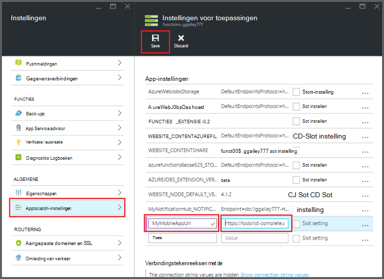

<properties
    pageTitle="Azure functies Mobile-Apps bindingen | Microsoft Azure"
    description="Meer informatie over het gebruik van Azure Mobile-Apps bindingen in Azure-functies."
    services="functions"
    documentationCenter="na"
    authors="ggailey777"
    manager="erikre"
    editor=""
    tags=""
    keywords="Azure werkt, functies, verwerking van gebeurtenis, dynamische berekeningscluster, als u kiest architectuur"/>

<tags
    ms.service="functions"
    ms.devlang="multiple"
    ms.topic="reference"
    ms.tgt_pltfrm="multiple"
    ms.workload="na"
    ms.date="08/30/2016"
    ms.author="glenga"/>

# Azure functies Mobile-Apps bindingen

[AZURE.INCLUDE [functions-selector-bindings](../../includes/functions-selector-bindings.md)]

In dit artikel wordt uitgelegd hoe u configureert en code Azure Mobile-Apps bindingen in Azure-functies. 

[AZURE.INCLUDE [intro](../../includes/functions-bindings-intro.md)] 

Azure App Service Mobile-Apps kunt u laten zien eindpunt tabelgegevens aan mobiele clients. Deze dezelfde tabelgegevens kan worden gebruikt met beide invoer en uitvoer bindingen in Azure-functies. Omdat dit dynamische schema ondersteunt, is een mobiele app van Node.js backend ideaal voor de weergave van tabelgegevens voor gebruik met uw functies. Dynamische schema is standaard ingeschakeld en in een mobiele app van productie moet worden uitgeschakeld. Zie voor meer informatie over de eindpunten van de tabel in een backend Node.js, [Overzicht: bewerkingen van een tabel](../app-service-mobile/app-service-mobile-node-backend-how-to-use-server-sdk.md#TableOperations). In de Mobile-Apps ondersteunt de backend Node.js in de portal bladeren en bewerken van tabellen. Zie voor meer informatie, klikt u [in de portal bewerken](../app-service-mobile/app-service-mobile-node-backend-how-to-use-server-sdk.md#in-portal-editing) in het onderwerp Node.js SDK. Wanneer u een mobiele app van .NET backend met Azure-functies gebruikt, moet u uw gegevensmodel zoals vereist door de functie handmatig bijwerken. Zie voor meer informatie over de eindpunten van de tabel in een mobiele app van .NET backend, [hoe: definiëren van een tabel controller](../app-service-mobile/app-service-mobile-dotnet-backend-how-to-use-server-sdk.md#define-table-controller) in het .NET backend SDK onderwerp. 

## Een omgevingsvariabele maken voor uw back-end-URL van de mobiele app

Mobile-Apps bindingen moeten momenteel u een omgevingsvariabele die resulteert in de URL van de mobiele app-end zelf maakt. Deze URL vindt u in de [portal van Azure](https://portal.azure.com) door de mobiele app zoeken en openen van het blad.

Deze URL als een omgevingsvariabele in uw app functie instellen:

1. Klik op **instellingen van de functie-app**in de functie-app in de [portal van Azure functies](https://functions.azure.com/signin) > **gaat u naar de App-Service-instellingen**. 

    

2. In de functie-app: klik op **alle instellingen**, schuif omlaag naar **Toepassingsinstellingen**, klikt u vervolgens onder **instellingen van de App** type een nieuwe **naam** voor de omgevingsvariabele, plak de URL in **waarde**, ervoor te zorgen dat aan het schema HTTPS gebruiken, klik op **Opslaan** en sluiten van het blad van de app functie om terug te keren naar de portal functies.   

    

Nu kunt u deze nieuwe omgevingsvariabele instellen als het veld *verbinding* in uw bindingen.

## Gebruik een API-sleutel om beveiligde toegang tot de eindpunten van de tabel Mobile-Apps.

In Azure-functies kunnen mobiele Tabelverbindingen u opgeven van een API-sleutel, dat wil een gedeeld geheim die kan worden gebruikt zeggen om te voorkomen dat ongewenste toegang via apps dan uw functies. Mobile-Apps heeft geen ingebouwde ondersteuning voor de verificatie van API-sleutel. U kunt echter een API-sleutel implementeren in uw Node.js backend mobiele app aan de hand van de voorbeelden in de [Mobile-Apps van Azure App Service backend uitvoering van een API-sleutel](https://github.com/Azure/azure-mobile-apps-node/tree/master/samples/api-key). U kunt ook een API-sleutel implementeren in een [mobiele app van .NET backend](https://github.com/Azure/azure-mobile-apps-net-server/wiki/Implementing-Application-Key).

>[AZURE.IMPORTANT] Deze API-sleutel mag niet worden verspreid met uw klanten mobiele app, deze moet alleen worden verdeeld veilig service aan de clientzijde-clients, zoals Azure-functies. 

## Azure Mobile-Apps input binding

Invoer bindingen kunnen een record laden vanuit een mobiele tabel-eindpunt en doorgegeven rechtstreeks aan uw binding. De record-ID wordt vastgesteld gebaseerd op de trigger die de functie aangeroepen. In een functie C# worden eventuele wijzigingen aan de record automatisch verzonden terug naar de tabel wanneer de functie is afgesloten.

#### Function.JSON voor Mobile-Apps invoer binding

Het bestand *function.json* ondersteunt de volgende eigenschappen:

- `name`: Variabelennaam in functiecode wordt gebruikt voor de nieuwe record.
- `type`: Type waar moet zijn ingesteld op *mobileTable*.
- `tableName`: De tabel waar de nieuwe record wordt gemaakt.
- `id`: De ID van de record om op te halen. Deze eigenschap ondersteunt bindingen die vergelijkbaar is met `{queueTrigger}`, waarin de tekenreekswaarde van het bericht wachtrij wordt gebruikt als de record Id.
- `apiKey`: De tekenreeks die de toepassingsinstelling die de optioneel API-sleutel voor de mobiele app aangeeft. Dit is vereist wanneer u uw mobiele app wordt gebruikt dat een API-sleutel beperken van clienttoegang.
- `connection`: De tekenreeks die de naam van de omgevingsvariabele in toepassingsinstellingen die de URL van uw mobiele app backend.
- `direction`: De richting binding, dat moet worden ingesteld op *in*.

Voorbeeld van een *function.json* bestand:

    {
      "bindings": [
        {
          "name": "record",
          "type": "mobileTable",
          "tableName": "MyTable",
          "id" : "{queueTrigger}",
          "connection": "My_MobileApp_Url",
          "apiKey": "My_MobileApp_Key",
          "direction": "in"
        }
      ],
      "disabled": false
    }

#### Azure voorbeeld Mobile-Apps voor een C# wachtrij trigger

Op basis van het voorbeeld function.json bovenstaande, de invoer binding-opgehaald die de record van een Mobile-Apps tabel eindpunt aan de ID die overeenkomt met de wachtrij bericht tekenreeks en wordt doorgegeven aan de *record* -parameter. Wanneer de record niet wordt gevonden, is de parameter is null. De record wordt vervolgens met *de nieuwe tekstwaarde* bijgewerkt wanneer de functie afgesloten.

    #r "Newtonsoft.Json"    
    using Newtonsoft.Json.Linq;
    
    public static void Run(string myQueueItem, JObject record)
    {
        if (record != null)
        {
            record["Text"] = "This has changed.";
        }    
    }

#### Azure voorbeeld Mobile-Apps voor een Node.js wachtrij-trigger

Op basis van het voorbeeld function.json bovenstaande, de invoer binding-opgehaald die de record van een Mobile-Apps tabel eindpunt aan de ID die overeenkomt met de wachtrij bericht tekenreeks en wordt doorgegeven aan de *record* -parameter. In Node.js functies, worden de bijgewerkte records niet verzonden terug naar de tabel. In dit codevoorbeeld schrijft de opgehaalde record naar het logboek.

    module.exports = function (context, input) {    
        context.log(context.bindings.record);
        context.done();
    };

## Azure Mobile-Apps uitvoer binding

De functie kunt u een record schrijven naar een Mobile-Apps tabel eindpunt met een binding uitvoer. 

#### Function.JSON voor Mobile-Apps uitvoer binding

Het bestand function.json ondersteunt de volgende eigenschappen:

- `name`: Variabelennaam in functiecode wordt gebruikt voor de nieuwe record.
- `type`: Type binding die moet worden ingesteld op *mobileTable*.
- `tableName`: De tabel waar de nieuwe record wordt gemaakt.
- `apiKey`: De tekenreeks die de toepassingsinstelling die de optioneel API-sleutel voor de mobiele app aangeeft. Dit is vereist wanneer u uw mobiele app wordt gebruikt dat een API-sleutel beperken van clienttoegang.
- `connection`: De tekenreeks die de naam van de omgevingsvariabele in toepassingsinstellingen die de URL van uw mobiele app backend.
- `direction`: De richting binding, dat moet worden ingesteld op *af*.

Voorbeeld function.json:

    {
      "bindings": [
        {
          "name": "record",
          "type": "mobileTable",
          "tableName": "MyTable",
          "connection": "My_MobileApp_Url",
          "apiKey": "My_MobileApp_Key",
          "direction": "out"
        }
      ],
      "disabled": false
    }

#### Azure voorbeeld Mobile-Apps voor een C# wachtrij trigger

In dit voorbeeld C#-code wordt een nieuwe record in een tabel-eindpunt van de Mobile-Apps met een eigenschap *tekst* in de tabel die is opgegeven in de bovenstaande binding ingevoegd.

    public static void Run(string myQueueItem, out object record)
    {
        record = new {
            Text = $"I'm running in a C# function! {myQueueItem}"
        };
    }

#### Azure voorbeeld Mobile-Apps voor Node.js wachtrij triggers

In dit voorbeeld van de code Node.js voegt een nieuwe record in een tabel-eindpunt van de Mobile-Apps met een eigenschap *tekst* in de tabel die is opgegeven in de bovenstaande binding.

    module.exports = function (context, input) {
    
        context.bindings.record = {
            text : "I'm running in a Node function! Data: '" + input + "'"
        }   
    
        context.done();
    };

## Volgende stappen

[AZURE.INCLUDE [next steps](../../includes/functions-bindings-next-steps.md)]
