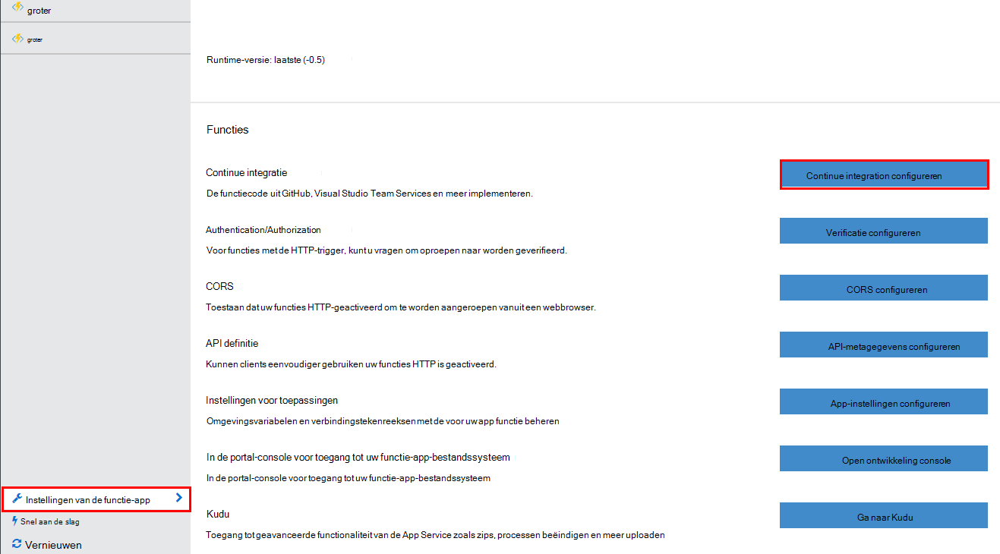
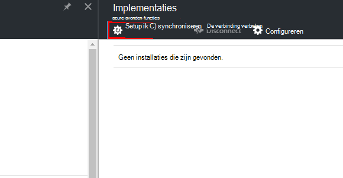
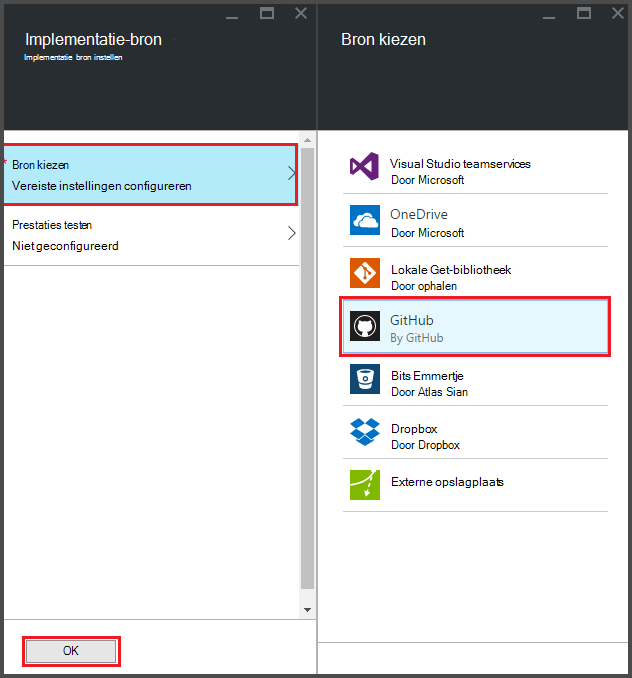
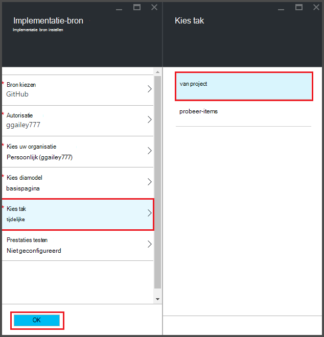
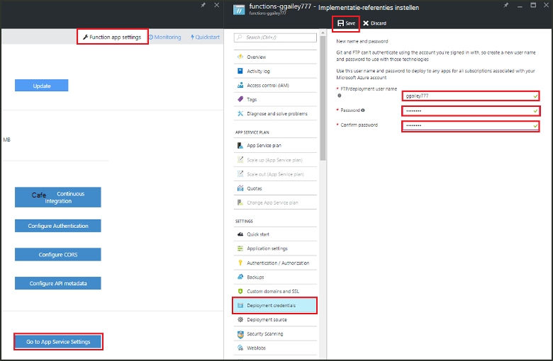
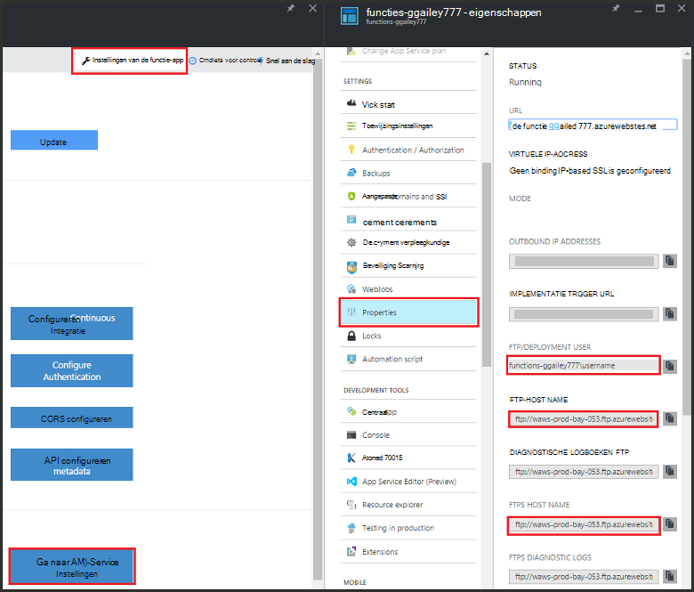
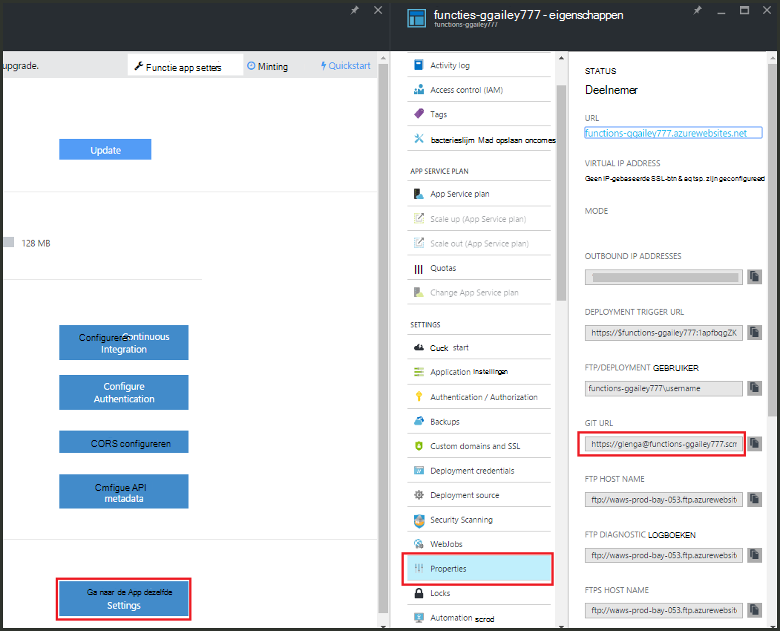

<properties
   pageTitle="Continue implementatie van Azure functies | Microsoft Azure"
   description="Gebruik continue implementatie faciliteiten van Azure App-Service te publiceren van uw Azure-functies."
   services="functions"
   documentationCenter="na"
   authors="ggailey777"
   manager="erikre"
   editor=""
   tags=""
   />

<tags
   ms.service="functions"
   ms.devlang="multiple"
   ms.topic="article"
   ms.tgt_pltfrm="multiple"
   ms.workload="na"
   ms.date="09/25/2016"
   ms.author="glenga"/>

# Continue implementatie van Azure-functies 

Azure-functies kunt u gemakkelijk voor het configureren van continue implementatie voor de functie-app. Functies worden gebruikt in Azure-Service voor App-integratie met BitBucket, Dropbox, GitHub en Visual Studio Team Services (VSTS) zodat een doorlopende implementatie-werkstroom waar Azure updates naar uw code functies getrokken wanneer ze worden gepubliceerd op een van deze services. Als u nog niet eerder tot Azure-functies, begint u met een [Overzicht van de Azure-functies](functions-overview.md).

Continue implementatie is een handige optie voor projecten waarin meerdere en veelgebruikte bijdragen aan goede doelen worden geïntegreerd. U kunt ook voor het behoud van bronbeheer dat op uw code functies. De volgende bronnen voor implementatie worden momenteel ondersteund:

+ [Bitbucket](https://bitbucket.org/)
+ [Dropbox](https://bitbucket.org/)
+ [Lokale cessies‑retrocessies cijfer](../app-service-web/app-service-deploy-local-git.md)
+ Externe cessies‑retrocessies cijfer
+ [GitHub]
+ Volgt externe cessies‑retrocessies
+ [OneDrive](https://onedrive.live.com/)
+ Visual Studio teamservices

Implementaties zijn geconfigureerd op basis van de per-functie-app. Nadat u doorlopend implementatie is ingeschakeld, toegang tot de functiecode in de portal is ingesteld op *alleen-lezen*.

## Implementatievereisten voor doorlopende

In de implementatie-bron voordat u ingesteld continue implementatie, moet u uw gegevensbron implementatie is geconfigureerd en uw code functies hebben. Klik in een bepaalde functie app-implementatie, elke functie bevindt zich in een benoemde submap, er de mapnaam de naam van de functie is. Deze mapstructuur is in principe de sitecode van uw. 

[AZURE.INCLUDE [functions-folder-structure](../../includes/functions-folder-structure.md)]

## Continue implementatie instellen

Gebruik de volgende procedure voor het configureren van continue implementatie van een bestaande functie-app:

1. Klik op **instellingen van de functie-app**in de functie-app in de [portal van Azure-functies](https://functions.azure.com/signin): > **configureren continue integratie** > **Setup**.

    
    
    
    
    U kunt ook openen het blad implementaties via de quickstart functies door te klikken op **starten vanuit het besturingselement voor gegevensbronnen**.

2. In het blad implementaties, klik op **bron kiezen**, klikt u vervolgens de gegevens voor de door u gekozen implementatie-bron fill-in en klik op **OK**.

    

Nadat continue implementatie is geconfigureerd, alle wijzigingen-bestanden in uw implementatie-bron worden gekopieerd naar de app functie en de implementatie van een volledige site wordt geactiveerd. De site is geïmplementeerd wanneer bestanden in de bron worden bijgewerkt.

##Opties voor distributie

Hier volgen enkele typische implementatie-scenario's:

+ 

###Een tijdelijk opslaan implementatie maken

Functie Apps ondersteunt nog geen implementatie sleuven. U kunt echter nog steeds afzonderlijk ontwikkel- en -implementaties beheren met behulp van de integratie van continue.

Het proces voor het configureren en werken met een tijdelijk opslaan implementatie ziet er gewoonlijk zo uit:

1. Maak twee functie apps in uw abonnement, één voor de productiecode en één voor tijdelijke. 

2. Hiermee maakt u een bron implementatie, als u er nog geen hebt. We [GitHub]gebruiken.
 
3. Voer de bovenstaande stappen uit in **het instellen van continue implementatie** en de implementatie-tak ingesteld op de basispagina tak van uw cessies‑retrocessies GitHub voor uw app van de functie productie.

    

4. Herhaal deze stap voor het tijdelijk opslaan functie-app, maar dit moment het tijdelijk opslaan tak in uw cessies‑retrocessies GitHub kiezen. Als uw implementatie-bron biedt geen ondersteuning takken, gebruikt u een andere map.
 
5. Breng wijzigingen aan uw code in het tijdelijk opslaan tak of de map en klik vervolgens controleren of worden deze wijzigingen doorgevoerd in het tijdelijk opslaan implementatie.

6. Na het testen verandert het samenvoegen van het tijdelijk opslaan tak in de basispagina tak. Dit wordt implementatie bij de app van de functie productie geactiveerd. Als uw implementatie-bron geen vertakkingen ondersteunt, moet u de bestanden in de map productie overschrijven met de bestanden die u uit de map tijdelijk opslaan.

###Bestaande functies verplaatsen naar continue implementatie

Wanneer er bestaande functies die u hebt gemaakt en onderhouden in de portal, moet u uw bestaande functie code-bestanden met FTP downloaden of de lokale cijfer opslagplaats voordat u kunt instellen continue implementatie zoals hierboven is beschreven. U kunt dit doen in de App Service-instellingen voor de functie-app. Nadat u uw bestanden hebt gedownload, kunt u ze kunt uploaden naar uw door u gekozen continue implementatie-gegevensbron.

>[AZURE.NOTE]Nadat u doorlopend integratie hebt geconfigureerd, is het niet meer mogelijk uw bronbestanden in de portal van functies te bewerken.

####Hoe u: referenties voor implementatie configureren
Voordat u bestanden vanuit de app van uw functie downloaden kunt, moet u uw referenties op voor toegang tot de site, waarin u in de portal doen kunt configureren. Referenties zijn ingesteld op het niveau van de functie app.

1. Klik op **instellingen van de functie-app**in de functie-app in de [portal van Azure functies](https://functions.azure.com/signin) > **gaat u naar de App-Service-instellingen** > **implementatie referenties**.

    

2. Typ in een gebruikersnaam en wachtwoord en klik op **Opslaan**. U kunt nu deze referenties gebruiken voor toegang tot uw functie-app van FTP- of de ingebouwde cijfer cessies‑retrocessies.

####Hoe u: FTP-bestanden downloaden

1. Klik op **instellingen van de functie-app**in de functie-app in de [portal van Azure functies](https://functions.azure.com/signin) > **gaat u naar de App-Service-instellingen** > **Eigenschappen** en kopieer de waarden voor **De gebruiker FTP-implementatie**, **FTP-Host Name**en **FTPS Host Name**.  
**FTP-implementatie gebruiker** moeten worden ingevoerd, zoals weergegeven in de portal, met inbegrip van de app-naam kan alleen worden aangeboden juiste context voor de FTP-server.

    
    
2. Gebruik de gegevens in uw FTP-client u u verbinding maken met uw app te downloaden van de bronbestanden voor uw functies hebt verzameld.

####Hoe u: downloaden van bestanden met de lokale cijfer opslagplaats

1. Klik op **instellingen van de functie-app**in de functie-app in de [portal van Azure-functies](https://functions.azure.com/signin): > **configureren continue integratie** > **Setup**.

2. Klik in het blad implementaties **kiezen bron**, **lokale cijfer bibliotheek**, klik op **OK**.
 
3. Klik op **Ga naar de App-Service-instellingen** > **Eigenschappen** en de waarde van de URL wordt cijfer notitie. 
    
    

4. De cessies‑retrocessies op uw lokale computer met een cijfer hoogte opdrachtregel of uw favoriete cijfer hulpmiddel klonen. De opdracht van de klonen cijfer ziet er als volgt uit:

        git clone https://username@my-function-app.scm.azurewebsites.net:443/my-function-app.git

5. Bestanden ophalen uit uw functie-app naar de klonen op uw lokale computer, zoals in het volgende voorbeeld:

        git pull origin master

    Als dit wordt gevraagd, leveren de gebruikersnaam en wachtwoord voor uw functie app-implementatie.  

[GitHub]: https://github.com/
