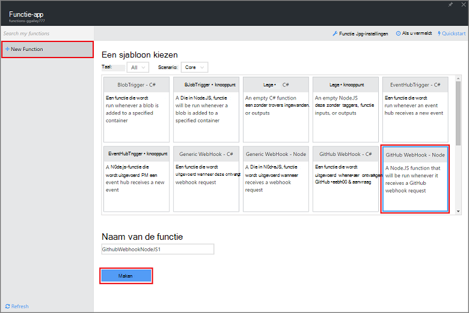
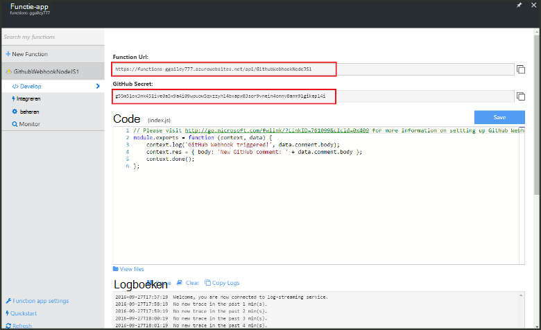
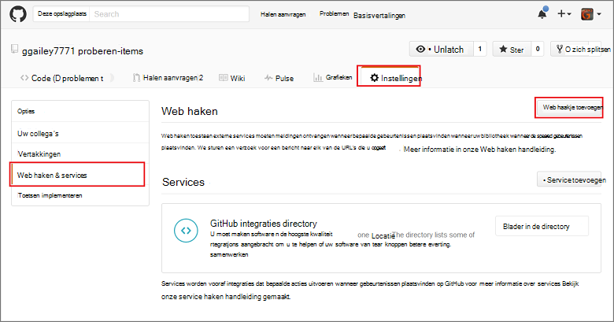
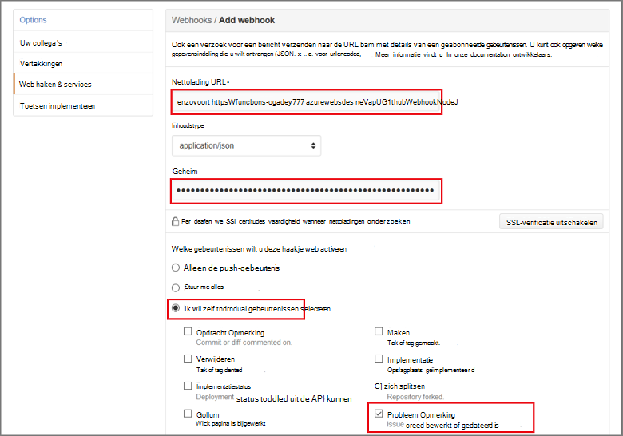

<properties
   pageTitle="Maak een web haakje of API Azure-functie | Microsoft Azure"
   description="Gebruik Azure-functies om te maken van een functie die wordt aangeroepen door een WebHook of API belt."
   services="azure-functions"
   documentationCenter="na"
   authors="ggailey777"
   manager="erikre"
   editor=""
   tags=""
   />

<tags
   ms.service="functions"
   ms.devlang="multiple"
   ms.topic="get-started-article"
   ms.tgt_pltfrm="multiple"
   ms.workload="na"
   ms.date="08/30/2016"
   ms.author="glenga"/>
   
# Maak een webhook of de API Azure-functie

Azure functies is een gebeurtenis op basis van hoeveelheid werk, berekeningscluster op verzoek ervaring die kunt u maken gepland of geactiveerd code-eenheden die zijn geïmplementeerd in diverse talen. Zie voor meer informatie over Azure-functies, het [Overzicht van de Azure-functies](functions-overview.md).

In dit onderwerp ziet u hoe u een nieuwe Node.js functie dat wordt aangeroepen door een webhook GitHub maken. De nieuwe functie is gemaakt op basis van een vooraf gedefinieerde sjabloon in de portal Azure-functies. U kunt ook een korte video om te zien hoe deze stappen worden uitgevoerd in de portal bekijken.

## Bekijk de video

De volgende video laten zien hoe de basisstappen beschreven die u in deze zelfstudie 

[AZURE.VIDEO create-a-web-hook-or-api-azure-function]

##Een functie webhook geactiveerd van de sjabloon maken

Een app functie host de uitvoering van de functies in Azure wordt aangegeven. Voordat u een functie maken kunt, moet u beschikken over een actieve Azure-account. Als u geen al een Azure-account, [gratis accounts zijn beschikbaar](https://azure.microsoft.com/free/). 

1. Ga naar de [portal van Azure-functies](https://functions.azure.com/signin) en aanmelden met uw Azure-account.

2. Als u een bestaande functie-app als u wilt gebruiken, selecteert u deze in **uw functie-apps** hebt klikt u op **openen**. Naar een nieuwe functie-app maakt, typ een unieke **naam** voor de nieuwe functie-app of accepteer de gegenereerde fase, selecteer uw voorkeur **regio**en klik op **maken + aan de slag**. 

3. Klik op **+ nieuwe functie**in uw app functie > **GitHub Webhook - knooppunt** > **maken**. Hiermee wordt een functie gemaakt met een standaardnaam die is gebaseerd op de opgegeven sjabloon. 

     

4. Kijk in **ontwikkelen**, de functie van de steekproef express.js in **het codevenster** . Deze functie ontvangt een GitHub-aanvragen van een probleem Opmerking webhook, de tekst van het probleem logboeken en stuurt een antwoord naar de webhook als `New GitHub comment: <Your issue comment text>`.

     

5. Kopieer de **URL van de functie** en **GitHub geheim** waarden. U moet deze wanneer u de webhook in GitHub maakt. 

6. Schuif omlaag naar **uitvoeren**, houd rekening met de vooraf gedefinieerde JSON hoofdtekst van een opmerking probleem in het hoofdgedeelte van de aanvraag en klik op **uitvoeren**. 
 
    U kunt een nieuwe sjabloon gebaseerde functie altijd testen rechts op het tabblad **ontwikkelen** door het opgeven van een verwacht hoofdtekst JSON-gegevens en te klikken op de knop **uitvoeren** . In dit geval bevat de sjabloon een vooraf gedefinieerde hoofdtekst van een opmerking probleem. 
 
U maakt vervolgens de werkelijke webhook in uw bibliotheek GitHub.

##De webhook configureren

1. Ga in GitHub, naar een bibliotheek dat u eigenaar bent; Deze groep omvat alle opslagplaatsen die u hebt forked.
 
2. Klik op **Instellingen** > **Webhooks & services** > **webhook toevoegen**.

       

3. Plak de URL van de functie en de geheim in **Nettolading URL** en **geheim**, en vervolgens klikt u op **Ik wil zelf afzonderlijke gebeurtenissen selecteren**, **probleem Opmerking** en klik op **toevoegen webhook**.

     

Nu is de webhook GitHub geconfigureerd voor het activeren van de functie wanneer een nieuwe probleem opmerking is toegevoegd.  
Nu is het tijd om deze af te testen.

##De functie testen

1. In uw cessies‑retrocessies GitHub het tabblad **problemen** openen in een nieuw browservenster, klik op **Nieuwe probleem**, typ een titel en klik op **nieuwe probleem verzenden**. U kunt ook een bestaande probleem openen.

2. Klik in het probleem toe, typt u een opmerking en klikt u op **Opmerking**. Nu u kunt teruggaan naar uw nieuwe webhook in GitHub en klik onder **Recente leveringen** Zie dat een webhook-aanvraag is verzonden en de hoofdtekst van het antwoord is `New GitHub comment: <Your issue comment text>`.

3. Terug in de portal functies, schuif omlaag naar de logboeken en Zie dat de functie geactiveerd is en de waarde `New GitHub comment: <Your issue comment text>` naar de streaming Logboeken is geschreven.

##Volgende stappen

Zie de volgende onderwerpen voor meer informatie over Azure-functies.

+ [Azure naslaginformatie voor ontwikkelaars van functies](functions-reference.md)  
Programma verwijzing voor het coderen van functies.
+ [Azure functies testen](functions-test-a-function.md)  
Diverse hulpprogramma's en technieken voor het testen van de functies beschreven.
+ [Hoe u de schaal van Azure-functies](functions-scale.md)  
Wordt beschreven hoe service-abonnementen die beschikbaar zijn met Azure-functies, inclusief de dynamische serviceplan en hoe u om de juiste abonnement te kiezen.  

[AZURE.INCLUDE [Getting Started Note](../../includes/functions-get-help.md)]
