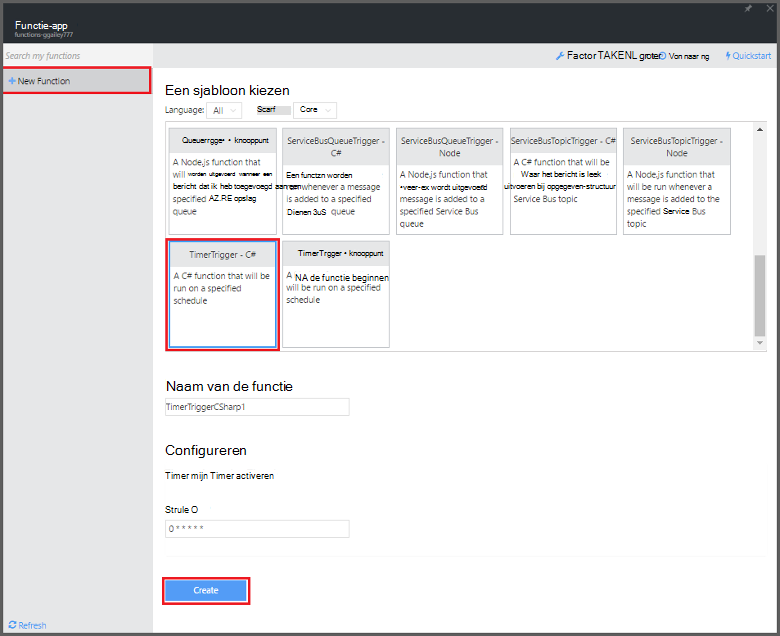

<properties
   pageTitle="Een gebeurtenis verwerken van de functie maken | Microsoft Azure"
   description="Gebruik Azure-functies maken een C#-functie die wordt uitgevoerd op basis van een Gebeurtenistimer."
   services="functions"
   documentationCenter="na"
   authors="ggailey777"
   manager="erikre"
   editor=""
   tags=""
   />

<tags
   ms.service="functions"
   ms.devlang="multiple"
   ms.topic="get-started-article"
   ms.tgt_pltfrm="multiple"
   ms.workload="na"
   ms.date="09/25/2016"
   ms.author="glenga"/>
   
# De verwerking van Azure-functie van een gebeurtenis maken

Azure functies is een gebeurtenis op basis van hoeveelheid werk, berekeningscluster op verzoek ervaring die kunt u maken gepland of geactiveerd code-eenheden die zijn geïmplementeerd in diverse talen. Zie voor meer informatie over Azure-functies, het [Overzicht van de Azure-functies](functions-overview.md).

In dit onderwerp ziet u hoe u een nieuwe functie maken in C# die wordt uitgevoerd op basis van een Gebeurtenistimer berichten toevoegen aan een wachtrij opslag. 

## Vereisten voor 

Voordat u een functie maken kunt, moet u beschikken over een actieve Azure-account. Als u geen al een Azure-account, [gratis accounts zijn beschikbaar](https://azure.microsoft.com/free/).

## Een timer geactiveerd-functie van de sjabloon maken

Een app functie host de uitvoering van de functies in Azure wordt aangegeven. Voordat u een functie maken kunt, moet u beschikken over een actieve Azure-account. Als u geen al een Azure-account, [gratis accounts zijn beschikbaar](https://azure.microsoft.com/free/). 

1. Ga naar de [portal van Azure-functies](https://functions.azure.com/signin) en aanmelden met uw Azure-account.

2. Als u een bestaande functie-app als u wilt gebruiken, selecteert u deze in **uw functie-apps** hebt klikt u op **openen**. Naar een nieuwe functie-app maakt, typ een unieke **naam** voor de nieuwe functie-app of accepteer de gegenereerde fase, selecteer uw voorkeur **regio**en klik op **maken + aan de slag**. 

3. Klik op **+ nieuwe functie**in uw app functie > **TimerTrigger - C#** > **maken**. Hiermee wordt een functie gemaakt met een standaardnaam die wordt uitgevoerd op de standaardplanning van eenmaal per minuut. 

    

4. Klik op het tabblad **integreren** in de nieuwe functie > **Nieuwe uitvoer** > **Azure opslag wachtrij** > **selecteren**.

    

5. **Azure opslag wachtrij uitvoer**, selecteert u een bestaande **verbinding voor opslag-account**, of in een nieuw account te maken, en klikt u op **Opslaan**. 

    

6. Terug in het tabblad **ontwikkelen** , kunt u het bestaande C#-script in **het codevenster** vervangen door de volgende code:

        using System;
        
        public static void Run(TimerInfo myTimer, out string outputQueueItem, TraceWriter log)
        {
            // Add a new scheduled message to the queue.
            outputQueueItem = $"Ping message added to the queue at: {DateTime.Now}.";
            
            // Also write the message to the logs.
            log.Info(outputQueueItem);
        }

    Een nieuw bericht door deze code wordt toegevoegd aan de wachtrij met de huidige datum en tijd waarop de functie wordt uitgevoerd.

7. Klik op **Opslaan** en bekijk de vensters **Logboeken** voor de uitvoering van de volgende functie.

8. (Optioneel) Navigeer naar de opslag-account en controleer of dat berichten worden toegevoegd aan de wachtrij.

9. Ga terug naar het tabblad **integreren** en wijzigen van het veld schema aan `0 0 * * * *`. De functie wordt nu uitgevoerd voor één keer per uur. 

Dit is een zeer eenvoudig voorbeeld van een timer-trigger zowel een wachtrij opslag uitvoer binding. Zie zowel de [functies van Azure timer inwerkingtreding](functions-bindings-timer.md) en de [functies van Azure triggers en bindingen voor de opslag van Azure](functions-bindings-storage.md) -onderwerpen voor meer informatie.

##Volgende stappen

Zie de volgende onderwerpen voor meer informatie over Azure-functies.

+ [Azure naslaginformatie voor ontwikkelaars van functies](functions-reference.md)  
Programma overzicht van functies van codering en triggers en bindingen definiëren.
+ [Azure functies testen](functions-test-a-function.md)  
Diverse hulpprogramma's en technieken voor het testen van de functies beschreven.
+ [Hoe u de schaal van Azure-functies](functions-scale.md)  
Wordt beschreven hoe service-abonnementen die beschikbaar zijn met Azure-functies, inclusief de dynamische serviceplan en hoe u om de juiste abonnement te kiezen.  

[AZURE.INCLUDE [Getting Started Note](../../includes/functions-get-help.md)]
