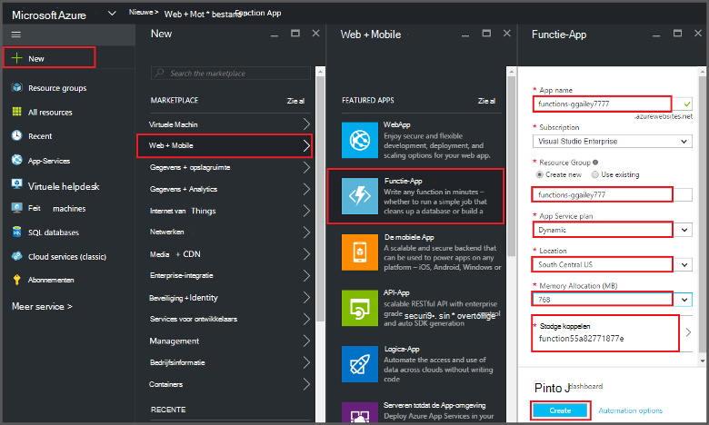
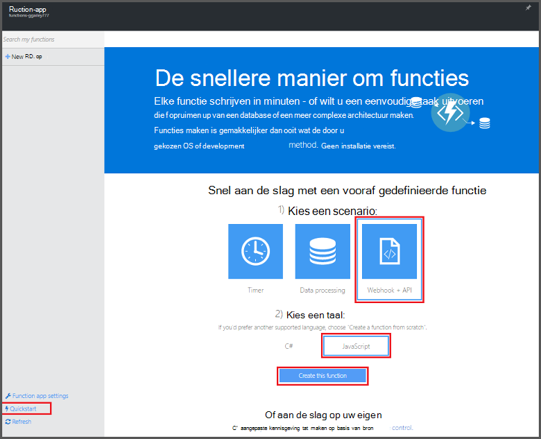
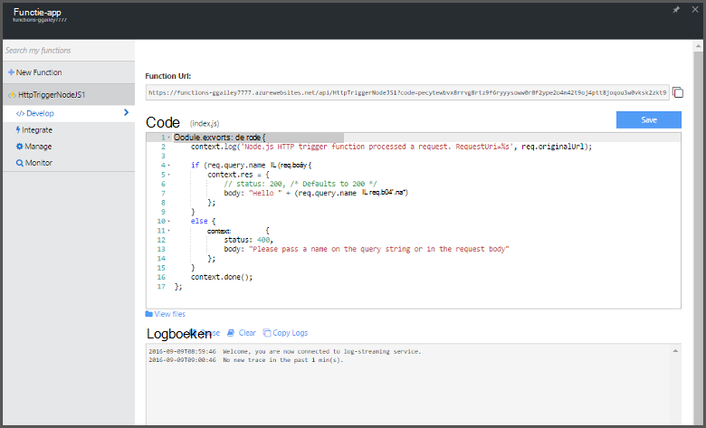

<properties
   pageTitle="Maken van een functie van de Portal Azure | Microsoft Azure"
   description="Uw eerste Azure-functie, een toepassing als u kiest in meer dan twee minuten maken."
   services="functions"
   documentationCenter="na"
   authors="ggailey777"
   manager="erikre"
   editor=""
   tags=""
/>

<tags
   ms.service="functions"
   ms.devlang="multiple"
   ms.topic="article"
   ms.tgt_pltfrm="multiple"
   ms.workload="na"
   ms.date="09/08/2016"
   ms.author="glenga"/>

#Maken van een functie van de Azure-portal

##Overzicht
Azure functies is een gebeurtenis op basis van hoeveelheid werk, berekeningscluster op verzoek ervaring die het bestaande Azure-toepassingsplatform met mogelijkheden willen implementeren code gestart door gebeurtenissen die in andere Azure services, producten SaaS en on-premises implementatie systemen uitbreidt. Uw toepassingen op basis van de aanvraag schalen met Azure-functies, en u betaalt alleen voor de resources die u wilt gebruiken. Azure functies kunt u maken gepland of geactiveerd eenheden van de code die zijn geïmplementeerd in verschillende talen. Zie voor meer informatie over Azure-functies, het [Overzicht van de Azure-functies](functions-overview.md).

In dit onderwerp ziet u hoe de Azure-portal gebruiken om te maken van een eenvoudige "Hallo allemaal" Node.js Azure functie dat wordt aangeroepen door een HTTP-trigger. Voordat u een functie in de portal van Azure maken kunt, moet u een app functie expliciet maken in Azure App-Service. Zie [de andere functies van Azure quickstart zelfstudie](functions-create-first-azure-function.md), dat is een eenvoudiger quickstart-ervaring en bevat een video wilt de functie app automatisch voor u gemaakt.

##Een functie-app maken

Een app functie host de uitvoering van de functies in Azure wordt aangegeven. Volg deze stappen om een functie-app maken in de portal van Azure.

Voordat u uw eerste functie maken kunt, moet u beschikken over een actieve Azure-account. Als u geen al een Azure-account, [gratis accounts zijn beschikbaar](https://azure.microsoft.com/free/).

1. Ga naar de [Azure-portal](https://portal.azure.com) en aanmelden met uw Azure-account.

2. Klik op **+ Nieuw** > **Web + Mobile** > **Functie App**, selecteert u uw **abonnement**, typ een unieke **naam App** waarmee uw functie-app, en geef vervolgens de volgende instellingen:

    + **[Resourcegroep](../azure-portal/resource-group-portal.md/)**: Selecteer **Nieuw** en voer een naam voor uw nieuwe resourcegroep. U kunt ook een bestaande resourcegroep, maar u niet mogelijk om een dynamische App Service-plan voor de functie-app te maken.
    + **[App-abonnement](../app-service/azure-web-sites-web-hosting-plans-in-depth-overview.md)**: kiest u *dynamische* of *klassieke*. 
        + **Dynamische**: het type abonnement voor Azure-functies. Als u een dynamische abonnement kiest, moet u ook Kies de **locatie** en de **Geheugentoewijzing** instellen (in MB). Kosten, Zie [Azure functies prijzen](https://azure.microsoft.com/pricing/details/functions/)voor informatie over de invloed van geheugentoewijzing. 
        + **Klassieke**: een klassieke App Service-abonnement, moet u een **App Service abonnement/locatie** maken of selecteren van een bestaande eigenschap. Deze instellingen bepalen de [locatie, functies, kosten en berekenen van resources](https://azure.microsoft.com/pricing/details/app-service/) die zijn gekoppeld aan uw app.  
    + **Opslag-account**: elke functie-app is een opslag-account vereist. U kunt kiezen van een bestaand opslag-account of een account maakt. 

    

3. Klik op **maken** inrichten en implementeer de nieuwe functie-app.  

Nu de functie-app wordt ingericht, kunt u uw eerste functie maken.

## Maken van een functie

Deze stappen maken een functie van de quickstart Azure-functies.

1. Het tabblad **Quickstart** **WebHook + API** en **JavaScript**, klik op **maken een functie**. Een nieuwe, vooraf gedefinieerde Node.js-functie wordt gemaakt. 

    

2. (Optioneel) Op dit punt in de snelstartgids, kunt u een rondleiding van Azure functies functies in de portal.   Zodra u hebt voltooid, of de rondleiding overgeslagen, kunt u de nieuwe functie kunt testen met behulp van de HTTP-trigger.

##De functie testen

Aangezien de QuickStart Azure functies functionele code bevatten, kunt u de nieuwe functie direct testen.

1. In het tabblad **ontwikkelen** bekijken van **het codevenster** waarna u ziet dat deze code Node.js verwacht een HTTP-aanvraag af met *een waarde in de hoofdtekst van het bericht of in een queryreeks doorgegeven* . Wanneer de functie wordt uitgevoerd, wordt deze waarde wordt geretourneerd in het antwoordbericht.

    

2. Schuif omlaag naar het tekstvak **hoofdtekst aanvragen** , wijzig de waarde van de eigenschap *name* in uw naam en klik op **uitvoeren**. U ziet dat kan worden uitgevoerd door een test HTTP-aanvraag wordt geactiveerd, gegevens worden naar de streaming logboekbestanden geschreven en het antwoord 'Hallo' wordt weergegeven in de **uitvoer**. 

3. Als u wilt activeren uitvoering van dezelfde functie uit een ander browservenster of tabblad, de **URL van de functie** waarde van het tabblad **ontwikkelen** kopiëren en plak deze in de adresbalk van een browser en de query-tekenreekswaarde toevoegen `&name=yourname` en druk op enter. Dezelfde gegevens naar de logboekbestanden geschreven en het antwoord 'Hallo' als voordat weergegeven in de browser.

##Volgende stappen

Deze snelstartgids ziet u een zeer eenvoudige uitvoering van een eenvoudige functie voor HTTP-geactiveerd. Zie de volgende onderwerpen voor meer informatie over het gebruik van de kracht van Azure-functies in uw apps.

+ [Azure naslaginformatie voor ontwikkelaars van functies](functions-reference.md)  
Programma overzicht van functies van codering en triggers en bindingen definiëren.
+ [Azure functies testen](functions-test-a-function.md)  
Diverse hulpprogramma's en technieken voor het testen van de functies beschreven.
+ [Hoe u de schaal van Azure-functies](functions-scale.md)  
Wordt beschreven hoe service-abonnementen die beschikbaar zijn met Azure-functies, inclusief de dynamische serviceplan en hoe u om de juiste abonnement te kiezen. 
+ [Wat is de App-Azure-Service?](../app-service/app-service-value-prop-what-is.md)  
Azure-functies gebruikt het platform Azure App-Service voor de belangrijkste functies zoals implementaties, omgevingsvariabelen en diagnostische gegevens. 

[AZURE.INCLUDE [Getting Started Note](../../includes/functions-get-help.md)]
