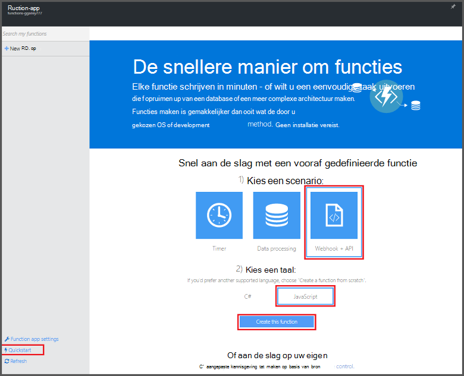
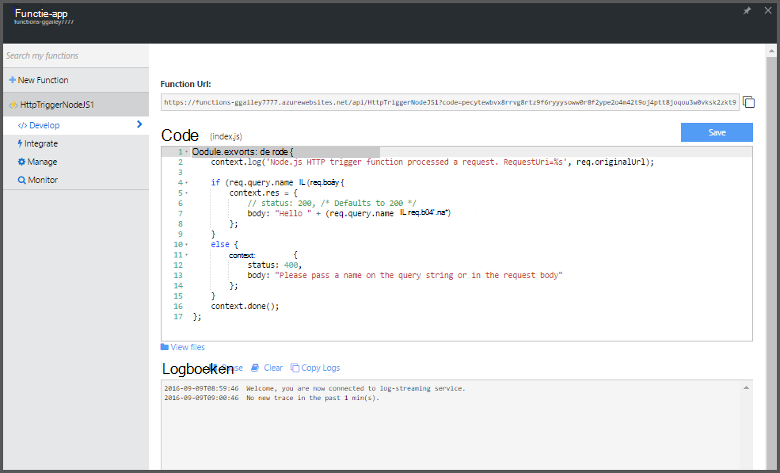

<properties
   pageTitle="Maak uw eerste Azure-functie | Microsoft Azure"
   description="Uw eerste Azure-functie, een toepassing als u kiest in meer dan twee minuten maken."
   services="functions"
   documentationCenter="na"
   authors="ggailey777"
   manager="erikre"
   editor=""
   tags=""
/>

<tags
   ms.service="functions"
   ms.devlang="multiple"
   ms.topic="hero-article"
   ms.tgt_pltfrm="multiple"
   ms.workload="na"
   ms.date="09/08/2016"
   ms.author="glenga"/>

#Maak uw eerste Azure-functie

##Overzicht
Azure functies is een gebeurtenis op basis van hoeveelheid werk, berekeningscluster op verzoek ervaring die het bestaande Azure-toepassingsplatform met mogelijkheden willen implementeren code gestart door gebeurtenissen die in andere Azure services, producten SaaS en on-premises implementatie systemen uitbreidt. Uw toepassingen op basis van de aanvraag schalen met Azure-functies, en u betaalt alleen voor de resources die u wilt gebruiken. Azure functies kunt u maken gepland of geactiveerd eenheden van de code die zijn geïmplementeerd in diverse talen. Zie voor meer informatie over Azure-functies, het [Overzicht van de Azure-functies](functions-overview.md).

In dit onderwerp ziet u hoe u de quickstart Azure-functies gebruiken in de portal om te maken van een eenvoudige "Hallo wereld" Node.js functie dat wordt aangeroepen door een HTTP-trigger. U kunt ook een korte video om te zien hoe deze stappen worden uitgevoerd in de portal bekijken.

## Bekijk de video

De volgende video hoe de eenvoudige stappen in deze zelfstudie uitvoeren. 

[AZURE.VIDEO create-your-first-azure-function-simple]

##Maken van een functie van de Snelstartgids

Een app functie host de uitvoering van de functies in Azure wordt aangegeven. Volg deze stappen om het maken van een nieuwe functie-app, evenals de nieuwe functie. De nieuwe functie-app is gemaakt met een standaard-configuratie. Voor een voorbeeld van hoe u expliciet uw functie-app maken, raadpleegt u [de andere functies van Azure quickstart zelfstudie](functions-create-first-azure-function-azure-portal.md).

Voordat u uw eerste functie maken kunt, moet u beschikken over een actieve Azure-account. Als u geen al een Azure-account, [gratis accounts zijn beschikbaar](https://azure.microsoft.com/free/).

1. Ga naar de [portal van Azure-functies](https://functions.azure.com/signin) en aanmelden met uw Azure-account.

2. Typ een unieke **naam** voor de nieuwe functie-app of accepteer de sectie die wordt gegenereerd, selecteer uw voorkeur **regio**en klik op **maken + aan de slag**. 

3. Het tabblad **Quickstart** **WebHook + API** en **JavaScript**, klik op **maken een functie**. Een nieuwe, vooraf gedefinieerde Node.js-functie wordt gemaakt. 

    

4. (Optioneel) Op dit punt in de snelstartgids, kunt u een rondleiding van Azure functies functies in de portal.   Zodra u hebt voltooid, of de rondleiding overgeslagen, kunt u de nieuwe functie kunt testen met behulp van de HTTP-trigger.

##De functie testen

Aangezien de QuickStart Azure functies functionele code bevatten, kunt u de nieuwe functie direct testen.

1. In het tabblad **ontwikkelen** bekijken van **het codevenster** waarna u ziet dat deze code Node.js verwacht een HTTP-aanvraag af met *een waarde in de hoofdtekst van het bericht of in een queryreeks doorgegeven* . Wanneer de functie wordt uitgevoerd, wordt deze waarde wordt geretourneerd in het antwoordbericht.

    

2. Schuif omlaag naar het tekstvak **hoofdtekst aanvragen** , wijzig de waarde van de eigenschap *name* in uw naam en klik op **uitvoeren**. U ziet dat kan worden uitgevoerd door een test HTTP-aanvraag wordt geactiveerd, gegevens worden naar de streaming logboekbestanden geschreven en het antwoord 'Hallo' wordt weergegeven in de **uitvoer**. 

3. Als u wilt activeren uitvoering van dezelfde functie uit een ander browservenster of tabblad, de **URL van de functie** waarde van het tabblad **ontwikkelen** kopiëren en plak deze in de adresbalk van een browser en de query-tekenreekswaarde toevoegen `&name=yourname` en druk op enter. Dezelfde gegevens naar de logboekbestanden geschreven en het antwoord 'Hallo' als voordat weergegeven in de browser.

##Volgende stappen

Deze snelstartgids ziet u een zeer eenvoudige uitvoering van een eenvoudige functie voor HTTP-geactiveerd. Zie de volgende onderwerpen voor meer informatie over het gebruik van de kracht van Azure-functies in uw apps.

+ [Azure naslaginformatie voor ontwikkelaars van functies](functions-reference.md)  
Programma overzicht van functies van codering en triggers en bindingen definiëren.
+ [Azure functies testen](functions-test-a-function.md)  
Diverse hulpprogramma's en technieken voor het testen van de functies beschreven.
+ [Hoe u de schaal van Azure-functies](functions-scale.md)  
Wordt beschreven hoe service-abonnementen die beschikbaar zijn met Azure-functies, inclusief de dynamische serviceplan en hoe u om de juiste abonnement te kiezen. 
+ [Wat is de App-Azure-Service?](../app-service/app-service-value-prop-what-is.md)  
Azure-functies worden gebruikt in het platform Azure App-Service voor de belangrijkste functies zoals implementaties, omgevingsvariabelen en diagnostische gegevens. 

[AZURE.INCLUDE [Getting Started Note](../../includes/functions-get-help.md)]
