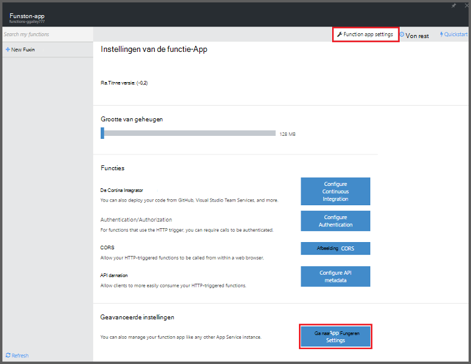
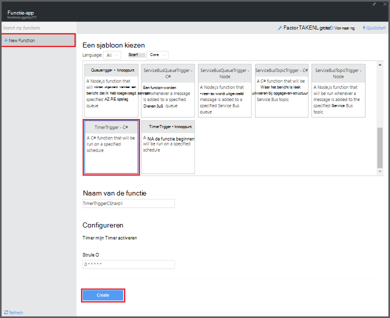

<properties
   pageTitle="Azure-functie gebruiken om het uitvoeren van een taak opschonen | Microsoft Azure"
   description="Gebruik Azure-functies maken een C#-functie die wordt uitgevoerd op basis van een Gebeurtenistimer."
   services="functions"
   documentationCenter="na"
   authors="ggailey777"
   manager="erikre"
   editor=""
   tags=""
   />

<tags
   ms.service="functions"
   ms.devlang="multiple"
   ms.topic="article"
   ms.tgt_pltfrm="multiple"
   ms.workload="na"
   ms.date="09/26/2016"
   ms.author="glenga"/>
   
# Azure-functie gebruiken om het uitvoeren van een taak opschonen

In dit onderwerp ziet u hoe u het Azure-functies gebruiken om te maken van een nieuwe functie in C# die wordt uitgevoerd op basis van een Gebeurtenistimer naar opschonen rijen in een database. De nieuwe functie is gemaakt op basis van een vooraf gedefinieerde sjabloon in de portal Azure-functies. Voor dit scenario, moet u ook een verbindingsreeks van de database instellen als een App-Service instellen in de functie-app. 

## Vereisten voor 

Voordat u een functie maken kunt, moet u beschikken over een actieve Azure-account. Als u geen al een Azure-account, [gratis accounts zijn beschikbaar](https://azure.microsoft.com/free/).

In dit onderwerp ziet u een Transact-SQL-opdracht die wordt uitgevoerd een bulkbewerking opruimen in de tabel met de naam *TodoItems* in een SQL-Database. In deze tabel met dezelfde TodoItems wordt gemaakt wanneer u de [Mobile-Apps van Azure App Service quickstart zelfstudie](../app-service-mobile/app-service-mobile-ios-get-started.md)hebt voltooid. U kunt ook een voorbeelddatabase gebruiken als u een andere tabel te gebruiken, moet u de opdracht wijzigen.

U krijgt de verbindingsreeks die wordt gebruikt door een backend Mobile-App in de portal onder **alle instellingen** > **Toepassingsinstellingen** > **verbindingstekenreeksen** > **verbinding tekenreekswaarden weergeven** > **MS_TableConnectionString**. U kunt ook de verbindingsreeks ophalen directe uit een SQL-Database in de portal onder **alle instellingen** > **Eigenschappen** > **weergeven tekenreeksen voor databaseverbinding** > **ADO.NET (SQL-verificatie)**.

In dit scenario wordt een bulkbewerking ten opzichte van de database. Als u wilt dat uw functie proces afzonderlijke CRUD-bewerkingen in een tabel Mobile-Apps, moet u in plaats daarvan Mobile tabel binding gebruiken.

## Een verbindingsreeks van de SQL-Database in de functie app instellen

Een app functie host de uitvoering van de functies in Azure wordt aangegeven. Dit is een goede gewoonte om verbindingstekenreeksen met de en andere geheimen opslaan in de functie app-instellingen. Hiermee voorkomt u per ongeluk gegevens noodzakelijk wanneer uw functiecode uiteinden boven in een cessies‑retrocessies ergens. 

1. Ga naar de [portal van Azure-functies](https://functions.azure.com/signin) en aanmelden met uw Azure-account.

2. Als u een bestaande functie-app als u wilt gebruiken, selecteert u deze in **uw functie-apps** hebt klikt u op **openen**. Naar een nieuwe functie-app maakt, typ een unieke **naam** voor de nieuwe functie-app of accepteer de gegenereerde fase, selecteer uw voorkeur **regio**en klik op **maken + aan de slag**. 

3. Klik op **instellingen van de functie-app**in uw app functie > **gaat u naar de App-Service-instellingen**. 

    

4. Klik in uw functie-app, op **alle instellingen**, schuif omlaag naar **Toepassingsinstellingen**en klik onder type **verbindingstekenreeksen** `sqldb_connection` voor **naam**, de verbindingsreeks in **waarde**plakken, klikt u op **Opslaan**en sluit het blad van de functie app om terug te keren naar de portal functies.

    

U kunt nu de C# programmacode die is verbonden met uw SQL-Database toevoegen.

## Een timer geactiveerd-functie van de sjabloon maken

1. Klik op **+ nieuwe functie**in uw app functie > **TimerTrigger - C#** > **maken**. Hiermee wordt een functie gemaakt met een standaardnaam die wordt uitgevoerd op de standaardplanning van eenmaal per minuut. 

    

2. Klik in het deelvenster **Code** op het tabblad **ontwikkelen** toevoegen de volgende constructie-verwijzingen boven aan de bestaande functiecode:

        #r "System.Configuration"
        #r "System.Data"

3. Voeg de volgende `using` instructies voor de functie:

        using System.Configuration;
        using System.Data.SqlClient;
        using System.Threading.Tasks; 

4. De bestaande **uitvoeren** functie vervangen door de volgende code:

        public static async Task Run(TimerInfo myTimer, TraceWriter log)
        {
            var str = ConfigurationManager.ConnectionStrings["sqldb_connection"].ConnectionString;
            using (SqlConnection conn = new SqlConnection(str))
            {
                conn.Open();
                var text = "DELETE from dbo.TodoItems WHERE Complete='True'";
                using (SqlCommand cmd = new SqlCommand(text, conn))
                {
                    // Execute the command and log the # rows deleted.
                    var rows = await cmd.ExecuteNonQueryAsync();
                    log.Info($"{rows} rows were deleted");
                }
            }
        }

5. Klik op **Opslaan**, de vensters **Logboeken** voor de uitvoering van de volgende functie bekijken en houd rekening met het aantal rijen verwijderd uit de tabel TodoItems.

6. (Optioneel) De [Mobile-Apps quickstart app](../app-service-mobile/app-service-mobile-ios-get-started.md)gebruikt, markeer de andere items als "voltooid" vervolgens gaat u terug naar het venster **Logboeken** en controle hetzelfde aantal rijen verwijderd door de functie tijdens de uitvoering van de volgende. 

##Volgende stappen

Zie de volgende onderwerpen voor meer informatie over Azure-functies.

+ [Azure naslaginformatie voor ontwikkelaars van functies](functions-reference.md)  
Programma overzicht van functies van codering en triggers en bindingen definiëren.
+ [Azure functies testen](functions-test-a-function.md)  
Diverse hulpprogramma's en technieken voor het testen van de functies beschreven.
+ [Hoe u de schaal van Azure-functies](functions-scale.md)  
Wordt beschreven hoe service-abonnementen die beschikbaar zijn met Azure-functies, inclusief de dynamische serviceplan en hoe u om de juiste abonnement te kiezen.  

[AZURE.INCLUDE [Getting Started Note](../../includes/functions-get-help.md)]