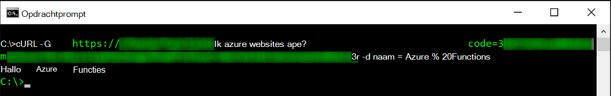
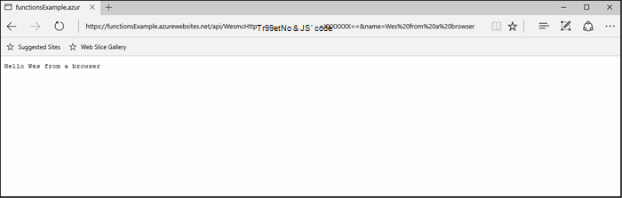
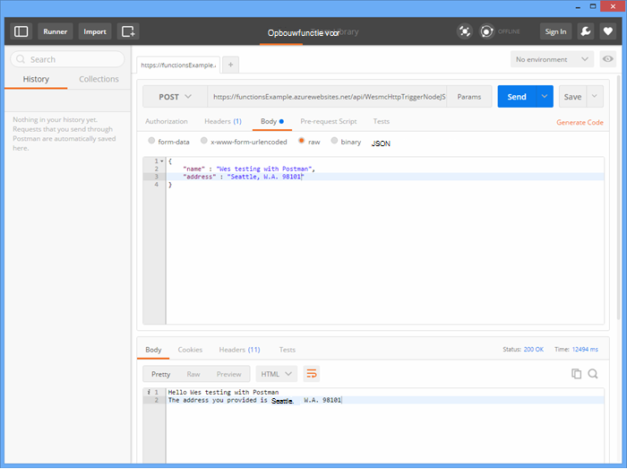
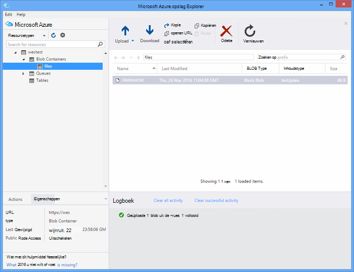

<properties
   pageTitle="Azure functies testen | Microsoft Azure"
   description="Test uw Azure-functies met Postman, krul en Node.js."
   services="functions"
   documentationCenter="na"
   authors="wesmc7777"
   manager="erikre"
   editor=""
   tags=""
   keywords="Azure-functies, functies, verwerking van de gebeurtenis, webhooks, dynamische berekeningscluster, als u kiest architectuur testen"/>

<tags
   ms.service="functions"
   ms.devlang="multiple"
   ms.topic="article"
   ms.tgt_pltfrm="multiple"
   ms.workload="na"
   ms.date="08/19/2016"
   ms.author="wesmc"/>

# Azure functies testen

## Overzicht

In deze zelfstudie doorlopen we verschillende methoden tot het testen van functies. We wordt de functie van een http-trigger die invoer door een queryreeksparameter of het hoofdgedeelte van de aanvraag accepteert gedefinieerd. De standaard **HttpTrigger Node.js functie** sjablooncode ondersteunt een `name` tekenreeks queryparameter. We wordt ook code toevoegen om te ondersteunen die parameter samen met `address` voor de gebruiker in de hoofdtekst van het verzoek.

## Een functie voor het testen van maken

Voor de meeste van deze zelfstudie, we gebruiken een iets gewijzigd versie van de sjabloon **HttpTrigger Nodejs functie** die beschikbaar zijn bij het maken van een nieuwe functie.  U kunt het [maken van uw eerste Azure functie zelfstudie](functions-create-first-azure-function.md) bekijken als u hulp bij het maken van een nieuwe functie nodig hebt.  Kies alleen de sjabloon **HttpTrigger Nodejs functie** bij het maken van de functie testen in de [Portal van Azure].

De standaardsjabloon van de functie is in principe een Hallo wereld-functie die de naam van de aanvraag hoofdtekst of query tekenreeksparameter, een echo terug `name=<your name>`.  We zullen de code ook dat u kunt de naam en een adres als JSON-inhoud in het hoofdgedeelte van de aanvraag opgeeft bijwerken. De functie wordt vervolgens deze terug naar de klant indien beschikbaar echo.   

De functie bijgewerkt met de volgende code die we voor het testen gebruiken:

    module.exports = function(context, req) {
        context.log("Node.js HTTP trigger function processed a request. RequestUri=%s", req.originalUrl);
        context.log("Request Headers = " + JSON.stringify(req.headers));    
    
        if (req.query.name || (req.body && req.body.name)) {
            if (typeof req.query.name != "undefined") {
                context.log("Name was provided as a query string param..."); 
                ProcessNewUserInformation(context, req.query.name);
            }
            else {
                context.log("Processing user info from request body..."); 
                ProcessNewUserInformation(context, req.body.name, req.body.address);
            }
        }
        else {
            context.res = {
                status: 400,
                body: "Please pass a name on the query string or in the request body"
            };
        }
        context.done();
    };
    
    function ProcessNewUserInformation(context, name, address)
    {    
        context.log("Processing User Information...");            
        context.log("name = " + name);            
        echoString = "Hello " + name;
        
        if (typeof address != "undefined")
        {
            echoString += "\n" + "The address you provided is " + address;
            context.log("address = " + address);            
        }
        
        context.res = {
                // status: 200, /* Defaults to 200 */
                body: echoString
            };
    }

## Een functie met hulpmiddelen voor testen

### Test met krul

Vaak bij het testen van software, is het niet nodig is om te zoeken een verder dan de opdrachtregel om te helpen fouten opsporen in uw toepassing, niet verschillende met functies is, kunt u dit.

Als u wilt testen van de bovenstaande functie, door de **Url van de functie** van de portal te kopiëren. Heeft de volgende notatie: 

    https://<Your Function App>.azurewebsites.net/api/<Your Function Name>?code=<your access code>
    
Dit is de Url voor uw functie activeert, kunnen we dit door het gebruik van de opdracht krul in de opdrachtregel om een Get toetsen (`-G` of `--get`) verzoek ten opzichte van onze functie:

    curl -G https://<Your Function App>.azurewebsites.net/api/<Your Function Name>?code=<your access code>
    
Dit voorbeeld hierboven vereist een queryreeksparameter die kan worden doorgegeven als de gegevens (`-d`) in de opdracht krul:

    curl -G https://<Your Function App>.azurewebsites.net/api/<Your Function Name>?code=<your access code> -d name=<Enter a name here>
    
Op ENTER drukken en de uitvoer van de functie wordt weergegeven op de opdrachtregel.

Klik in het venster portal **Logboeken** uitvoer van de volgende strekking vastgelegd tijdens het uitvoeren van de functie:

    2016-04-05T21:55:09  Welcome, you are now connected to log-streaming service.
    2016-04-05T21:55:30.738 Function started (Id=ae6955da-29db-401a-b706-482fcd1b8f7a)
    2016-04-05T21:55:30.738 Node.js HTTP trigger function processed a request. RequestUri=https://functionsExample.azurewebsites.net/api/HttpTriggerNodeJS1?code=XXXXXXX&name=Azure Functions
    2016-04-05T21:55:30.738 Function completed (Success, Id=ae6955da-29db-401a-b706-482fcd1b8f7a)

### Testen met een browser

Functies die niet vereisen parameters of hoeft slechts eenmaal queryreeks-parameters, kunnen worden getest met een browser.

Als u wilt testen van de functie die zoals hierboven hebt gedefinieerd, kopieert u de **Url van de functie** van de portal. Heeft de volgende notatie:

    https://<Your Function App>.azurewebsites.net/api/<Your Function Name>?code=<your access code>

Toevoegen de `name` queryparameter tekenreeks als volgt bepaald, met de naam van een werkelijke voor de `<Enter a name here>` tijdelijke aanduiding.

    https://<Your Function App>.azurewebsites.net/api/<Your Function Name>?code=<your access code>&name=<Enter a name here>

Plak de URL in uw browser en moet u een reactie ongeveer als volgt uit.

Klik in het venster portal **Logboeken** uitvoer van de volgende strekking vastgelegd tijdens het uitvoeren van de functie:

    2016-03-23T07:34:59  Welcome, you are now connected to log-streaming service.
    2016-03-23T07:35:09.195 Function started (Id=61a8c5a9-5e44-4da0-909d-91d293f20445)
    2016-03-23T07:35:10.338 Node.js HTTP trigger function processed a request. RequestUri=https://functionsExample.azurewebsites.net/api/WesmcHttpTriggerNodeJS1?code=XXXXXXXXXX==&name=Wes from a browser
    2016-03-23T07:35:10.338 Request Headers = {"cache-control":"max-age=0","connection":"Keep-Alive","accept":"text/html","accept-encoding":"gzip","accept-language":"en-US"}
    2016-03-23T07:35:10.338 Name was provided as a query string param.
    2016-03-23T07:35:10.338 Processing User Information...
    2016-03-23T07:35:10.369 Function completed (Success, Id=61a8c5a9-5e44-4da0-909d-91d293f20445)

### Test met Postman

Het aanbevolen hulpmiddel om te testen van de meeste van de functies is Postman. Als u wilt Postman hebt geïnstalleerd, raadpleegt u [Postman ophalen](https://www.getpostman.com/). Postman biedt controle over veel meer kenmerken van een HTTP-aanvraag.

> [AZURE.TIP] Gebruik de REST-Client waarin u vertrouwd bent. Hier zijn enkele alternatieven voor Postman:  
> 
> * [Fiddler](http://www.telerik.com/fiddler)  
> * [Paw](https://luckymarmot.com/paw)  

De functie met de hoofdtekst van een verzoek in Postman testen: 

1. Start Postman via de knop **Apps** in de linkerbovenhoek van de hoek van een venster van Chrome-browser.
2. Kopieer de **Url van de functie** en plak deze in Postman. Het bevat de parameter queryreeks toegangscode.
3. Wijzig de HTTP-methode op **bericht**.
4. Klik op **hoofdtekst** > **onbewerkte** en toevoegen van JSON het hoofdgedeelte van de aanvraag vergelijkbaar met de volgende handelingen uit:

        {
            "name" : "Wes testing with Postman",
            "address" : "Seattle, W.A. 98101"
        }

5. Klik op **verzenden**.

De volgende afbeelding ziet u het voorbeeld van de functie eenvoudige echo in deze zelfstudie te testen. 

Klik in het venster portal **Logboeken** uitvoer van de volgende strekking vastgelegd tijdens het uitvoeren van de functie:

    2016-03-23T08:04:51  Welcome, you are now connected to log-streaming service.
    2016-03-23T08:04:57.107 Function started (Id=dc5db8b1-6f1c-4117-b5c4-f6b602d538f7)
    2016-03-23T08:04:57.763 Node.js HTTP trigger function processed a request. RequestUri=https://functions841def78.azurewebsites.net/api/WesmcHttpTriggerNodeJS1?code=XXXXXXXXXX==
    2016-03-23T08:04:57.763 Request Headers = {"cache-control":"no-cache","connection":"Keep-Alive","accept":"*/*","accept-encoding":"gzip","accept-language":"en-US"}
    2016-03-23T08:04:57.763 Processing user info from request body...
    2016-03-23T08:04:57.763 Processing User Information...
    2016-03-23T08:04:57.763 name = Wes testing with Postman
    2016-03-23T08:04:57.763 address = Seattle, W.A. 98101
    2016-03-23T08:04:57.795 Function completed (Success, Id=dc5db8b1-6f1c-4117-b5c4-f6b602d538f7)
    
### Een blob-trigger opslag Verkenner testen

U kunt een blob trigger-functie met [Microsoft Azure opslag Explorer](http://storageexplorer.com/)testen.

1. Maak een nieuwe C#, F # of knooppunt blob trigger functie in de [Portal van Azure] voor uw app functies. Stel het pad naar het controleren op de naam van de container blob. Bijvoorbeeld:

        files

2. Klik op de **+** knop selecteren of maak de opslag-account dat u wilt gebruiken. Klik vervolgens op **maken**.

3. Maak een tekstbestand met de volgende tekst en sla dit:

        A text file for blob trigger function testing.

4. [Microsoft Azure opslag Explorer](http://storageexplorer.com/) uitvoeren en verbinding maken met de container blob in de opslagruimte-account wordt gecontroleerd.

5. Klik op de knop **uploaden** en upload het tekstbestand.

    

    De code van de standaard blob trigger functie wordt de verwerking van de label in de logboeken rapporteren:

        2016-03-24T11:30:10  Welcome, you are now connected to log-streaming service.
        2016-03-24T11:30:34.472 Function started (Id=739ebc07-ff9e-4ec4-a444-e479cec2e460)
        2016-03-24T11:30:34.472 C# Blob trigger function processed: A text file for blob trigger function testing.
        2016-03-24T11:30:34.472 Function completed (Success, Id=739ebc07-ff9e-4ec4-a444-e479cec2e460)

## Een functie binnen functies testen

### Testen met de portal van de functies die de knop uitvoeren

De portal vindt u een knop **uitvoeren** waarmee u naar bepaalde beperkte testen. U kunt de hoofdtekst van een verzoek om met de knop uitvoeren opgeeft maar, u niet bieden queryreeks-parameters of verzoek kopteksten bijwerken.

Test de HTTP-trigger functie die we eerder hebt gemaakt door een JSON-tekenreeks de volgende strekking toe te voegen in het veld **aanvragen hoofdtekst** Klik op de knop **uitvoeren** .

    {
        "name" : "Wes testing Run button",
        "address" : "USA"
    } 

Klik in het venster portal **Logboeken** uitvoer van de volgende strekking vastgelegd tijdens het uitvoeren van de functie:

    2016-03-23T08:03:12  Welcome, you are now connected to log-streaming service.
    2016-03-23T08:03:17.357 Function started (Id=753a01b0-45a8-4125-a030-3ad543a89409)
    2016-03-23T08:03:18.697 Node.js HTTP trigger function processed a request. RequestUri=https://functions841def78.azurewebsites.net/api/wesmchttptriggernodejs1
    2016-03-23T08:03:18.697 Request Headers = {"connection":"Keep-Alive","accept":"*/*","accept-encoding":"gzip","accept-language":"en-US"}
    2016-03-23T08:03:18.697 Processing user info from request body...
    2016-03-23T08:03:18.697 Processing User Information...
    2016-03-23T08:03:18.697 name = Wes testing Run button
    2016-03-23T08:03:18.697 address = USA
    2016-03-23T08:03:18.744 Function completed (Success, Id=753a01b0-45a8-4125-a030-3ad543a89409)

### Testen met een timer-trigger

Sommige functies, kunnen niet echt worden getest met de hulpmiddelen die eerder is vermeld. Bijvoorbeeld een wachtrij trigger functie die wordt uitgevoerd wanneer een bericht in [Azure wachtrij opslag](../storage/storage-dotnet-how-to-use-queues.md)is geplaatst. U kunt altijd code om een bericht in de wachtrij neer te schrijven en een voorbeeld in een project console vindt u hieronder. Er is echter een andere methode die u kunt rechtstreeks met de functies te testen.  

U kunt een timer trigger geconfigureerd met een wachtrij binding uitvoer. Die timer trigger-code kan vervolgens de testberichten naar de wachtrij schrijven. In deze sectie doorlopen tot en met een voorbeeld. 

Voor meer gedetailleerde informatie over het gebruik van bindingen met Azure-functies, raadpleegt u [Naslaginformatie voor ontwikkelaars van Azure-functies](functions-reference.md). 

#### Wachtrij trigger maken voor testen

Voorbeelden van deze methode, we eerst een wachtrij trigger-functie die we voor een wachtrij met de naam wilt testen maakt `queue-newusers`. Deze functie worden verwerkt door de naam en het adres van informatie voor een nieuwe gebruiker in Azure wachtrij opslag geplaatst. 

> [AZURE.NOTE] Als u de naam van een andere wachtrij gebruikt, zorg er dan voor dat de naam die u gebruikt voldoet aan de regels [Naming wachtrijen en metagegevens](https://msdn.microsoft.com/library/dd179349.aspx) .  Anders krijgt u een HTTP-statuscode 400: ongeldige aanvragen. 

1. Klik op **Nieuwe functie**in de [Portal van Azure] voor uw app functies > **QueueTrigger - C#**.
2. Voer de naam van de wachtrij door de functie wachtrij worden bewaakt 

        queue-newusers 

3. Klik op de **+** (toevoegen) knop selecteren of maak de opslag-account dat u wilt gebruiken. Klik vervolgens op **maken**.
4. Laat dit portal browservenster geopend, zodat u kunt de logboekvermeldingen voor de standaard wachtrij functie sjablooncode controleren.

#### Timer trigger als u wilt verwijderen van een bericht in de wachtrij maken

1. Open de [Portal van Azure] in een nieuw browservenster en Ga naar uw functie-app.
2. Klik op de **nieuwe functie** > **TimerTrigger - C#**. Voer een expressie cron om in te stellen hoe vaak de code timer testen van de functie wachtrij wordt uitgevoerd. Klik vervolgens op **maken**. Als u wilt dat de test elke 30 seconden kunt u de volgende [expressie CRON](https://wikipedia.org/wiki/Cron#CRON_expression)uitvoeren:

        */30 * * * * *

2. Klik op het tabblad **integreren** voor uw nieuwe timer-trigger.
3. Klik onder **uitvoer**, klikt u op de knop **+ nieuwe uitvoer** . Klik vervolgens op **wachtrij** en de knop **selecteren** .
4. Houd rekening met de naam die u gebruikt voor het **object in de wachtrij bericht** u dit zult gebruiken in de code van de functie timer.

        myQueue

4. Voer de naam van de wachtrij waar het bericht wordt verzonden: 

        queue-newusers 

3. Klik op de **+** knop de opslag-account dat u eerder hebt gebruikt met de wachtrij-trigger selecteren (toevoegen). Klik vervolgens op **Opslaan**.
4. Klik op het tabblad **opstellen** voor uw timer-trigger.
5. Zo lang maken als u hetzelfde bericht objectnaam van de wachtrij hierboven hebt gebruikt, kunt u de volgende code voor de functie C# timer. Klik vervolgens op **Opslaan**

        using System;
        
        public static void Run(TimerInfo myTimer, out String myQueue, TraceWriter log)
        {
            String newUser = 
            "{\"name\":\"User testing from C# timer function\",\"address\":\"XYZ\"}";
        
            log.Verbose($"C# Timer trigger function executed at: {DateTime.Now}");   
            log.Verbose($"{newUser}");   
            
            myQueue = newUser;
        }

Op dit punt, C# timer, functie wordt elke 30 seconden uitgevoerd als u de cron voorbeeldexpressie hebt gebruikt. De logboeken voor de timerfunctie wordt elke execution rapporteren:

    2016-03-24T10:27:02  Welcome, you are now connected to log-streaming service.
    2016-03-24T10:27:30.004 Function started (Id=04061790-974f-4043-b851-48bd4ac424d1)
    2016-03-24T10:27:30.004 C# Timer trigger function executed at: 3/24/2016 10:27:30 AM
    2016-03-24T10:27:30.004 {"name":"User testing from C# timer function","address":"XYZ"}
    2016-03-24T10:27:30.004 Function completed (Success, Id=04061790-974f-4043-b851-48bd4ac424d1)

In het browservenster voor de functie wachtrij ziet u de elk bericht wordt verwerkt:

    2016-03-24T10:27:06  Welcome, you are now connected to log-streaming service.
    2016-03-24T10:27:30.607 Function started (Id=e304450c-ff48-44dc-ba2e-1df7209a9d22)
    2016-03-24T10:27:30.607 C# Queue trigger function processed: {"name":"User testing from C# timer function","address":"XYZ"}
    2016-03-24T10:27:30.607 Function completed (Success, Id=e304450c-ff48-44dc-ba2e-1df7209a9d22)
    
## Een functie met Code testen

### Testen van de functie van een HTTP-trigger met Code: Node.js

U kunt Node.js code uitvoeren van een HTTP-verzoek om te testen van de functie Azure. 

Controleer of om in te stellen:

- De `host` in de opties van de aanvraag aan de host van uw functie-app
- Uw functienaam in de `path`.
- Uw access-code (`<your code>`) in de `path`.

Codevoorbeeld:

    var http = require("http");
    
    var nameQueryString = "name=Wes%20Query%20String%20Test%20From%20Node.js";
    
    var nameBodyJSON = {
        name : "Wes testing with Node.JS code",
        address : "Dallas, T.X. 75201"
    };
    
    var bodyString = JSON.stringify(nameBodyJSON);
    
    var options = {
      host: "functions841def78.azurewebsites.net",
      //path: "/api/HttpTriggerNodeJS2?code=sc1wt62opn7k9buhrm8jpds4ikxvvj42m5ojdt0p91lz5jnhfr2c74ipoujyq26wab3wk5gkfbt9&" + nameQueryString,
      path: "/api/HttpTriggerNodeJS2?code=sc1wt62opn7k9buhrm8jpds4ikxvvj42m5ojdt0p91lz5jnhfr2c74ipoujyq26wab3wk5gkfbt9",
      method: "POST",
      headers : {
          "Content-Type":"application/json",
          "Content-Length": Buffer.byteLength(bodyString)
        }    
    };
    
    callback = function(response) {
      var str = ""
      response.on("data", function (chunk) {
        str += chunk;
      });
    
      response.on("end", function () {
        console.log(str);
      });
    }
    
    var req = http.request(options, callback);
    console.log("*** Sending name and address in body ***");
    console.log(bodyString);
    req.end(bodyString);

Uitvoer:

    C:\Users\Wesley\testing\Node.js>node testHttpTriggerExample.js
    *** Sending name and address in body ***
    {"name" : "Wes testing with Node.JS code","address" : "Dallas, T.X. 75201"}
    Hello Wes testing with Node.JS code
    The address you provided is Dallas, T.X. 75201
        
Klik in het venster portal **Logboeken** uitvoer van de volgende strekking vastgelegd tijdens het uitvoeren van de functie:

    2016-03-23T08:08:55  Welcome, you are now connected to log-streaming service.
    2016-03-23T08:08:59.736 Function started (Id=607b891c-08a1-427f-910c-af64ae4f7f9c)
    2016-03-23T08:09:01.153 Node.js HTTP trigger function processed a request. RequestUri=http://functionsExample.azurewebsites.net/api/WesmcHttpTriggerNodeJS1/?code=XXXXXXXXXX==
    2016-03-23T08:09:01.153 Request Headers = {"connection":"Keep-Alive","host":"functionsExample.azurewebsites.net"}
    2016-03-23T08:09:01.153 Name not provided as query string param. Checking body...
    2016-03-23T08:09:01.153 Request Body Type = object
    2016-03-23T08:09:01.153 Request Body = [object Object]
    2016-03-23T08:09:01.153 Processing User Information...
    2016-03-23T08:09:01.215 Function completed (Success, Id=607b891c-08a1-427f-910c-af64ae4f7f9c)
    

### Een functie van de trigger wachtrij met Code testen: C# #

Eerder vermeld dat u een trigger wachtrij testen kan met behulp van de code om een bericht in de wachtrij neer te zetten. Het volgende voorbeeldcode is gebaseerd op de C#-code in de zelfstudie [aan de slag met Azure wachtrij opslag](../storage/storage-dotnet-how-to-use-queues.md) gepresenteerd. Code voor andere talen is ook beschikbaar via de koppeling.

Deze code in een console-app die u moet testen:

- [Uw opslag-verbindingsreeks in het bestand app.config configureren](../storage/storage-dotnet-how-to-use-queues.md#setup-a-storage-connection-string).
- Deze code accepteert de naam en adres voor een nieuwe gebruiker als argumenten voor de opdrachtregel tijdens runtime. Geeft een `name` en `address` als parameters bij de app. Bijvoorbeeld:`C:\myQueueConsoleApp\test.exe "Wes testing queues" "in a console app"`

C#-voorbeeldcode:

    static void Main(string[] args)
    {
        string name = null;
        string address = null;
        string queueName = "queue-newusers";
        string JSON = null;

        if (args.Length > 0)
        {
            name = args[0];
        }
        if (args.Length > 1)
        {
            address = args[1];
        }

        // Retrieve storage account from connection string
        CloudStorageAccount storageAccount = CloudStorageAccount.Parse(ConfigurationManager.AppSettings["StorageConnectionString"]);

        // Create the queue client
        CloudQueueClient queueClient = storageAccount.CreateCloudQueueClient();

        // Retrieve a reference to a queue
        CloudQueue queue = queueClient.GetQueueReference(queueName);

        // Create the queue if it doesn't already exist
        queue.CreateIfNotExists();

        // Create a message and add it to the queue.
        if (name != null)
        {
            if (address != null)
                JSON = String.Format("{{\"name\":\"{0}\",\"address\":\"{1}\"}}", name, address);
            else
                JSON = String.Format("{{\"name\":\"{0}\"}}", name);
        }

        Console.WriteLine("Adding message to " + queueName + "...");
        Console.WriteLine(JSON);

        CloudQueueMessage message = new CloudQueueMessage(JSON);
        queue.AddMessage(message);
    }

In het browservenster voor de functie wachtrij ziet u de elk bericht wordt verwerkt:

    2016-03-24T10:27:06  Welcome, you are now connected to log-streaming service.
    2016-03-24T10:27:30.607 Function started (Id=e304450c-ff48-44dc-ba2e-1df7209a9d22)
    2016-03-24T10:27:30.607 C# Queue trigger function processed: {"name":"Wes testing queues","address":"in a console app"}
    2016-03-24T10:27:30.607 Function completed (Success, Id=e304450c-ff48-44dc-ba2e-1df7209a9d22)

<!-- URLs. -->

[Azure-Portal]: https://portal.azure.com
