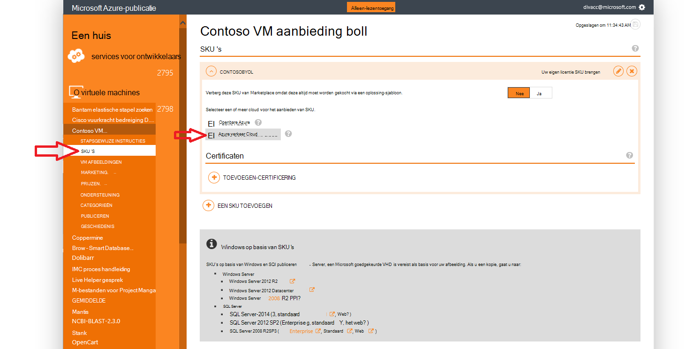

<properties
            pageTitle="Azure overheid documentatie | Microsoft Azure"
            description="Hierdoor wordt een vergelijking van functies en informatie over het ontwikkelen van toepassingen voor de overheid Azure."
            services="Azure-Government"
            cloud="gov"
            documentationCenter=""
            authors="tsingh"
            manager="asimm"
            editor=""/>
 
<tags    ms.service="multiple"
            ms.devlang="na"
            ms.topic="article"
            ms.tgt_pltfrm="na"
            ms.workload="azure-government"
            ms.date="10/20/2016"
            ms.author="zakramer;tsingh;divacc"/> 

# Overheid van Azure Marketplace
Zoek de onderstaande informatie voor partners geïnteresseerd uw aanbod publiceren naar de Azure Marketplace voor de overheid.

## Publiceren
>[AZURE.NOTE] Als u niet een bestaande Azure gecertificeerd Marketplace-partner bent, voert u de stappen [hier](../marketplace-publishing/marketplace-publishing-getting-started.md) voordat u verdergaat.

### Stap 1  
Meld u aan bij [https://publish.windowsazure.com](https://publish.windowsazure.com)

### Stap 2
Klik op de aanbieding die u wilt publiceren

### Stap 3
Klik op **SKU's** en klik in het vak Azure overheid Cloud

>[AZURE.NOTE] Alleen doen om uw eigen licentie (BYOL) SKU's worden ondersteund.  Deze optie is niet beschikbaar voor Pay-as-You-Go (PayG) SKU's.

### Stap 4
Klik op het + -certificering toevoegen koppeling koppelingen toevoegen aan een certificaten voor de aanbieding.

### Stap 5
Aanvraag voor een proefaccount in Microsoft Azure overheid cloud zodat u kunt het testen van uw afbeelding in de portal voor publiceren: [https://azuregov.microsoft.com/trial/azuregovtrial](https://azuregov.microsoft.com/trial/azuregovtrial)

Uw geschiktheid als een partner die Amerikaanse federale, provinciale, lokale of Tribale entiteiten fungeert zijn gecontroleerd en bevestiging per e-mail worden geleverd.  Uw proefabonnement account is beschikbaar is binnen werkdagen 3 tot en met 5.

### Stap 6
Klik op publiceren en Push naar tijdelijke op. 

U wordt gevraagd om in te voeren een whitelisted-abonnement dat toegang heeft tot de gefaseerde bieden. Voer de abonnements-ID van uw account voor het proefabonnement van Azure overheid recent overgenomen.

### Stap 7
Zodra de aanbieding succes gefaseerde is, kunt u uw afbeelding testen door het aanmelden bij [https://portal.azure.us](https://portal.azure.us) met uw account Azure overheid proefabonnement.

### Stap 8
Nadat u uw afbeelding met het proefabonnement hebt gevalideerd, kunt u de aanbieding beschikbaar live door te klikken op publiceren en goedkeuring naar productie aanvragen maken. 

## Volgende stappen

Aanvullende informatie en updates, Abonneer u op de [Microsoft Azure overheid Blog](https://blogs.msdn.microsoft.com/azuregov/).
