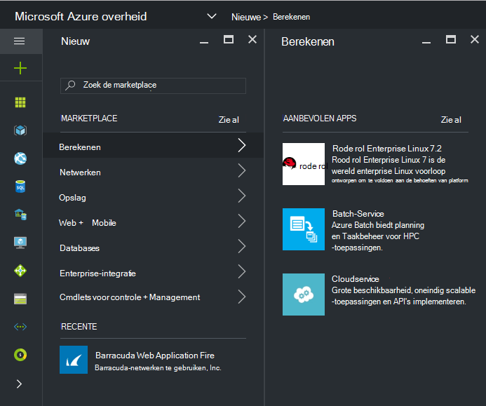
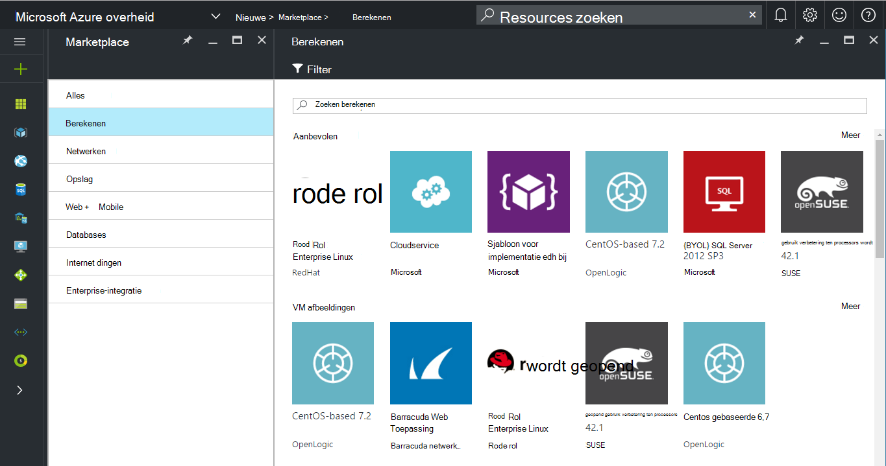
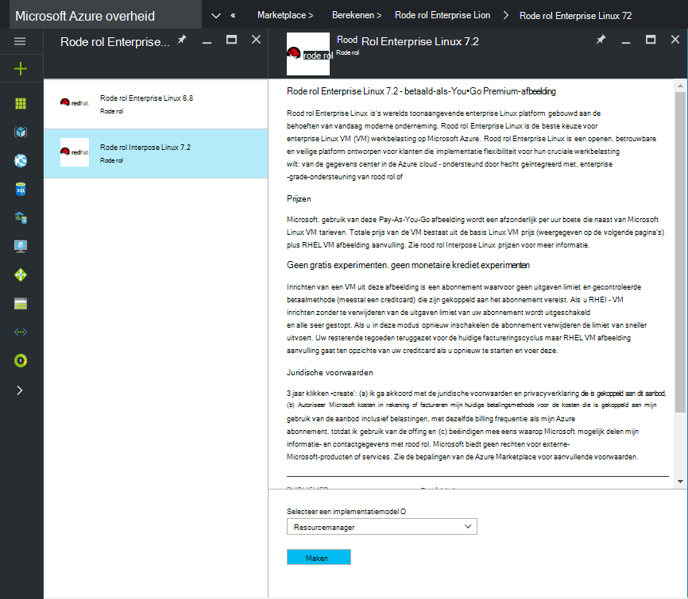
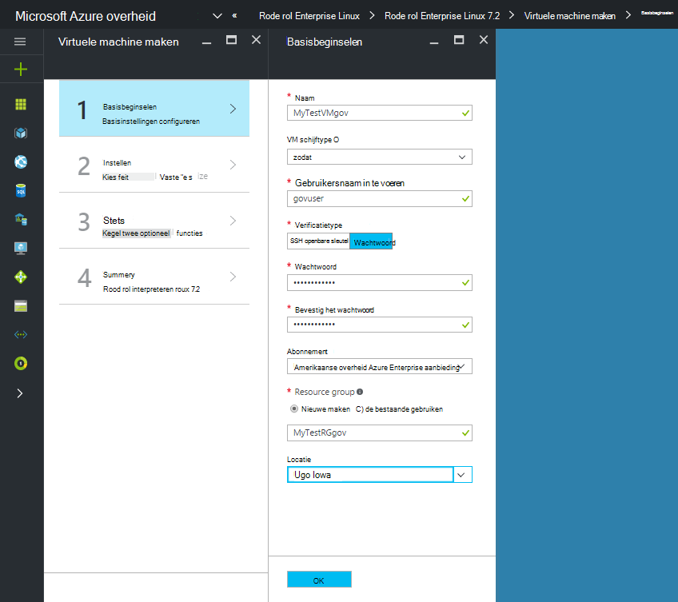
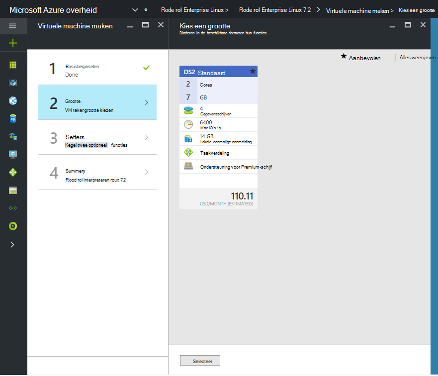

 <properties
    pageTitle="Azure overheid documentatie | Microsoft Azure"
    description="Hierdoor wordt een vergelijking van functies en informatie over het ontwikkelen van toepassingen voor de overheid Azure."
    services="Azure-Government"
    cloud="gov"
    documentationCenter=""
    authors="VybavaRamadoss"
    manager="asimm"
    editor=""/>

<tags   ms.service="multiple"
    ms.devlang="na"
    ms.topic="article"
    ms.tgt_pltfrm="na"
    ms.workload="azure-government"
    ms.date="10/20/2016"
    ms.author="zakramer;vybavar"/>

# Azure Marketplace voor de overheid
De Azure Marketplace is beschikbaar voor de overheid Azure met een bijgewerkte lijst met afbeeldingen van onze uitgevers marketplace. 

## Variaties
Hieronder vindt u enkele overwegingen bij het gebruik van Azure Marketplace voor de overheid:

- Alleen doen om uw eigen licentie (BYOL) afbeeldingen zijn beschikbaar. U geen toegang tot afbeeldingen waarvoor aankooptransactie via Azure Marketplace
- Alleen een subset van afbeeldingen is momenteel beschikbaar in vergelijking met de openbare marketplace. U vindt de lijst met beschikbare afbeeldingen [hier](../azure-government-image-gallery.md) 
- Voordat u een afbeelding is geïnstalleerd, moet de beheerder van uw bedrijf Marketplace aankopen voor uw abonnement Azure inschakelen.
  - Meld u aan bij de Portal als een Enterprise-beheerder
  - Navigeer naar *beheren*
  - Klik op het potloodpictogram naast het item van *Azure Marketplace* lijn onder *Registratie Details* .
  - *Ingeschakeld/uitgeschakeld* zo nodig in-of uitschakelen
  - Klik op *Opslaan*

>[AZURE.NOTE] Als u geïnteresseerd in aanbrengen bent Raadpleeg uw afbeeldingen die beschikbaar zijn in Azure overheid [partner onboarding richtlijnen](documentation-government-manage-marketplace-partners.md) voor meer informatie.

### Stap 1
De Marketplace starten

  

### Stap 2
Blader door de verschillende producten om het juiste account.

De uitgever marketplace vindt u een lijst van certificaten als onderdeel van de productbeschrijving om de juiste keuze te. 

### Stap 3
Kies een product\image

### Stap 4
Start de stroom maken en voer de vereiste parameters voor implementatie

>[AZURE.NOTE] In de vervolgkeuzelijst locatie zijn alleen Azure overheid locaties zichtbaar

### Stap 5
Toekijken prijzen

### Stap 6
Alle stappen en klik op Ok om het inrichten

## Volgende stappen

Aanvullende informatie en updates, Abonneer u op de [Microsoft Azure overheid Blog](https://blogs.msdn.microsoft.com/azuregov/).
