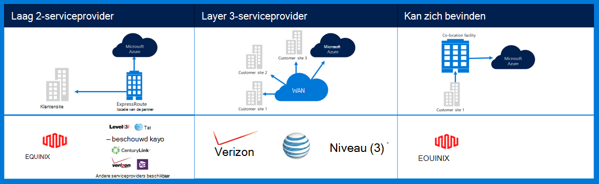
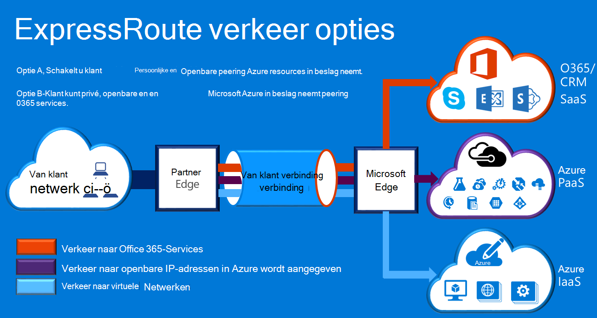

<properties
    pageTitle="Azure Governmenmt documentatie | Microsoft Azure"
    description="Hier vindt u een vergelijking van functies en richtlijnen voor het privé connectiviteit met e voor de overheid"
    services="Azure-Government"
    cloud="gov" 
    documentationCenter=""
    authors="ryansoc"
    manager="zakramer"
    editor=""/>

<tags
    ms.service="multiple"
    ms.devlang="na"
    ms.topic="article"
    ms.tgt_pltfrm="na"
    ms.workload="azure-government"
    ms.date="09/28/2016"
    ms.author="ryansoc"/>

#  Azure overheid netwerken

##  ExpressRoute (privé Connectivity)

ExpressRoute vindt u in het algemeen in Azure overheid. Zie de <a href="https://azure.microsoft.com/en-us/documentation/services/expressroute/">ExpressRoute openbare documentatie </a>voor meer informatie (inclusief partners en locaties peering).

###  Variaties

ExpressRoute is algemeen beschikbaar (GA) in voor de overheid Azure. 

- Overheid klanten verbinding maken met een fysiek geïsoleerd capaciteit via een speciale (beurs) voor de overheid Azure ExpressRoute (ER)-verbinding

- Azure beurs biedt verbeterde beschikbaarheid & levensduur door gebruikmaken van meerdere regio paren gevestigd minimaal 500 mijl spreiden 

- Standaard alle Azure beurs ER-connectiviteit geconfigureerde actieve overtollige met ondersteuning voor uiteenspatten is en biedt de capaciteit van maximaal 10 G circuitlijnen (kleinste is 50MB)

- Azure beurs ER locaties Geef geoptimaliseerde routes (kortste hops, lage latentie, krachtige, enz.) bij klanten en Azure beurs overtollige met geografische regio 's

- Geen gebruik van de Azure beurs ER particuliere verbinding, overdragen of afhankelijk zijn van Internet

- Azure beurs fysieke en logische-infrastructuur is fysiek specifiek gescheiden en toegang is beperkt tot Amerikaans personen

- Microsoft eigenaar is van en alle fiber infrastructuur tussen Azure beurs regio's en Azure beurs ER vergaderen werkt-mij locaties

- Azure beurs ER biedt connectiviteit met Microsoft Azure, O365 en CRM cloudservices

### Overwegingen

Er zijn twee eenvoudige services die privé netwerkconnectiviteit in Azure overheid leveren: VPN (naar website voor een organisatie) en ExpressRoute.

Azure ExpressRoute wordt gebruikt voor het maken van persoonlijke verbindingen tussen Azure overheid datacenters en de infrastructuur van uw on-premises of in een omgeving onderbrengen. ExpressRoute verbindingen Ga niet via de openbare Internet, bieden meer betrouwbaarheid, snellere snelheden en lagere vertragingstijden dan typische internetverbindingen. In sommige gevallen, gebruikt ExpressRoute verbindingen om gegevens tussen op premises systemen en Azure oogst aanzienlijk voordelen van kosten te brengen.   

U verbindingen met Azure op een locatie ExpressRoute (zoals een Exchange-provider faciliteit) tot stand brengen met ExpressRoute, of u direct verbinding maken met Azure vanuit uw bestaande WAN-netwerk (zoals een multiprotocol label overstappen op een andere (MPLS) VPN, verstrekt door een netwerkprovider).

    

Voor netwerkservices ter ondersteuning van Azure overheid klanttoepassingen en oplossingen, is het raadzaam dat ExpressRoute (privé connectivity) als u wilt verbinden met Azure overheid wordt geïmplementeerd. Als VPN-verbindingen worden gebruikt, moeten worden beschouwd:

- Klanten contact moeten opnemen met hun machtigen officiële/Bureau om te bepalen of privé connectivity of andere manier beveiligde verbinding vereist is en eventuele aanvullende beperkingen aandachtspunten identificeren.

- Klanten moeten bepalen of ze willen dwingend dat de VPN van de site-naar-site is gerouteerd via een zone privé connectivity.

- Klanten moeten een circuitlijnen MPLS of VPN verkrijgen met een access-provider voor gelicentieerde privé connectivity.

Alle klanten die gebruikmaken van de architectuur van een privé-connectiviteit moeten valideren dat een juiste implementatie is ingesteld en voor de klant-verbinding met de Gateway netwerk/Internet onderhouden (uitlijnen / ik) router scheidingspunt rand voor de overheid Azure. Uw organisatie moet de netwerkverbindingen tussen uw on-premises omgeving en de Gateway netwerk/klant (uitlijnen/C) rand router scheidingspunt op dezelfde manier instellen voor de overheid Azure.

## Volgende stappen

Voor aanvullende informatie en updates Abonneer u op de <a href="https://blogs.msdn.microsoft.com/azuregov/">Microsoft Azure overheid Blog.</a>
